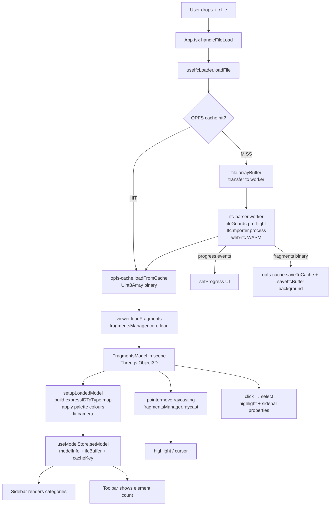
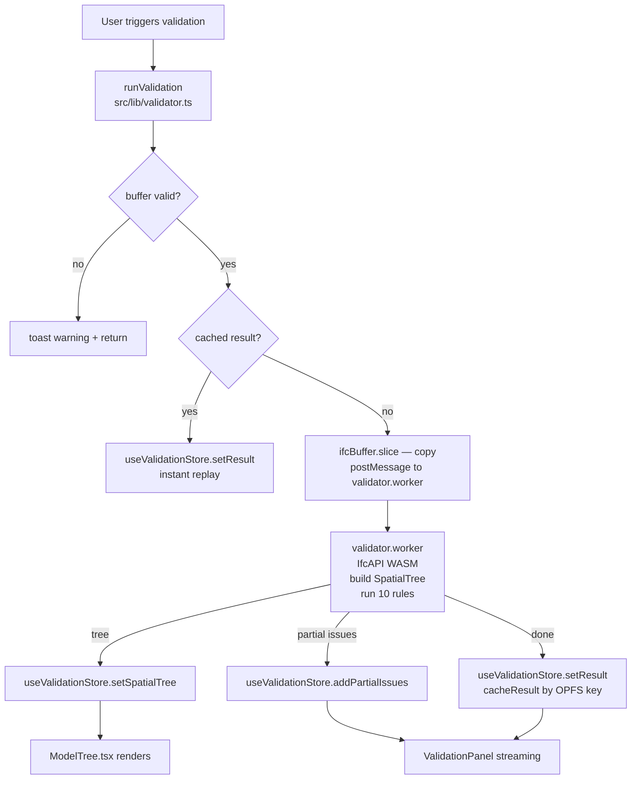

# Architecture

## Folder structure

```
ifc/
├── src/
│   ├── App.tsx                       # Root component; owns route + viewer bridge
│   ├── main.tsx                      # ReactDOM.createRoot entry point
│   ├── index.css                     # Global CSS variables, Tailwind base, scrollbar/animation styles
│   │
│   ├── components/
│   │   ├── Landing.tsx               # Full marketing/hero page (static, no data deps)
│   │   ├── Viewer.tsx                # Three.js canvas wrapper; bridges React and ViewerAPI
│   │   ├── Toolbar.tsx               # Top bar: file name, load status, Reset/Isolate/Open actions
│   │   ├── Sidebar.tsx               # Right panel: Properties tab + Categories tab
│   │   ├── ModelTree.tsx             # Spatial hierarchy tree (virtualised with @tanstack/react-virtual)
│   │   ├── ValidationPanel.tsx       # Validation report panel with severity/rule filters
│   │   ├── UploadOverlay.tsx         # Modal: drag-and-drop zone + progress bar
│   │   ├── ToastContainer.tsx        # Non-blocking toast notification renderer
│   │   └── Icons.tsx                 # All SVG icons as React components (single source of truth)
│   │
│   ├── hooks/
│   │   └── useEditorHistory.ts       # Keyboard shortcut binding for undo/redo (Ctrl+Z / Ctrl+Y)
│   │
│   ├── lib/
│   │   ├── viewer.ts                 # createViewer() factory — OBC world, WebGL renderer, ViewerAPI
│   │   ├── loader.ts                 # useIfcLoader() hook — cache + worker pipeline orchestration
│   │   ├── validator.ts              # runValidation() — orchestrates validator worker, streams to store
│   │   ├── diffStore.ts              # buildRenameCommand / buildFixGuidCommand helpers
│   │   ├── ifc-guards.ts             # validateIfcBuffer() — pre-flight buffer + signature checks
│   │   ├── ifc-guards.test.ts        # Vitest tests for ifc-guards
│   │   ├── opfs-cache.ts             # OPFS read/write/list/delete for fragments + IFC binaries
│   │   ├── memory-tracker.ts         # getMemoryStats() + startMemoryTracking() polling
│   │   ├── scheduler.ts              # yieldToMain() + runInChunks() scheduler wrappers
│   │   ├── utils.ts                  # cn() (tailwind-merge) + lighten() colour utility
│   │   └── loader.test.ts            # Vitest unit tests: cache key, OPFS hit/miss, progress events
│   │
│   ├── stores/
│   │   ├── modelStore.ts             # Loaded model: ModelInfo, IFC buffer, OPFS key, model object
│   │   ├── validationStore.ts        # Validation results, spatial tree, rules config, filters, progress
│   │   ├── editorStore.ts            # Edit diffs, command history, undo/redo stack, selection
│   │   ├── uiStore.ts                # Global UI flags (open panels, active tabs, etc.)
│   │   └── toastStore.ts             # Toast queue + toast() imperative helper
│   │
│   ├── workers/
│   │   ├── ifc-parser.worker.ts      # IFC bytes → fragments binary (IfcImporter, WASM, no DOM)
│   │   └── validator.worker.ts       # IFC bytes → SpatialTree + ValidationResult (IfcAPI, WASM)
│   │
│   └── types/
│       └── index.ts                  # All shared TypeScript interfaces and type aliases
│
├── docs/
│   └── DEPLOYMENT.md                 # GitHub Pages deployment guide + production bug history
├── CONTEXT.md                        # ← Read first in every Claude session
├── ARCHITECTURE.md                   # This file
├── IFC_DOMAIN.md                     # IFC domain knowledge reference
├── DECISIONS.md                      # Architectural decision log
├── ROADMAP.md                        # Sprint plan
├── PROMPTS.md                        # Claude prompt log
├── vite.config.ts                    # Vite + Vitest config; worker format; WASM copy plugin
├── tsconfig.json                     # TypeScript strict, ESNext modules, bundler resolution
└── package.json                      # Dependencies (see External dependencies below)
```

---

## Data flow

### IFC loading



### IFC validation



> ⚠️ NOTE: `viewer.loadIfc()` (OBC IfcLoader path) still exists on ViewerAPI but is not called from App.tsx. All loads go through the worker → `loadFragments()` path.

---

## State management

All shared state lives in **Zustand stores** (`src/stores/`). Plain React `useState` is used only for local component state that does not need to cross component boundaries.

| Store | What it owns |
|---|---|
| `useModelStore` | `modelInfo`, `ifcBuffer` (original IFC bytes), `opfsCacheKey`, `modelObject` (FragmentsModel ref) |
| `useValidationStore` | `result`, `partialIssues`, `isRunning`, `progress`, `spatialTree`, `rules`, `filters`, `validationMode`, `cachedResults` |
| `useEditorStore` | `diffs` (flattened EditDiff[]), `history` (EditorCommand[]), `historyIndex`, `selection` (expressIds), `canUndo`, `canRedo` |
| `uiStore` | Global UI flags: open panels, active tabs, sidebar width, etc. |
| `toastStore` | Toast queue; exposes `toast(message, level)` as an imperative singleton |

**Zustand constraint:** Stores must not hold Three.js objects (non-serialisable, GC risk). Store references by ID only; let `viewer.ts` manage geometry.

---

## Key abstractions

### `ViewerAPI` (`src/lib/viewer.ts`)

The imperative handle to the 3D world. Created once per Viewer component mount via `createViewer(container)`. Owns the OBC `Components` instance, the Three.js renderer, all geometry, and the expressID→type map.

| Method | Description |
|---|---|
| `loadIfc(file, onProgress?)` | Parse an IFC file via OBC IfcLoader (legacy, unused in app) |
| `loadFragments(buffer, fileName, onProgress?)` | Load pre-parsed fragments binary; primary load path |
| `resetCamera()` | Animated return to default look-at position |
| `frameCategory(id)` | Animate camera to bounding box of a category |
| `applyFilters(hidden, isolated)` | Show/hide elements by canonical IFC type |
| `applyStyle(style)` | `'shaded'` / `'blueprint'` / `'xray'` global material override |
| `setSelectCallback(cb)` | Register click-select handler |
| `getGpuEstimateBytes()` | Rough GPU memory estimate from `WebGLRenderer.info` |
| `dispose()` | Tear down world, remove event listeners |

### `useIfcLoader` (`src/lib/loader.ts`)

React hook that orchestrates the entire load pipeline. Accepts `{ viewerApiRef, onModelLoaded, onError }`. Returns `{ loadFile, resetProgress, progress, memoryStats, cacheEntries, deleteFromCache, isFromCache, opfsAvailable }`.

Internally:
- Lazily creates one `Worker` instance (reused across loads, recreated after error)
- Waits for `viewerApiRef.current` to become non-null (polls every 50 ms, 10 s timeout)
- Retains a copy of the IFC buffer before transfer to worker (for validation and export)
- Runs `saveToCache` + `saveIfcBuffer` in background without blocking viewer render
- Starts a 4-second memory polling interval on mount
- Concurrent load guard: rejects a second `loadFile()` while one is in flight

### IFC parser worker (`src/workers/ifc-parser.worker.ts`)

Runs in a dedicated ES module worker. Protocol:

- **IN:** `{ type: 'parse', id, buffer: ArrayBuffer (transferred), fileName }`
- **OUT:** `{ type: 'progress', id, phase, percent }` → `{ type: 'result', id, fragmentsBuffer: ArrayBuffer (transferred) }` OR `{ type: 'error', id, message }`

Pre-flight: empty buffer check + IFC STEP signature validation before WASM init.
`forceSingleThread: true` passed to `IfcAPI.Init` to avoid Emscripten pthread sub-workers.

### Validator worker (`src/workers/validator.worker.ts`)

Runs in a second dedicated ES module worker. Protocol:

- **IN:** `{ type: 'validate', id, buffer: ArrayBuffer (transferred copy), rules: RulesConfig }`
- **OUT:** `{ type: 'tree', id, tree: SpatialNode[] }` → `{ type: 'partial', id, issues, progress }` → `{ type: 'done', id, result: ValidationResult }` OR `{ type: 'error', id, message }`

### `runValidation` (`src/lib/validator.ts`)

Singleton-manages the validator worker. Pre-flight checks the IFC buffer. Checks in-memory cache keyed by OPFS cache key (avoids re-running rules on the same model). Copies the buffer before transfer (preserves the original for export). Streams results into `useValidationStore`.

### OPFS cache (`src/lib/opfs-cache.ts`)

Stores fragments binaries as `<key>.frag` and IFC bytes as `<key>.ifc` plus `<key>.meta.json` under `navigator.storage.getDirectory() / ifc-cache/`. Cache key = `"${file.name}:${file.size}:${file.lastModified}"`. Gracefully no-ops when OPFS is unavailable.

---

## External dependencies and why each was chosen

| Package | Why |
|---|---|
| `@thatopen/components` | Provides `OBC.Components`, `OBC.IfcLoader`, `OBC.FragmentsManager`, `OBC.SimpleRenderer/Camera/Scene`, `OBC.Grids` — a batteries-included IFC toolkit that abstracts geometry batching, frustum culling, raycasting, and highlight systems. |
| `@thatopen/fragments` | The geometry serialisation format and `IfcImporter` class. `IfcImporter.process()` converts IFC bytes → compact binary entirely without DOM — safe to run in a Web Worker. |
| `@thatopen/components-front` | Peer dependency; provides frontend-specific OBC components. |
| `three` | Underlying 3D library for OBC. Also used directly for `THREE.Color`, lights, and shadow config. |
| `web-ifc` | The WebAssembly IFC parser. Used by `IfcImporter` (parser worker) and `IfcAPI` (validator worker). Not imported directly in `src/` outside the workers. |
| `zustand` | Lightweight state management for cross-component validation and editor state. Added in Sprint 3. |
| `@tanstack/react-virtual` | Row virtualisation for the spatial tree. Required for models with 10k+ nodes. Added in Sprint 3. |
| `react` / `react-dom` | UI framework. |
| `framer-motion` | Page transitions and entrance animations. Not used inside the Three.js canvas. |
| `gsap` | Installed; reserved for complex animation sequences in future sprints. |
| `@radix-ui/*` | Accessible component primitives (Dialog, Tabs, ScrollArea, Switch, Tooltip). Used in Sprint 3 UI. |
| `tailwindcss` | Utility CSS. Design tokens live in `src/index.css` as CSS custom properties. |
| `clsx` + `tailwind-merge` | `cn()` utility in `utils.ts` for conditional Tailwind class merging. |
| `vitest` + `jsdom` | Unit testing. Chosen over Jest because Vite's native transform pipeline is reused. |
| `lucide-react` | Installed but unused — all icons are custom SVGs in `Icons.tsx`. Do not mix icon sources. |

### What is intentionally NOT in the codebase

- **No server / API.** No backend, no fetch to any external endpoint.
- **No authentication.** No login, no user accounts.
- **No WebGPU renderer.** Detected at runtime, but `OBC.SimpleRenderer` uses WebGL. Integration requires a custom renderer wrapper satisfying OBC's `BaseRenderer` interface. Deferred to a dedicated sprint.
- **No `web-ifc` direct imports in `src/` outside workers.** All web-ifc usage is encapsulated inside `@thatopen` packages, `ifc-parser.worker.ts`, or `validator.worker.ts`.

---

*Last updated: 2026-05-09 · Current sprint: 3 (in progress)*
