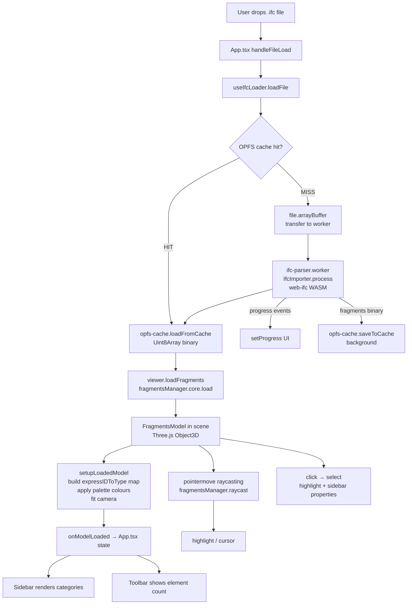

# Architecture

## Folder structure

```
ifc/
├── src/
│   ├── App.tsx                   # Root component; owns all React state; mounts route views
│   ├── main.tsx                  # ReactDOM.createRoot entry point
│   ├── index.css                 # Global CSS variables, Tailwind base, scrollbar/animation styles
│   │
│   ├── components/
│   │   ├── Landing.tsx           # Full marketing/hero page (static, no data deps)
│   │   ├── Viewer.tsx            # Three.js canvas wrapper; bridges React and ViewerAPI
│   │   ├── Toolbar.tsx           # Top bar: file name, load status, Reset/Isolate/Open actions
│   │   ├── Sidebar.tsx           # Right panel: Properties tab + Categories tab
│   │   ├── UploadOverlay.tsx     # Modal: drag-and-drop zone + progress bar
│   │   └── Icons.tsx             # All SVG icons as React components (single source of truth)
│   │
│   ├── lib/
│   │   ├── viewer.ts             # createViewer() factory — OBC world, WebGL renderer, ViewerAPI
│   │   ├── loader.ts             # useIfcLoader() hook — cache + worker pipeline orchestration
│   │   ├── opfs-cache.ts         # OPFS read/write/list/delete for fragments binaries
│   │   ├── memory-tracker.ts     # getMemoryStats() + startMemoryTracking() polling
│   │   ├── scheduler.ts          # yieldToMain() + runInChunks() scheduler wrappers
│   │   ├── utils.ts              # cn() (tailwind-merge) + lighten() colour utility
│   │   └── loader.test.ts        # Vitest unit tests: cache key, OPFS hit/miss, progress events
│   │
│   ├── workers/
│   │   └── ifc-parser.worker.ts  # Dedicated parse worker: IFC bytes → fragments binary
│   │
│   └── types/
│       └── index.ts              # Shared TypeScript interfaces (Category, ModelInfo, CacheEntry…)
│
├── CONTEXT.md                    # ← Read first in every Claude session
├── ARCHITECTURE.md               # This file
├── IFC_DOMAIN.md                 # IFC domain knowledge reference
├── DECISIONS.md                  # Architectural decision log
├── ROADMAP.md                    # Sprint plan
├── PROMPTS.md                    # Claude prompt log
├── vite.config.ts                # Vite + Vitest config; worker format; WASM copy plugin
├── tsconfig.json                 # TypeScript strict, ESNext modules, bundler resolution
└── package.json                  # Dependencies (see External dependencies below)
```

---

## Data flow



> ⚠️ NOTE: `viewer.loadIfc()` (OBC IfcLoader path) still exists on ViewerAPI but is not called from App.tsx. All loads go through the worker → `loadFragments()` path. `loadIfc()` may be used for testing or future fallback, but is dead code in the current app flow.

---

## State management

There is **no Zustand or other state library**. All state lives in `App.tsx` as local React `useState`. This is intentional for Sprint 1–2 (see `DECISIONS.md`).

| State variable | Type | Owns |
|---|---|---|
| `route` | `'landing' \| 'viewer'` | Which full-screen view is active |
| `accent` | `string` | CSS accent colour (currently hardcoded `#5E6AD2`) |
| `modelInfo` | `ModelInfo \| null` | File name, element count, category list |
| `loadingState` | `'idle' \| 'loading' \| 'loaded' \| 'error'` | Loading phase for Toolbar status chip |
| `viewerStyle` | `ViewerStyle` | `'shaded' \| 'blueprint' \| 'xray'` — not yet changeable from UI (hardcoded `'shaded'`) |
| `selected` | `SelectedInfo \| null` | Currently selected IFC element |
| `hidden` | `Set<string>` | Category IDs hidden from view |
| `isolated` | `string \| null` | Single category isolated; others hidden |
| `showUpload` | `boolean` | Whether the upload modal is open |

`useIfcLoader` hook manages its own internal state (progress, cacheEntries, isFromCache, opfsAvailable) and is driven by the `viewerApiRef` ref, not React props.

---

## Key abstractions

### `ViewerAPI` (`src/lib/viewer.ts`)

The imperative handle to the 3D world. Created once per Viewer component mount via `createViewer(container)`. Owns the OBC `Components` instance, the Three.js renderer, all geometry, and the expressID→type map.

| Method | Description |
|---|---|
| `loadIfc(file, onProgress?)` | Parse an IFC file via OBC IfcLoader (legacy, unused in app) |
| `loadFragments(buffer, fileName, onProgress?)` | Load pre-parsed fragments binary; primary load path |
| `resetCamera()` | Animated return to default `(30, 24, 36)` look-at `(0, 2, 0)` |
| `frameCategory(id)` | Animate camera to bounding box of a category |
| `applyFilters(hidden, isolated)` | Show/hide elements by canonical IFC type |
| `applyStyle(style)` | `'shaded'` / `'blueprint'` / `'xray'` global material override |
| `setSelectCallback(cb)` | Register click-select handler |
| `getGpuEstimateBytes()` | Rough GPU memory estimate from `WebGLRenderer.info` |
| `dispose()` | Tear down world, remove event listeners |

### `useIfcLoader` (`src/lib/loader.ts`)

React hook that orchestrates the entire load pipeline. Accepts `{ viewerApiRef, onModelLoaded, onError }`. Returns `{ loadFile, progress, memoryStats, cacheEntries, deleteFromCache, isFromCache, opfsAvailable }`.

Internally:
- Lazily creates one `Worker` instance (reused across loads)
- Waits for `viewerApiRef.current` to become non-null (polls every 50ms, 8s timeout)
- Runs `saveToCache` in the background without blocking the viewer render path
- Starts a 4-second memory polling interval on mount

### `IfcImporter` worker (`src/workers/ifc-parser.worker.ts`)

Runs in a dedicated ES module worker. Receives `{ type: 'parse', id, buffer: ArrayBuffer, fileName }` with the `ArrayBuffer` transferred (zero-copy). Uses `@thatopen/fragments` `IfcImporter.process()` — pure IFC→fragments conversion, no DOM required. Emits `{ type: 'progress', percent }` events then `{ type: 'result', fragmentsBuffer: ArrayBuffer }` (transferred back).

### OPFS cache (`src/lib/opfs-cache.ts`)

Stores fragments binaries as `<key>.frag` files plus `<key>.meta.json` metadata under `navigator.storage.getDirectory() / ifc-cache/`. Cache key = `"${file.name}:${file.size}:${file.lastModified}"`. Gracefully no-ops when OPFS is unavailable (returns `null` from reads, silently skips writes).

---

## External dependencies and why each was chosen

| Package | Why |
|---|---|
| `@thatopen/components` | Provides `OBC.Components`, `OBC.IfcLoader`, `OBC.FragmentsManager`, `OBC.SimpleRenderer/Camera/Scene`, and `OBC.Grids` — a batteries-included IFC rendering toolkit that abstracts away Three.js boilerplate and maintains its own worker for fragments geometry processing. Chosen over raw Three.js + web-ifc to avoid re-implementing geometry batching, frustum culling, raycasting, and highlight systems. |
| `@thatopen/fragments` | The geometry serialization format and `IfcImporter` class. `IfcImporter.process()` converts IFC bytes → compressed fragments binary entirely without DOM, making it safe to run in a Web Worker. |
| `@thatopen/components-front` | Installed as a peer dependency; provides frontend-specific OBC components (not yet used in Sprint 1–2). |
| `three` | Underlying 3D library for OBC. Also used directly for `THREE.Color`, `THREE.Vector2`, `THREE.Fog`, lights, shadow config. |
| `web-ifc` | The WebAssembly IFC parser that `IfcImporter` delegates to. Required peer dep of `@thatopen/fragments`. Not imported directly in `src/` outside the worker — all web-ifc usage is internal to `IfcImporter`. |
| `react` / `react-dom` | UI framework. |
| `framer-motion` | Page transitions (route changes), sidebar/toolbar entrance animations, upload overlay entrance/exit. Not used inside the Three.js canvas. |
| `gsap` | Installed but not used in Sprint 1–2. Retained for potential use in Sprint 3+ animations. |
| `@radix-ui/*` | Accessible component primitives (Dialog, Tabs, ScrollArea, Switch, Tooltip). Installed; not yet used in Sprint 1–2. Retained for Sprint 3 validation UI. |
| `tailwindcss` | Utility CSS. Design tokens live in `src/index.css` as CSS custom properties; Tailwind references them via `var(--*)` syntax. |
| `clsx` + `tailwind-merge` | `cn()` utility in `utils.ts` for conditional Tailwind class merging. |
| `vitest` + `jsdom` | Unit testing. Chosen over Jest because Vite's native transform pipeline is reused (no separate Babel config). |
| `lucide-react` | Icon library installed but not used — all icons are custom SVGs in `Icons.tsx`. |

### What is intentionally NOT in the codebase

- **No server / API.** No backend, no fetch to any external endpoint. All processing is client-side.
- **No authentication.** No login, no user accounts.
- **No Zustand / Redux / Jotai.** State is local `useState` in `App.tsx`. State library will be added in Sprint 3 when the validator introduces cross-component derived state (validation results driving both the 3D highlight layer and the report panel).
- **No virtualised list library.** No `react-virtual` or `@tanstack/virtual`. The spatial tree (Sprint 3) will need one for large models with 10k+ nodes.
- **No WebGPU renderer.** Detection code is planned; `three/webgpu` build exists in `node_modules` (Three.js r184+) but is not wired up. `OBC.SimpleRenderer` uses WebGL. WebGPU integration requires a custom renderer wrapper that satisfies the OBC `BaseRenderer` interface.
- **No `web-ifc` direct imports in `src/`.** All web-ifc usage is encapsulated inside `@thatopen` packages or `ifc-parser.worker.ts`.

---

*Last updated: 2026-04-19 · Current sprint: 2 (complete)*
