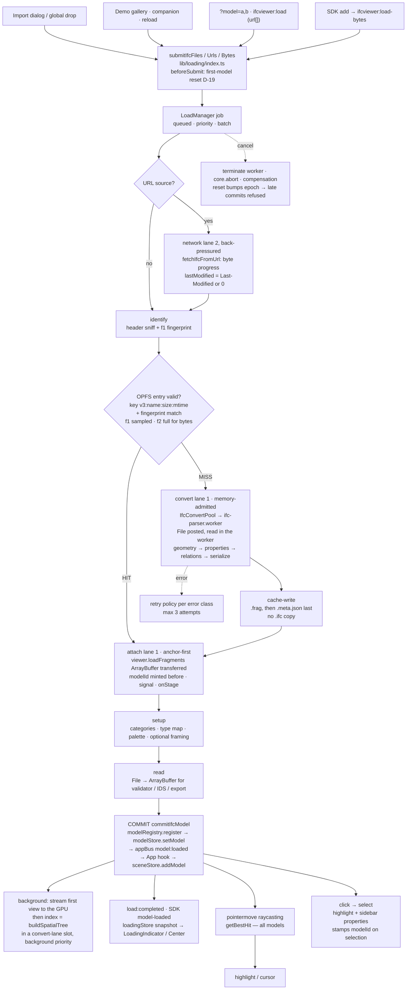
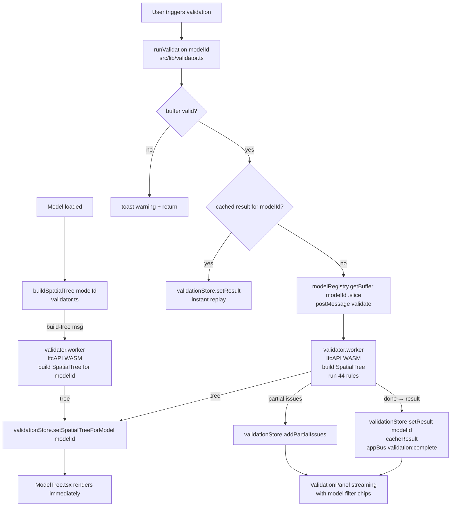
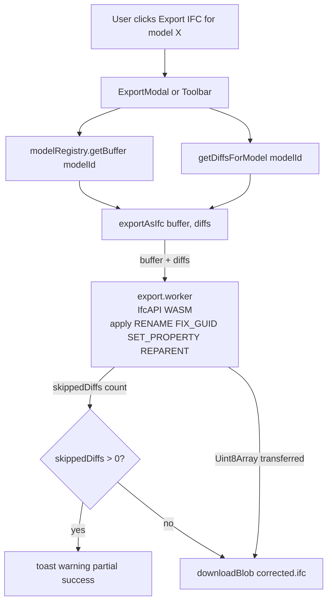

# Architecture

## Folder structure

```
ifc/
├── src/
│   ├── App.tsx                       # Root component; owns route + viewer bridge; multi-model handlers
│   ├── main.tsx                      # ReactDOM.createRoot entry point; mounts ErrorBoundary
│   ├── index.css                     # Global CSS variables, Tailwind base, scrollbar/animation styles
│   │
│   ├── components/
│   │   ├── Landing.tsx               # Marketing/hero page with SEO meta, JSON-LD, FAQ schema
│   │   ├── Viewer.tsx                # Three.js canvas wrapper; bridges React and ViewerAPI
│   │   ├── Toolbar.tsx               # Top bar: file name, loading chip (opens the Loading Center), export dropdown/modal, Scene button
│   │   ├── Sidebar.tsx               # Right panel: Properties, Categories, Quantities tabs; takeoff panel
│   │   ├── ModelTree.tsx             # Spatial hierarchy tree (virtualised); full modelId threading
│   │   ├── ValidationPanel.tsx       # Validation report: severity/rule filters + model filter chips
│   │   ├── ValidationExportModal.tsx # Configurable JSON/CSV/Certificate/BCF export with scope + severity
│   │   ├── IdsPanel.tsx              # buildingSMART IDS results (docked sibling of ValidationPanel)
│   │   ├── IdsModal.tsx             # .ids loader + built-in samples; ids/ subfolder = FacetChip, IdsExportMenu, score
│   │   ├── BcfPanel.tsx             # BCF topic CRUD, comments, viewpoint capture, filters
│   │   ├── GeoPanel.tsx             # GIS / Map mode: consent, layers, georef ladder, placement editor
│   │   ├── MeasurementPanel.tsx     # Length/area/edge/volume measurements list
│   │   ├── FloorPlanPanel.tsx       # 2D floor plan views per IfcBuildingStorey
│   │   ├── SectionPanel.tsx         # Clipping planes / section cuts
│   │   ├── EmbedModal.tsx           # Embed snippet generator (iframe + SDK)
│   │   ├── DemoGallery.tsx          # Curated public demo-model picker
│   │   ├── ScenePanel.tsx           # Multi-model manager: visibility, isolate, frame, delete, transforms;
│   │   │                             #   "Loading" section (per-batch / per-member load status)
│   │   ├── CaptureToolbar.tsx       # Capture Toolkit: screenshot + replay capture buttons (Toolbar zone D)
│   │   ├── CapturePreviewModal.tsx  # Clip preview: trim, fps, resolution, watermark, PNG/WebM/GIF export (lazy)
│   │   ├── TourPlayer.tsx           # Tour Mode playback bar: prev/next, D-22 fix text, isolate, capture,
│   │   │                             #   share link + one-click social GIF (lazy)
│   │   ├── TourRecorder.tsx         # Tour Mode recorder: template selector, add/reorder stops (lazy)
│   │   ├── TemplateSelector.tsx     # D-26: social / client-walkthrough / technical-review cards
│   │   ├── CameraControls.tsx        # Floating camera preset panel (ISO/Top/Front/Right + numpad)
│   │   ├── ModelInfoPanel.tsx        # Floating pill: active model file size, element count, health badges
│   │   ├── mobile/                  # MobileBottomNav + bottom-sheet IDS/Validation panels (useIsMobile)
│   │   ├── loading/                 # Loading UI (reads loadingStore only): LoadingIndicator (toolbar chip ·
│   │   │                             #   floating variant for toolbar-less presets · mobile pill), LoadingCenter
│   │   │                             #   (desktop popover / mobile sheet, Basic ↔ Advanced), FirstLoadCard
│   │   │                             #   (empty-scene phase checklist), SceneLoadingSection (ScenePanel);
│   │   │                             #   job-view.ts = pure view-model (phase lines, wait reasons, ETA gates)
│   │   ├── InviteRibbon/View/...    # Personalized invite + attribution UI
│   │   ├── ErrorBoundary.tsx         # React error boundary; DefaultFallback; withErrorBoundary HOC
│   │   ├── UploadOverlay.tsx         # Import dialog: multi-file drop/pick → per-file checks, review,
│   │   │                             #   duplicate warning, large-file notice → one submission to the queue
│   │   │                             #   (closes on submit; progress lives in the Loading Center)
│   │   ├── ToastContainer.tsx        # Non-blocking toast notification renderer
│   │   └── Icons.tsx                 # All SVG icons as React components (single source of truth)
│   │
│   ├── hooks/
│   │   ├── useEditorHistory.ts       # Keyboard shortcut binding for undo/redo (Ctrl+Z / Ctrl+Y)
│   │   ├── useAppEvent.ts            # React bridge for TypedEventBus (ref trick — no stale closures)
│   │   ├── useModelSession.ts        # Facade: combines modelStore + validationStore + editorStore + uiStore
│   │   ├── useValidationRunner.ts    # Validation lifecycle hook (run, cancel, status, error, counts)
│   │   ├── useElementFocus.ts        # Encapsulates jumpTo / select / frame / revealInTree handlers
│   │   ├── usePersistedPreferences.ts# Hydrates treeWidth/treeVisible from localStorage; debounce-saves
│   │   ├── useKeyboardShortcuts.ts   # Input-aware global keyboard shortcut handler (skips editable targets)
│   │   ├── useIfcUploadFlow.ts       # Import dialog orchestrator: checks + fingerprints + duplicates →
│   │   │                             #   loadingController.submitFiles / openExisting
│   │   ├── useCanvasReplayBuffer.ts  # DVR replay buffer: 2 staggered MediaRecorders on canvas.captureStream
│   │   └── useUploadStateMachine.ts  # FSM for the import dialog (idle/dragging → preparing → review |
│   │                                 #   duplicate | error → submitting); no parse/progress states any more
│   │
│   ├── lib/
│   │   ├── viewer.ts                 # createViewer() factory — multi-model ViewerAPI
│   │   │                             #   modelPivots: Map<string, THREE.Group> per model
│   │   │                             #   getBestHit() iterates all models
│   │   │                             #   setCameraPreset, setModelTransform(t, modelId?)
│   │   │                             #   getModelBounds(modelId?), frameAllModels(), isolateModel(id)
│   │   ├── loading/                  # Model loading & orchestration — see docs/MODEL_LOADING.md, D-29
│   │   │                             #   load-manager.ts   jobs · batches · lanes · retries · events · metrics
│   │   │                             #   scheduler.ts      pure lane decisions (network 2 · convert 1 · attach 1, anchor-first)
│   │   │                             #   resource-policy / retry-policy / phases / fingerprint / model-id
│   │   │                             #   ifc-source.ts     the IFC pipeline as an adapter (download → … → commit → stream → index)
│   │   │                             #   ifc-convert-pool  ifc-parser workers on demand; cancel = terminate()
│   │   │                             #   external-sources  point cloud / mesh / GIS loads mirrored as tracked jobs
│   │   │                             #   index.ts          app wiring: singleton manager, commit, appBus/store bridges
│   │   │                             #   controller.ts     what the UI calls (cancel, retry, hold, reprioritise…)
│   │   ├── loader.ts                 # useIfcLoader() — thin React face of the loading system: installs the
│   │   │                             #   viewer getter + App's LoadingHooks, memory/OPFS readouts, and
│   │   │                             #   promise-returning loadFile/loadFiles/loadUrls/loadBytes (never reject)
│   │   ├── embed-loader.ts           # Blog EmbedViewer's own fetch → parser worker → loadFragments path
│   │   │                             #   (no OPFS, no stores; NOT routed through the LoadManager)
│   │   ├── validator.ts              # runValidation() + buildSpatialTree() — orchestrates validator worker
│   │   │                             #   resolves buffer/modelId from modelRegistry or sceneStore.activeModelId
│   │   ├── diffStore.ts              # Command builders: buildRenameCommand / buildFixGuidCommand /
│   │   │                             #   buildReparentCommand / buildSetPropertyCommand
│   │   │                             #   getDiffsForModel(modelId), exportAsIfc(buffer, diffs)
│   │   │                             #   exportAsGlb(obj)
│   │   ├── model-registry.ts         # ModelRegistry: per-model IFC buffers + typeMap; unregister on remove
│   │   ├── errors.ts                 # Typed error hierarchy: AppError subclasses, tryAsync, safeVoid
│   │   ├── worker-schemas.ts         # Zod schemas + parse helpers for all worker in/out messages
│   │   ├── ifc-guards.ts             # validateIfcBuffer() — pre-flight buffer + signature checks
│   │   ├── ifc-guards.test.ts        # Vitest tests for ifc-guards
│   │   ├── opfs-cache.ts             # OPFS entries (.frag + .meta.json commit marker; the engine no longer
│   │   │                             #   writes .ifc), key prefix v3, fingerprint check on lookup, LRU budget
│   │   ├── cache-repository.ts       # CacheRepository class — Repository pattern wrapping all OPFS I/O
│   │   ├── fetch-ifc-url.ts          # fetchIfcFromUrl(): streamed download with byte progress + AbortSignal;
│   │   │                             #   File.lastModified = Last-Modified header (or 0) → stable cache key
│   │   ├── memory-tracker.ts         # getMemoryStats() + startMemoryTracking() polling
│   │   ├── scheduler.ts              # yieldToMain() + runInChunks() (main-thread yielding — not the
│   │   │                             #   loading lane scheduler, which is loading/scheduler.ts)
│   │   ├── event-bus.ts              # TypedEventBus<AppEventMap> + appBus singleton; AppEventMap is declared here
│   │   │                             #   model:loaded { modelInfo, fromCache, cacheKey, modelId } · model:removed
│   │   │                             #   load:queued/started/phase/progress/completed/failed/cancelled/batch-settled/idle
│   │   ├── logger.ts                 # createLogger(channel) — structured, filterable, worker-safe logger
│   │   ├── result.ts                 # Result<T,E> monad: ok/err/safeAsync/safe/unwrapOr/mapOk
│   │   ├── invariant.ts              # invariant / assertDefined / assertNever / devWarn
│   │   ├── brand.ts                  # Brand<T,B> nominal types: ExpressId, GlobalId, CacheKey, IfcModelId
│   │   ├── type-guards.ts            # Runtime type guards for worker messages and stored data
│   │   ├── takeoff.ts                # computeTakeoff(modelId) — reads IfcElementQuantity via worker
│   │   ├── ids/                      # buildingSMART IDS 1.0 engine — parser, facet evaluators,
│   │   │                             #   runner, value/hierarchy helpers, report (JSON/CSV/HTML/BCF),
│   │   │                             #   run-diff, embedded examples, golden bSI testcase fixtures
│   │   ├── geo/                      # GIS / Map mode — basemap-engine, CRS/proj4, georef ladder,
│   │   │                             #   terrain sampling, tile providers, gis-flag (VITE_FEATURE_GIS)
│   │   ├── capture/                  # Capture Toolkit — replay-buffer-core (pure logic + tests),
│   │   │                             #   gif-export (frame extraction + worker orchestration + WebM
│   │   │                             #   re-encode), watermark compositing. See DECISIONS.md D-23.
│   │   ├── tour/                     # Tour Mode — generateAutoTour (severity + showcase strategies):
│   │   │                             #   issue grouping/ordering, showcase view planning, framing math
│   │   │                             #   (pure, tested); startAutoTour orchestration. See D-24/D-26.
│   │   ├── templates/                # Presentation templates (D-26) — 3 goal presets + applyTemplate()
│   │   │                             #   orchestrating presentation/ui/capture stores.
│   │   ├── share/                    # tourShareLink (D-26) — #tour= codec mirroring D-21's
│   │   │                             #   share-report contract (sanitised decode, URL guards).
│   │   ├── validation-diff.ts        # Diff two validation runs (powers RunDiffBar)
│   │   ├── validation-coverage.ts    # Honest per-rule coverage / status (no silent score inflation)
│   │   ├── share-report.ts           # buildShareUrl() — crawlable /r?d= worker URL or legacy hash
│   │   ├── benchmark.ts              # Anonymous Health Score percentile benchmark
│   │   ├── analytics.ts             # PostHog wrapper (no PII); attribution.ts = ?ref / /i/:code
│   │   ├── utils.ts                  # clamp, lerp, formatBytes, formatDuration, debounce, throttle, …
│   │   └── loader.test.ts            # Legacy: buildCacheKey + the legacy OPFS API; most cases re-implement the
│   │                                 #   old loader inline. Loading coverage lives in loading/*.test.ts
│   │                                 #   (see docs/MODEL_LOADING.md "Testing")
│   │
│   ├── sdk/                          # IfcViewer embeddable JS SDK (iframe + postMessage bridge)
│   │                                 #   built to public/sdk/ via `npm run build:sdk`
│   ├── stores/
│   │   ├── modelStore.ts             # Legacy single-model: ModelInfo, IFC buffer, OPFS key, model object
│   │   │                             #   Deprecated for multi-model: use modelRegistry for buffers
│   │   ├── validationStore.ts        # Validation results + spatialTrees (per model), rules config, filters
│   │   │                             #   clearValidationForModel(id), setSpatialTreeForModel(id, tree)
│   │   │                             #   cachedResultsByModel: Map<string, ValidationResult>
│   │   ├── editorStore.ts            # Edit diffs + command history + undo/redo stack + selection
│   │   │                             #   All mutations emit appBus events; commands carry modelId
│   │   ├── uiStore.ts                # Global UI flags (open panels, active tabs, sidebar width, etc.)
│   │   │                             #   + cameraControlsVisible, scenePanelOpen, TransformMode
│   │   ├── sceneStore.ts             # Multi-model scene: SceneModel[], activeModelId
│   │   │                             #   addModel, removeModel (promotes next on delete), setActiveModel
│   │   ├── takeoffStore.ts           # Quantity takeoff: byModel record, setModelResult, clearModelResult
│   │   ├── bcfStore.ts               # BCF topics CRUD + comments + viewpoints (persisted)
│   │   ├── idsStore.ts               # IDS results per model (resultsByModel, multiRun, run-diff, highlight)
│   │   ├── geoStore.ts               # GIS / Map mode state (epoch pattern, consent, layers, placement)
│   │   ├── waiverStore.ts            # Muted/waived validation issues (Pro control)
│   │   ├── captureStore.ts           # Capture Toolkit: replay state, capture duration, watermark, clip preview
│   │   ├── presentationStore.ts      # Tour Mode: tour (session-only), recorder/playback mode, step index
│   │   ├── loadingStore.ts           # Read-only mirror of the LoadManager snapshot (≤ ~10 updates/s) +
│   │   │                             #   Loading Center UI state; no File / buffer / worker ever stored
│   │   ├── …                         # + eir, overlay, solar, consent, cobie, cloudAccount, pointCloud,
│   │   │                             #   mesh, video, clipStudio (24 stores in total)
│   │   └── toastStore.ts             # Toast queue + toast() / toastFromError() imperative helpers
│   │                                 # Stores use Zustand 5 devtools middleware + named actions
│   │                                 #   (except consent, waiver, cloudAccount)
│   │
│   ├── workers/
│   │   ├── ifc-parser.worker.ts      # IFC File → fragments binary (IfcImporter, WASM, no DOM); spawned on
│   │   │                             #   demand by IfcConvertPool, reads the posted File itself
│   │   ├── validator.worker.ts       # IFC bytes → SpatialTree + ValidationResult (IfcAPI, WASM)
│   │   │                             #   Handles: 'validate' + 'build-tree' message types
│   │   ├── export.worker.ts          # Apply diffs → corrected IFC binary (IfcAPI, WASM)
│   │   │                             #   Returns skippedDiffs count for partial-failure toasts
│   │   ├── ids.worker.ts             # Run an IDS spec against the model (web-ifc, progress + cancel)
│   │   ├── bcf-parser.worker.ts      # Parse .bcfzip (BCF 2.1 / 3.0) off the main thread
│   │   ├── geo-extract.worker.ts     # Extract georeferencing from IFC (Map mode)
│   │   ├── geo-terrain.worker.ts     # Build 3D terrain mesh from elevation tiles (Map mode)
│   │   ├── geo-buildings.worker.ts   # OpenStreetMap surroundings (Overpass) parsed off the main thread (Map mode)
│   │   ├── point-cloud.worker.ts     # LAS/LAZ/COPC/PLY/PCD/text scans → GPU-ready chunks, File sliced not copied
│   │   └── gif-export.worker.ts      # RGBA frames → animated GIF via gifenc (no WASM, streamed progress)
│   │
│   └── types/
│       └── index.ts                  # All shared TypeScript interfaces and type aliases
│
├── docs/                             # MODEL_LOADING (loading & orchestration), DEPLOYMENT (Vercel), IDS_IMPLEMENTATION_PLAN, GIS_MAP_MODE,
│   │                                 #   GIS_MAP_INTEGRATION_PLAN, IFC_VIEWER_SDK, EMBED_URL_PARAMS,
│   │                                 #   INVITE_SYSTEM, REFERENCE_IFC, SEO_PRERENDER_PLAN,
│   │                                 #   TERRAIN_3D_IMPROVEMENT_PLAN, …
├── cf-worker/                        # Stateless edge worker: email proxy + crawlable /r?d= report route
├── CONTEXT.md                        # ← Read first in every Claude session
├── ARCHITECTURE.md                   # This file
├── IFC_DOMAIN.md                     # IFC domain knowledge reference
├── DECISIONS.md                      # Architectural decision log
├── ROADMAP.md                        # Sprints 1–9 done; forward plan = Roadmap v2 (distribution-led)
├── PROMPTS.md                        # Claude prompt log
├── vite.config.ts                    # Vite + Vitest config; chunk splitting; worker format; WASM plugin
├── tsconfig.json                     # TypeScript strict, ESNext modules, bundler resolution
└── package.json                      # Dependencies; build script with --max-old-space-size=4096
```

---

## Data flow

### IFC loading (multi-model, queued)

Every entry point submits a job to the one `LoadManager`. The diagram is one job; several run side by side, one lane at a time. The reference is `docs/MODEL_LOADING.md`.



Point clouds, meshes and GIS context keep their own runners. `lib/loading/external-sources.ts` mirrors their store status into *tracked* jobs, so the Loading Center shows every load in flight and each row's Cancel calls that runner's own cancel. The blog `EmbedViewer` (`lib/embed-loader.ts`) is the one IFC path outside the manager.

### IFC validation + auto-tree



### IFC export (multi-model)



> ⚠️ NOTE: `viewer.loadIfc()` (OBC IfcLoader path) still exists on ViewerAPI but is not called from App.tsx. All app loads go through the LoadManager's IFC adapter, which calls `loadFragments()` (D-08, D-29).

---

## State management

All shared state lives in **Zustand stores** (`src/stores/`). Plain React `useState` is used only for local component state that does not need to cross component boundaries.

All stores use **Zustand 5 + devtools middleware** with named actions and typed selectors exported alongside each store.

| Store | What it owns |
|---|---|
| `useModelStore` | `modelInfo`, `ifcBuffer` (legacy single-model IFC bytes), `opfsCacheKey`, `modelObject` |
| `useSceneStore` | `SceneModel[]` (serialisable metadata for all loaded models), `activeModelId`; `removeModel` promotes next model on delete |
| `useValidationStore` | `result`, `partialIssues`, `validationStatus`, `progress`, spatial trees per model (`setSpatialTreeForModel`), `rules`, `filters`, `validationMode`, `cachedResultsByModel` |
| `useEditorStore` | `diffs` (EditDiff[]), `history` (EditorCommand[] — each carries `modelId`), `historyIndex`, `selection`, `canUndo`, `canRedo` — all mutations emit `appBus` events |
| `uiStore` | Global UI flags: open panels, active tabs, sidebar width, mobileSidebarOpen, `cameraControlsVisible`, `scenePanelOpen`, `transformMode` |
| `useTakeoffStore` | `byModel: Record<string, { status, result, error }>` — per-model quantity takeoff results |
| `useBcfStore` | BCF topics (CRUD), comments, captured viewpoints; persisted across reloads |
| `useIdsStore` | IDS results per model (`resultsByModel`, `previousResultByModel`, `runMetaByModel`, `multiRun`, `highlightMode`); `clearForModel` |
| `useGeoStore` | GIS / Map mode state — consent, active layers, georef result, manual placement; epoch pattern guards stale async |
| `useWaiverStore` | Muted / waived validation issues (Pro control) — keyed by rule + element |
| `useCaptureStore` | Capture Toolkit: replay recording status, capture duration (5/15/30 s), watermark toggle (persisted), previewed clip (Blob by reference), export progress |
| `usePresentationStore` | Tour Mode: active `Tour` (session-only, never persisted), `mode` (idle/recording/playing), step index, isolate toggle |
| `toastStore` | Toast queue; exposes `toast(message, level)` and `toastFromError(err, level, prefix?)` as imperative singletons |
| `useLoadingStore` | Read-only mirror of the `LoadManager` snapshot (`jobs`, `batches`, `summary`, `session`, `policy`), published at most ~10×/s, plus the Loading Center's own UI state (open, Basic/Advanced). Components subscribe narrowly (the indicator reads `summary` only). Never holds a `File`, buffer, worker or `AbortController`, which stay inside the engine |

**Cross-store facade:** `useModelSession()` hook combines stores into one stable surface for components that need cross-store derived state.

**Zustand constraint:** Stores must not hold Three.js objects or large ArrayBuffers (non-serialisable, GC risk). Store IDs only; let `viewer.ts` manage geometry. IFC buffers go in `modelRegistry`, not Zustand.

---

## Key abstractions

### `ViewerAPI` (`src/lib/viewer.ts`)

The imperative handle to the 3D world. Created once per Viewer component mount via `createViewer(container)`. Owns the OBC `Components` instance, the Three.js renderer, all geometry, and the per-model `modelPivots` map.

| Method | Description |
|---|---|
| `loadFragments(buffer, fileName, fileSize?, onProgress?, options?)` | Add a fragments model to the scene. This is the only way into the scene. `options = { modelId, signal, onStage, frame }`. The loading manager mints `modelId` before the load (the viewer mints one only for direct callers). `signal` aborts it (fragments `core.abort` in the worker, full undo after that). `onStage` reports the real `decompressing` / `parsing` / `generating` (0..1) / `setup` stages. `frame: false` leaves the camera alone. An `ArrayBuffer` is transferred (detached) and a `Uint8Array` is copied. Any rejection leaves the scene as it was |
| `hasModel(id)` | Whether the model is loaded (registered and not removed) |
| `waitForModelIdle(id, timeoutMs, signal?)` | Resolves `'idle' \| 'timeout' \| 'missing' \| 'aborted'` once the model's first view has streamed (fragments `isBusy` false on two polls 100 ms apart). Timer-based, so it ends even in a hidden pane. Never rejects |
| `getRenderStats()` | three.js renderer counters (calls, triangles, geometries, textures, programs) for the Loading Center's Advanced view |
| `removeModel(id)` | Dispose model geometry and remove pivot from scene (the app's removal path also unregisters it and emits `model:removed`) |
| `setActiveModel(id)` | Switch the viewer's current active model |
| `frameActiveModel()` | Animate camera to active model's AABB |
| `frameAllModels()` | Animate camera to union AABB of all models |
| `isolateModel(id)` | Hide all models except the given one |
| `showAllModels()` | Restore visibility of all models |
| `getBestHit(event)` | Raycast across all loaded models; returns `{ localId, modelId }` |
| `getModelObject(id)` | Returns THREE.Object3D for GLB export |
| `getModelBounds(modelId?)` | World-space AABB after pivot transform |
| `getModelTransform(modelId?)` | Read back current pivot transform for UI sync |
| `setModelTransform(t, modelId?)` | Apply translate/rotate/scale to a model's pivot group |
| `resetModelTransform(modelId?)` | Reset pivot to identity |
| `resetCamera()` | Animated return to default look-at position |
| `frameCategory(id, modelId?)` | Animate camera to bounding box of a category |
| `applyFilters(hidden, isolated)` | Show/hide elements by canonical IFC type |
| `applyStyle(style)` | `'shaded'` / `'blueprint'` / `'xray'` global material override |
| `setValidationHighlights(issues, enabled)` | Red/amber/blue overlays per model on validation issues |
| `setCameraPreset(preset)` | Fly camera to one of 7 presets: `iso`/`top`/`bottom`/`front`/`back`/`left`/`right` |
| `focusElement(expressId, modelId?)` | Frame element in the correct model's pivot space |
| `frameElements(ids, modelId?)` | Frame a set of elements |
| `dispose()` | Tear down world, remove event listeners, dispose all models |

### `ModelRegistry` (`src/lib/model-registry.ts`)

Plain JS Map (outside Zustand) storing per-model IFC buffers (`ArrayBuffer`) and typeMaps. Keys are sceneStore model IDs. Must not hold Three.js objects.

| Method | Description |
|---|---|
| `register(entry)` | Store `{ modelId, fileName, ifcBuffer, opfsCacheKey, expressIDToType, loadedAt }`; called once per model by the loading system's commit (`commitIfcModel`) |
| `getBuffer(id)` | Retrieve IFC buffer for export / validation |
| `getTypeMap(id)` | Retrieve expressIDToType map |
| `unregister(id)` | Free buffer reference (call in handleRemoveModel) |
| `size()` | Number of registered models |

### Loading system (`src/lib/loading/`) — full reference in `docs/MODEL_LOADING.md`

One `LoadManager` singleton (`getLoadManager()` in `loading/index.ts`) owns every load in flight. It is framework-agnostic: no React, store, viewer or worker imports. The policy, the clock, the heap probe and the scene model count are injected, and source adapters do the work through a `JobContext`.

- **Jobs and batches.** `submit(source, kind, opts)` / `submitBatch(items, { name, groupId })`. The source is a `File`, a URL or bytes. The origin (`upload`, `drop`, `url`, `sdk`, `demo`, `companion`, `reload`, `retry`, `external`) sets the default priority: `critical 0 · high 1 · normal 2 · low 3 · background 4`. Aging lifts a waiting job one level every 45 s.
- **Statuses:** `queued · held · running · waiting(slot | memory | exclusive | anchor | attach-lane | backoff | viewer) · loaded · failed · cancelled · unloading · removed`. `loaded` is the commit point. The background phases `stream` and `index` still run after it, and the job shows as "finishing".
- **Lanes**, decided by the pure `scheduler.ts`:

  | Lane | Capacity | Rule |
  |---|---|---|
  | `network` | 2 | downloads of URL sources; back-pressured: none starts while `maxConverts + 1` downloaded files still wait to convert |
  | `convert` | 1 by default (measured — `MODEL_LOADING.md` §4) | memory-admitted; large files run alone; reserved for the anchor of an empty scene; the spatial-tree build (`index`) queues here too, at background priority |
  | `attach` | 1 | anchor-first: the first-submitted IFC job sets fragments' coordinate base |

- **Phases** are reported by the code doing the work: download bytes, IfcImporter per-class counts, fragments' `generating` fraction. Anything else is `null` (activity). The overall % is a monotonic, weighted estimate. ETA is shown only when it can be predicted.
- **Retry** (`retry-policy.ts`) is decided per error class, with at most 3 attempts. **Cancel** is real, per phase (`MODEL_LOADING.md` §10). `reset()` bumps an epoch that refuses late commits.
- **Commit** (`commitIfcModel`) is the same for every entry point: `modelRegistry.register` → `modelStore.setModel` → `appBus 'model:loaded'` → App's `onModelLoaded` hook (sceneStore, embed `model-loaded`, analytics, toasts).
- **Bridges.** Manager events go to `loadingStore` (throttled snapshot) and to `appBus` (`load:*`). App's `LoadingHooks` (`beforeSubmit`, `onModelLoaded`, `onLoadFailed`, `onLoadCancelled`, `onProgress`, `onBatchSettled`, `onIdle`, `removeModel`, `focusModel`, and an optional `createGroup`) are refreshed every render, so a commit never runs a stale closure.
- **UI actions** go through `loadingController` (`controller.ts`): cancel, cancelAll, retry, hold/resume, setPriority, move, remove, reload, dismiss, focus, openExisting, submitFiles, findDuplicate, listCache/clearCache.

### `useIfcLoader` (`src/lib/loader.ts`)

The thin React face of the loading system. It accepts `{ viewerApiRef, hooks: LoadingHooks }`. It installs the viewer getter and App's hooks into the manager (`configureLoading` / `setLoadingHooks`) and keeps the memory readout (4 s poll) and the OPFS cache list. It returns `{ loadFile, loadFiles, loadUrls, loadBytes, memoryStats, cacheEntries, deleteFromCache, opfsAvailable }`. The load functions submit jobs and resolve with a `JobOutcome` when the job commits, fails or is cancelled. They never reject. It creates no worker, polls no viewer and does no OPFS I/O of its own. It never calls `clearHistory()`: history only clears in `handleNavigateToLanding`, which first calls `resetLoading()`.

### IFC conversion pool + parser worker (`src/lib/loading/ifc-convert-pool.ts`, `src/workers/ifc-parser.worker.ts`)

`IfcConvertPool` spawns `ifc-parser.worker` instances on demand, keeps one warm, terminates any worker that converted a file ≥ 64 MB (Emscripten heaps never shrink) or whose conversion threw, and reaps idle ones after 60 s. It does not cap concurrency; the convert lane does. Cancel is `worker.terminate()`, because conversion is one synchronous WASM call per IFC class and the worker cannot read a message while it runs. The pool respawns on demand. A worker that dies is reported as `worker-crash`, and the retry uses a fresh worker.

Protocol (ES module worker):

- **IN:** `{ type: 'parse', id, fileName, file: Blob }`. The pool path posts the `File` handle, and the worker reads it. The legacy `buffer: ArrayBuffer (transferred)` is still accepted for the blog `embed-loader`.
- **OUT:**
  - `{ type: 'stage', id, stage: 'reading' | 'converting' }`;
  - `{ type: 'progress', id, phase: 'parsing', percent, fraction, process?, state?, className?, entitiesProcessed? }`: IfcImporter's own `ProgressData`, from which the pool derives exact per-class counts;
  - then `{ type: 'result', id, fragmentsBuffer: ArrayBuffer (transferred, no copy when the view spans its buffer) }`
  - or `{ type: 'error', id, message, code? }`, where `code` is `invalid-file | read-failed | out-of-memory | worker-init | parse`.
- There is deliberately no `cancel` message.

Pre-flight: empty-file check and IFC STEP signature validation, both before WASM init.
`forceSingleThread: true` passed to `IfcAPI.Init` to avoid Emscripten pthread sub-workers.

### Validator worker (`src/workers/validator.worker.ts`)

Runs in dedicated ES module workers kept warm by `validator.ts` as a two-slot pool: slot 0 runs half the rules plus the spatial tree, slot 1 the other half. Protocol:

- **IN (validate):** `{ type: 'validate', id, buffer: ArrayBuffer (transferred copy), rules: RulesConfig }`
- **IN (tree-only):** `{ type: 'build-tree', id, buffer: ArrayBuffer (transferred copy) }`
- **OUT:** `{ type: 'tree', id, tree: SpatialNode[] }` → `{ type: 'tree-done', id }` (tree-only path) OR `{ type: 'partial', id, issues, progress }` → `{ type: 'done', id, result: ValidationResult }` (full validation) OR `{ type: 'error', id, message }`

**44 validation rules** (dispatched in `validator.worker.ts`; each gated by `RulesConfig` — see `DEFAULT_RULES` in `src/types/index.ts`, the canonical source of truth for the count). Grouped by generation:

- **Core (V1/V2) — 18:** RULE_EMPTY_NAME, RULE_EMPTY_LONGNAME, RULE_DUPLICATE_NAME, RULE_NAMING_CONVENTION, RULE_MISSING_TYPE, RULE_DUPLICATE_GUID, RULE_MISSING_PROPERTY_SET, RULE_ORPHAN_ELEMENT, RULE_WRONG_CONTAINER, RULE_BROKEN_AGGREGATE, RULE_INVALID_GUID_FORMAT, RULE_SPATIAL_HIERARCHY, RULE_CIRCULAR_REFERENCE, RULE_EMPTY_PROPERTY_VALUE, RULE_MISSING_MATERIAL, RULE_ELEMENT_IN_BUILDING, RULE_INVALID_IFC_VERSION, RULE_ELEMENT_CLASH (off by default).
- **Spatial / file-header (V3) — 11:** RULE_MISSING_PROJECT, RULE_MISSING_BUILDING, RULE_MISSING_STOREY, RULE_EMPTY_STOREY, RULE_FILE_DESCRIPTION_MISSING, RULE_FILE_AUTHOR_MISSING, RULE_PROJECT_LONGNAME_MISSING, RULE_STOREY_ELEVATION_MISSING, RULE_ISO19650_PROJECT_INFO, RULE_ISO19650_AUTHOR_INFO, RULE_ISO19650_FILENAME.
- **LOD / classification / MEP (V4) — 9:** RULE_MISSING_CLASSIFICATION, RULE_LOD_PSET_MISSING, RULE_LOD_QUANTITY_MISSING, RULE_LOD_MATERIAL_LAYER_MISSING, RULE_MEP_SYSTEM_MISSING, RULE_CLASH_MEP_STRUCTURAL, RULE_PROXY_OVERUSE, RULE_COORDINATE_OFFSET, RULE_FILE_SIZE_ANOMALY.
- **Geometry / storey integrity (V6) — 6:** RULE_OPENING_WITHOUT_HOST, RULE_STOREY_ELEVATION_DUPLICATE, RULE_STOREY_ELEVATION_ORDER, RULE_UNIT_CONSISTENCY, RULE_SPACE_AREA_MISSING, RULE_CONNECTED_MEP.

This built-in rule set is **separate from the buildingSMART IDS check** (`ids.worker.ts` + `src/lib/ids/`), which runs a user-supplied `.ids` Information Delivery Specification instead.

When adding a rule, update this count and the marketing copy (`index.html`, `README*.md`, `src/seo/config.ts`, the `public/*` landing pages) — all reference "44 validation rules" and must move together. The remediation corpus in `src/i18n/rule-remediation.ts` now covers all 44 rules in 10 languages (440 entries = 44 × 10).

### Export worker (`src/workers/export.worker.ts`)

Runs in a third dedicated ES module worker. Protocol:

- **IN:** `{ type: 'export', id, buffer: ArrayBuffer, diffs: EditDiff[] }`
- **OUT:** `{ type: 'progress', id, percent }` → `{ type: 'done', id, buffer: ArrayBuffer (transferred), skippedDiffs: number }` OR `{ type: 'error', id, message }`

`skippedDiffs > 0` triggers a toast warning (partial success — some diffs failed to apply but the export still completes with the rest).

### IDS engine + worker (`src/lib/ids/`, `src/workers/ids.worker.ts`)

A pure-TypeScript implementation of the buildingSMART **IDS 1.0** specification, independent of the built-in validator.

- `ids-parser.ts` — namespace-agnostic `.ids` XML → typed `IdsDocument` (specs + facets), with `doc.warnings` for unsupported constructs.
- `ids-engine.ts` / `ids-engine-facets.ts` — evaluate all **six facets** (entity, attribute, property, classification, material, partOf) plus value restrictions (enumeration, pattern via XSD-regex translation, bounds, length, multi-value any-match) and spec cardinality. Emits structured `IdsReason{code, params}` (SDK-frozen, rendered to text via `renderReasons`).
- `ids-gather.ts` — pulls the model data each facet needs from web-ifc (runs in the worker, not the runner).
- `ids-runner.ts` — orchestrates parse → gather → check with a 120 s watchdog and a 400 MB memory guard; cooperative cancel via `AbortSignal`.
- `ids-report.ts` — export to JSON / CSV / standalone XSS-safe HTML / BCF (reuses `bcf.ts`).
- `ids-diff.ts` — diff two IDS runs (powers the run-diff strip).
- `ifc-hierarchy.ts` — generated from web-ifc (`scripts/ids/generate-ifc-hierarchy.mjs`) for entity-subtype matching.
- `ids-examples.ts` — four valid embedded IDS 1.0 samples (used by IdsModal's "Samples" row).
- **Golden testing:** `ids-testcases.test.ts` runs 100 official bSI testcases (`ids-fixtures/`, CC BY-ND, pinned commit) through the **real** pipeline in Vitest with the web-ifc Node build.

Worker protocol (v2): `runIds(xml|doc, buffer, { signal, onProgress })` → progress events + a result validated by Zod in both directions (`worker-schemas.ts`). Results stream into `idsStore` (per model). `IdsPanel` is the docked sibling of `ValidationPanel` (exclusive in the bottom slot); `setIdsHighlights` shares the validation overlay channel (the two are mutually exclusive at store level).

### GIS / Map mode (`src/lib/geo/`, `geo-extract.worker.ts`, `geo-terrain.worker.ts`)

Optional, build-flag-gated feature (`VITE_FEATURE_GIS` via `gis-flag.ts`; when off, the Map button never renders and no GIS chunk loads). Places a georeferenced IFC model on a real-world 2D basemap (and optional 3D terrain) **inside the existing three.js scene** — the map aligns to the model, never the reverse.

- `basemap-engine.ts` — seam over NASA's `3d-tiles-renderer` (`GeneratedSurfacePlugin` planar + XYZ overlay). MapLibre/Cesium were rejected (see `docs/GIS_MAP_INTEGRATION_PLAN.md`).
- `crs.ts` / `geo-math.ts` / `georef-ladder.ts` — CRS/proj4 handling and the georef extraction ladder: `IfcMapConversion`+`IfcProjectedCRS` → `ePSet_MapConversion` → `IfcSite` lat-lon → none, with sanity gates (Null Island, bad scale, out-of-range, out-of-CRS-domain).
- `placement.ts` — local anchor + `cos(lat)` scale (1 unit = 1 m real).
- `elevation.ts` / `terrain-sampling.ts` / `geo-terrain.ts` — AWS terrarium elevation → a single seamless terrain mesh (see `docs/TERRAIN_3D_IMPROVEMENT_PLAN.md`).
- `providers.ts` — free, no-API-key tile providers (OSM default; topo; satellite behind an explicit terms sheet; custom XYZ/WMTS).

State lives in `geoStore` (epoch pattern to discard stale async). Privacy: tile requests reveal only the approximate site location; the model never leaves the browser. User-facing guide: `docs/GIS_MAP_MODE.md`.

### `runValidation` + `buildSpatialTree` (`src/lib/validator.ts`)

Manages the validator worker pool. Resolves `modelId` from `sceneStore.activeModelId` when not explicitly provided. Gets buffer from `modelRegistry.getBuffer(modelId)`. Checks in-memory cache `cachedResultsByModel`. Copies the buffer before transfer. Streams results into `useValidationStore`. Emits full lifecycle events on `appBus`. If validation is already running when `buildSpatialTree` is called, defers via `appBus.once('validation:complete')`.

`buildSpatialTree` is no longer called by the loader directly. It is the `index` background phase of each IFC load job, which runs after the commit and after the model's first view has streamed. Because it is another full web-ifc parse, it first takes a **convert-lane slot at background priority**: it never runs beside a conversion and waits behind models not yet on screen. A failure or a timeout there (max(120 s, 60 s + 1 s/MB)) is a warning, not a failed load. Post-load auto-validation (`?validate`) and georef extraction wait until no IFC job is active (`summary.managedActive === 0` / `load:idle`), so a federated drop does not stack WASM parses on top of its own conversions.

### OPFS cache — `CacheRepository` (`src/lib/cache-repository.ts`)

Repository pattern wrapping all OPFS I/O. All methods return `Result<T, Error>`. Cache key format: `"v3:${file.name}:${file.size}:${file.lastModified}"`. The `v3` prefix is `CACHE_VERSION`, bumped when the converter stopped applying `COORDINATE_TO_ORIGIN`. The key also names saved georef placement and cached validation results, so its shape is frozen. Gracefully no-ops when OPFS is unavailable. The loading engine uses the entry-level API (`findEntry(key, fingerprint)`, `saveEntry`, `touch`, `evictForSpace`, `getBudget`) through `cacheRepoAdapter()`, which turns every failure into a miss or a skipped write. No cache problem ever fails a load.

Underlying storage (`src/lib/opfs-cache.ts`) stores fragments binaries as `<key>.frag` plus `<key>.meta.json`. The layout still allows an IFC copy (`<key>.ifc`), but the loading engine writes `ifc: null`: nothing read the copy back, and a rewrite removes a stale one from older builds. The IFC bytes for validation, IDS and export come from the user's `File`, the download or the SDK bytes, read at commit into `modelRegistry`. An entry is written as a set with the meta last, and the meta is the **commit marker**: a lookup needs a parseable meta and a non-empty `.frag` of the recorded size, or the orphan files are deleted. The meta stores the content fingerprint (`contentHash`): `f1:` (size + SHA-256 of three 64 KB samples) for files, `f2:` (SHA-256 of every byte) for SDK bytes. A key hit whose fingerprint differs is stale, so it is evicted and treated as a miss. Entries are evicted least-recently-used (`lastUsedAt`) to stay within min(4 GB, 50 % of the origin quota). Fetched files get `lastModified` from `Last-Modified` (or 0), so URL and demo loads now hit the cache.

### `diffStore` (`src/lib/diffStore.ts`)

Command builder helpers for all diff types. Each builder accepts `modelId?`:
- `buildRenameCommand(expressId, field, oldValue, newValue, modelId?)`
- `buildFixGuidCommand(expressId, guid, modelId?)`
- `buildReparentCommand(expressId, oldParentId, newParentId, modelId?)`
- `buildSetPropertyCommand(propExpressId, oldValue, newValue, modelId?)`
- `getDiffsForModel(modelId)` — filters `editorStore.history` by modelId
- `exportAsIfc(buffer, diffs)` — takes explicit buffer (from modelRegistry) and filtered diffs
- `exportAsGlb(obj)` — takes explicit THREE.Object3D (from `viewer.getModelObject`)

### Result monad (`src/lib/result.ts`)

`Result<T, E = Error>` = `Ok<T> | Err<E>`. Used at all I/O boundaries. Helpers: `ok`, `err`, `safeAsync`, `safe`, `unwrapOr`, `mapOk`, `collectResults`.

### TypedEventBus (`src/lib/event-bus.ts`)

`appBus` is a singleton `TypedEventBus<AppEventMap>`; `AppEventMap` is declared in the same file. Components subscribe via `useAppEvent(event, handler)` hook. Events include:
- `model:loaded { modelInfo, fromCache, cacheKey, modelId }`. It fires after `modelRegistry` and `modelStore` hold the model and before `sceneStore` does, unchanged by the loading rebuild.
- `model:removed { modelId }` and `model:cleared`.
- `load:queued / started / phase / progress / completed / failed / cancelled`, each with `{ jobId, kind, fileName, batchId, requestId }` plus its own fields. Also `load:batch-settled { batchId, name, loaded, failed, cancelled }` and `load:idle`, which fires when no IFC job is queued, running or waiting.
- `validation:started/progress/complete/failed`, `editor:command-applied/undone/redone/history-cleared`, `cache:saved/deleted`, and the `capture:*`, `tour:*` and `sdk:*` families.

The loading UI reads `loadingStore`, not these events.

---

## External dependencies and why each was chosen

| Package | Why |
|---|---|
| `@thatopen/components` | Provides `OBC.Components`, `OBC.IfcLoader`, `OBC.FragmentsManager`, `OBC.SimpleRenderer/Camera/Scene`, `OBC.Grids` — batteries-included IFC toolkit. Also uses `OBCF.PostproductionRenderer`, `OBCF.LengthMeasurement`, `OBCF.Plans`, `OBCF.ClipEdges` (shipped in Sprints 7–8). **Note:** this library is open-source and maintained by a competitor (That Open Company) — it is the commodity layer, not a moat. See `DECISIONS.md` D-01 and `memory/project_moats_vs_commodities.md`. |
| `@thatopen/fragments` | The geometry serialisation format and `IfcImporter` class. |
| `@thatopen/components-front` | Peer dependency; provides frontend-specific OBC components (postpro, measurements, plans). |
| `three` | Underlying 3D library for OBC. Also used directly for `THREE.Group` (modelPivots), lights, shadow config, and GLB export. |
| `web-ifc` | The WebAssembly IFC parser. Used by `IfcImporter` (parser worker), `IfcAPI` (validator worker + export worker). Not imported in `src/` outside the workers. |
| `zustand` | Lightweight state management. 24 stores active. |
| `3d-tiles-renderer` | NASA-AMMOS tile renderer for GIS / Map mode (basemap + 3D terrain inside the three.js scene). Lazy-loaded; only when `VITE_FEATURE_GIS` is on. |
| `proj4` | Coordinate-system transforms for GIS georeferencing (Map mode). |
| `@tanstack/react-virtual` | Row virtualisation for the spatial tree. Required for models with 10k+ nodes. |
| `react` / `react-dom` | UI framework. |
| `framer-motion` | Page transitions and entrance animations. |
| `gsap` | Installed; reserved for complex animation sequences in future sprints. |
| `@radix-ui/*` | Accessible component primitives (Dialog, Tabs, ScrollArea, Switch, Tooltip, ContextMenu). |
| `tailwindcss` | Utility CSS. Design tokens live in `src/index.css` as CSS custom properties. |
| `clsx` + `tailwind-merge` | `cn()` utility in `utils.ts` for conditional Tailwind class merging. |
| `ts-pattern` | Exhaustive `match()` routing for validator and takeoff message handlers. |
| `zod` | Runtime schema validation for all worker messages via `worker-schemas.ts`. |
| `react-resizable-panels` | Resizable tree/viewer split panel with drag handle. |
| `gifenc` | GIF encoding in `gif-export.worker.ts` (Capture Toolkit). Pure JS, worker-safe, incremental per-frame API. Also used by the OG-image scripts. Chosen over gif.js / gif-encoder-2 / ffmpeg.wasm — see `DECISIONS.md` D-23. |
| `fix-webm-duration` | Patches the missing EBML duration in Chromium `MediaRecorder` WebM blobs so captured clips are seekable (~4 KB, MIT). See D-23. |
| `vitest` + `jsdom` | Unit testing. Vite's native transform pipeline is reused. |
| `lucide-react` | Installed but unused — all icons are custom SVGs in `Icons.tsx`. Do not mix icon sources. |

### What is intentionally NOT in the codebase

- **No server-side processing of the model.** The IFC file never leaves the browser — no upload, no server parse/validate. *The app does make a few external fetches that never touch the model:* PostHog analytics (`src/lib/analytics.ts`) and email capture (`src/lib/subscribe.ts` → the stateless `cf-worker/` email proxy). Stateless edge compute that never receives the model is permitted; see `CONTEXT.md` invariant 1 and `DECISIONS.md` D-21.
- **No authentication.** No login, no user accounts.
- **No WebGPU renderer.** ❌ Deferred indefinitely (was old Sprint 10). No documented perf pain; would require a custom renderer satisfying OBC's `BaseRenderer`. See `ROADMAP.md` Roadmap v2.
- **No `web-ifc` direct imports in `src/` outside workers.**

---

### `errors.ts` — Typed error hierarchy

26-code `ErrorCode` union with domain subclasses (`WorkerError`, `IFCParseError`, `ValidationError`, `CacheError`, `ViewerError`, `TakeoffError`, `ExportError`). All errors carry `code`, `context`, `severity`, `cause`. Helpers: `toAppError()`, `tryAsync()`, `trySync()`, `formatUserError()`, `formatDevError()`, `safeVoid(promise, context)`.

`safeVoid` is the canonical pattern for fire-and-forget async calls in `viewer.ts` (replaces `catch { /* ignore */ }` with a debug-logged warning).

### Per-model pivot groups — Non-destructive model transforms

Each loaded model has its own `THREE.Group` stored in `modelPivots: Map<string, THREE.Group>`. The group sits between the scene root and the model's geometry. All user-facing transforms (translate/rotate/scale from `ScenePanel`) modify this group, leaving the model's internal IFC placement untouched. `getModelBounds(id)` transforms the raw model AABB through the pivot's `matrixWorld`.

ScenePanel transform callbacks pass explicit `model.id` so the correct pivot is always targeted, regardless of which model is "active" in the viewer at the time.

---

## Build configuration

**`vite.config.ts` chunk strategy:**

| Chunk | Contents | Approx. size (uncompressed) |
|---|---|---|
| `index-*.js` | App code (React components, hooks, stores) | ~220 KB |
| `vendor-ui-*.js` | React, Radix UI, Framer Motion, Zustand, Zod, ts-pattern, all other npm packages | ~518 KB |
| `vendor-three-*.js` | three.js (changes infrequently — long browser cache TTL) | ~1.3 MB |
| `vendor-ifc-*.js` | @thatopen/* + web-ifc JS side | ~4.5 MB |
| `*.worker-*.js` (one per worker: ifc-parser, validator, export, ids, bcf-parser, geo-extract, geo-terrain, geo-buildings, point-cloud, gif-export) | web-ifc / three.js workers bundle their deps inline (required — see D-11); gif-export is the one lightweight non-WASM worker (~30 KB). The ifc-parser chunk is one script however many instances `IfcConvertPool` spawns | ~3–4.3 MB each for the web-ifc workers (gif-export excepted) |

**Windows build:** `node --max-old-space-size=4096 node_modules/vite/bin/vite.js build` — required because the default Node.js 2 GB heap is exhausted by the 514+ module graph.

---

*Last updated: 2026-09-24 (model loading & orchestration system — `src/lib/loading/`, D-29, `docs/MODEL_LOADING.md`) · Previous: 2026-07-02 (Capture Toolkit + Tour Mode) · Sprints 1–9 complete + IDS 1.0 / 3D Map (GIS) / BCF panel / embed+SDK / mobile UI / Capture Toolkit / Tour Mode / queued multi-model loading shipped · 44 validation rules · 25 Zustand stores · 10 worker scripts · Deploy: Vercel · Forward plan: ROADMAP.md Roadmap v2 + Solibri-parity backlog*
