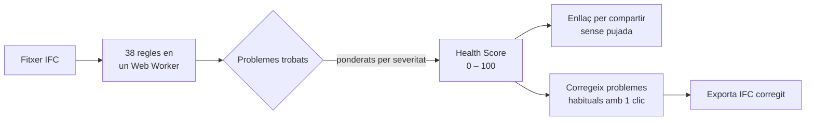
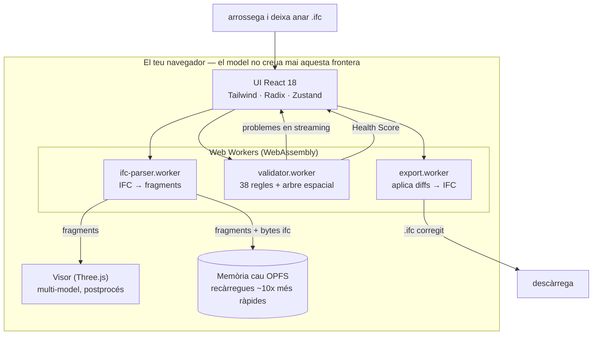

<div align="center">

# IFC Viewer Online

**Obre un fitxer IFC i obtén un Health Score —de 0 a 100— en 30 segons.**

Visor + validador IFC gratuït que s'executa enterament al teu navegador.
Sense compte. Sense configurar cap ruleset. Sense límit de mida. Els teus models no surten mai del teu equip.

[**→ Prova-ho en directe**](https://www.ifcvieweronline.eu/)

<br/>

[](https://www.ifcvieweronline.eu/)
[](#llicència--open-core)
[](#com-contribuir)
[](https://github.com/j03rul4nd/ifc-viewer-online/stargazers)


<br/>

**Llegeix-ho en la teva llengua**

[English](readme.md) · [简体中文](README.zh-CN.md) · [Español](README.es.md) · [Français](README.fr.md) · [Deutsch](README.de.md) · [日本語](README.ja.md) · [Português](README.pt.md) · Català · [Italiano](README.it.md) · [ไทย](README.th.md)

</div>

---

<div align="center">

[](https://www.ifcvieweronline.eu/)

<sub><i>Carrega un model de demostració → executa un perfil de validació → Health Score amb problemes prioritzats, 100% al teu navegador. <a href="https://www.ifcvieweronline.eu/">Prova-ho en directe →</a></i></sub>

</div>

> **En una frase:** arrossega un IFC, mira el teu model en 3D, obtén un Health Score amb una llista prioritzada de problemes, corregeix els més habituals amb un clic i exporta un fitxer corregit —sense pujar res a cap servidor.

## Contingut

- [Per què existeix](#per-què-existeix)
- [Què fa](#què-fa)
- [En acció](#en-acció)
- [El Health Score](#el-health-score)
- [Com funciona (arquitectura)](#com-funciona-arquitectura)
- [Com es veu un problema de validació](#com-es-veu-un-problema-de-validació)
- [Stack tècnic](#stack-tècnic)
- [Primers passos](#primers-passos)
- [Estructura del projecte](#estructura-del-projecte)
- [Les 38 regles de validació](#les-38-regles-de-validació)
- [Com contribuir](#com-contribuir)
- [Roadmap](#roadmap)
- [Llicència — open core](#llicència--open-core)

---

## Per què existeix

La majoria d'eines de validació IFC tenen almenys un d'aquests punts de fricció:

| Eina | Fricció |
|---|---|
| Validador buildingSMART | Límit de 250 MB, sense visor 3D, sortida en text pla |
| Autodesk Viewer / BIM 360 | Puja el teu model als seus servidors — risc amb NDA |
| Sortdesk | Exigeix compte abans de poder validar |
| Data Octopus | Cobra per cada check — car per a ús habitual |
| IFC Verify | Sense visor 3D — els problemes només apareixen com a text |
| BIMvision / Solibri Anywhere | Només escriptori, només Windows (Solibri Anywhere descontinuat l'abril de 2026) |

**IFC Viewer Online no té cap d'aquestes limitacions.** S'executa enterament al navegador via WebAssembly, sense pujada, sense compte i sense límit de mida. Els teus models no surten mai del teu equip.

---

## Què fa

| Capacitat | Què obtens |
|---|---|
| **IFC Health Check** | 38 regles de validació, transmeses en directe des d'un Web Worker, resumides en un únic **Health Score (0–100)**. |
| **Visor 3D** | Renderitzat WebGL amb Three.js + `@thatopen/components`. Càrrega multi-model amb transformacions independents, SSAO, edge rendering, bloom, plantes 2D i talls de secció en directe. |
| **Editor no destructiu** | Edita valors de propietat, corregeix GUIDs, reanomena elements. Cada canvi és un diff amb undo/redo complet. Exporta un IFC corregit — els diffs s'apliquen en un worker, sense servidor. |
| **Importació/exportació BCF 2.1** | Navega als viewpoints BCF importats. Exporta els problemes de validació com un zip BCF 2.1 per a Navisworks, BIMcollab i qualsevol CDE compatible amb BCF. |
| **Amidaments (takeoff)** | Agrega `IfcElementQuantity` a tot el model — àrea, volum i longitud per classe IFC. |
| **Memòria cau de geometria OPFS** | La geometria analitzada es desa a l'Origin Private File System del navegador. Les recàrregues són ~10× més ràpides i funcionen sense connexió. |
| **10 idiomes** | EN · ES · FR · DE · PT · JA · CA · ZH · IT · TH |

**Versions IFC suportades:** IFC2x3 · IFC4 · IFC4x1 · IFC4x3

---

## En acció

> Cada clip de sota és l'**app real** executant-se en un navegador —sense mockups ni metratge editat. El model utilitzat és l'IFC de referència obert [Duplex Apartment](public/Ifc2x3_Duplex_Architecture.ifc) (7.131 elements), processat i validat 100% al client.

### Navega pel model i inspecciona propietats IFC

Recorre tota la jerarquia espacial (projecte → emplaçament → planta → espai → element), fes clic a qualsevol element per ressaltar-lo en 3D i llegeix els seus property sets, classificacions i quantitats IFC en cru.


### Ressalta cada problema en 3D

Executa un perfil de validació i activa l'**Overlay** per pintar els elements marcats directament sobre el model —així una llista de problemes es converteix en una cosa que pots veure i recórrer.


### Exporta un model corregit

Reexporta el model com a **IFC** o **GLB**, o treu els problemes de validació com un paquet **BCF 2.1** i un informe compartible —tot generat en un Web Worker, sense pujar res.


---

## El Health Score

Cada model rep un únic número de **0 a 100** — una puntuació logarítmica de rendiments decreixents derivada de la severitat ponderada de tots els problemes detectats. És el número sobre el qual pots actuar, citar o compartir amb un company.



| Severitat | Exemples |
|---|---|
| **Error** | GUIDs duplicats, agregats trencats, contenidors espacials absents |
| **Advertiment** | Property sets absents, materials absents, infraccions de convenció de noms |
| **Info** | Abús de proxies, desplaçament de coordenades, anomalies de mida, esquema obsolet |

---

## Com funciona (arquitectura)

Tot el pipeline viu al navegador. El fitxer IFC s'analitza en un Web Worker via WebAssembly, es renderitza amb Three.js i es valida en un segon worker — **res del teu model s'envia a cap servidor.**



Tres workers independents mantenen la UI fluida: anàlisi, validació i exportació s'executen fora del fil principal. L'estat viu en set petits stores de [Zustand](https://github.com/pmndrs/zustand); la geometria no entra mai a l'store (només IDs estables). Els diagrames complets de flux de dades són a [`ARCHITECTURE.md`](ARCHITECTURE.md).

---

## Com es veu un problema de validació

El validador llegeix entitats IFC STEP crues i emet problemes estructurats. Per exemple, aquest GUID duplicat al fitxer d'origen:

```step
#42=  IFCWALL('3vB2Y...DUPLICATE',   #5, 'Basic Wall', $, ...);
#118= IFCWALLSTANDARDCASE('3vB2Y...DUPLICATE', #5, 'Wall', $, ...);
```

...produeix un problema tipat, transmès a la UI i inclòs a l'informe compartible:

```jsonc
{
  "ruleId": "RULE_DUPLICATE_GUID",
  "severity": "error",
  "globalId": "3vB2Y...DUPLICATE",
  "expressIds": [42, 118],
  "message": "GlobalId is shared by 2 elements",
  "ifcClass": "IfcWall"
}
```

L'exportació BCF 2.1 embolcalla els mateixos problemes en el markup obert de coordinació que entenen Navisworks i BIMcollab:

```xml
<Markup>
  <Topic Guid="..." TopicType="Issue" TopicStatus="Open">
    <Title>Duplicate GlobalId on IfcWall</Title>
    <Priority>High</Priority>
  </Topic>
</Markup>
```

Cada missatge de worker es valida en temps d'execució amb esquemes [Zod](https://zod.dev) (`src/lib/worker-schemas.ts`), de manera que cap dada malformada arriba a la UI.

---

## Stack tècnic

| Capa | Tecnologia |
|---|---|
| Anàlisi IFC | [web-ifc](https://github.com/ThatOpenCompany/web-ifc) (WebAssembly) |
| Renderitzat 3D | [Three.js](https://threejs.org/) + [@thatopen/components](https://github.com/ThatOpenCompany/engine_components) |
| UI | React 18 + Tailwind CSS + Radix UI |
| Animacions | Framer Motion + GSAP |
| Estat | Zustand 5 (7 stores: model, scene, validation, editor, ui, takeoff, toast) |
| Validació | Web Worker — 38 regles, transmeses via `postMessage` |
| Seguretat en runtime | Esquemes Zod a cada frontera de worker |
| Llistes virtualitzades | @tanstack/react-virtual |
| i18n | i18next (10 idiomes) |
| Analítica | PostHog (client, sense PII) |
| Build | Vite 6 + TypeScript (strict) |
| Tests | Vitest (jsdom) |
| Desplegament | GitHub Pages (estàtic, zero backend) |

---

## Primers passos

```bash
git clone https://github.com/j03rul4nd/ifc-viewer-online.git
cd ifc-viewer-online
npm install
npm run dev    # → http://localhost:3000
```

El servidor de desenvolupament fixa `Cross-Origin-Opener-Policy: same-origin` i `Cross-Origin-Embedder-Policy: require-corp` — necessaris per a `SharedArrayBuffer` (WASM multifil).

**Build**

```bash
npm run build   # → dist/
```

> El build empaqueta Three.js i `@thatopen/*` inline als chunks de worker (~5 MB cadascun). L'script `build` ja passa `--max-old-space-size=4096`. Si tot i així arribes a un OOM de heap, prova `NODE_OPTIONS=--max-old-space-size=8192 npx vite build`.

**Tests**

```bash
npm test        # vitest (jsdom)
```

---

## Estructura del projecte

```
src/
  components/      # Landing, Viewer, ValidationPanel, Sidebar, ModelTree, ScenePanel, …
  workers/         # ifc-parser.worker.ts · validator.worker.ts · export.worker.ts
  stores/          # 7 stores Zustand (model, scene, validation, editor, ui, takeoff, toast)
  hooks/           # useModelSession, useValidationRunner, useElementFocus, …
  lib/             # viewer.ts · loader.ts · validator.ts · diffStore.ts · worker-schemas.ts
  locales/         # i18n — en/ es/ fr/ de/ pt/ ja/ ca/ zh/ it/ th/
  types/           # Esquemes Zod + tipus TypeScript (ValidationRules, EditDiff, …)
public/
  ifc-validator/           # Landing de nínxol — /ifc-validator/
  ifc-viewer-mac/          # Landing de nínxol — /ifc-viewer-mac/
  solibri-alternative/     # Landing de nínxol — /solibri-alternative/
  tools/fix-duplicate-guids/
  es/                      # Shell estàtic en castellà + /es/ifc-validador/
cf-worker/         # Cloudflare Worker — proxy stateless de captura d'email (no veu mai el model)
```

Documents de referència que aprofundeixen: [`ARCHITECTURE.md`](ARCHITECTURE.md) · [`IFC_DOMAIN.md`](IFC_DOMAIN.md) · [`DECISIONS.md`](DECISIONS.md) · [`ROADMAP.md`](ROADMAP.md).

---

## Les 38 regles de validació

Les regles s'executen a `src/workers/validator.worker.ts`, controlades per un `RulesConfig`, agrupades per generació:

<details>
<summary><b>Nucli — 18 regles</b> (noms, GUIDs, tipus, jerarquia)</summary>

`RULE_EMPTY_NAME` · `RULE_EMPTY_LONGNAME` · `RULE_DUPLICATE_NAME` · `RULE_NAMING_CONVENTION` · `RULE_MISSING_TYPE` · `RULE_DUPLICATE_GUID` · `RULE_MISSING_PROPERTY_SET` · `RULE_ORPHAN_ELEMENT` · `RULE_WRONG_CONTAINER` · `RULE_BROKEN_AGGREGATE` · `RULE_INVALID_GUID_FORMAT` · `RULE_SPATIAL_HIERARCHY` · `RULE_CIRCULAR_REFERENCE` · `RULE_EMPTY_PROPERTY_VALUE` · `RULE_MISSING_MATERIAL` · `RULE_ELEMENT_IN_BUILDING` · `RULE_INVALID_IFC_VERSION` · `RULE_ELEMENT_CLASH` (desactivada per defecte)

</details>

<details>
<summary><b>Espacial &amp; capçalera de fitxer — 11 regles</b> (projecte/emplaçament/planta, ISO 19650)</summary>

`RULE_MISSING_PROJECT` · `RULE_MISSING_BUILDING` · `RULE_MISSING_STOREY` · `RULE_EMPTY_STOREY` · `RULE_FILE_DESCRIPTION_MISSING` · `RULE_FILE_AUTHOR_MISSING` · `RULE_PROJECT_LONGNAME_MISSING` · `RULE_STOREY_ELEVATION_MISSING` · `RULE_ISO19650_PROJECT_INFO` · `RULE_ISO19650_AUTHOR_INFO` · `RULE_ISO19650_FILENAME`

</details>

<details>
<summary><b>LOD, classificació &amp; MEP — 9 regles</b></summary>

`RULE_MISSING_CLASSIFICATION` · `RULE_LOD_PSET_MISSING` · `RULE_LOD_QUANTITY_MISSING` · `RULE_LOD_MATERIAL_LAYER_MISSING` · `RULE_MEP_SYSTEM_MISSING` · `RULE_CLASH_MEP_STRUCTURAL` · `RULE_PROXY_OVERUSE` · `RULE_COORDINATE_OFFSET` · `RULE_FILE_SIZE_ANOMALY`

</details>

---

## Com contribuir

Les contribucions són benvingudes — especialment noves regles de validació, traduccions i correccions de bugs.

**Afegir una regla de validació** (`src/workers/validator.worker.ts`):

1. Afegeix l'ID de la regla a `ValidationRules` a `src/types/index.ts`
2. Implementa la funció `async` — rep la instància `IfcAPI`, `modelId` i un helper `SpatialIndex`, i retorna `ValidationIssue[]`
3. Connecta-la al bloc de dispatch `runAllRules`
4. Afegeix les cadenes i18n a `RULE_TRANSLATIONS` a `src/types/index.ts`
5. Defineix `DEFAULT_RULES[RULE_ID] = true` (o `false` si és opt-in)
6. Actualitza el nombre de regles al copy que esmenta "38 regles" (`index.html`, `README*.md`, `src/seo/config.ts`, les landings a `public/*`)

**Afegir una traducció:** copia `src/locales/en/` a una nova carpeta d'idioma, tradueix els valors JSON i registra l'idioma a `src/i18n/config.ts`. Les traduccions d'aquest README també són benvingudes — respecta el nom (`README.<lang>.md`) i afegeix un enllaç a la fila d'idiomes de dalt.

**Abans d'obrir un PR:** executa `npm test` i `npm run lint`.

---

## Roadmap

El producte és tècnicament madur (visor multi-model, validador de 38 regles, editor no destructiu, BCF, 10 idiomes). El pla cap endavant està **liderat per la distribució**, no per les features:

- **Taula de remediació** — contingut determinista "com arreglar això a Revit / ArchiCAD / Tekla" per regla, escrit en i18n (sense IA, sense servidor).
- **Informes rastrejables** — moure l'enllaç compartit d'un hash d'URL a una ruta edge stateless perquè els informes es despleguin a xarxes/cercadors (el model continua sense sortir del navegador).
- **Diff de revisions** — comparar dues versions d'un model per GlobalId.
- **IDS-lite** — checklists de projecte en llenguatge planer.

Consulta [`ROADMAP.md`](ROADMAP.md) per al pla complet i els punts explícitament ajornats.

---

## Llicència — open core

| Component | Llicència |
|---|---|
| Visor IFC (renderitzat Three.js, integració WASM) | **MIT** |
| Validador (38 regles, Web Worker) | **MIT** |
| Editor no destructiu (diffs, undo/redo, export IFC) | **MIT** |
| Stores, hooks, utilitats, i18n | **MIT** |
| Cloudflare Worker (backend de captura d'email) | Propietari |
| Futur: cloud storage, API de compartició, auth, informes PDF | Propietari |

**El visor i el validador nucli són MIT per sempre.** Fes-ne fork, autoallotja'l, fes-lo servir comercialment. La infraestructura cloud per a futures features de pagament és propietària i no es pot replicar només des d'aquest repo.

---

## Autor

[Joel Benitez](https://github.com/j03rul4nd)

Si aquest projecte t'ha estalviat temps, una ⭐ ajuda altra gent del món BIM a trobar-lo.

---

<div align="center">

*Construït amb [@thatopen/components](https://github.com/ThatOpenCompany/engine_components), [web-ifc](https://github.com/ThatOpenCompany/web-ifc) i [Three.js](https://threejs.org/).*

</div>
