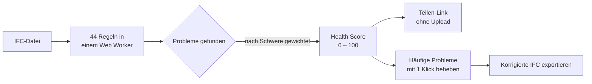
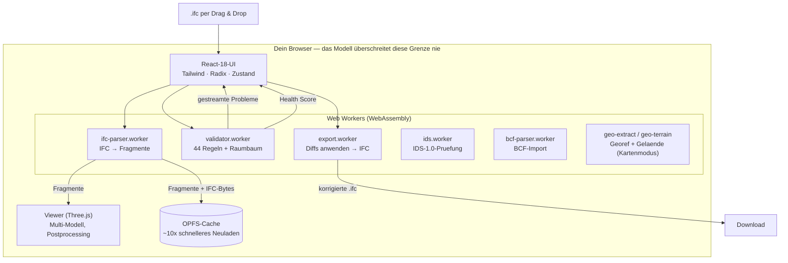

<div align="center">

# IFC Viewer Online

**Öffne eine IFC-Datei und erhalte einen Health Score — 0 bis 100 — in 30 Sekunden.**

Kostenloser IFC-Viewer + Validator, der vollständig im Browser läuft.
Kein Konto. Kein Regelsatz zum Konfigurieren. Keine Größenbeschränkung. Deine Modelle verlassen niemals dein Gerät.

[**→ Live ausprobieren**](https://www.ifcvieweronline.eu/)

<br/>

[](https://www.ifcvieweronline.eu/)
[](#lizenz--open-core)
[](#mitwirken)
[](https://github.com/j03rul4nd/ifc-viewer-online/stargazers)


<br/>

**In deiner Sprache lesen**

[English](readme.md) · [简体中文](README.zh-CN.md) · [Español](README.es.md) · [Français](README.fr.md) · Deutsch · [日本語](README.ja.md) · [Português](README.pt.md) · [Català](README.ca.md) · [Italiano](README.it.md) · [ไทย](README.th.md)

</div>

---

<div align="center">

[](https://www.ifcvieweronline.eu/)

<sub><i>Demo-Modell laden → Validierungsprofil starten → Health Score mit priorisierten Problemen, 100 % im Browser. <a href="https://www.ifcvieweronline.eu/">Live ausprobieren →</a></i></sub>

</div>

> **In einem Satz:** Ziehe eine IFC hinein, sieh dein Modell in 3D, erhalte einen Health Score mit einer priorisierten Problemliste, behebe die häufigsten mit einem Klick und exportiere eine korrigierte Datei — ohne irgendetwas auf einen Server hochzuladen.

## Inhalt

- [Warum es das gibt](#warum-es-das-gibt)
- [Was es kann](#was-es-kann)
- [In Aktion](#in-aktion)
- [Der Health Score](#der-health-score)
- [Wie es funktioniert (Architektur)](#wie-es-funktioniert-architektur)
- [Wie ein Validierungsproblem aussieht](#wie-ein-validierungsproblem-aussieht)
- [Tech-Stack](#tech-stack)
- [Loslegen](#loslegen)
- [Projektstruktur](#projektstruktur)
- [Die 44 Validierungsregeln](#die-44-validierungsregeln)
- [Mitwirken](#mitwirken)
- [Roadmap](#roadmap)
- [Lizenz — Open Core](#lizenz--open-core)

---

## Warum es das gibt

Die meisten IFC-Validierungstools haben mindestens einen dieser Reibungspunkte:

| Tool | Reibungspunkt |
|---|---|
| buildingSMART-Validator | 250-MB-Größenlimit, kein 3D-Viewer, reine Textausgabe |
| Autodesk Viewer / BIM 360 | Lädt dein Modell auf deren Server hoch — NDA-Risiko |
| Sortdesk | Verlangt ein Konto, bevor du validieren kannst |
| Data Octopus | Berechnet pro Prüfung — teuer bei regelmäßiger Nutzung |
| IFC Verify | Kein 3D-Viewer — Probleme erscheinen nur als Text |
| BIMvision / Solibri Anywhere | Nur Desktop, nur Windows (Solibri Anywhere im April 2026 eingestellt) |

**IFC Viewer Online hat keine dieser Einschränkungen.** Es läuft vollständig im Browser über WebAssembly, ohne Upload, ohne Konto und ohne Größenlimit. Deine Modelle verlassen niemals dein Gerät.

---

## Was es kann

| Fähigkeit | Was du bekommst |
|---|---|
| **IFC Health Check** | 44 Validierungsregeln, live aus einem Web Worker gestreamt, zusammengefasst in einem einzigen **Health Score (0–100)**. |
| **buildingSMART IDS** | Lade eine `.ids`-Datei und prüfe das Modell gegen eine Information Delivery Specification — vollständige Abdeckung aller IDS-1.0-Facetten, validiert gegen die offiziellen buildingSMART-Testfälle. Bestanden/Fehlgeschlagen pro Spezifikation, Export nach JSON/CSV/HTML/BCF. |
| **3D-Kartenmodus (GIS)** | Platziere ein georeferenziertes Modell auf einer realen Basiskarte (OpenStreetMap / Topo / Satellit) und optionalem 3D-Gelände, in derselben 3D-Szene. Die Georeferenzierung wird automatisch aus der IFC extrahiert; das Modell verlässt nie den Browser. Per Build-Flag aktivierbar (`VITE_FEATURE_GIS`). |
| **3D-Viewer** | WebGL-Rendering über Three.js + `@thatopen/components`. Multi-Modell-Laden mit unabhängigen Transformationen, SSAO, Edge-Rendering, Bloom, 2D-Grundrisse und Live-Schnitte. |
| **Nicht-destruktiver Editor** | Eigenschaftswerte ändern, GUIDs reparieren, Elemente umbenennen. Jede Änderung ist ein Diff mit vollständigem Undo/Redo. Exportiere eine korrigierte IFC-Binärdatei — Diffs werden in einem Worker angewendet, ohne Server. |
| **BCF-2.1-Import/-Export** | Navigiere zu importierten BCF-Viewpoints. Exportiere Validierungsprobleme als BCF-2.1-Zip für Navisworks, BIMcollab und jedes BCF-kompatible CDE. |
| **Mengenermittlung** | Aggregiert `IfcElementQuantity` über das gesamte Modell — Fläche, Volumen, Länge pro IFC-Klasse. |
| **OPFS-Geometrie-Cache** | Geparste Geometrie wird im Origin Private File System des Browsers gecacht. Neuladen ist ~10× schneller und funktioniert offline. |
| **10 Sprachen** | EN · ES · FR · DE · PT · JA · CA · ZH · IT · TH |

**Unterstützte IFC-Versionen:** IFC2x3 · IFC4 · IFC4x1 · IFC4x3

---

## In Aktion

> Jeder Clip unten ist die **echte App**, die in einem Browser läuft — keine Mockups, kein geschnittenes Material. Verwendet wird die offene Referenz-IFC [Duplex Apartment](public/Ifc2x3_Duplex_Architecture.ifc) (7.131 Elemente), zu 100 % clientseitig geparst und validiert.

### Modell navigieren & IFC-Eigenschaften inspizieren

Durchsuchen Sie die gesamte räumliche Hierarchie (Projekt → Grundstück → Geschoss → Raum → Element), klicken Sie ein beliebiges Element an, um es in 3D hervorzuheben, und lesen Sie seine rohen IFC-Property-Sets, Klassifikationen und Mengen.


### Jedes Problem in 3D hervorheben

Führen Sie ein Validierungsprofil aus und schalten Sie dann das **Overlay** ein, um markierte Elemente direkt auf dem Modell einzufärben — so wird aus einer Liste von Problemen etwas, das Sie tatsächlich sehen und durchgehen können.


### Korrigiertes Modell exportieren

Exportieren Sie das Modell erneut als **IFC** oder **GLB**, oder geben Sie die Validierungsprobleme als **BCF-2.1**-Paket und teilbaren Bericht aus — alles in einem Web Worker erzeugt, ohne Upload.


---

## Der Health Score

Jedes Modell erhält eine einzige Zahl von **0 bis 100** — ein logarithmischer Score mit abnehmendem Grenznutzen, abgeleitet aus der gewichteten Schwere aller erkannten Probleme. Es ist die eine Zahl, auf die du reagieren, die du zitieren oder mit Kolleg:innen teilen kannst.



| Schweregrad | Beispiele |
|---|---|
| **Fehler** | Doppelte GUIDs, kaputte Aggregate, fehlende räumliche Container |
| **Warnung** | Fehlende Property Sets, fehlende Materialien, Verstöße gegen Namenskonventionen |
| **Info** | Proxy-Übernutzung, Koordinaten-Offset, Dateigrößen-Anomalien, veraltetes Schema |

---

## Wie es funktioniert (Architektur)

Die gesamte Pipeline lebt im Browser. Die IFC-Datei wird in einem Web Worker über WebAssembly geparst, mit Three.js gerendert und in einem zweiten Worker validiert — **nichts von deinem Modell wird an einen Server gesendet.**



Mehrere unabhängige Worker halten die UI reaktionsfähig: Parsing, Validierung und Export laufen außerhalb des Main-Threads. Der State liegt in elf kleinen [Zustand](https://github.com/pmndrs/zustand)-Stores; Geometrie kommt nie in den Store (nur stabile IDs). Die vollständigen Datenflussdiagramme stehen in [`ARCHITECTURE.md`](ARCHITECTURE.md).

---

## Wie ein Validierungsproblem aussieht

Der Validator liest rohe IFC-STEP-Entitäten und gibt strukturierte Probleme aus. Zum Beispiel erzeugt diese doppelte GUID in der Quelldatei:

```step
#42=  IFCWALL('3vB2Y...DUPLICATE',   #5, 'Basic Wall', $, ...);
#118= IFCWALLSTANDARDCASE('3vB2Y...DUPLICATE', #5, 'Wall', $, ...);
```

...ein typisiertes Problem, das in die UI gestreamt und in den teilbaren Bericht aufgenommen wird:

```jsonc
{
  "ruleId": "RULE_DUPLICATE_GUID",
  "severity": "error",
  "globalId": "3vB2Y...DUPLICATE",
  "expressIds": [42, 118],
  "message": "GlobalId is shared by 2 elements",
  "ifcClass": "IfcWall"
}
```

Der BCF-2.1-Export verpackt dieselben Probleme in das offene Koordinations-Markup, das Navisworks und BIMcollab verstehen:

```xml
<Markup>
  <Topic Guid="..." TopicType="Issue" TopicStatus="Open">
    <Title>Duplicate GlobalId on IfcWall</Title>
    <Priority>High</Priority>
  </Topic>
</Markup>
```

Jede Worker-Nachricht wird zur Laufzeit mit [Zod](https://zod.dev)-Schemata (`src/lib/worker-schemas.ts`) validiert, sodass fehlerhafte Daten niemals die UI erreichen.

---

## Tech-Stack

| Schicht | Technologie |
|---|---|
| IFC-Parsing | [web-ifc](https://github.com/ThatOpenCompany/web-ifc) (WebAssembly) |
| 3D-Rendering | [Three.js](https://threejs.org/) + [@thatopen/components](https://github.com/ThatOpenCompany/engine_components) |
| UI | React 18 + Tailwind CSS + Radix UI |
| Animationen | Framer Motion + GSAP |
| State | Zustand 5 (11 Stores: model, scene, validation, editor, ui, takeoff, toast, bcf, ids, geo, waiver) |
| IDS | Reiner-TS-IDS-1.0-Engine + dedizierter web-ifc-Worker (`src/lib/ids/`, `ids.worker.ts`) |
| GIS / Basiskarte | [3d-tiles-renderer](https://github.com/NASA-AMMOS/3DTilesRendererJS) (Kacheln in der three.js-Szene) — nur Kartenmodus |
| Validierung | Web Worker — 44 Regeln, gestreamt über `postMessage` |
| Laufzeit-Sicherheit | Zod-Schemata an jeder Worker-Grenze |
| Virtualisierte Listen | @tanstack/react-virtual |
| i18n | i18next (10 Sprachen) |
| Analytics | PostHog (clientseitig, keine PII) |
| Build | Vite 6 + TypeScript (strict) |
| Tests | Vitest (jsdom) |
| Deployment | Vercel (statisch, kein Backend) |

---

## Loslegen

```bash
git clone https://github.com/j03rul4nd/ifc-viewer-online.git
cd ifc-viewer-online
npm install
npm run dev    # → http://localhost:3000
```

Der Dev-Server setzt `Cross-Origin-Opener-Policy: same-origin` und `Cross-Origin-Embedder-Policy: require-corp` — erforderlich für `SharedArrayBuffer` (Multithread-WASM).

**Build**

```bash
npm run build   # → dist/
```

> Der Build bündelt Three.js und `@thatopen/*` inline in die Worker-Chunks (~5 MB pro Stück). Das `build`-Skript übergibt bereits `--max-old-space-size=4096`. Falls du trotzdem auf einen Heap-OOM stößt, versuche `NODE_OPTIONS=--max-old-space-size=8192 npx vite build`.

**Tests**

```bash
npm test        # vitest (jsdom)
```

---

## Projektstruktur

```
src/
  components/      # Landing, Viewer, ValidationPanel, Sidebar, ModelTree, ScenePanel, …
  workers/         # ifc-parser.worker.ts · validator.worker.ts · export.worker.ts
  stores/          # 11 Zustand-Stores (model, scene, validation, editor, ui, takeoff, toast, bcf, ids, geo, waiver)
  hooks/           # useModelSession, useValidationRunner, useElementFocus, …
  lib/             # viewer.ts · loader.ts · validator.ts · diffStore.ts · worker-schemas.ts
  locales/         # i18n — en/ es/ fr/ de/ pt/ ja/ ca/ zh/ it/ th/
  types/           # Zod-Schemata + TypeScript-Typen (ValidationRules, EditDiff, …)
public/
  ifc-validator/           # Nischen-Landingpage — /ifc-validator/
  ifc-viewer-mac/          # Nischen-Landingpage — /ifc-viewer-mac/
  solibri-alternative/     # Nischen-Landingpage — /solibri-alternative/
  tools/fix-duplicate-guids/
  es/                      # Spanische statische Shell + /es/ifc-validador/
cf-worker/         # Cloudflare Worker — zustandsloser E-Mail-Capture-Proxy (sieht nie das Modell)
```

Weiterführende Referenzdokumente: [`ARCHITECTURE.md`](ARCHITECTURE.md) · [`IFC_DOMAIN.md`](IFC_DOMAIN.md) · [`DECISIONS.md`](DECISIONS.md) · [`ROADMAP.md`](ROADMAP.md).

---

## Die 44 Validierungsregeln

Die Regeln laufen in `src/workers/validator.worker.ts`, gesteuert durch eine `RulesConfig`, gruppiert nach Generation:

<details>
<summary><b>Kern — 18 Regeln</b> (Namen, GUIDs, Typen, Hierarchie)</summary>

`RULE_EMPTY_NAME` · `RULE_EMPTY_LONGNAME` · `RULE_DUPLICATE_NAME` · `RULE_NAMING_CONVENTION` · `RULE_MISSING_TYPE` · `RULE_DUPLICATE_GUID` · `RULE_MISSING_PROPERTY_SET` · `RULE_ORPHAN_ELEMENT` · `RULE_WRONG_CONTAINER` · `RULE_BROKEN_AGGREGATE` · `RULE_INVALID_GUID_FORMAT` · `RULE_SPATIAL_HIERARCHY` · `RULE_CIRCULAR_REFERENCE` · `RULE_EMPTY_PROPERTY_VALUE` · `RULE_MISSING_MATERIAL` · `RULE_ELEMENT_IN_BUILDING` · `RULE_INVALID_IFC_VERSION` · `RULE_ELEMENT_CLASH` (standardmäßig aus)

</details>

<details>
<summary><b>Räumlich &amp; Datei-Header — 11 Regeln</b> (Projekt/Gelände/Geschoss, ISO 19650)</summary>

`RULE_MISSING_PROJECT` · `RULE_MISSING_BUILDING` · `RULE_MISSING_STOREY` · `RULE_EMPTY_STOREY` · `RULE_FILE_DESCRIPTION_MISSING` · `RULE_FILE_AUTHOR_MISSING` · `RULE_PROJECT_LONGNAME_MISSING` · `RULE_STOREY_ELEVATION_MISSING` · `RULE_ISO19650_PROJECT_INFO` · `RULE_ISO19650_AUTHOR_INFO` · `RULE_ISO19650_FILENAME`

</details>

<details>
<summary><b>LOD, Klassifizierung &amp; TGA/MEP — 9 Regeln</b></summary>

`RULE_MISSING_CLASSIFICATION` · `RULE_LOD_PSET_MISSING` · `RULE_LOD_QUANTITY_MISSING` · `RULE_LOD_MATERIAL_LAYER_MISSING` · `RULE_MEP_SYSTEM_MISSING` · `RULE_CLASH_MEP_STRUCTURAL` · `RULE_PROXY_OVERUSE` · `RULE_COORDINATE_OFFSET` · `RULE_FILE_SIZE_ANOMALY`

</details>

<details>
<summary><b>Geometrie & Geschoss-Integrität — 6 Regeln</b></summary>

`RULE_OPENING_WITHOUT_HOST` · `RULE_STOREY_ELEVATION_DUPLICATE` · `RULE_STOREY_ELEVATION_ORDER` · `RULE_UNIT_CONSISTENCY` · `RULE_SPACE_AREA_MISSING` · `RULE_CONNECTED_MEP`

</details>

---

## Mitwirken

Beiträge sind willkommen — besonders neue Validierungsregeln, Übersetzungen und Bugfixes.

**Eine Validierungsregel hinzufügen** (`src/workers/validator.worker.ts`):

1. Füge die Regel-ID zu `ValidationRules` in `src/types/index.ts` hinzu
2. Implementiere die `async`-Funktion — sie erhält die `IfcAPI`-Instanz, `modelId` und einen `SpatialIndex`-Helper und gibt `ValidationIssue[]` zurück
3. Binde sie in den `runAllRules`-Dispatch-Block ein
4. Füge i18n-Strings zu `RULE_TRANSLATIONS` in `src/types/index.ts` hinzu
5. Setze `DEFAULT_RULES[RULE_ID] = true` (oder `false`, falls opt-in)
6. Aktualisiere die Regelanzahl im Marketing-Text, der „44 Regeln“ erwähnt (`index.html`, `README*.md`, `src/seo/config.ts`, die Landingpages in `public/*`)

**Eine Übersetzung hinzufügen:** Kopiere `src/locales/en/` in einen neuen Sprachordner, übersetze die JSON-Werte und registriere die Sprache in `src/i18n/config.ts`. Übersetzungen dieser README sind ebenso willkommen — halte dich an die Benennung (`README.<lang>.md`) und füge oben einen Link in die Sprachzeile ein.

**Vor dem Öffnen eines PR:** führe `npm test` und `npm run lint` aus.

---

## Roadmap

Das Produkt ist technisch ausgereift (Multi-Modell-Viewer, 44-Regeln-Validator, nicht-destruktiver Editor, BCF, 10 Sprachen). Der weitere Plan ist **vertriebsgetrieben**, nicht feature-getrieben:

- **Behebungstabelle** — deterministischer Inhalt „So behebst du das in Revit / ArchiCAD / Tekla“ pro Regel, in i18n geschrieben (keine KI, kein Server).
- **Crawlbare Berichte** — den Teilen-Link von einem URL-Hash zu einer zustandslosen Edge-Route verschieben, damit Berichte in sozialen Netzen/Suche entfaltet werden (das Modell verlässt weiterhin nie den Browser).
- **Revisions-Diff** — zwei Versionen eines Modells per GlobalId vergleichen.
- **buildingSMART IDS** — vollstaendige IDS-1.0-Abdeckung, validiert gegen die offiziellen bSI-Testfaelle. Lade eine beliebige `.ids`, erhalte Bestanden/Fehlgeschlagen pro Spezifikation, exportiere nach JSON/CSV/HTML/BCF.
- **3D-Kartenmodus / GIS** — georeferenziertes Modell auf einer realen Basiskarte + 3D-Gelaende, in der bestehenden Szene (per Flag aktivierbar).
- **Solibri-Paritaet-Backlog** — Regelvorlagen, Information Takeoff, Clash-Gruppierung/Praesentationen. Siehe [`ROADMAP.md`](ROADMAP.md).

Siehe [`ROADMAP.md`](ROADMAP.md) für den vollständigen Plan und die ausdrücklich zurückgestellten Punkte.

---

## Lizenz — Open Core

| Komponente | Lizenz |
|---|---|
| IFC-Viewer (Three.js-Rendering, WASM-Integration) | **MIT** |
| Validator (44 Regeln, Web Worker) | **MIT** |
| IDS-1.0-Engine + Worker | **MIT** |
| GIS / 3D-Kartenmodus | **MIT** |
| Nicht-destruktiver Editor (Diffs, Undo/Redo, IFC-Export) | **MIT** |
| Stores, Hooks, Utilities, i18n | **MIT** |
| Cloudflare Worker (E-Mail-Capture-Backend) | Proprietär |
| Zukünftig: Cloud-Storage, Sharing-API, Auth, PDF-Berichte | Proprietär |

**Der Kern-Viewer und -Validator sind für immer MIT-lizenziert.** Forke ihn, hoste ihn selbst, nutze ihn kommerziell. Die Cloud-Infrastruktur für künftige kostenpflichtige Funktionen ist proprietär und kann allein aus diesem Repo nicht repliziert werden.

---

## Autor

[Joel Benitez](https://github.com/j03rul4nd)

Wenn dir dieses Projekt Zeit gespart hat, hilft ein ⭐ anderen BIM-Leuten, es zu finden.

---

<div align="center">

*Erstellt mit [@thatopen/components](https://github.com/ThatOpenCompany/engine_components), [web-ifc](https://github.com/ThatOpenCompany/web-ifc) und [Three.js](https://threejs.org/).*

</div>
