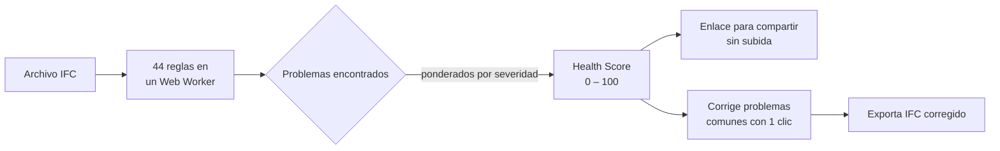
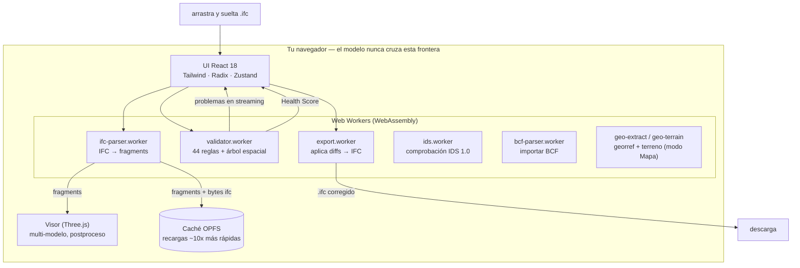

<div align="center">

# IFC Viewer Online

**Abre un archivo IFC y obtén un Health Score —de 0 a 100— en 30 segundos.**

Visor + validador IFC gratuito que se ejecuta enteramente en tu navegador.
Sin cuenta. Sin configurar ningún ruleset. Sin límite de tamaño. Tus modelos nunca salen de tu equipo.

[**→ Pruébalo en vivo**](https://www.ifcvieweronline.eu/)

<br/>

[](https://www.ifcvieweronline.eu/)
[](#licencia--open-core)
[](#cómo-contribuir)
[](https://github.com/j03rul4nd/ifc-viewer-online/stargazers)


<br/>

**Léelo en tu idioma**

[English](readme.md) · [简体中文](README.zh-CN.md) · Español · [Français](README.fr.md) · [Deutsch](README.de.md) · [日本語](README.ja.md) · [Português](README.pt.md) · [Català](README.ca.md) · [Italiano](README.it.md) · [ไทย](README.th.md)

</div>

---

<div align="center">

[](https://www.ifcvieweronline.eu/)

<sub><i>Carga un modelo de demo → ejecuta un perfil de validación → Health Score con problemas priorizados, 100% en tu navegador. <a href="https://www.ifcvieweronline.eu/">Pruébalo en vivo →</a></i></sub>

</div>

> **En una frase:** arrastra un IFC, mira tu modelo en 3D, obtén un Health Score con una lista priorizada de problemas, corrige los más comunes con un clic y exporta un archivo corregido —sin subir nada a ningún servidor.

## Contenido

- [Por qué existe](#por-qué-existe)
- [Qué hace](#qué-hace)
- [En acción](#en-acción)
- [El Health Score](#el-health-score)
- [Cómo funciona (arquitectura)](#cómo-funciona-arquitectura)
- [Cómo se ve un problema de validación](#cómo-se-ve-un-problema-de-validación)
- [Stack técnico](#stack-técnico)
- [Primeros pasos](#primeros-pasos)
- [Estructura del proyecto](#estructura-del-proyecto)
- [Las 44 reglas de validación](#las-44-reglas-de-validación)
- [Cómo contribuir](#cómo-contribuir)
- [Roadmap](#roadmap)
- [Licencia — open core](#licencia--open-core)

---

## Por qué existe

La mayoría de las herramientas de validación IFC tienen al menos uno de estos puntos de fricción:

| Herramienta | Fricción |
|---|---|
| Validador buildingSMART | Límite de 250 MB, sin visor 3D, salida en texto plano |
| Autodesk Viewer / BIM 360 | Sube tu modelo a sus servidores — riesgo con NDA |
| Sortdesk | Exige cuenta antes de poder validar |
| Data Octopus | Cobra por cada check — caro para uso habitual |
| IFC Verify | Sin visor 3D — los problemas solo aparecen como texto |
| BIMvision / Solibri Anywhere | Solo escritorio, solo Windows (Solibri Anywhere descontinuado en abril de 2026) |

**IFC Viewer Online no tiene ninguna de esas limitaciones.** Se ejecuta enteramente en el navegador vía WebAssembly, sin subida, sin cuenta y sin tope de tamaño. Tus modelos nunca salen de tu equipo.

---

## Qué hace

| Capacidad | Lo que obtienes |
|---|---|
| **IFC Health Check** | 44 reglas de validación, transmitidas en vivo desde un Web Worker, resumidas en un único **Health Score (0–100)**. |
| **buildingSMART IDS** | Carga un archivo `.ids` y comprueba el modelo contra una Information Delivery Specification — cobertura completa de las facetas de IDS 1.0, validada contra los casos de prueba oficiales de buildingSMART. Aprobado/fallido por especificación, exportación a JSON/CSV/HTML/BCF. |
| **Modo Mapa 3D (GIS)** | Coloca un modelo georreferenciado sobre un mapa base real (OpenStreetMap / topográfico / satélite) y terreno 3D opcional, dentro de la misma escena 3D. La georreferenciación se extrae automáticamente del IFC; el modelo nunca sale del navegador. Activable por flag de build (`VITE_FEATURE_GIS`). |
| **Visor 3D** | Renderizado WebGL con Three.js + `@thatopen/components`. Carga multi-modelo con transformaciones independientes, SSAO, edge rendering, bloom, plantas 2D y cortes de sección en vivo. |
| **Editor no destructivo** | Edita valores de propiedad, corrige GUIDs, renombra elementos. Cada cambio es un diff con undo/redo completo. Exporta un IFC corregido — los diffs se aplican en un worker, sin servidor. |
| **Importación/exportación BCF 2.1** | Navega a los viewpoints BCF importados. Exporta los problemas de validación como un zip BCF 2.1 para Navisworks, BIMcollab y cualquier CDE compatible con BCF. |
| **Mediciones (takeoff)** | Agrega `IfcElementQuantity` en todo el modelo — área, volumen y longitud por clase IFC. |
| **Caché de geometría OPFS** | La geometría parseada se cachea en el Origin Private File System del navegador. Las recargas son ~10× más rápidas y funcionan offline. |
| **10 idiomas** | EN · ES · FR · DE · PT · JA · CA · ZH · IT · TH |

**Versiones IFC soportadas:** IFC2x3 · IFC4 · IFC4x1 · IFC4x3

---

## En acción

> Cada clip de abajo es la **app real** ejecutándose en un navegador —sin mockups ni metraje editado. El modelo usado es el IFC de referencia abierto [Duplex Apartment](public/Ifc2x3_Duplex_Architecture.ifc) (7.131 elementos), procesado y validado 100% en el cliente.

### Navega el modelo e inspecciona propiedades IFC

Recorre toda la jerarquía espacial (proyecto → emplazamiento → planta → espacio → elemento), haz clic en cualquier elemento para resaltarlo en 3D y lee sus property sets, clasificaciones y cantidades IFC en crudo.


### Resalta cada problema en 3D

Ejecuta un perfil de validación y activa el **Overlay** para pintar los elementos marcados directamente sobre el modelo —así una lista de problemas se convierte en algo que puedes ver y recorrer.


### Exporta un modelo corregido

Reexporta el modelo como **IFC** o **GLB**, o saca los problemas de validación como un paquete **BCF 2.1** y un informe compartible —todo generado en un Web Worker, sin subir nada.


---

## El Health Score

Cada modelo recibe un único número de **0 a 100** — una puntuación logarítmica de rendimientos decrecientes derivada de la severidad ponderada de todos los problemas detectados. Es el número sobre el que puedes actuar, citar o compartir con un colega.



| Severidad | Ejemplos |
|---|---|
| **Error** | GUIDs duplicados, agregados rotos, contenedores espaciales ausentes |
| **Advertencia** | Property sets ausentes, materiales ausentes, violaciones de convención de nombres |
| **Info** | Abuso de proxies, offset de coordenadas, anomalías de tamaño, esquema obsoleto |

---

## Cómo funciona (arquitectura)

Todo el pipeline vive en el navegador. El archivo IFC se parsea en un Web Worker vía WebAssembly, se renderiza con Three.js y se valida en un segundo worker — **nada de tu modelo se envía a ningún servidor.**



Varios workers independientes mantienen la UI fluida: parseo, validación y exportación corren fuera del hilo principal. El estado vive en once pequeños stores de [Zustand](https://github.com/pmndrs/zustand); la geometría nunca entra al store (solo IDs estables). Los diagramas completos de flujo de datos están en [`ARCHITECTURE.md`](ARCHITECTURE.md).

---

## Cómo se ve un problema de validación

El validador lee entidades IFC STEP crudas y emite problemas estructurados. Por ejemplo, este GUID duplicado en el archivo de origen:

```step
#42=  IFCWALL('3vB2Y...DUPLICATE',   #5, 'Basic Wall', $, ...);
#118= IFCWALLSTANDARDCASE('3vB2Y...DUPLICATE', #5, 'Wall', $, ...);
```

...produce un problema tipado, transmitido a la UI e incluido en el reporte compartible:

```jsonc
{
  "ruleId": "RULE_DUPLICATE_GUID",
  "severity": "error",
  "globalId": "3vB2Y...DUPLICATE",
  "expressIds": [42, 118],
  "message": "GlobalId is shared by 2 elements",
  "ifcClass": "IfcWall"
}
```

La exportación BCF 2.1 envuelve los mismos problemas en el markup abierto de coordinación que entienden Navisworks y BIMcollab:

```xml
<Markup>
  <Topic Guid="..." TopicType="Issue" TopicStatus="Open">
    <Title>Duplicate GlobalId on IfcWall</Title>
    <Priority>High</Priority>
  </Topic>
</Markup>
```

Cada mensaje de worker se valida en tiempo de ejecución con esquemas [Zod](https://zod.dev) (`src/lib/worker-schemas.ts`), de modo que ningún dato malformado llega a la UI.

---

## Stack técnico

| Capa | Tecnología |
|---|---|
| Parseo IFC | [web-ifc](https://github.com/ThatOpenCompany/web-ifc) (WebAssembly) |
| Renderizado 3D | [Three.js](https://threejs.org/) + [@thatopen/components](https://github.com/ThatOpenCompany/engine_components) |
| UI | React 18 + Tailwind CSS + Radix UI |
| Animaciones | Framer Motion + GSAP |
| Estado | Zustand 5 (11 stores: model, scene, validation, editor, ui, takeoff, toast, bcf, ids, geo, waiver) |
| IDS | Motor IDS 1.0 en TS puro + worker web-ifc dedicado (`src/lib/ids/`, `ids.worker.ts`) |
| GIS / mapa base | [3d-tiles-renderer](https://github.com/NASA-AMMOS/3DTilesRendererJS) (tiles dentro de la escena three.js) — solo modo Mapa |
| Validación | Web Worker — 44 reglas, transmitidas vía `postMessage` |
| Seguridad en runtime | Esquemas Zod en cada frontera de worker |
| Listas virtualizadas | @tanstack/react-virtual |
| i18n | i18next (10 idiomas) |
| Analítica | PostHog (cliente, sin PII) |
| Build | Vite 6 + TypeScript (strict) |
| Tests | Vitest (jsdom) |
| Despliegue | Vercel (estático, cero backend) |

---

## Primeros pasos

```bash
git clone https://github.com/j03rul4nd/ifc-viewer-online.git
cd ifc-viewer-online
npm install
npm run dev    # → http://localhost:3000
```

El servidor de desarrollo fija `Cross-Origin-Opener-Policy: same-origin` y `Cross-Origin-Embedder-Policy: require-corp` — necesarios para `SharedArrayBuffer` (WASM multihilo).

**Build**

```bash
npm run build   # → dist/
```

> El build empaqueta Three.js y `@thatopen/*` inline en los chunks de worker (~5 MB cada uno). El script `build` ya pasa `--max-old-space-size=4096`. Si aun así llegas a un OOM de heap, prueba `NODE_OPTIONS=--max-old-space-size=8192 npx vite build`.

**Tests**

```bash
npm test        # vitest (jsdom)
```

---

## Estructura del proyecto

```
src/
  components/      # Landing, Viewer, ValidationPanel, Sidebar, ModelTree, ScenePanel, …
  workers/         # ifc-parser.worker.ts · validator.worker.ts · export.worker.ts
  stores/          # 11 stores Zustand (model, scene, validation, editor, ui, takeoff, toast, bcf, ids, geo, waiver)
  hooks/           # useModelSession, useValidationRunner, useElementFocus, …
  lib/             # viewer.ts · loader.ts · validator.ts · diffStore.ts · worker-schemas.ts
  locales/         # i18n — en/ es/ fr/ de/ pt/ ja/ ca/ zh/ it/ th/
  types/           # Esquemas Zod + tipos TypeScript (ValidationRules, EditDiff, …)
public/
  ifc-validator/           # Landing de nicho — /ifc-validator/
  ifc-viewer-mac/          # Landing de nicho — /ifc-viewer-mac/
  solibri-alternative/     # Landing de nicho — /solibri-alternative/
  tools/fix-duplicate-guids/
  es/                      # Shell estático en español + /es/ifc-validador/
cf-worker/         # Cloudflare Worker — proxy stateless de captura de email (nunca ve el modelo)
```

Documentos de referencia que profundizan: [`ARCHITECTURE.md`](ARCHITECTURE.md) · [`IFC_DOMAIN.md`](IFC_DOMAIN.md) · [`DECISIONS.md`](DECISIONS.md) · [`ROADMAP.md`](ROADMAP.md).

---

## Las 44 reglas de validación

Las reglas corren en `src/workers/validator.worker.ts`, controladas por un `RulesConfig`, agrupadas por generación:

<details>
<summary><b>Núcleo — 18 reglas</b> (nombres, GUIDs, tipos, jerarquía)</summary>

`RULE_EMPTY_NAME` · `RULE_EMPTY_LONGNAME` · `RULE_DUPLICATE_NAME` · `RULE_NAMING_CONVENTION` · `RULE_MISSING_TYPE` · `RULE_DUPLICATE_GUID` · `RULE_MISSING_PROPERTY_SET` · `RULE_ORPHAN_ELEMENT` · `RULE_WRONG_CONTAINER` · `RULE_BROKEN_AGGREGATE` · `RULE_INVALID_GUID_FORMAT` · `RULE_SPATIAL_HIERARCHY` · `RULE_CIRCULAR_REFERENCE` · `RULE_EMPTY_PROPERTY_VALUE` · `RULE_MISSING_MATERIAL` · `RULE_ELEMENT_IN_BUILDING` · `RULE_INVALID_IFC_VERSION` · `RULE_ELEMENT_CLASH` (desactivada por defecto)

</details>

<details>
<summary><b>Espacial y cabecera de archivo — 11 reglas</b> (proyecto/emplazamiento/planta, ISO 19650)</summary>

`RULE_MISSING_PROJECT` · `RULE_MISSING_BUILDING` · `RULE_MISSING_STOREY` · `RULE_EMPTY_STOREY` · `RULE_FILE_DESCRIPTION_MISSING` · `RULE_FILE_AUTHOR_MISSING` · `RULE_PROJECT_LONGNAME_MISSING` · `RULE_STOREY_ELEVATION_MISSING` · `RULE_ISO19650_PROJECT_INFO` · `RULE_ISO19650_AUTHOR_INFO` · `RULE_ISO19650_FILENAME`

</details>

<details>
<summary><b>LOD, clasificación y MEP — 9 reglas</b></summary>

`RULE_MISSING_CLASSIFICATION` · `RULE_LOD_PSET_MISSING` · `RULE_LOD_QUANTITY_MISSING` · `RULE_LOD_MATERIAL_LAYER_MISSING` · `RULE_MEP_SYSTEM_MISSING` · `RULE_CLASH_MEP_STRUCTURAL` · `RULE_PROXY_OVERUSE` · `RULE_COORDINATE_OFFSET` · `RULE_FILE_SIZE_ANOMALY`

</details>

<details>
<summary><b>Geometría e integridad de plantas — 6 reglas</b></summary>

`RULE_OPENING_WITHOUT_HOST` · `RULE_STOREY_ELEVATION_DUPLICATE` · `RULE_STOREY_ELEVATION_ORDER` · `RULE_UNIT_CONSISTENCY` · `RULE_SPACE_AREA_MISSING` · `RULE_CONNECTED_MEP`

</details>

---

## Cómo contribuir

Las contribuciones son bienvenidas — en especial nuevas reglas de validación, traducciones y correcciones de bugs.

**Añadir una regla de validación** (`src/workers/validator.worker.ts`):

1. Añade el ID de la regla a `ValidationRules` en `src/types/index.ts`
2. Implementa la función `async` — recibe la instancia `IfcAPI`, `modelId` y un helper `SpatialIndex`, y devuelve `ValidationIssue[]`
3. Conéctala al bloque de despacho `runAllRules`
4. Añade las cadenas i18n a `RULE_TRANSLATIONS` en `src/types/index.ts`
5. Define `DEFAULT_RULES[RULE_ID] = true` (o `false` si es opt-in)
6. Actualiza el número de reglas en el copy que menciona "44 reglas" (`index.html`, `README*.md`, `src/seo/config.ts`, las landings en `public/*`)

**Añadir una traducción:** copia `src/locales/en/` a una nueva carpeta de idioma, traduce los valores JSON y registra el idioma en `src/i18n/config.ts`. Las traducciones de este README también son bienvenidas — respeta el nombrado (`README.<lang>.md`) y añade un enlace en la fila de idiomas del principio.

**Antes de abrir un PR:** ejecuta `npm test` y `npm run lint`.

---

## Roadmap

El producto es técnicamente maduro (visor multi-modelo, validador de 44 reglas, editor no destructivo, BCF, 10 idiomas). El plan de avance está **liderado por la distribución**, no por las features.

**Ya disponible:**

- **Guías de remediación** — contenido determinista "cómo arreglar esto en Revit / ArchiCAD / Tekla / Allplan" por regla, escrito en i18n (sin AI, sin servidor). También publicado como páginas estáticas rastreables [`/fix/`](https://www.ifcvieweronline.eu/fix/) en 10 idiomas.
- **buildingSMART IDS** — cobertura completa de IDS 1.0, validada contra los casos de prueba oficiales de bSI. Carga cualquier `.ids`, obtén aprobado/fallido por especificación, exporta a JSON/CSV/HTML/BCF.
- **Modo Mapa 3D / GIS** — modelo georreferenciado sobre un mapa base real + terreno 3D, dentro de la escena existente (activable por flag).
- **Reportes rastreables** — el enlace compartido se renderiza en el servidor mediante un edge worker stateless para que los reportes se desplieguen en redes y se indexen (el modelo sigue sin salir del navegador).

**Planificado:**

- **Diff de revisiones** — comparar dos versiones de un modelo por GlobalId.
- **Backlog de paridad con Solibri** — plantillas de reglas, takeoff de información, agrupación de clashes/presentaciones. Ver [`ROADMAP.md`](ROADMAP.md).

Consulta [`ROADMAP.md`](ROADMAP.md) para el plan completo y los puntos explícitamente diferidos.

---

## Licencia — open core

| Componente | Licencia |
|---|---|
| Visor IFC (renderizado Three.js, integración WASM) | **MIT** |
| Validador (44 reglas, Web Worker) | **MIT** |
| Motor IDS 1.0 + worker | **MIT** |
| GIS / modo Mapa 3D | **MIT** |
| Editor no destructivo (diffs, undo/redo, export IFC) | **MIT** |
| Stores, hooks, utilidades, i18n | **MIT** |
| Cloudflare Worker (backend de captura de email) | Propietario |
| Futuro: cloud storage, API de compartición, auth, reportes PDF | Propietario |

**El visor y el validador núcleo son MIT para siempre.** Haz fork, autohospédalo, úsalo comercialmente. La infraestructura cloud para futuras features de pago es propietaria y no puede replicarse solo desde este repo.

---

## Autor

[Joel Benitez](https://github.com/j03rul4nd)

Si este proyecto te ahorró tiempo, una ⭐ ayuda a que otra gente del mundo BIM lo encuentre.

---

<div align="center">

*Construido con [@thatopen/components](https://github.com/ThatOpenCompany/engine_components), [web-ifc](https://github.com/ThatOpenCompany/web-ifc) y [Three.js](https://threejs.org/).*

</div>
