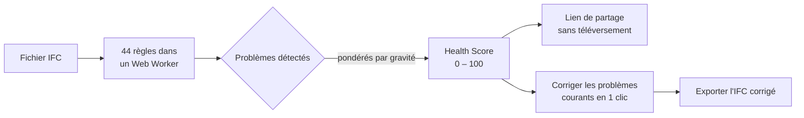
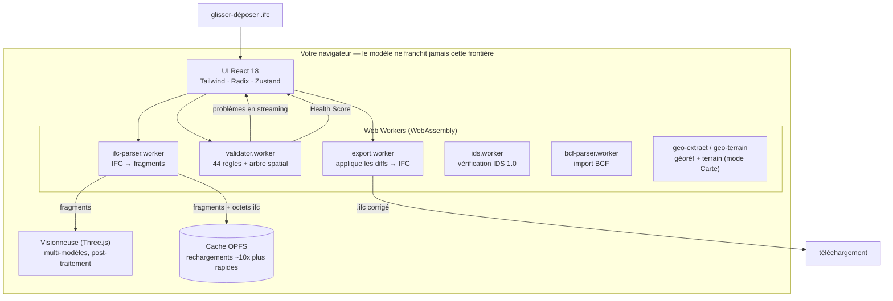

<div align="center">

# IFC Viewer Online

**Ouvrez un fichier IFC et obtenez un Health Score — de 0 à 100 — en 30 secondes.**

Visionneuse + validateur IFC gratuit qui s'exécute entièrement dans votre navigateur.
Sans compte. Sans configurer de ruleset. Sans limite de taille. Vos modèles ne quittent jamais votre machine.

[**→ Essayer en ligne**](https://www.ifcvieweronline.eu/)

<br/>

[](https://www.ifcvieweronline.eu/)
[](#licence--open-core)
[](#contribuer)
[](https://github.com/j03rul4nd/ifc-viewer-online/stargazers)


<br/>

**Lire dans votre langue**

[English](readme.md) · [简体中文](README.zh-CN.md) · [Español](README.es.md) · Français · [Deutsch](README.de.md) · [日本語](README.ja.md) · [Português](README.pt.md) · [Català](README.ca.md) · [Italiano](README.it.md) · [ไทย](README.th.md)

</div>

---

<div align="center">

[](https://www.ifcvieweronline.eu/)

<sub><i>Chargez un modèle de démo → lancez un profil de validation → Health Score avec problèmes classés, 100 % dans votre navigateur. <a href="https://www.ifcvieweronline.eu/">Essayez en ligne →</a></i></sub>

</div>

> **En une phrase :** glissez un IFC, visualisez votre modèle en 3D, obtenez un Health Score avec une liste de problèmes priorisée, corrigez les plus courants en un clic et exportez un fichier corrigé — sans rien envoyer à un serveur.

## Sommaire

- [Pourquoi ce projet](#pourquoi-ce-projet)
- [Ce qu'il fait](#ce-quil-fait)
- [En action](#en-action)
- [Le Health Score](#le-health-score)
- [Comment ça marche (architecture)](#comment-ça-marche-architecture)
- [À quoi ressemble un problème de validation](#à-quoi-ressemble-un-problème-de-validation)
- [Stack technique](#stack-technique)
- [Démarrage](#démarrage)
- [Structure du projet](#structure-du-projet)
- [Les 44 règles de validation](#les-44-règles-de-validation)
- [Contribuer](#contribuer)
- [Roadmap](#roadmap)
- [Licence — open core](#licence--open-core)

---

## Pourquoi ce projet

La plupart des outils de validation IFC présentent au moins l'un de ces points de friction :

| Outil | Friction |
|---|---|
| Validateur buildingSMART | Limite de 250 Mo, pas de vue 3D, sortie en texte brut |
| Autodesk Viewer / BIM 360 | Envoie votre modèle sur leurs serveurs — risque NDA |
| Sortdesk | Exige un compte avant de pouvoir valider |
| Data Octopus | Facture à chaque vérification — coûteux à l'usage régulier |
| IFC Verify | Pas de vue 3D — les problèmes n'apparaissent qu'en texte |
| BIMvision / Solibri Anywhere | Bureau uniquement, Windows uniquement (Solibri Anywhere arrêté en avril 2026) |

**IFC Viewer Online n'a aucune de ces limitations.** Il s'exécute entièrement dans le navigateur via WebAssembly, sans téléversement, sans compte et sans plafond de taille. Vos modèles ne quittent jamais votre machine.

---

## Ce qu'il fait

| Fonctionnalité | Ce que vous obtenez |
|---|---|
| **IFC Health Check** | 44 règles de validation, diffusées en direct depuis un Web Worker, résumées en un unique **Health Score (0–100)**. |
| **buildingSMART IDS** | Chargez un fichier `.ids` et vérifiez le modèle par rapport à une Information Delivery Specification — couverture complète des facettes IDS 1.0, validée avec les cas de test officiels de buildingSMART. Réussite/échec par spécification, export en JSON/CSV/HTML/BCF. |
| **Mode Carte 3D (SIG)** | Placez un modèle géoréférencé sur un fond de carte réel (OpenStreetMap / topo / satellite) et un terrain 3D optionnel, dans la même scène 3D. Le géoréférencement est extrait automatiquement de l'IFC ; le modèle ne quitte jamais le navigateur. Activable par drapeau de build (`VITE_FEATURE_GIS`). |
| **Visionneuse 3D** | Rendu WebGL via Three.js + `@thatopen/components`. Chargement multi-modèles avec transformations indépendantes, SSAO, edge rendering, bloom, plans 2D et coupes en temps réel. |
| **Éditeur non destructif** | Modifiez des valeurs de propriété, corrigez des GUID, renommez des éléments. Chaque changement est un diff avec undo/redo complet. Exportez un IFC corrigé — diffs appliqués dans un worker, sans serveur. |
| **Import/export BCF 2.1** | Naviguez vers les viewpoints BCF importés. Exportez les problèmes de validation en zip BCF 2.1 pour Navisworks, BIMcollab et tout CDE compatible BCF. |
| **Métré (takeoff)** | Agrège `IfcElementQuantity` sur tout le modèle — surface, volume, longueur par classe IFC. |
| **Cache géométrique OPFS** | La géométrie analysée est mise en cache dans l'Origin Private File System du navigateur. Les rechargements sont ~10× plus rapides et fonctionnent hors ligne. |
| **10 langues** | EN · ES · FR · DE · PT · JA · CA · ZH · IT · TH |

**Versions IFC prises en charge :** IFC2x3 · IFC4 · IFC4x1 · IFC4x3

---

## En action

> Chaque clip ci-dessous est l'**application réelle** tournant dans un navigateur — sans maquette ni montage. Le modèle utilisé est l'IFC de référence ouvert [Duplex Apartment](public/Ifc2x3_Duplex_Architecture.ifc) (7 131 éléments), analysé et validé 100 % côté client.

### Naviguez dans le modèle et inspectez les propriétés IFC

Parcourez toute la hiérarchie spatiale (projet → site → étage → espace → élément), cliquez sur n'importe quel élément pour le mettre en surbrillance en 3D, et lisez ses property sets, classifications et quantités IFC bruts.


### Mettez en évidence chaque problème en 3D

Lancez un profil de validation, puis activez l'**Overlay** pour peindre les éléments signalés directement sur le modèle — une liste de problèmes devient ainsi quelque chose que vous pouvez voir et parcourir.


### Exportez un modèle corrigé

Réexportez le modèle en **IFC** ou **GLB**, ou exportez les problèmes de validation sous forme de paquet **BCF 2.1** et de rapport partageable — le tout généré dans un Web Worker, sans aucun envoi.


---

## Le Health Score

Chaque modèle reçoit un nombre unique de **0 à 100** — un score logarithmique à rendements décroissants dérivé de la gravité pondérée de tous les problèmes détectés. C'est le chiffre sur lequel vous pouvez agir, que vous pouvez citer ou partager avec un collègue.



| Gravité | Exemples |
|---|---|
| **Erreur** | GUID dupliqués, agrégats cassés, conteneurs spatiaux manquants |
| **Avertissement** | Property sets manquants, matériaux manquants, conventions de nommage non respectées |
| **Info** | Surusage de proxies, décalage de coordonnées, anomalies de taille, schéma obsolète |

---

## Comment ça marche (architecture)

Tout le pipeline vit dans le navigateur. Le fichier IFC est analysé dans un Web Worker via WebAssembly, rendu avec Three.js et validé dans un second worker — **rien de votre modèle n'est envoyé à un serveur.**



Plusieurs workers indépendants gardent l'UI réactive : analyse, validation et export tournent hors du thread principal. L'état réside dans onze petits stores [Zustand](https://github.com/pmndrs/zustand) ; la géométrie n'entre jamais dans le store (uniquement des ID stables). Les diagrammes de flux complets sont dans [`ARCHITECTURE.md`](ARCHITECTURE.md).

---

## À quoi ressemble un problème de validation

Le validateur lit les entités IFC STEP brutes et émet des problèmes structurés. Par exemple, ce GUID dupliqué dans le fichier source :

```step
#42=  IFCWALL('3vB2Y...DUPLICATE',   #5, 'Basic Wall', $, ...);
#118= IFCWALLSTANDARDCASE('3vB2Y...DUPLICATE', #5, 'Wall', $, ...);
```

...produit un problème typé, diffusé vers l'UI et inclus dans le rapport partageable :

```jsonc
{
  "ruleId": "RULE_DUPLICATE_GUID",
  "severity": "error",
  "globalId": "3vB2Y...DUPLICATE",
  "expressIds": [42, 118],
  "message": "GlobalId is shared by 2 elements",
  "ifcClass": "IfcWall"
}
```

L'export BCF 2.1 enveloppe les mêmes problèmes dans le markup de coordination ouvert que comprennent Navisworks et BIMcollab :

```xml
<Markup>
  <Topic Guid="..." TopicType="Issue" TopicStatus="Open">
    <Title>Duplicate GlobalId on IfcWall</Title>
    <Priority>High</Priority>
  </Topic>
</Markup>
```

Chaque message de worker est validé à l'exécution avec des schémas [Zod](https://zod.dev) (`src/lib/worker-schemas.ts`), de sorte qu'aucune donnée malformée n'atteint l'UI.

---

## Stack technique

| Couche | Technologie |
|---|---|
| Analyse IFC | [web-ifc](https://github.com/ThatOpenCompany/web-ifc) (WebAssembly) |
| Rendu 3D | [Three.js](https://threejs.org/) + [@thatopen/components](https://github.com/ThatOpenCompany/engine_components) |
| UI | React 18 + Tailwind CSS + Radix UI |
| Animations | Framer Motion + GSAP |
| État | Zustand 5 (11 stores : model, scene, validation, editor, ui, takeoff, toast, bcf, ids, geo, waiver) |
| IDS | Moteur IDS 1.0 en TS pur + worker web-ifc dédié (`src/lib/ids/`, `ids.worker.ts`) |
| SIG / fond de carte | [3d-tiles-renderer](https://github.com/NASA-AMMOS/3DTilesRendererJS) (tuiles dans la scène three.js) — mode Carte uniquement |
| Validation | Web Worker — 44 règles, diffusées via `postMessage` |
| Sûreté à l'exécution | Schémas Zod à chaque frontière de worker |
| Listes virtualisées | @tanstack/react-virtual |
| i18n | i18next (10 langues) |
| Analytique | PostHog (côté client, sans PII) |
| Build | Vite 6 + TypeScript (strict) |
| Tests | Vitest (jsdom) |
| Déploiement | Vercel (statique, zéro backend) |

---

## Démarrage

```bash
git clone https://github.com/j03rul4nd/ifc-viewer-online.git
cd ifc-viewer-online
npm install
npm run dev    # → http://localhost:3000
```

Le serveur de dev définit `Cross-Origin-Opener-Policy: same-origin` et `Cross-Origin-Embedder-Policy: require-corp` — nécessaires pour `SharedArrayBuffer` (WASM multithread).

**Build**

```bash
npm run build   # → dist/
```

> Le build empaquette Three.js et `@thatopen/*` en inline dans les chunks de worker (~5 Mo chacun). Le script `build` passe déjà `--max-old-space-size=4096`. Si vous atteignez tout de même un OOM du heap, essayez `NODE_OPTIONS=--max-old-space-size=8192 npx vite build`.

**Tests**

```bash
npm test        # vitest (jsdom)
```

---

## Structure du projet

```
src/
  components/      # Landing, Viewer, ValidationPanel, Sidebar, ModelTree, ScenePanel, …
  workers/         # ifc-parser.worker.ts · validator.worker.ts · export.worker.ts
  stores/          # 11 stores Zustand (model, scene, validation, editor, ui, takeoff, toast, bcf, ids, geo, waiver)
  hooks/           # useModelSession, useValidationRunner, useElementFocus, …
  lib/             # viewer.ts · loader.ts · validator.ts · diffStore.ts · worker-schemas.ts
  locales/         # i18n — en/ es/ fr/ de/ pt/ ja/ ca/ zh/ it/ th/
  types/           # Schémas Zod + types TypeScript (ValidationRules, EditDiff, …)
public/
  ifc-validator/           # Landing de niche — /ifc-validator/
  ifc-viewer-mac/          # Landing de niche — /ifc-viewer-mac/
  solibri-alternative/     # Landing de niche — /solibri-alternative/
  tools/fix-duplicate-guids/
  es/                      # Shell statique espagnol + /es/ifc-validador/
cf-worker/         # Cloudflare Worker — proxy stateless de capture d'email (ne voit jamais le modèle)
```

Documents de référence plus détaillés : [`ARCHITECTURE.md`](ARCHITECTURE.md) · [`IFC_DOMAIN.md`](IFC_DOMAIN.md) · [`DECISIONS.md`](DECISIONS.md) · [`ROADMAP.md`](ROADMAP.md).

---

## Les 44 règles de validation

Les règles s'exécutent dans `src/workers/validator.worker.ts`, pilotées par un `RulesConfig`, regroupées par génération :

<details>
<summary><b>Noyau — 18 règles</b> (noms, GUID, types, hiérarchie)</summary>

`RULE_EMPTY_NAME` · `RULE_EMPTY_LONGNAME` · `RULE_DUPLICATE_NAME` · `RULE_NAMING_CONVENTION` · `RULE_MISSING_TYPE` · `RULE_DUPLICATE_GUID` · `RULE_MISSING_PROPERTY_SET` · `RULE_ORPHAN_ELEMENT` · `RULE_WRONG_CONTAINER` · `RULE_BROKEN_AGGREGATE` · `RULE_INVALID_GUID_FORMAT` · `RULE_SPATIAL_HIERARCHY` · `RULE_CIRCULAR_REFERENCE` · `RULE_EMPTY_PROPERTY_VALUE` · `RULE_MISSING_MATERIAL` · `RULE_ELEMENT_IN_BUILDING` · `RULE_INVALID_IFC_VERSION` · `RULE_ELEMENT_CLASH` (désactivée par défaut)

</details>

<details>
<summary><b>Spatial &amp; en-tête de fichier — 11 règles</b> (projet/site/étage, ISO 19650)</summary>

`RULE_MISSING_PROJECT` · `RULE_MISSING_BUILDING` · `RULE_MISSING_STOREY` · `RULE_EMPTY_STOREY` · `RULE_FILE_DESCRIPTION_MISSING` · `RULE_FILE_AUTHOR_MISSING` · `RULE_PROJECT_LONGNAME_MISSING` · `RULE_STOREY_ELEVATION_MISSING` · `RULE_ISO19650_PROJECT_INFO` · `RULE_ISO19650_AUTHOR_INFO` · `RULE_ISO19650_FILENAME`

</details>

<details>
<summary><b>LOD, classification &amp; MEP — 9 règles</b></summary>

`RULE_MISSING_CLASSIFICATION` · `RULE_LOD_PSET_MISSING` · `RULE_LOD_QUANTITY_MISSING` · `RULE_LOD_MATERIAL_LAYER_MISSING` · `RULE_MEP_SYSTEM_MISSING` · `RULE_CLASH_MEP_STRUCTURAL` · `RULE_PROXY_OVERUSE` · `RULE_COORDINATE_OFFSET` · `RULE_FILE_SIZE_ANOMALY`

</details>

<details>
<summary><b>Géométrie et intégrité des étages — 6 règles</b></summary>

`RULE_OPENING_WITHOUT_HOST` · `RULE_STOREY_ELEVATION_DUPLICATE` · `RULE_STOREY_ELEVATION_ORDER` · `RULE_UNIT_CONSISTENCY` · `RULE_SPACE_AREA_MISSING` · `RULE_CONNECTED_MEP`

</details>

---

## Contribuer

Les contributions sont les bienvenues — en particulier nouvelles règles de validation, traductions et corrections de bugs.

**Ajouter une règle de validation** (`src/workers/validator.worker.ts`) :

1. Ajoutez l'ID de la règle à `ValidationRules` dans `src/types/index.ts`
2. Implémentez la fonction `async` — elle reçoit l'instance `IfcAPI`, `modelId` et un helper `SpatialIndex`, et retourne `ValidationIssue[]`
3. Branchez-la dans le bloc de dispatch `runAllRules`
4. Ajoutez les chaînes i18n à `RULE_TRANSLATIONS` dans `src/types/index.ts`
5. Définissez `DEFAULT_RULES[RULE_ID] = true` (ou `false` si opt-in)
6. Mettez à jour le nombre de règles dans le copy qui mentionne « 44 règles » (`index.html`, `README*.md`, `src/seo/config.ts`, les landings dans `public/*`)

**Ajouter une traduction :** copiez `src/locales/en/` vers un nouveau dossier de langue, traduisez les valeurs JSON et enregistrez la langue dans `src/i18n/config.ts`. Les traductions de ce README sont tout aussi bienvenues — respectez le nommage (`README.<lang>.md`) et ajoutez un lien dans la ligne de langues en haut.

**Avant d'ouvrir une PR :** lancez `npm test` et `npm run lint`.

---

## Roadmap

Le produit est techniquement mature (visionneuse multi-modèles, validateur de 44 règles, éditeur non destructif, BCF, 10 langues). Le plan à venir est **piloté par la distribution**, pas par les fonctionnalités :

- **Table de remédiation** — contenu déterministe « comment corriger ceci dans Revit / ArchiCAD / Tekla » par règle, écrit en i18n (sans IA, sans serveur).
- **Rapports indexables** — déplacer le lien de partage d'un hash d'URL vers une route edge stateless pour que les rapports s'affichent sur les réseaux/moteurs (le modèle ne quitte toujours pas le navigateur).
- **Diff de révisions** — comparer deux versions d'un modèle par GlobalId.
- **buildingSMART IDS** — couverture complète d'IDS 1.0, validée avec les cas de test officiels de bSI. Chargez n'importe quel `.ids`, obtenez réussite/échec par spécification, exportez en JSON/CSV/HTML/BCF.
- **Mode Carte 3D / SIG** — modèle géoréférencé sur un fond de carte réel + terrain 3D, dans la scène existante (activable par drapeau).
- **Backlog de parité Solibri** — modèles de règles, takeoff d'information, regroupement de clashes/présentations. Voir [`ROADMAP.md`](ROADMAP.md).

Voir [`ROADMAP.md`](ROADMAP.md) pour le plan complet et les éléments explicitement reportés.

---

## Licence — open core

| Composant | Licence |
|---|---|
| Visionneuse IFC (rendu Three.js, intégration WASM) | **MIT** |
| Validateur (44 règles, Web Worker) | **MIT** |
| Moteur IDS 1.0 + worker | **MIT** |
| SIG / mode Carte 3D | **MIT** |
| Éditeur non destructif (diffs, undo/redo, export IFC) | **MIT** |
| Stores, hooks, utilitaires, i18n | **MIT** |
| Cloudflare Worker (backend de capture d'email) | Propriétaire |
| À venir : stockage cloud, API de partage, auth, rapports PDF | Propriétaire |

**La visionneuse et le validateur noyau sont MIT pour toujours.** Forkez, auto-hébergez, utilisez commercialement. L'infrastructure cloud des futures fonctionnalités payantes est propriétaire et ne peut être répliquée à partir de ce seul dépôt.

---

## Auteur

[Joel Benitez](https://github.com/j03rul4nd)

Si ce projet vous a fait gagner du temps, une ⭐ aide d'autres professionnels du BIM à le trouver.

---

<div align="center">

*Construit avec [@thatopen/components](https://github.com/ThatOpenCompany/engine_components), [web-ifc](https://github.com/ThatOpenCompany/web-ifc) et [Three.js](https://threejs.org/).*

</div>
