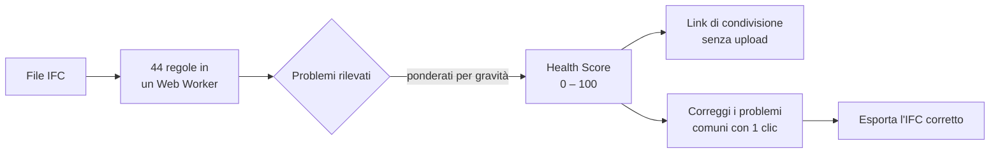
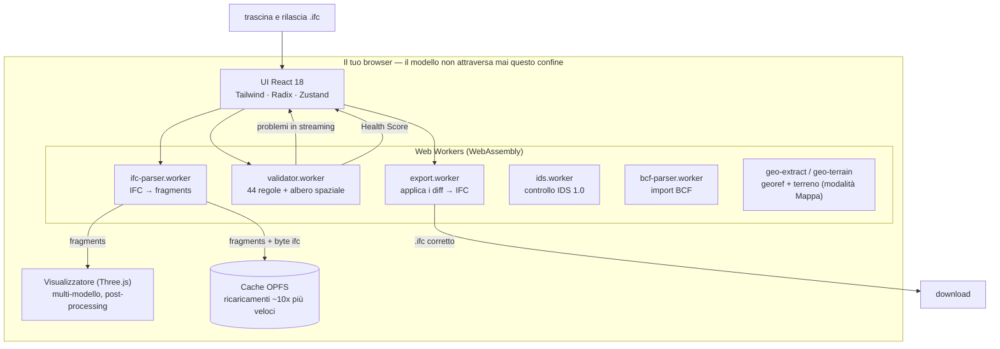

<div align="center">

# IFC Viewer Online

**Apri un file IFC e ottieni un Health Score — da 0 a 100 — in 30 secondi.**

Visualizzatore + validatore IFC gratuito che gira interamente nel tuo browser.
Nessun account. Nessun ruleset da configurare. Nessun limite di dimensione. I tuoi modelli non lasciano mai la tua macchina.

[**→ Provalo dal vivo**](https://www.ifcvieweronline.eu/)

<br/>

[](https://www.ifcvieweronline.eu/)
[](#licenza--open-core)
[](#come-contribuire)
[](https://github.com/j03rul4nd/ifc-viewer-online/stargazers)


<br/>

**Leggilo nella tua lingua**

[English](readme.md) · [简体中文](README.zh-CN.md) · [Español](README.es.md) · [Français](README.fr.md) · [Deutsch](README.de.md) · [日本語](README.ja.md) · [Português](README.pt.md) · [Català](README.ca.md) · Italiano · [ไทย](README.th.md)

</div>

---

<div align="center">

[](https://www.ifcvieweronline.eu/)

<sub><i>Carica un modello demo → esegui un profilo di validazione → Health Score con problemi in ordine di priorità, 100% nel browser. <a href="https://www.ifcvieweronline.eu/">Provalo dal vivo →</a></i></sub>

</div>

> **In una frase:** trascina un IFC, vedi il tuo modello in 3D, ottieni un Health Score con un elenco di problemi in ordine di priorità, correggi i più comuni con un clic ed esporta un file corretto — senza caricare nulla su alcun server.

## Indice

- [Perché esiste](#perché-esiste)
- [Cosa fa](#cosa-fa)
- [In azione](#in-azione)
- [L'Health Score](#lhealth-score)
- [Come funziona (architettura)](#come-funziona-architettura)
- [Com'è fatto un problema di validazione](#comè-fatto-un-problema-di-validazione)
- [Stack tecnologico](#stack-tecnologico)
- [Per iniziare](#per-iniziare)
- [Struttura del progetto](#struttura-del-progetto)
- [Le 44 regole di validazione](#le-44-regole-di-validazione)
- [Come contribuire](#come-contribuire)
- [Roadmap](#roadmap)
- [Licenza — open core](#licenza--open-core)

---

## Perché esiste

La maggior parte degli strumenti di validazione IFC ha almeno uno di questi punti di attrito:

| Strumento | Attrito |
|---|---|
| Validatore buildingSMART | Limite di 250 MB, niente visualizzatore 3D, output in testo grezzo |
| Autodesk Viewer / BIM 360 | Carica il tuo modello sui loro server — rischio NDA |
| Sortdesk | Richiede un account prima di poter validare |
| Data Octopus | Fa pagare a ogni check — costoso per un uso regolare |
| IFC Verify | Niente visualizzatore 3D — i problemi appaiono solo come testo |
| BIMvision / Solibri Anywhere | Solo desktop, solo Windows (Solibri Anywhere dismesso ad aprile 2026) |

**IFC Viewer Online non ha nessuna di queste limitazioni.** Gira interamente nel browser tramite WebAssembly, senza upload, senza account e senza tetto di dimensione. I tuoi modelli non lasciano mai la tua macchina.

---

## Cosa fa

| Funzionalità | Cosa ottieni |
|---|---|
| **IFC Health Check** | 44 regole di validazione, trasmesse dal vivo da un Web Worker, riassunte in un unico **Health Score (0–100)**. |
| **buildingSMART IDS** | Carica un file `.ids` e verifica il modello rispetto a una Information Delivery Specification — copertura completa delle faccette IDS 1.0, validata sui casi di test ufficiali di buildingSMART. Esito per specifica, esportazione in JSON/CSV/HTML/BCF. |
| **Modalità Mappa 3D (GIS)** | Posiziona un modello georeferenziato su una mappa base reale (OpenStreetMap / topografica / satellitare) e terreno 3D opzionale, nella stessa scena 3D. La georeferenziazione viene estratta automaticamente dall'IFC; il modello non lascia mai il browser. Attivabile tramite flag di build (`VITE_FEATURE_GIS`). |
| **Visualizzatore 3D** | Rendering WebGL tramite Three.js + `@thatopen/components`. Caricamento multi-modello con trasformazioni indipendenti, SSAO, edge rendering, bloom, piante 2D e sezioni in tempo reale. |
| **Editor non distruttivo** | Modifica i valori di proprietà, correggi i GUID, rinomina elementi. Ogni modifica è un diff con undo/redo completo. Esporta un IFC corretto — i diff vengono applicati in un worker, senza server. |
| **Import/export BCF 2.1** | Naviga ai viewpoint BCF importati. Esporta i problemi di validazione come zip BCF 2.1 per Navisworks, BIMcollab e qualsiasi CDE compatibile con BCF. |
| **Computo (takeoff)** | Aggrega `IfcElementQuantity` su tutto il modello — area, volume e lunghezza per classe IFC. |
| **Cache geometrica OPFS** | La geometria analizzata viene messa in cache nell'Origin Private File System del browser. I ricaricamenti sono ~10× più veloci e funzionano offline. |
| **10 lingue** | EN · ES · FR · DE · PT · JA · CA · ZH · IT · TH |

**Versioni IFC supportate:** IFC2x3 · IFC4 · IFC4x1 · IFC4x3

---

## In azione

> Ogni clip qui sotto è l'**app reale** in esecuzione in un browser — nessun mockup, nessun montaggio. Il modello usato è l'IFC di riferimento aperto [Duplex Apartment](public/Ifc2x3_Duplex_Architecture.ifc) (7.131 elementi), elaborato e validato al 100% lato client.

### Naviga il modello e ispeziona le proprietà IFC

Esplora l'intera gerarchia spaziale (progetto → sito → piano → spazio → elemento), fai clic su qualsiasi elemento per evidenziarlo in 3D e leggi i suoi property set, classificazioni e quantità IFC grezzi.


### Evidenzia ogni problema in 3D

Esegui un profilo di validazione, poi attiva l'**Overlay** per dipingere gli elementi segnalati direttamente sul modello — così un elenco di problemi diventa qualcosa che puoi davvero vedere e percorrere.


### Esporta un modello corretto

Riesporta il modello come **IFC** o **GLB**, oppure esporta i problemi di validazione come pacchetto **BCF 2.1** e report condivisibile — tutto generato in un Web Worker, senza alcun upload.


---

## L'Health Score

Ogni modello riceve un singolo numero da **0 a 100** — un punteggio logaritmico a rendimenti decrescenti derivato dalla gravità ponderata di tutti i problemi rilevati. È il numero su cui puoi agire, che puoi citare o condividere con un collega.



| Gravità | Esempi |
|---|---|
| **Errore** | GUID duplicati, aggregati rotti, contenitori spaziali mancanti |
| **Avviso** | Property set mancanti, materiali mancanti, violazioni delle convenzioni di denominazione |
| **Info** | Uso eccessivo di proxy, offset di coordinate, anomalie di dimensione, schema obsoleto |

---

## Come funziona (architettura)

L'intera pipeline vive nel browser. Il file IFC viene analizzato in un Web Worker tramite WebAssembly, renderizzato con Three.js e validato in un secondo worker — **nulla del tuo modello viene inviato ad alcun server.**



Diversi worker indipendenti mantengono la UI reattiva: parsing, validazione ed export girano fuori dal thread principale. Lo stato vive in tredici piccoli store [Zustand](https://github.com/pmndrs/zustand); la geometria non entra mai nello store (solo ID stabili). I diagrammi completi del flusso dati sono in [`ARCHITECTURE.md`](ARCHITECTURE.md).

---

## Com'è fatto un problema di validazione

Il validatore legge entità IFC STEP grezze ed emette problemi strutturati. Per esempio, questo GUID duplicato nel file di origine:

```step
#42=  IFCWALL('3vB2Y...DUPLICATE',   #5, 'Basic Wall', $, ...);
#118= IFCWALLSTANDARDCASE('3vB2Y...DUPLICATE', #5, 'Wall', $, ...);
```

...produce un problema tipizzato, trasmesso alla UI e incluso nel report condivisibile:

```jsonc
{
  "ruleId": "RULE_DUPLICATE_GUID",
  "severity": "error",
  "globalId": "3vB2Y...DUPLICATE",
  "expressIds": [42, 118],
  "message": "GlobalId is shared by 2 elements",
  "ifcClass": "IfcWall"
}
```

L'export BCF 2.1 avvolge gli stessi problemi nel markup aperto di coordinamento che Navisworks e BIMcollab comprendono:

```xml
<Markup>
  <Topic Guid="..." TopicType="Issue" TopicStatus="Open">
    <Title>Duplicate GlobalId on IfcWall</Title>
    <Priority>High</Priority>
  </Topic>
</Markup>
```

Ogni messaggio del worker viene validato a runtime con schemi [Zod](https://zod.dev) (`src/lib/worker-schemas.ts`), così che nessun dato malformato raggiunga la UI.

---

## Stack tecnologico

| Livello | Tecnologia |
|---|---|
| Parsing IFC | [web-ifc](https://github.com/ThatOpenCompany/web-ifc) (WebAssembly) |
| Rendering 3D | [Three.js](https://threejs.org/) + [@thatopen/components](https://github.com/ThatOpenCompany/engine_components) |
| UI | React 18 + Tailwind CSS + Radix UI |
| Animazioni | Framer Motion + GSAP |
| Stato | Zustand 5 (13 store: model, scene, validation, editor, ui, takeoff, toast, bcf, ids, geo, waiver, capture, presentation) |
| IDS | Motore IDS 1.0 in puro TS + worker web-ifc dedicato (`src/lib/ids/`, `ids.worker.ts`) |
| GIS / mappa base | [3d-tiles-renderer](https://github.com/NASA-AMMOS/3DTilesRendererJS) (tiles dentro della scena three.js) — solo modalità Mappa |
| Validazione | Web Worker — 44 regole, trasmesse via `postMessage` |
| Sicurezza a runtime | Schemi Zod a ogni confine di worker |
| Liste virtualizzate | @tanstack/react-virtual |
| i18n | i18next (10 lingue) |
| Analytics | PostHog (lato client, senza PII) |
| Build | Vite 6 + TypeScript (strict) |
| Test | Vitest (jsdom) |
| Deploy | Vercel (statico, zero backend) |

---

## Per iniziare

```bash
git clone https://github.com/j03rul4nd/ifc-viewer-online.git
cd ifc-viewer-online
npm install
npm run dev    # → http://localhost:3000
```

Il dev server imposta `Cross-Origin-Opener-Policy: same-origin` e `Cross-Origin-Embedder-Policy: require-corp` — necessari per `SharedArrayBuffer` (WASM multithread).

**Build**

```bash
npm run build   # → dist/
```

> La build impacchetta Three.js e `@thatopen/*` inline nei chunk dei worker (~5 MB ciascuno). Lo script `build` passa già `--max-old-space-size=4096`. Se incontri comunque un OOM dell'heap, prova `NODE_OPTIONS=--max-old-space-size=8192 npx vite build`.

**Test**

```bash
npm test        # vitest (jsdom)
```

---

## Struttura del progetto

```
src/
  components/      # Landing, Viewer, ValidationPanel, Sidebar, ModelTree, ScenePanel, …
  workers/         # ifc-parser.worker.ts · validator.worker.ts · export.worker.ts
  stores/          # 13 store Zustand (model, scene, validation, editor, ui, takeoff, toast, bcf, ids, geo, waiver, capture, presentation)
  hooks/           # useModelSession, useValidationRunner, useElementFocus, …
  lib/             # viewer.ts · loader.ts · validator.ts · diffStore.ts · worker-schemas.ts
  locales/         # i18n — en/ es/ fr/ de/ pt/ ja/ ca/ zh/ it/ th/
  types/           # Schemi Zod + tipi TypeScript (ValidationRules, EditDiff, …)
public/
  ifc-validator/           # Landing di nicchia — /ifc-validator/
  ifc-viewer-mac/          # Landing di nicchia — /ifc-viewer-mac/
  solibri-alternative/     # Landing di nicchia — /solibri-alternative/
  tools/fix-duplicate-guids/
  es/                      # Shell statico in spagnolo + /es/ifc-validador/
cf-worker/         # Cloudflare Worker — proxy stateless di cattura email (non vede mai il modello)
```

Documenti di riferimento più approfonditi: [`ARCHITECTURE.md`](ARCHITECTURE.md) · [`IFC_DOMAIN.md`](IFC_DOMAIN.md) · [`DECISIONS.md`](DECISIONS.md) · [`ROADMAP.md`](ROADMAP.md).

---

## Le 44 regole di validazione

Le regole girano in `src/workers/validator.worker.ts`, controllate da un `RulesConfig`, raggruppate per generazione:

<details>
<summary><b>Core — 18 regole</b> (nomi, GUID, tipi, gerarchia)</summary>

`RULE_EMPTY_NAME` · `RULE_EMPTY_LONGNAME` · `RULE_DUPLICATE_NAME` · `RULE_NAMING_CONVENTION` · `RULE_MISSING_TYPE` · `RULE_DUPLICATE_GUID` · `RULE_MISSING_PROPERTY_SET` · `RULE_ORPHAN_ELEMENT` · `RULE_WRONG_CONTAINER` · `RULE_BROKEN_AGGREGATE` · `RULE_INVALID_GUID_FORMAT` · `RULE_SPATIAL_HIERARCHY` · `RULE_CIRCULAR_REFERENCE` · `RULE_EMPTY_PROPERTY_VALUE` · `RULE_MISSING_MATERIAL` · `RULE_ELEMENT_IN_BUILDING` · `RULE_INVALID_IFC_VERSION` · `RULE_ELEMENT_CLASH` (disattivata di default)

</details>

<details>
<summary><b>Spaziale &amp; header del file — 11 regole</b> (progetto/sito/piano, ISO 19650)</summary>

`RULE_MISSING_PROJECT` · `RULE_MISSING_BUILDING` · `RULE_MISSING_STOREY` · `RULE_EMPTY_STOREY` · `RULE_FILE_DESCRIPTION_MISSING` · `RULE_FILE_AUTHOR_MISSING` · `RULE_PROJECT_LONGNAME_MISSING` · `RULE_STOREY_ELEVATION_MISSING` · `RULE_ISO19650_PROJECT_INFO` · `RULE_ISO19650_AUTHOR_INFO` · `RULE_ISO19650_FILENAME`

</details>

<details>
<summary><b>LOD, classificazione &amp; MEP — 9 regole</b></summary>

`RULE_MISSING_CLASSIFICATION` · `RULE_LOD_PSET_MISSING` · `RULE_LOD_QUANTITY_MISSING` · `RULE_LOD_MATERIAL_LAYER_MISSING` · `RULE_MEP_SYSTEM_MISSING` · `RULE_CLASH_MEP_STRUCTURAL` · `RULE_PROXY_OVERUSE` · `RULE_COORDINATE_OFFSET` · `RULE_FILE_SIZE_ANOMALY`

</details>

<details>
<summary><b>Geometria e integrità dei piani — 6 regole</b></summary>

`RULE_OPENING_WITHOUT_HOST` · `RULE_STOREY_ELEVATION_DUPLICATE` · `RULE_STOREY_ELEVATION_ORDER` · `RULE_UNIT_CONSISTENCY` · `RULE_SPACE_AREA_MISSING` · `RULE_CONNECTED_MEP`

</details>

---

## Come contribuire

I contributi sono benvenuti — specialmente nuove regole di validazione, traduzioni e correzioni di bug.

**Aggiungere una regola di validazione** (`src/workers/validator.worker.ts`):

1. Aggiungi l'ID della regola a `ValidationRules` in `src/types/index.ts`
2. Implementa la funzione `async` — riceve l'istanza `IfcAPI`, `modelId` e un helper `SpatialIndex`, e restituisce `ValidationIssue[]`
3. Collegala al blocco di dispatch `runAllRules`
4. Aggiungi le stringhe i18n a `RULE_TRANSLATIONS` in `src/types/index.ts`
5. Imposta `DEFAULT_RULES[RULE_ID] = true` (o `false` se opt-in)
6. Aggiorna il conteggio delle regole nel copy che menziona "44 regole" (`index.html`, `README*.md`, `src/seo/config.ts`, le landing in `public/*`)

**Aggiungere una traduzione:** copia `src/locales/en/` in una nuova cartella di lingua, traduci i valori JSON e registra la lingua in `src/i18n/config.ts`. Anche le traduzioni di questo README sono benvenute — rispetta la denominazione (`README.<lang>.md`) e aggiungi un link nella riga delle lingue in alto.

**Prima di aprire una PR:** esegui `npm test` e `npx tsc -b`.

---

## Roadmap

Il prodotto è tecnicamente maturo (visualizzatore multi-modello, validatore a 44 regole, editor non distruttivo, BCF, 10 lingue). Il piano futuro è **guidato dalla distribuzione**, non dalle feature:

- **Tabella di rimedio** — contenuto deterministico "come correggerlo in Revit / ArchiCAD / Tekla" per regola, scritto in i18n (niente IA, niente server).
- **Report indicizzabili** — spostare il link di condivisione da un hash URL a una rotta edge stateless, così i report si espandono su social/motori di ricerca (il modello continua a non lasciare il browser).
- **Diff di revisioni** — confrontare due versioni di un modello per GlobalId.
- **buildingSMART IDS** — copertura completa di IDS 1.0, validata sui casi di test ufficiali bSI. Carica qualsiasi `.ids`, ottieni esito per specifica, esporta in JSON/CSV/HTML/BCF.
- **Modalità Mappa 3D / GIS** — modello georeferenziato su una mappa base reale + terreno 3D, nella scena esistente (attivabile tramite flag).
- **Backlog di parità con Solibri** — template di regole, information takeoff, raggruppamento di clash/presentazioni. Vedi [`ROADMAP.md`](ROADMAP.md).

Vedi [`ROADMAP.md`](ROADMAP.md) per il piano completo e gli elementi esplicitamente rimandati.

---

## Licenza — open core

| Componente | Licenza |
|---|---|
| Visualizzatore IFC (rendering Three.js, integrazione WASM) | **MIT** |
| Validatore (44 regole, Web Worker) | **MIT** |
| Motore IDS 1.0 + worker | **MIT** |
| GIS / modalità Mappa 3D | **MIT** |
| Editor non distruttivo (diff, undo/redo, export IFC) | **MIT** |
| Store, hook, utility, i18n | **MIT** |
| Cloudflare Worker (backend di cattura email) | Proprietario |
| Futuro: cloud storage, API di condivisione, auth, report PDF | Proprietario |

**Il visualizzatore e il validatore core sono MIT per sempre.** Fanne il fork, self-hostalo, usalo commercialmente. L'infrastruttura cloud per le future feature a pagamento è proprietaria e non può essere replicata dal solo questo repo.

---

## Autore

[Joel Benitez](https://github.com/j03rul4nd)

Se questo progetto ti ha fatto risparmiare tempo, una ⭐ aiuta altre persone del mondo BIM a trovarlo.

---

<div align="center">

*Costruito con [@thatopen/components](https://github.com/ThatOpenCompany/engine_components), [web-ifc](https://github.com/ThatOpenCompany/web-ifc) e [Three.js](https://threejs.org/).*

</div>
