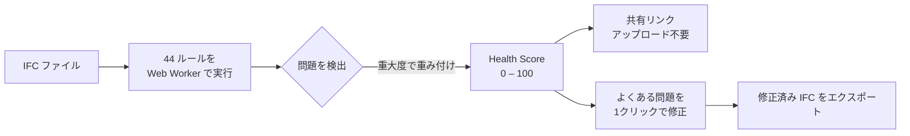
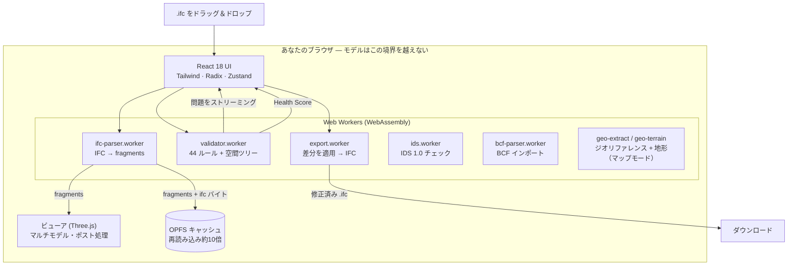

<div align="center">

# IFC Viewer Online

**IFCファイルを開いて、30秒で Health Score（0〜100）を取得。**

ブラウザだけで完結する無料の IFC ビューア + バリデーター。
アカウント不要。ルールセットの設定不要。ファイルサイズ制限なし。モデルが端末から外に出ることはありません。

[**→ ライブで試す**](https://www.ifcvieweronline.eu/)

<br/>

[](https://www.ifcvieweronline.eu/)
[](#ライセンス--オープンコア)
[](#コントリビュート)
[](https://github.com/j03rul4nd/ifc-viewer-online/stargazers)


<br/>

**他の言語で読む**

[English](readme.md) · [简体中文](README.zh-CN.md) · [Español](README.es.md) · [Français](README.fr.md) · [Deutsch](README.de.md) · 日本語 · [Português](README.pt.md) · [Català](README.ca.md) · [Italiano](README.it.md) · [ไทย](README.th.md)

</div>

---

<div align="center">

[](https://www.ifcvieweronline.eu/)

<sub><i>デモモデルを読み込み → 検証プロファイルを実行 → Health Score と問題一覧をブラウザだけで取得。<a href="https://www.ifcvieweronline.eu/">ライブで試す →</a></i></sub>

</div>

> **ひとことで：** IFC をドラッグして読み込み、3D でモデルを確認し、優先順位付けされた問題リスト付きの Health Score を取得、よくある問題をワンクリックで修正し、修正済みファイルをエクスポート——すべてサーバーに何もアップロードせずに。

## 目次

- [なぜ作ったか](#なぜ作ったか)
- [できること](#できること)
- [実際の動作](#実際の動作)
- [Health Score](#health-score)
- [仕組み（アーキテクチャ）](#仕組みアーキテクチャ)
- [検証問題の見え方](#検証問題の見え方)
- [技術スタック](#技術スタック)
- [はじめに](#はじめに)
- [プロジェクト構成](#プロジェクト構成)
- [44 の検証ルール](#44-の検証ルール)
- [コントリビュート](#コントリビュート)
- [ロードマップ](#ロードマップ)
- [ライセンス — オープンコア](#ライセンス--オープンコア)

---

## なぜ作ったか

ほとんどの IFC 検証ツールには、少なくとも次のいずれかの摩擦があります：

| ツール | 摩擦 |
|---|---|
| buildingSMART validator | 250 MB のサイズ制限、3D ビューアなし、生のテキスト出力 |
| Autodesk Viewer / BIM 360 | モデルを自社サーバーにアップロード——NDA リスク |
| Sortdesk | 検証前にアカウントが必須 |
| Data Octopus | チェックごとに課金——常用するには高額 |
| IFC Verify | 3D ビューアなし——問題はテキストのみ |
| BIMvision / Solibri Anywhere | デスクトップ専用・Windows 専用（Solibri Anywhere は2026年4月に提供終了） |

**IFC Viewer Online にはこれらの制限が一切ありません。** WebAssembly によりブラウザだけで完結し、アップロード・アカウント・サイズ上限はありません。モデルが端末から外に出ることはありません。

---

## できること

| 機能 | 得られるもの |
|---|---|
| **IFC ヘルスチェック** | 44 の検証ルールを Web Worker からライブにストリーミングし、単一の **Health Score（0〜100）** にまとめます。 |
| **buildingSMART IDS** | `.ids` ファイルを読み込み、Information Delivery Specification に対してモデルをチェック — IDS 1.0 の全ファセットに対応し、buildingSMART 公式テストケースで検証済み。仕様ごとに合否判定、JSON/CSV/HTML/BCF にエクスポート。 |
| **3D マップモード (GIS)** | ジオリファレンス済みモデルを実世界のベースマップ（OpenStreetMap／地形図／衛星）と任意の 3D 地形の上に、同じ 3D シーン内で配置。ジオリファレンス情報は IFC から自動抽出され、モデルはブラウザから外に出ません。ビルドフラグで切り替え（`VITE_FEATURE_GIS`）。 |
| **3D ビューア** | Three.js + `@thatopen/components` による WebGL レンダリング。独立トランスフォーム付きのマルチモデル読み込み、SSAO、エッジ描画、ブルーム、2D 平面図、リアルタイム断面。 |
| **非破壊エディタ** | プロパティ値の編集、GUID の修正、要素のリネーム。すべての変更は完全な Undo/Redo 付きの差分（diff）です。修正済み IFC バイナリをエクスポート——差分は Worker で適用、サーバー不要。 |
| **BCF 2.1 インポート/エクスポート** | インポートした BCF ビューポイントへ移動。検証問題を BCF 2.1 zip としてエクスポートし、Navisworks、BIMcollab、BCF 対応の任意の CDE で利用。 |
| **数量集計（Takeoff）** | モデル全体で `IfcElementQuantity` を集計——IFC クラスごとの面積・体積・長さ。 |
| **OPFS ジオメトリキャッシュ** | 解析済みジオメトリをブラウザの Origin Private File System にキャッシュ。再読み込みは約10倍速く、オフラインでも動作。 |
| **10 言語** | EN · ES · FR · DE · PT · JA · CA · ZH · IT · TH |

**対応 IFC バージョン：** IFC2x3 · IFC4 · IFC4x1 · IFC4x3

---

## 実際の動作

> 以下のクリップはすべて、ブラウザで動作する**実際のアプリ**です——モックアップや編集映像ではありません。使用モデルはオープンな参照 IFC [Duplex Apartment](public/Ifc2x3_Duplex_Architecture.ifc)（7,131 要素）で、100% クライアント側で解析・検証しています。

### モデルを操作して IFC プロパティを確認

空間階層全体（プロジェクト → 敷地 → 階 → 空間 → 要素）をたどり、任意の要素をクリックして 3D でハイライトし、その生の IFC プロパティセット・分類・数量を読み取れます。


### すべての問題を 3D でハイライト

検証プロファイルを実行し、**Overlay** を切り替えると、指摘された要素がモデル上に直接塗り分けられます——問題の一覧が、実際に見て確認できるものになります。


### 修正済みモデルをエクスポート

モデルを **IFC** または **GLB** として再エクスポートしたり、検証の問題を **BCF 2.1** パッケージと共有可能なレポートとして出力できます——すべて Web Worker で生成され、アップロードは一切ありません。


---

## Health Score

各モデルには **0〜100** の単一の数値が付与されます——検出されたすべての問題の重大度を重み付けして導出した、対数的・逓減的なスコアです。これは、行動・引用・同僚との共有ができる唯一の数値です。



| 重大度 | 例 |
|---|---|
| **エラー** | GUID の重複、壊れた集約、欠落した空間コンテナ |
| **警告** | プロパティセットの欠落、マテリアルの欠落、命名規則違反 |
| **情報** | プロキシの過剰使用、座標オフセット、ファイルサイズ異常、古いスキーマ |

---

## 仕組み（アーキテクチャ）

パイプライン全体がブラウザ内で動作します。IFC ファイルは WebAssembly により Web Worker で解析され、Three.js で描画され、2つ目の Worker で検証されます——**モデルに関する情報はサーバーに一切送信されません。**



複数の独立した Worker が UI の応答性を保ちます：解析・検証・エクスポートはすべてメインスレッドの外で実行されます。状態は11個の小さな [Zustand](https://github.com/pmndrs/zustand) ストアに保持され、ジオメトリはストアに入りません（安定 ID のみ）。完全なデータフロー図は [`ARCHITECTURE.md`](ARCHITECTURE.md) を参照してください。

---

## 検証問題の見え方

バリデーターは生の IFC STEP エンティティを読み取り、構造化された問題を出力します。たとえば、ソースファイル内のこの重複 GUID：

```step
#42=  IFCWALL('3vB2Y...DUPLICATE',   #5, 'Basic Wall', $, ...);
#118= IFCWALLSTANDARDCASE('3vB2Y...DUPLICATE', #5, 'Wall', $, ...);
```

...は型付きの問題を生成し、UI にストリーミングされ、共有可能なレポートに含まれます：

```jsonc
{
  "ruleId": "RULE_DUPLICATE_GUID",
  "severity": "error",
  "globalId": "3vB2Y...DUPLICATE",
  "expressIds": [42, 118],
  "message": "GlobalId is shared by 2 elements",
  "ifcClass": "IfcWall"
}
```

BCF 2.1 エクスポートは、同じ問題を Navisworks や BIMcollab が理解できるオープンな調整マークアップに包みます：

```xml
<Markup>
  <Topic Guid="..." TopicType="Issue" TopicStatus="Open">
    <Title>Duplicate GlobalId on IfcWall</Title>
    <Priority>High</Priority>
  </Topic>
</Markup>
```

すべての Worker メッセージは実行時に [Zod](https://zod.dev) スキーマ（`src/lib/worker-schemas.ts`）で検証されるため、不正なデータが UI に到達することはありません。

---

## 技術スタック

| レイヤー | 技術 |
|---|---|
| IFC 解析 | [web-ifc](https://github.com/ThatOpenCompany/web-ifc)（WebAssembly） |
| 3D 描画 | [Three.js](https://threejs.org/) + [@thatopen/components](https://github.com/ThatOpenCompany/engine_components) |
| UI | React 18 + Tailwind CSS + Radix UI |
| アニメーション | Framer Motion + GSAP |
| 状態管理 | Zustand 5（13 ストア：model, scene, validation, editor, ui, takeoff, toast, bcf, ids, geo, waiver, capture, presentation） |
| IDS | 純粋 TS の IDS 1.0 エンジン + 専用 web-ifc ワーカー（`src/lib/ids/`、`ids.worker.ts`） |
| GIS / ベースマップ | [3d-tiles-renderer](https://github.com/NASA-AMMOS/3DTilesRendererJS)（three.js シーン内にタイル）— マップモードのみ |
| 検証 | Web Worker — 44 ルール、`postMessage` でストリーミング |
| 実行時安全性 | すべての Worker 境界で Zod スキーマ |
| 仮想化リスト | @tanstack/react-virtual |
| i18n | i18next（10 言語） |
| 分析 | PostHog（クライアント側、PII なし） |
| ビルド | Vite 6 + TypeScript（strict） |
| テスト | Vitest（jsdom） |
| デプロイ | Vercel（静的、バックエンドなし） |

---

## はじめに

```bash
git clone https://github.com/j03rul4nd/ifc-viewer-online.git
cd ifc-viewer-online
npm install
npm run dev    # → http://localhost:3000
```

開発サーバーは `Cross-Origin-Opener-Policy: same-origin` と `Cross-Origin-Embedder-Policy: require-corp` を設定します——`SharedArrayBuffer`（マルチスレッド WASM）に必要です。

**ビルド**

```bash
npm run build   # → dist/
```

> ビルドは Three.js と `@thatopen/*` を Worker チャンクにインラインでバンドルします（各 ~5 MB）。`build` スクリプトはすでに `--max-old-space-size=4096` を渡しています。それでもヒープ OOM になる場合は `NODE_OPTIONS=--max-old-space-size=8192 npx vite build` を試してください。

**テスト**

```bash
npm test        # vitest (jsdom)
```

---

## プロジェクト構成

```
src/
  components/      # Landing, Viewer, ValidationPanel, Sidebar, ModelTree, ScenePanel, …
  workers/         # ifc-parser.worker.ts · validator.worker.ts · export.worker.ts
  stores/          # 13 つの Zustand ストア (model, scene, validation, editor, ui, takeoff, toast, bcf, ids, geo, waiver, capture, presentation)
  hooks/           # useModelSession, useValidationRunner, useElementFocus, …
  lib/             # viewer.ts · loader.ts · validator.ts · diffStore.ts · worker-schemas.ts
  locales/         # i18n — en/ es/ fr/ de/ pt/ ja/ ca/ zh/ it/ th/
  types/           # Zod スキーマ + TypeScript 型 (ValidationRules, EditDiff, …)
public/
  ifc-validator/           # ニッチ用ランディング — /ifc-validator/
  ifc-viewer-mac/          # ニッチ用ランディング — /ifc-viewer-mac/
  solibri-alternative/     # ニッチ用ランディング — /solibri-alternative/
  tools/fix-duplicate-guids/
  es/                      # スペイン語の静的シェル + /es/ifc-validador/
cf-worker/         # Cloudflare Worker — ステートレスなメール収集プロキシ（モデルには一切触れない）
```

さらに詳しい参照ドキュメント：[`ARCHITECTURE.md`](ARCHITECTURE.md) · [`IFC_DOMAIN.md`](IFC_DOMAIN.md) · [`DECISIONS.md`](DECISIONS.md) · [`ROADMAP.md`](ROADMAP.md)。

---

## 44 の検証ルール

ルールは `src/workers/validator.worker.ts` で実行され、`RulesConfig` で制御され、世代ごとにグループ化されています：

<details>
<summary><b>コア — 18 ルール</b>（名前、GUID、型、階層）</summary>

`RULE_EMPTY_NAME` · `RULE_EMPTY_LONGNAME` · `RULE_DUPLICATE_NAME` · `RULE_NAMING_CONVENTION` · `RULE_MISSING_TYPE` · `RULE_DUPLICATE_GUID` · `RULE_MISSING_PROPERTY_SET` · `RULE_ORPHAN_ELEMENT` · `RULE_WRONG_CONTAINER` · `RULE_BROKEN_AGGREGATE` · `RULE_INVALID_GUID_FORMAT` · `RULE_SPATIAL_HIERARCHY` · `RULE_CIRCULAR_REFERENCE` · `RULE_EMPTY_PROPERTY_VALUE` · `RULE_MISSING_MATERIAL` · `RULE_ELEMENT_IN_BUILDING` · `RULE_INVALID_IFC_VERSION` · `RULE_ELEMENT_CLASH`（デフォルトでオフ）

</details>

<details>
<summary><b>空間 &amp; ファイルヘッダー — 11 ルール</b>（プロジェクト/敷地/階、ISO 19650）</summary>

`RULE_MISSING_PROJECT` · `RULE_MISSING_BUILDING` · `RULE_MISSING_STOREY` · `RULE_EMPTY_STOREY` · `RULE_FILE_DESCRIPTION_MISSING` · `RULE_FILE_AUTHOR_MISSING` · `RULE_PROJECT_LONGNAME_MISSING` · `RULE_STOREY_ELEVATION_MISSING` · `RULE_ISO19650_PROJECT_INFO` · `RULE_ISO19650_AUTHOR_INFO` · `RULE_ISO19650_FILENAME`

</details>

<details>
<summary><b>LOD・分類・MEP — 9 ルール</b></summary>

`RULE_MISSING_CLASSIFICATION` · `RULE_LOD_PSET_MISSING` · `RULE_LOD_QUANTITY_MISSING` · `RULE_LOD_MATERIAL_LAYER_MISSING` · `RULE_MEP_SYSTEM_MISSING` · `RULE_CLASH_MEP_STRUCTURAL` · `RULE_PROXY_OVERUSE` · `RULE_COORDINATE_OFFSET` · `RULE_FILE_SIZE_ANOMALY`

</details>

<details>
<summary><b>ジオメトリ・階の整合性 — 6 ルール</b></summary>

`RULE_OPENING_WITHOUT_HOST` · `RULE_STOREY_ELEVATION_DUPLICATE` · `RULE_STOREY_ELEVATION_ORDER` · `RULE_UNIT_CONSISTENCY` · `RULE_SPACE_AREA_MISSING` · `RULE_CONNECTED_MEP`

</details>

---

## コントリビュート

コントリビューションを歓迎します——特に新しい検証ルール、翻訳、バグ修正。

**検証ルールを追加する**（`src/workers/validator.worker.ts`）：

1. `src/types/index.ts` の `ValidationRules` にルール ID を追加
2. `async` 関数を実装——`IfcAPI` インスタンス、`modelId`、`SpatialIndex` ヘルパーを受け取り、`ValidationIssue[]` を返します
3. `runAllRules` のディスパッチブロックに組み込む
4. `src/types/index.ts` の `RULE_TRANSLATIONS` に i18n 文字列を追加
5. `DEFAULT_RULES[RULE_ID] = true` を設定（オプトインなら `false`）
6. 「44 ルール」と記載しているコピー（`index.html`、`README*.md`、`src/seo/config.ts`、`public/*` のランディング）のルール数を更新

**翻訳を追加する：** `src/locales/en/` を新しいロケールフォルダにコピーし、JSON の値を翻訳して、`src/i18n/config.ts` にロケールを登録します。この README の翻訳も同様に歓迎します——命名（`README.<lang>.md`）に従い、先頭の言語行にリンクを追加してください。

**PR を開く前に：** `npm test` と `npx tsc -b` を実行してください。

---

## ロードマップ

本プロダクトは技術的に成熟しています（マルチモデルビューア、44 ルールのバリデーター、非破壊エディタ、BCF、10 言語）。今後の計画は機能主導ではなく **流通（ディストリビューション）主導** です：

- **修正手順テーブル** — ルールごとに「Revit / ArchiCAD / Tekla での直し方」を決定論的に i18n で記述（AI なし、サーバーなし）。
- **クロール可能なレポート** — 共有リンクを URL ハッシュからステートレスなエッジルートへ移し、SNS・検索でレポートが展開されるように（モデルは引き続きブラウザから出ません）。
- **リビジョン差分** — GlobalId でモデルの2バージョンを比較。
- **buildingSMART IDS** — IDS 1.0 を完全にカバーし、bSI 公式テストケースで検証済み。任意の `.ids` を読み込み、仕様ごとに合否を取得し、JSON/CSV/HTML/BCF にエクスポート。
- **3D マップモード / GIS** — ジオリファレンス済みモデルを実世界のベースマップ + 3D 地形の上に、既存のシーン内で配置（フラグで切り替え）。
- **Solibri パリティ バックログ** — ルールテンプレート、情報テイクオフ、クラッシュのグルーピング/プレゼンテーション。[`ROADMAP.md`](ROADMAP.md) を参照。

完全な計画と明示的に保留した項目は [`ROADMAP.md`](ROADMAP.md) を参照してください。

---

## ライセンス — オープンコア

| コンポーネント | ライセンス |
|---|---|
| IFC ビューア（Three.js 描画、WASM 統合） | **MIT** |
| バリデーター（44 ルール、Web Worker） | **MIT** |
| IDS 1.0 エンジン + ワーカー | **MIT** |
| GIS / 3D マップモード | **MIT** |
| 非破壊エディタ（差分、Undo/Redo、IFC エクスポート） | **MIT** |
| ストア、フック、ユーティリティ、i18n | **MIT** |
| Cloudflare Worker（メール収集バックエンド） | プロプライエタリ |
| 将来：クラウドストレージ、共有 API、認証、PDF レポート | プロプライエタリ |

**コアのビューアとバリデーターは永続的に MIT ライセンスです。** フォーク、セルフホスト、商用利用が可能です。将来の有料機能向けクラウドインフラはプロプライエタリで、このリポジトリだけからは再現できません。

---

## 作者

[Joel Benitez](https://github.com/j03rul4nd)

このプロジェクトが時間の節約になったなら、⭐ をいただけると他の BIM ユーザーが見つけやすくなります。

---

<div align="center">

*[@thatopen/components](https://github.com/ThatOpenCompany/engine_components)、[web-ifc](https://github.com/ThatOpenCompany/web-ifc)、[Three.js](https://threejs.org/) で構築。*

</div>
