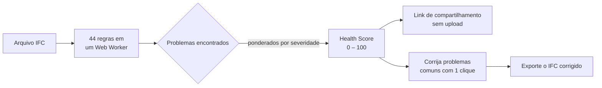
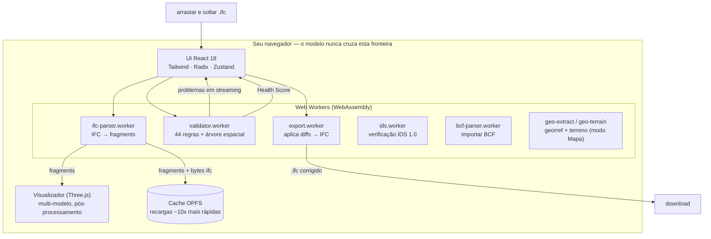

<div align="center">

# IFC Viewer Online

**Abra um arquivo IFC e obtenha um Health Score — de 0 a 100 — em 30 segundos.**

Visualizador + validador IFC gratuito que roda inteiramente no seu navegador.
Sem conta. Sem ruleset para configurar. Sem limite de tamanho. Seus modelos nunca saem da sua máquina.

[**→ Experimente ao vivo**](https://www.ifcvieweronline.eu/)

<br/>

[](https://www.ifcvieweronline.eu/)
[](#licença--open-core)
[](#como-contribuir)
[](https://github.com/j03rul4nd/ifc-viewer-online/stargazers)


<br/>

**Leia no seu idioma**

[English](readme.md) · [简体中文](README.zh-CN.md) · [Español](README.es.md) · [Français](README.fr.md) · [Deutsch](README.de.md) · [日本語](README.ja.md) · Português · [Català](README.ca.md) · [Italiano](README.it.md) · [ไทย](README.th.md)

</div>

---

<div align="center">

[](https://www.ifcvieweronline.eu/)

<sub><i>Carregue um modelo de demonstração → execute um perfil de validação → Health Score com problemas priorizados, 100% no navegador. <a href="https://www.ifcvieweronline.eu/">Experimente online →</a></i></sub>

</div>

> **Em uma frase:** arraste um IFC, veja seu modelo em 3D, obtenha um Health Score com uma lista priorizada de problemas, corrija os mais comuns com um clique e exporte um arquivo corrigido — sem enviar nada para nenhum servidor.

## Conteúdo

- [Por que existe](#por-que-existe)
- [O que faz](#o-que-faz)
- [Em ação](#em-ação)
- [O Health Score](#o-health-score)
- [Como funciona (arquitetura)](#como-funciona-arquitetura)
- [Como é um problema de validação](#como-é-um-problema-de-validação)
- [Stack técnica](#stack-técnica)
- [Primeiros passos](#primeiros-passos)
- [Estrutura do projeto](#estrutura-do-projeto)
- [As 44 regras de validação](#as-44-regras-de-validação)
- [Como contribuir](#como-contribuir)
- [Roadmap](#roadmap)
- [Licença — open core](#licença--open-core)

---

## Por que existe

A maioria das ferramentas de validação IFC tem pelo menos um destes pontos de atrito:

| Ferramenta | Atrito |
|---|---|
| Validador buildingSMART | Limite de 250 MB, sem visualizador 3D, saída em texto puro |
| Autodesk Viewer / BIM 360 | Envia seu modelo para os servidores deles — risco de NDA |
| Sortdesk | Exige conta antes de poder validar |
| Data Octopus | Cobra por verificação — caro para uso regular |
| IFC Verify | Sem visualizador 3D — problemas aparecem só como texto |
| BIMvision / Solibri Anywhere | Só desktop, só Windows (Solibri Anywhere descontinuado em abril de 2026) |

**O IFC Viewer Online não tem nenhuma dessas limitações.** Roda inteiramente no navegador via WebAssembly, sem upload, sem conta e sem teto de tamanho. Seus modelos nunca saem da sua máquina.

---

## O que faz

| Recurso | O que você obtém |
|---|---|
| **IFC Health Check** | 44 regras de validação, transmitidas ao vivo de um Web Worker, resumidas em um único **Health Score (0–100)**. |
| **buildingSMART IDS** | Carregue um arquivo `.ids` e verifique o modelo contra uma Information Delivery Specification — cobertura completa das facetas do IDS 1.0, validada com os casos de teste oficiais do buildingSMART. Aprovado/reprovado por especificação, exportação para JSON/CSV/HTML/BCF. |
| **Modo Mapa 3D (GIS)** | Coloque um modelo georreferenciado sobre um mapa base real (OpenStreetMap / topográfico / satélite) e terreno 3D opcional, dentro da mesma cena 3D. O georreferenciamento é extraído automaticamente do IFC; o modelo nunca sai do navegador. Ativável por flag de build (`VITE_FEATURE_GIS`). |
| **Visualizador 3D** | Renderização WebGL via Three.js + `@thatopen/components`. Carga multi-modelo com transformações independentes, SSAO, edge rendering, bloom, plantas 2D e cortes de seção ao vivo. |
| **Editor não destrutivo** | Edite valores de propriedade, corrija GUIDs, renomeie elementos. Cada mudança é um diff com undo/redo completo. Exporte um IFC corrigido — diffs aplicados em um worker, sem servidor. |
| **Importação/exportação BCF 2.1** | Navegue para os viewpoints BCF importados. Exporte os problemas de validação como um zip BCF 2.1 para Navisworks, BIMcollab e qualquer CDE compatível com BCF. |
| **Quantitativos (takeoff)** | Agrega `IfcElementQuantity` em todo o modelo — área, volume e comprimento por classe IFC. |
| **Cache de geometria OPFS** | A geometria analisada é cacheada no Origin Private File System do navegador. Recargas são ~10× mais rápidas e funcionam offline. |
| **10 idiomas** | EN · ES · FR · DE · PT · JA · CA · ZH · IT · TH |

**Versões IFC suportadas:** IFC2x3 · IFC4 · IFC4x1 · IFC4x3

---

## Em ação

> Cada clipe abaixo é o **app real** rodando em um navegador — sem mockups, sem filmagem editada. O modelo usado é o IFC de referência aberto [Duplex Apartment](public/Ifc2x3_Duplex_Architecture.ifc) (7.131 elementos), processado e validado 100% no cliente.

### Navegue pelo modelo e inspecione propriedades IFC

Percorra toda a hierarquia espacial (projeto → terreno → pavimento → espaço → elemento), clique em qualquer elemento para destacá-lo em 3D e leia seus property sets, classificações e quantidades IFC brutos.


### Destaque cada problema em 3D

Execute um perfil de validação e ative o **Overlay** para pintar os elementos sinalizados diretamente sobre o modelo — assim uma lista de problemas se torna algo que você pode ver e percorrer.


### Exporte um modelo corrigido

Reexporte o modelo como **IFC** ou **GLB**, ou envie os problemas de validação como um pacote **BCF 2.1** e um relatório compartilhável — tudo gerado em um Web Worker, sem nenhum upload.


---

## O Health Score

Cada modelo recebe um único número de **0 a 100** — uma pontuação logarítmica de retornos decrescentes derivada da severidade ponderada de todos os problemas detectados. É o número sobre o qual você pode agir, citar ou compartilhar com um colega.



| Severidade | Exemplos |
|---|---|
| **Erro** | GUIDs duplicados, agregados quebrados, contêineres espaciais ausentes |
| **Aviso** | Property sets ausentes, materiais ausentes, violações de convenção de nomes |
| **Info** | Uso excessivo de proxies, offset de coordenadas, anomalias de tamanho, schema desatualizado |

---

## Como funciona (arquitetura)

Todo o pipeline vive no navegador. O arquivo IFC é analisado em um Web Worker via WebAssembly, renderizado com Three.js e validado em um segundo worker — **nada do seu modelo é enviado a qualquer servidor.**



Vários workers independentes mantêm a UI responsiva: análise, validação e exportação rodam fora da thread principal. O estado vive em onze pequenos stores [Zustand](https://github.com/pmndrs/zustand); a geometria nunca entra no store (apenas IDs estáveis). Os diagramas completos de fluxo de dados estão em [`ARCHITECTURE.md`](ARCHITECTURE.md).

---

## Como é um problema de validação

O validador lê entidades IFC STEP cruas e emite problemas estruturados. Por exemplo, este GUID duplicado no arquivo de origem:

```step
#42=  IFCWALL('3vB2Y...DUPLICATE',   #5, 'Basic Wall', $, ...);
#118= IFCWALLSTANDARDCASE('3vB2Y...DUPLICATE', #5, 'Wall', $, ...);
```

...produz um problema tipado, transmitido à UI e incluído no relatório compartilhável:

```jsonc
{
  "ruleId": "RULE_DUPLICATE_GUID",
  "severity": "error",
  "globalId": "3vB2Y...DUPLICATE",
  "expressIds": [42, 118],
  "message": "GlobalId is shared by 2 elements",
  "ifcClass": "IfcWall"
}
```

A exportação BCF 2.1 envolve os mesmos problemas no markup aberto de coordenação que Navisworks e BIMcollab entendem:

```xml
<Markup>
  <Topic Guid="..." TopicType="Issue" TopicStatus="Open">
    <Title>Duplicate GlobalId on IfcWall</Title>
    <Priority>High</Priority>
  </Topic>
</Markup>
```

Cada mensagem de worker é validada em tempo de execução com schemas [Zod](https://zod.dev) (`src/lib/worker-schemas.ts`), de modo que dados malformados nunca chegam à UI.

---

## Stack técnica

| Camada | Tecnologia |
|---|---|
| Análise IFC | [web-ifc](https://github.com/ThatOpenCompany/web-ifc) (WebAssembly) |
| Renderização 3D | [Three.js](https://threejs.org/) + [@thatopen/components](https://github.com/ThatOpenCompany/engine_components) |
| UI | React 18 + Tailwind CSS + Radix UI |
| Animações | Framer Motion + GSAP |
| Estado | Zustand 5 (11 stores: model, scene, validation, editor, ui, takeoff, toast, bcf, ids, geo, waiver) |
| IDS | Motor IDS 1.0 em TS puro + worker web-ifc dedicado (`src/lib/ids/`, `ids.worker.ts`) |
| GIS / mapa base | [3d-tiles-renderer](https://github.com/NASA-AMMOS/3DTilesRendererJS) (tiles dentro da cena three.js) — apenas modo Mapa |
| Validação | Web Worker — 44 regras, transmitidas via `postMessage` |
| Segurança em runtime | Schemas Zod em cada fronteira de worker |
| Listas virtualizadas | @tanstack/react-virtual |
| i18n | i18next (10 idiomas) |
| Analytics | PostHog (cliente, sem PII) |
| Build | Vite 6 + TypeScript (strict) |
| Testes | Vitest (jsdom) |
| Deploy | Vercel (estático, zero backend) |

---

## Primeiros passos

```bash
git clone https://github.com/j03rul4nd/ifc-viewer-online.git
cd ifc-viewer-online
npm install
npm run dev    # → http://localhost:3000
```

O servidor de desenvolvimento define `Cross-Origin-Opener-Policy: same-origin` e `Cross-Origin-Embedder-Policy: require-corp` — necessários para `SharedArrayBuffer` (WASM multithread).

**Build**

```bash
npm run build   # → dist/
```

> O build empacota Three.js e `@thatopen/*` inline nos chunks de worker (~5 MB cada). O script `build` já passa `--max-old-space-size=4096`. Se ainda assim ocorrer OOM de heap, tente `NODE_OPTIONS=--max-old-space-size=8192 npx vite build`.

**Testes**

```bash
npm test        # vitest (jsdom)
```

---

## Estrutura do projeto

```
src/
  components/      # Landing, Viewer, ValidationPanel, Sidebar, ModelTree, ScenePanel, …
  workers/         # ifc-parser.worker.ts · validator.worker.ts · export.worker.ts
  stores/          # 11 stores Zustand (model, scene, validation, editor, ui, takeoff, toast, bcf, ids, geo, waiver)
  hooks/           # useModelSession, useValidationRunner, useElementFocus, …
  lib/             # viewer.ts · loader.ts · validator.ts · diffStore.ts · worker-schemas.ts
  locales/         # i18n — en/ es/ fr/ de/ pt/ ja/ ca/ zh/ it/ th/
  types/           # Schemas Zod + tipos TypeScript (ValidationRules, EditDiff, …)
public/
  ifc-validator/           # Landing de nicho — /ifc-validator/
  ifc-viewer-mac/          # Landing de nicho — /ifc-viewer-mac/
  solibri-alternative/     # Landing de nicho — /solibri-alternative/
  tools/fix-duplicate-guids/
  es/                      # Shell estático em espanhol + /es/ifc-validador/
cf-worker/         # Cloudflare Worker — proxy stateless de captura de e-mail (nunca vê o modelo)
```

Documentos de referência mais aprofundados: [`ARCHITECTURE.md`](ARCHITECTURE.md) · [`IFC_DOMAIN.md`](IFC_DOMAIN.md) · [`DECISIONS.md`](DECISIONS.md) · [`ROADMAP.md`](ROADMAP.md).

---

## As 44 regras de validação

As regras rodam em `src/workers/validator.worker.ts`, controladas por um `RulesConfig`, agrupadas por geração:

<details>
<summary><b>Núcleo — 18 regras</b> (nomes, GUIDs, tipos, hierarquia)</summary>

`RULE_EMPTY_NAME` · `RULE_EMPTY_LONGNAME` · `RULE_DUPLICATE_NAME` · `RULE_NAMING_CONVENTION` · `RULE_MISSING_TYPE` · `RULE_DUPLICATE_GUID` · `RULE_MISSING_PROPERTY_SET` · `RULE_ORPHAN_ELEMENT` · `RULE_WRONG_CONTAINER` · `RULE_BROKEN_AGGREGATE` · `RULE_INVALID_GUID_FORMAT` · `RULE_SPATIAL_HIERARCHY` · `RULE_CIRCULAR_REFERENCE` · `RULE_EMPTY_PROPERTY_VALUE` · `RULE_MISSING_MATERIAL` · `RULE_ELEMENT_IN_BUILDING` · `RULE_INVALID_IFC_VERSION` · `RULE_ELEMENT_CLASH` (desativada por padrão)

</details>

<details>
<summary><b>Espacial &amp; cabeçalho de arquivo — 11 regras</b> (projeto/sítio/pavimento, ISO 19650)</summary>

`RULE_MISSING_PROJECT` · `RULE_MISSING_BUILDING` · `RULE_MISSING_STOREY` · `RULE_EMPTY_STOREY` · `RULE_FILE_DESCRIPTION_MISSING` · `RULE_FILE_AUTHOR_MISSING` · `RULE_PROJECT_LONGNAME_MISSING` · `RULE_STOREY_ELEVATION_MISSING` · `RULE_ISO19650_PROJECT_INFO` · `RULE_ISO19650_AUTHOR_INFO` · `RULE_ISO19650_FILENAME`

</details>

<details>
<summary><b>LOD, classificação &amp; MEP — 9 regras</b></summary>

`RULE_MISSING_CLASSIFICATION` · `RULE_LOD_PSET_MISSING` · `RULE_LOD_QUANTITY_MISSING` · `RULE_LOD_MATERIAL_LAYER_MISSING` · `RULE_MEP_SYSTEM_MISSING` · `RULE_CLASH_MEP_STRUCTURAL` · `RULE_PROXY_OVERUSE` · `RULE_COORDINATE_OFFSET` · `RULE_FILE_SIZE_ANOMALY`

</details>

<details>
<summary><b>Geometria e integridade de pavimentos — 6 regras</b></summary>

`RULE_OPENING_WITHOUT_HOST` · `RULE_STOREY_ELEVATION_DUPLICATE` · `RULE_STOREY_ELEVATION_ORDER` · `RULE_UNIT_CONSISTENCY` · `RULE_SPACE_AREA_MISSING` · `RULE_CONNECTED_MEP`

</details>

---

## Como contribuir

Contribuições são bem-vindas — especialmente novas regras de validação, traduções e correções de bugs.

**Adicionar uma regra de validação** (`src/workers/validator.worker.ts`):

1. Adicione o ID da regra a `ValidationRules` em `src/types/index.ts`
2. Implemente a função `async` — ela recebe a instância `IfcAPI`, `modelId` e um helper `SpatialIndex`, e retorna `ValidationIssue[]`
3. Conecte-a ao bloco de dispatch `runAllRules`
4. Adicione as strings i18n a `RULE_TRANSLATIONS` em `src/types/index.ts`
5. Defina `DEFAULT_RULES[RULE_ID] = true` (ou `false` se for opt-in)
6. Atualize a contagem de regras no copy que menciona "44 regras" (`index.html`, `README*.md`, `src/seo/config.ts`, as landings em `public/*`)

**Adicionar uma tradução:** copie `src/locales/en/` para uma nova pasta de idioma, traduza os valores JSON e registre o idioma em `src/i18n/config.ts`. Traduções deste README também são bem-vindas — siga a nomenclatura (`README.<lang>.md`) e adicione um link na linha de idiomas no topo.

**Antes de abrir um PR:** rode `npm test` e `npm run lint`.

---

## Roadmap

O produto é tecnicamente maduro (visualizador multi-modelo, validador de 44 regras, editor não destrutivo, BCF, 10 idiomas). O plano à frente é **liderado pela distribuição**, não pelas features:

- **Tabela de remediação** — conteúdo determinístico "como corrigir isto no Revit / ArchiCAD / Tekla" por regra, escrito em i18n (sem IA, sem servidor).
- **Relatórios rastreáveis** — mover o link de compartilhamento de um hash de URL para uma rota edge stateless, para que os relatórios se expandam em redes/buscadores (o modelo continua nunca saindo do navegador).
- **Diff de revisões** — comparar duas versões de um modelo por GlobalId.
- **buildingSMART IDS** — cobertura completa do IDS 1.0, validada com os casos de teste oficiais do bSI. Carregue qualquer `.ids`, obtenha aprovado/reprovado por especificação, exporte para JSON/CSV/HTML/BCF.
- **Modo Mapa 3D / GIS** — modelo georreferenciado sobre um mapa base real + terreno 3D, dentro da cena existente (ativável por flag).
- **Backlog de paridade com Solibri** — modelos de regras, takeoff de informação, agrupamento de clashes/apresentações. Veja [`ROADMAP.md`](ROADMAP.md).

Veja [`ROADMAP.md`](ROADMAP.md) para o plano completo e os itens explicitamente adiados.

---

## Licença — open core

| Componente | Licença |
|---|---|
| Visualizador IFC (renderização Three.js, integração WASM) | **MIT** |
| Validador (44 regras, Web Worker) | **MIT** |
| Motor IDS 1.0 + worker | **MIT** |
| GIS / modo Mapa 3D | **MIT** |
| Editor não destrutivo (diffs, undo/redo, exportação IFC) | **MIT** |
| Stores, hooks, utilitários, i18n | **MIT** |
| Cloudflare Worker (backend de captura de e-mail) | Proprietário |
| Futuro: cloud storage, API de compartilhamento, auth, relatórios PDF | Proprietário |

**O visualizador e o validador núcleo são MIT para sempre.** Faça fork, hospede você mesmo, use comercialmente. A infraestrutura de nuvem para futuras features pagas é proprietária e não pode ser replicada apenas a partir deste repo.

---

## Autor

[Joel Benitez](https://github.com/j03rul4nd)

Se este projeto te poupou tempo, uma ⭐ ajuda outras pessoas do mundo BIM a encontrá-lo.

---

<div align="center">

*Construído com [@thatopen/components](https://github.com/ThatOpenCompany/engine_components), [web-ifc](https://github.com/ThatOpenCompany/web-ifc) e [Three.js](https://threejs.org/).*

</div>
