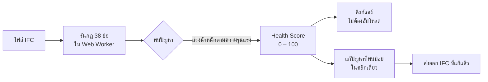
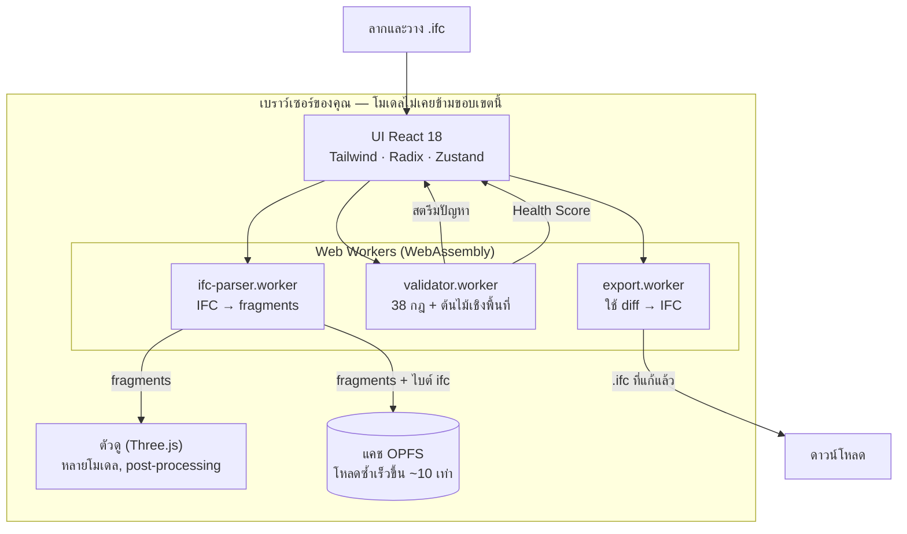

<div align="center">

# IFC Viewer Online

**เปิดไฟล์ IFC แล้วรับ Health Score — 0 ถึง 100 — ภายใน 30 วินาที**

โปรแกรมดู + ตรวจสอบ IFC ฟรี ที่ทำงานในเบราว์เซอร์ทั้งหมด
ไม่ต้องมีบัญชี ไม่ต้องตั้งค่า ruleset ไม่มีขีดจำกัดขนาดไฟล์ โมเดลของคุณไม่เคยออกจากเครื่องของคุณ

[**→ ลองใช้งานจริง**](https://www.ifcvieweronline.eu/)

<br/>

[](https://www.ifcvieweronline.eu/)
[](#สัญญาอนุญาต--open-core)
[](#การร่วมพัฒนา)
[](https://github.com/j03rul4nd/ifc-viewer-online/stargazers)


<br/>

**อ่านในภาษาของคุณ**

[English](readme.md) · [简体中文](README.zh-CN.md) · [Español](README.es.md) · [Français](README.fr.md) · [Deutsch](README.de.md) · [日本語](README.ja.md) · [Português](README.pt.md) · [Català](README.ca.md) · [Italiano](README.it.md) · ไทย

</div>

---

<div align="center">

[](https://www.ifcvieweronline.eu/)

<sub><i>โหลดโมเดลตัวอย่าง → รันโปรไฟล์ตรวจสอบ → Health Score พร้อมรายการปัญหาที่จัดลำดับความสำคัญ ทำงานในเบราว์เซอร์ทั้งหมด <a href="https://www.ifcvieweronline.eu/">ลองใช้งานจริง →</a></i></sub>

</div>

> **สรุปในประโยคเดียว:** ลากไฟล์ IFC เข้ามา ดูโมเดลแบบ 3 มิติ รับ Health Score พร้อมรายการปัญหาที่จัดลำดับความสำคัญ แก้ปัญหาที่พบบ่อยได้ในคลิกเดียว แล้วส่งออกไฟล์ที่แก้ไขแล้ว — โดยไม่อัปโหลดอะไรขึ้นเซิร์ฟเวอร์เลย

## สารบัญ

- [ทำไมจึงมีโปรเจกต์นี้](#ทำไมจึงมีโปรเจกต์นี้)
- [ทำอะไรได้บ้าง](#ทำอะไรได้บ้าง)
- [ดูการทำงานจริง](#ดูการทำงานจริง)
- [Health Score](#health-score)
- [ทำงานอย่างไร (สถาปัตยกรรม)](#ทำงานอย่างไร-สถาปัตยกรรม)
- [ปัญหาการตรวจสอบหน้าตาเป็นอย่างไร](#ปัญหาการตรวจสอบหน้าตาเป็นอย่างไร)
- [เทคโนโลยีที่ใช้](#เทคโนโลยีที่ใช้)
- [เริ่มต้นใช้งาน](#เริ่มต้นใช้งาน)
- [โครงสร้างโปรเจกต์](#โครงสร้างโปรเจกต์)
- [กฎการตรวจสอบ 38 ข้อ](#กฎการตรวจสอบ-38-ข้อ)
- [การร่วมพัฒนา](#การร่วมพัฒนา)
- [โรดแมป](#โรดแมป)
- [สัญญาอนุญาต — open core](#สัญญาอนุญาต--open-core)

---

## ทำไมจึงมีโปรเจกต์นี้

เครื่องมือตรวจสอบ IFC ส่วนใหญ่มีอุปสรรคอย่างน้อยหนึ่งข้อต่อไปนี้:

| เครื่องมือ | อุปสรรค |
|---|---|
| buildingSMART validator | จำกัดขนาด 250 MB, ไม่มีตัวดู 3 มิติ, แสดงผลเป็นข้อความดิบ |
| Autodesk Viewer / BIM 360 | อัปโหลดโมเดลขึ้นเซิร์ฟเวอร์ของเขา — เสี่ยงผิด NDA |
| Sortdesk | ต้องมีบัญชีก่อนจึงจะตรวจสอบได้ |
| Data Octopus | คิดเงินต่อการตรวจสอบหนึ่งครั้ง — แพงเมื่อใช้งานบ่อย |
| IFC Verify | ไม่มีตัวดู 3 มิติ — ปัญหาแสดงเป็นข้อความเท่านั้น |
| BIMvision / Solibri Anywhere | เดสก์ท็อปเท่านั้น, Windows เท่านั้น (Solibri Anywhere ยุติให้บริการเมษายน 2026) |

**IFC Viewer Online ไม่มีข้อจำกัดเหล่านั้นเลย** ทำงานในเบราว์เซอร์ทั้งหมดผ่าน WebAssembly ไม่มีการอัปโหลด ไม่มีบัญชี และไม่มีเพดานขนาดไฟล์ โมเดลของคุณไม่เคยออกจากเครื่องของคุณ

---

## ทำอะไรได้บ้าง

| ความสามารถ | สิ่งที่คุณได้รับ |
|---|---|
| **IFC Health Check** | กฎการตรวจสอบ 38 ข้อ สตรีมแบบเรียลไทม์จาก Web Worker สรุปเป็น **Health Score (0–100)** ค่าเดียว |
| **ตัวดู 3 มิติ** | เรนเดอร์ WebGL ผ่าน Three.js + `@thatopen/components` รองรับหลายโมเดลพร้อมการแปลงแยกอิสระ, SSAO, การเรนเดอร์ขอบ, bloom, แปลนพื้น 2 มิติ และการตัดหน้าตัดแบบเรียลไทม์ |
| **ตัวแก้ไขแบบไม่ทำลายข้อมูล** | แก้ค่าพร็อพเพอร์ตี ซ่อม GUID เปลี่ยนชื่อองค์ประกอบ ทุกการเปลี่ยนแปลงเป็น diff พร้อม undo/redo เต็มรูปแบบ ส่งออกไฟล์ IFC ที่แก้แล้ว — diff ถูกใช้ใน worker ไม่ต้องมีเซิร์ฟเวอร์ |
| **นำเข้า/ส่งออก BCF 2.1** | ไปยัง viewpoint ของ BCF ที่นำเข้ามา ส่งออกปัญหาการตรวจสอบเป็นไฟล์ zip BCF 2.1 สำหรับ Navisworks, BIMcollab และ CDE ใดก็ตามที่รองรับ BCF |
| **การถอดปริมาณ (takeoff)** | รวม `IfcElementQuantity` ทั้งโมเดล — พื้นที่ ปริมาตร ความยาว ตามคลาส IFC |
| **แคชเรขาคณิต OPFS** | เรขาคณิตที่แยกวิเคราะห์แล้วถูกแคชใน Origin Private File System ของเบราว์เซอร์ โหลดซ้ำเร็วขึ้นราว 10 เท่า และทำงานแบบออฟไลน์ได้ |
| **10 ภาษา** | EN · ES · FR · DE · PT · JA · CA · ZH · IT · TH |

**เวอร์ชัน IFC ที่รองรับ:** IFC2x3 · IFC4 · IFC4x1 · IFC4x3

---

## ดูการทำงานจริง

> คลิปทุกอันด้านล่างคือ **แอปจริง** ที่ทำงานในเบราว์เซอร์ — ไม่มีภาพจำลองหรือการตัดต่อ โมเดลที่ใช้คือไฟล์ IFC อ้างอิงแบบเปิด [Duplex Apartment](public/Ifc2x3_Duplex_Architecture.ifc) (7,131 องค์ประกอบ) ซึ่งประมวลผลและตรวจสอบ 100% ฝั่งไคลเอนต์

### นำทางในโมเดลและตรวจสอบคุณสมบัติ IFC

ท่องดูลำดับชั้นเชิงพื้นที่ทั้งหมด (โครงการ → ไซต์ → ชั้น → พื้นที่ → องค์ประกอบ) คลิกองค์ประกอบใดก็ได้เพื่อไฮไลต์ใน 3D และอ่าน property set, การจัดหมวดหมู่ และปริมาณ IFC ดิบของมัน


### ไฮไลต์ทุกปัญหาใน 3D

เรียกใช้โปรไฟล์การตรวจสอบ แล้วสลับ **Overlay** เพื่อระบายองค์ประกอบที่ถูกตั้งค่าสถานะลงบนโมเดลโดยตรง — รายการปัญหาจึงกลายเป็นสิ่งที่คุณมองเห็นและไล่ดูได้จริง


### ส่งออกโมเดลที่แก้ไขแล้ว

ส่งออกโมเดลใหม่เป็น **IFC** หรือ **GLB** หรือส่งปัญหาการตรวจสอบออกเป็นแพ็กเกจ **BCF 2.1** และรายงานที่แชร์ได้ — ทั้งหมดสร้างใน Web Worker โดยไม่อัปโหลดข้อมูลใด ๆ


---

## Health Score

ทุกโมเดลจะได้รับตัวเลขเดียวจาก **0 ถึง 100** — คะแนนแบบลอการิทึมที่ให้ผลตอบแทนลดลง คำนวณจากความรุนแรงถ่วงน้ำหนักของปัญหาทั้งหมดที่ตรวจพบ นี่คือตัวเลขเดียวที่คุณนำไปลงมือทำ อ้างอิง หรือแชร์กับเพื่อนร่วมงานได้



| ความรุนแรง | ตัวอย่าง |
|---|---|
| **ข้อผิดพลาด (Error)** | GUID ซ้ำ, aggregate เสียหาย, ไม่มี container เชิงพื้นที่ |
| **คำเตือน (Warning)** | ไม่มี property set, ไม่มีวัสดุ, ผิดหลักการตั้งชื่อ |
| **ข้อมูล (Info)** | ใช้ proxy มากเกินไป, ค่าพิกัดเลื่อน, ขนาดไฟล์ผิดปกติ, สคีมาล้าสมัย |

---

## ทำงานอย่างไร (สถาปัตยกรรม)

ไปป์ไลน์ทั้งหมดอยู่ในเบราว์เซอร์ ไฟล์ IFC ถูกแยกวิเคราะห์ใน Web Worker ผ่าน WebAssembly เรนเดอร์ด้วย Three.js และตรวจสอบใน worker ตัวที่สอง — **ไม่มีข้อมูลใด ๆ ของโมเดลถูกส่งไปยังเซิร์ฟเวอร์**



worker อิสระสามตัวช่วยให้ UI ตอบสนองลื่นไหล: การแยกวิเคราะห์ การตรวจสอบ และการส่งออก ล้วนทำงานนอก main thread สถานะถูกเก็บใน [Zustand](https://github.com/pmndrs/zustand) store ขนาดเล็กเจ็ดตัว เรขาคณิตไม่เคยเข้าไปใน store (เก็บเฉพาะ ID ที่เสถียร) ดูไดอะแกรมการไหลของข้อมูลฉบับเต็มได้ที่ [`ARCHITECTURE.md`](ARCHITECTURE.md)

---

## ปัญหาการตรวจสอบหน้าตาเป็นอย่างไร

ตัวตรวจสอบอ่านเอนทิตี IFC STEP แบบดิบและสร้างปัญหาที่มีโครงสร้าง ตัวอย่างเช่น GUID ที่ซ้ำกันในไฟล์ต้นฉบับนี้:

```step
#42=  IFCWALL('3vB2Y...DUPLICATE',   #5, 'Basic Wall', $, ...);
#118= IFCWALLSTANDARDCASE('3vB2Y...DUPLICATE', #5, 'Wall', $, ...);
```

...จะสร้างปัญหาที่มีชนิด (typed) สตรีมไปยัง UI และรวมอยู่ในรายงานที่แชร์ได้:

```jsonc
{
  "ruleId": "RULE_DUPLICATE_GUID",
  "severity": "error",
  "globalId": "3vB2Y...DUPLICATE",
  "expressIds": [42, 118],
  "message": "GlobalId is shared by 2 elements",
  "ifcClass": "IfcWall"
}
```

การส่งออก BCF 2.1 ห่อหุ้มปัญหาเดียวกันไว้ในมาร์กอัปการประสานงานแบบเปิดที่ Navisworks และ BIMcollab เข้าใจ:

```xml
<Markup>
  <Topic Guid="..." TopicType="Issue" TopicStatus="Open">
    <Title>Duplicate GlobalId on IfcWall</Title>
    <Priority>High</Priority>
  </Topic>
</Markup>
```

ทุกข้อความของ worker ถูกตรวจสอบขณะรันด้วยสคีมา [Zod](https://zod.dev) (`src/lib/worker-schemas.ts`) ดังนั้นข้อมูลที่ผิดรูปแบบจะไม่มีวันไปถึง UI

---

## เทคโนโลยีที่ใช้

| เลเยอร์ | เทคโนโลยี |
|---|---|
| การแยกวิเคราะห์ IFC | [web-ifc](https://github.com/ThatOpenCompany/web-ifc) (WebAssembly) |
| การเรนเดอร์ 3 มิติ | [Three.js](https://threejs.org/) + [@thatopen/components](https://github.com/ThatOpenCompany/engine_components) |
| UI | React 18 + Tailwind CSS + Radix UI |
| แอนิเมชัน | Framer Motion + GSAP |
| สถานะ | Zustand 5 (7 store: model, scene, validation, editor, ui, takeoff, toast) |
| การตรวจสอบ | Web Worker — 38 กฎ สตรีมผ่าน `postMessage` |
| ความปลอดภัยขณะรัน | สคีมา Zod ที่ทุกขอบเขตของ worker |
| ลิสต์แบบ virtualized | @tanstack/react-virtual |
| i18n | i18next (10 ภาษา) |
| Analytics | PostHog (ฝั่งไคลเอนต์ ไม่มี PII) |
| Build | Vite 6 + TypeScript (strict) |
| เทสต์ | Vitest (jsdom) |
| Deploy | GitHub Pages (สแตติก ไม่มี backend) |

---

## เริ่มต้นใช้งาน

```bash
git clone https://github.com/j03rul4nd/ifc-viewer-online.git
cd ifc-viewer-online
npm install
npm run dev    # → http://localhost:3000
```

dev server ตั้งค่า `Cross-Origin-Opener-Policy: same-origin` และ `Cross-Origin-Embedder-Policy: require-corp` — จำเป็นสำหรับ `SharedArrayBuffer` (WASM แบบหลายเธรด)

**Build**

```bash
npm run build   # → dist/
```

> การ build จะรวม Three.js และ `@thatopen/*` แบบ inline เข้าไปใน worker chunk (ราว 5 MB ต่อตัว) สคริปต์ `build` ส่ง `--max-old-space-size=4096` ให้แล้ว หากยังเจอ heap OOM ให้ลอง `NODE_OPTIONS=--max-old-space-size=8192 npx vite build`

**เทสต์**

```bash
npm test        # vitest (jsdom)
```

---

## โครงสร้างโปรเจกต์

```
src/
  components/      # Landing, Viewer, ValidationPanel, Sidebar, ModelTree, ScenePanel, …
  workers/         # ifc-parser.worker.ts · validator.worker.ts · export.worker.ts
  stores/          # 7 Zustand store (model, scene, validation, editor, ui, takeoff, toast)
  hooks/           # useModelSession, useValidationRunner, useElementFocus, …
  lib/             # viewer.ts · loader.ts · validator.ts · diffStore.ts · worker-schemas.ts
  locales/         # i18n — en/ es/ fr/ de/ pt/ ja/ ca/ zh/ it/ th/
  types/           # สคีมา Zod + ชนิด TypeScript (ValidationRules, EditDiff, …)
public/
  ifc-validator/           # หน้า landing เฉพาะกลุ่ม — /ifc-validator/
  ifc-viewer-mac/          # หน้า landing เฉพาะกลุ่ม — /ifc-viewer-mac/
  solibri-alternative/     # หน้า landing เฉพาะกลุ่ม — /solibri-alternative/
  tools/fix-duplicate-guids/
  es/                      # เชลล์สแตติกภาษาสเปน + /es/ifc-validador/
cf-worker/         # Cloudflare Worker — พร็อกซีเก็บอีเมลแบบ stateless (ไม่เคยเห็นโมเดล)
```

เอกสารอ้างอิงเชิงลึก: [`ARCHITECTURE.md`](ARCHITECTURE.md) · [`IFC_DOMAIN.md`](IFC_DOMAIN.md) · [`DECISIONS.md`](DECISIONS.md) · [`ROADMAP.md`](ROADMAP.md)

---

## กฎการตรวจสอบ 38 ข้อ

กฎทำงานใน `src/workers/validator.worker.ts` ควบคุมโดย `RulesConfig` จัดกลุ่มตามรุ่น:

<details>
<summary><b>หลัก — 18 กฎ</b> (ชื่อ, GUID, ชนิด, ลำดับชั้น)</summary>

`RULE_EMPTY_NAME` · `RULE_EMPTY_LONGNAME` · `RULE_DUPLICATE_NAME` · `RULE_NAMING_CONVENTION` · `RULE_MISSING_TYPE` · `RULE_DUPLICATE_GUID` · `RULE_MISSING_PROPERTY_SET` · `RULE_ORPHAN_ELEMENT` · `RULE_WRONG_CONTAINER` · `RULE_BROKEN_AGGREGATE` · `RULE_INVALID_GUID_FORMAT` · `RULE_SPATIAL_HIERARCHY` · `RULE_CIRCULAR_REFERENCE` · `RULE_EMPTY_PROPERTY_VALUE` · `RULE_MISSING_MATERIAL` · `RULE_ELEMENT_IN_BUILDING` · `RULE_INVALID_IFC_VERSION` · `RULE_ELEMENT_CLASH` (ปิดโดยค่าเริ่มต้น)

</details>

<details>
<summary><b>เชิงพื้นที่ &amp; ส่วนหัวไฟล์ — 11 กฎ</b> (โปรเจกต์/ไซต์/ชั้น, ISO 19650)</summary>

`RULE_MISSING_PROJECT` · `RULE_MISSING_BUILDING` · `RULE_MISSING_STOREY` · `RULE_EMPTY_STOREY` · `RULE_FILE_DESCRIPTION_MISSING` · `RULE_FILE_AUTHOR_MISSING` · `RULE_PROJECT_LONGNAME_MISSING` · `RULE_STOREY_ELEVATION_MISSING` · `RULE_ISO19650_PROJECT_INFO` · `RULE_ISO19650_AUTHOR_INFO` · `RULE_ISO19650_FILENAME`

</details>

<details>
<summary><b>LOD, การจำแนกประเภท &amp; MEP — 9 กฎ</b></summary>

`RULE_MISSING_CLASSIFICATION` · `RULE_LOD_PSET_MISSING` · `RULE_LOD_QUANTITY_MISSING` · `RULE_LOD_MATERIAL_LAYER_MISSING` · `RULE_MEP_SYSTEM_MISSING` · `RULE_CLASH_MEP_STRUCTURAL` · `RULE_PROXY_OVERUSE` · `RULE_COORDINATE_OFFSET` · `RULE_FILE_SIZE_ANOMALY`

</details>

---

## การร่วมพัฒนา

ยินดีรับการมีส่วนร่วม — โดยเฉพาะกฎการตรวจสอบใหม่ การแปล และการแก้บั๊ก

**การเพิ่มกฎการตรวจสอบ** (`src/workers/validator.worker.ts`):

1. เพิ่ม ID ของกฎไปยัง `ValidationRules` ใน `src/types/index.ts`
2. เขียนฟังก์ชัน `async` — รับอินสแตนซ์ `IfcAPI`, `modelId` และตัวช่วย `SpatialIndex` แล้วคืนค่า `ValidationIssue[]`
3. เชื่อมต่อเข้ากับบล็อก dispatch `runAllRules`
4. เพิ่มสตริง i18n ไปยัง `RULE_TRANSLATIONS` ใน `src/types/index.ts`
5. ตั้งค่า `DEFAULT_RULES[RULE_ID] = true` (หรือ `false` หากเป็นแบบ opt-in)
6. อัปเดตจำนวนกฎในข้อความที่กล่าวถึง "38 กฎ" (`index.html`, `README*.md`, `src/seo/config.ts`, หน้า landing ใน `public/*`)

**การเพิ่มการแปล:** คัดลอก `src/locales/en/` ไปยังโฟลเดอร์ภาษาใหม่ แปลค่าใน JSON แล้วลงทะเบียนภาษาใน `src/i18n/config.ts` การแปล README นี้ก็ยินดีรับเช่นกัน — ใช้รูปแบบชื่อไฟล์ (`README.<lang>.md`) และเพิ่มลิงก์ในแถวภาษาด้านบน

**ก่อนเปิด PR:** รัน `npm test` และ `npm run lint`

---

## โรดแมป

ผลิตภัณฑ์นี้สมบูรณ์ในเชิงเทคนิคแล้ว (ตัวดูหลายโมเดล, ตัวตรวจสอบ 38 กฎ, ตัวแก้ไขแบบไม่ทำลายข้อมูล, BCF, 10 ภาษา) แผนต่อไป **ขับเคลื่อนด้วยการกระจาย (distribution-led)** ไม่ใช่ด้วยฟีเจอร์:

- **ตารางวิธีแก้ไข** — เนื้อหาแบบกำหนดแน่นอน "แก้สิ่งนี้ใน Revit / ArchiCAD / Tekla อย่างไร" ต่อกฎ เขียนใน i18n (ไม่มี AI ไม่มีเซิร์ฟเวอร์)
- **รายงานที่ crawl ได้** — ย้ายลิงก์แชร์จาก URL hash ไปเป็น edge route แบบ stateless เพื่อให้รายงานแสดงตัวอย่างได้บนโซเชียล/เสิร์ช (โมเดลยังคงไม่ออกจากเบราว์เซอร์)
- **diff การแก้ไข (revision)** — เปรียบเทียบสองเวอร์ชันของโมเดลด้วย GlobalId
- **IDS-lite** — เช็กลิสต์โปรเจกต์ด้วยภาษาที่เข้าใจง่าย

ดูแผนฉบับเต็มและรายการที่เลื่อนออกไปอย่างชัดเจนได้ที่ [`ROADMAP.md`](ROADMAP.md)

---

## สัญญาอนุญาต — open core

| ส่วนประกอบ | สัญญาอนุญาต |
|---|---|
| ตัวดู IFC (การเรนเดอร์ Three.js, การผสาน WASM) | **MIT** |
| ตัวตรวจสอบ (38 กฎ, Web Worker) | **MIT** |
| ตัวแก้ไขแบบไม่ทำลายข้อมูล (diff, undo/redo, ส่งออก IFC) | **MIT** |
| store, hook, utility, i18n | **MIT** |
| Cloudflare Worker (backend เก็บอีเมล) | กรรมสิทธิ์ |
| อนาคต: cloud storage, sharing API, auth, รายงาน PDF | กรรมสิทธิ์ |

**ตัวดูและตัวตรวจสอบหลักเป็น MIT ตลอดไป** fork ได้ โฮสต์เองได้ ใช้เชิงพาณิชย์ได้ โครงสร้างพื้นฐานคลาวด์สำหรับฟีเจอร์แบบเสียเงินในอนาคตเป็นกรรมสิทธิ์ และไม่สามารถจำลองได้จาก repo นี้เพียงอย่างเดียว

---

## ผู้เขียน

[Joel Benitez](https://github.com/j03rul4nd)

หากโปรเจกต์นี้ช่วยประหยัดเวลาของคุณ การกด ⭐ จะช่วยให้ชาว BIM คนอื่นค้นพบมันได้ง่ายขึ้น

---

<div align="center">

*สร้างด้วย [@thatopen/components](https://github.com/ThatOpenCompany/engine_components), [web-ifc](https://github.com/ThatOpenCompany/web-ifc) และ [Three.js](https://threejs.org/)*

</div>
