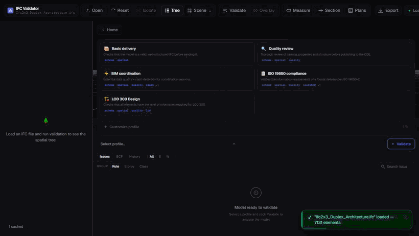
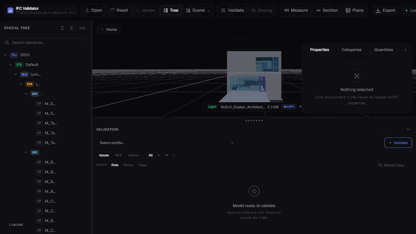
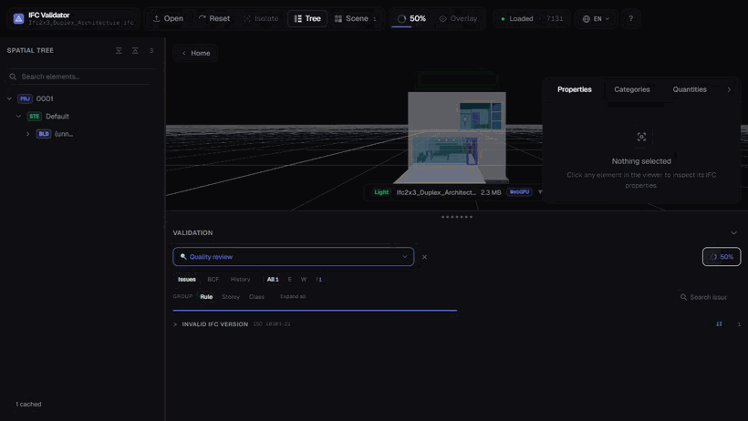
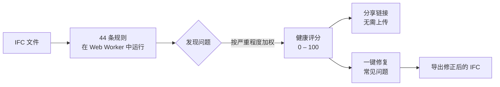
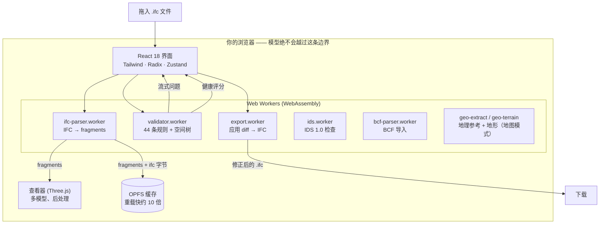

<div align="center">

# IFC Viewer Online

**打开一个 IFC 文件，30 秒内获得健康评分（Health Score）—— 0 到 100 分。**

完全在浏览器中运行的免费 IFC 查看器 + 校验器。
无需账号。无需配置规则集。无文件大小限制。你的模型永远不会离开你的设备。

[**→ 在线体验**](https://www.ifcvieweronline.eu/)

<br/>

[](https://www.ifcvieweronline.eu/)
[](#许可证--开放核心)
[](#参与贡献)
[](https://github.com/j03rul4nd/ifc-viewer-online/stargazers)


<br/>

**选择你的语言**

[English](readme.md) · 简体中文 · [Español](README.es.md) · [Français](README.fr.md) · [Deutsch](README.de.md) · [日本語](README.ja.md) · [Português](README.pt.md) · [Català](README.ca.md) · [Italiano](README.it.md) · [ไทย](README.th.md)

</div>

---

<div align="center">

[](https://www.ifcvieweronline.eu/)

<sub><i>加载演示模型 → 运行验证配置 → 获得健康评分与问题清单，全程在浏览器中完成。<a href="https://www.ifcvieweronline.eu/">在线体验 →</a></i></sub>

</div>

> **一句话概括：** 拖入一个 IFC 文件，在 3D 中查看模型，获得带有问题清单的健康评分，一键修复常见问题，导出修正后的文件 —— 全程不向任何服务器上传数据。

## 目录

- [为什么需要它](#为什么需要它)
- [它能做什么](#它能做什么)
- [实际演示](#实际演示)
- [健康评分](#健康评分)
- [工作原理（架构）](#工作原理架构)
- [一个校验问题长什么样](#一个校验问题长什么样)
- [技术栈](#技术栈)
- [快速开始](#快速开始)
- [项目结构](#项目结构)
- [44 条校验规则](#44-条校验规则)
- [参与贡献](#参与贡献)
- [路线图](#路线图)
- [许可证 — 开放核心](#许可证--开放核心)

---

## 为什么需要它

大多数 IFC 校验工具至少存在以下一种使用障碍：

| 工具 | 使用障碍 |
|---|---|
| buildingSMART validator | 250 MB 文件大小限制，无 3D 查看器，仅输出原始文本 |
| Autodesk Viewer / BIM 360 | 会把模型上传到他们的服务器 —— 存在保密协议（NDA）风险 |
| Sortdesk | 校验前必须注册账号 |
| Data Octopus | 按次收费 —— 频繁使用成本高 |
| IFC Verify | 没有 3D 查看器 —— 问题只能以文本显示 |
| BIMvision / Solibri Anywhere | 仅限桌面、仅限 Windows（Solibri Anywhere 已于 2026 年 4 月停止服务） |

**IFC Viewer Online 没有上述任何限制。** 它通过 WebAssembly 完全在浏览器中运行，无上传、无账号、无大小限制。你的模型永远不会离开你的设备。

---

## 它能做什么

| 能力 | 你能获得什么 |
|---|---|
| **IFC 健康检查** | 44 条校验规则，由 Web Worker 实时流式返回，汇总为一个**健康评分（0–100）**。 |
| **buildingSMART IDS** | 加载 `.ids` 文件，根据 Information Delivery Specification 检查模型 —— 完整覆盖 IDS 1.0 的全部分面，已通过 buildingSMART 官方测试用例验证。按规范给出通过/未通过，可导出为 JSON/CSV/HTML/BCF。 |
| **3D 地图模式（GIS）** | 在同一个 3D 场景中，将带地理参考的模型放置到真实底图（OpenStreetMap／地形图／卫星）和可选的 3D 地形之上。地理参考信息从 IFC 自动提取；模型始终不离开浏览器。通过构建标志启用（`VITE_FEATURE_GIS`）。 |
| **3D 查看器** | 基于 Three.js + `@thatopen/components` 的 WebGL 渲染。支持多模型加载与独立变换、SSAO、边缘渲染、辉光、2D 楼层平面图和实时剖切。 |
| **非破坏性编辑器** | 编辑属性值、修复 GUID、重命名构件。每次更改都是一个 diff，支持完整的撤销/重做。导出修正后的 IFC 二进制 —— diff 在 Worker 中应用，无需服务器。 |
| **BCF 2.1 导入/导出** | 跳转到导入的 BCF 视点。将校验问题导出为 BCF 2.1 zip，供 Navisworks、BIMcollab 及任何兼容 BCF 的 CDE 使用。 |
| **工程量统计** | 跨模型聚合 `IfcElementQuantity` —— 按 IFC 类别统计面积、体积、长度。 |
| **OPFS 几何缓存** | 解析后的几何缓存在浏览器的源私有文件系统（OPFS）中。重新加载快约 10 倍，并支持离线。 |
| **10 种语言** | EN · ES · FR · DE · PT · JA · CA · ZH · IT · TH |

**支持的 IFC 版本：** IFC2x3 · IFC4 · IFC4x1 · IFC4x3

---

## 实际演示

> 下面每个动图都是在浏览器中运行的**真实应用**——没有任何模型图或剪辑。所用模型是开放的参考 IFC [Duplex Apartment](public/Ifc2x3_Duplex_Architecture.ifc)（7,131 个构件），完全在客户端解析与校验。

### 浏览模型并查看 IFC 属性

浏览完整的空间层级（项目 → 场地 → 楼层 → 空间 → 构件），点击任意构件即可在 3D 中高亮，并读取其原始 IFC 属性集、分类与工程量。



### 在 3D 中高亮每个问题

运行一个校验配置，然后切换 **Overlay**，将被标记的构件直接绘制到模型上——这样一份问题清单就变成你可以真正看见并逐一查看的内容。


### 导出已修正的模型

将模型重新导出为 **IFC** 或 **GLB**，或把校验问题导出为 **BCF 2.1** 包和可共享的报告——全部在 Web Worker 中生成，不上传任何数据。



---

## 健康评分

每个模型都会获得一个 **0 到 100** 的单一数值 —— 这是一个对数式、边际递减的评分，由所有检测到问题的加权严重程度推导而来。它是你可以据以行动、引用或与同事分享的唯一数字。



| 严重程度 | 示例 |
|---|---|
| **错误（Error）** | 重复的 GUID、损坏的聚合关系、缺失的空间容器 |
| **警告（Warning）** | 缺失属性集、缺失材质、命名规范违规 |
| **提示（Info）** | 代理构件滥用、坐标偏移、文件大小异常、过时的版本 |

---

## 工作原理（架构）

整个流程都在浏览器中完成。IFC 文件通过 WebAssembly 在 Web Worker 中解析，用 Three.js 渲染，并在第二个 Worker 中校验 —— **关于你模型的任何信息都不会发送到任何服务器。**



多个独立的 Worker 保证界面流畅：解析、校验和导出都在主线程之外运行。状态保存在十一个小型 [Zustand](https://github.com/pmndrs/zustand) store 中；几何数据从不进入 store（只存稳定的 ID）。完整的数据流图见 [`ARCHITECTURE.md`](ARCHITECTURE.md)。

---

## 一个校验问题长什么样

校验器读取原始的 IFC STEP 实体并输出结构化的问题。例如，源文件中这个重复的 GUID：

```step
#42=  IFCWALL('3vB2Y...DUPLICATE',   #5, 'Basic Wall', $, ...);
#118= IFCWALLSTANDARDCASE('3vB2Y...DUPLICATE', #5, 'Wall', $, ...);
```

……会生成一个带类型的问题，流式传到界面并包含在可分享的报告中：

```jsonc
{
  "ruleId": "RULE_DUPLICATE_GUID",
  "severity": "error",
  "globalId": "3vB2Y...DUPLICATE",
  "expressIds": [42, 118],
  "message": "GlobalId is shared by 2 elements",
  "ifcClass": "IfcWall"
}
```

BCF 2.1 导出会把相同的问题封装到 Navisworks 和 BIMcollab 能识别的开放协调标记中：

```xml
<Markup>
  <Topic Guid="..." TopicType="Issue" TopicStatus="Open">
    <Title>Duplicate GlobalId on IfcWall</Title>
    <Priority>High</Priority>
  </Topic>
</Markup>
```

每条 Worker 消息都在运行时通过 [Zod](https://zod.dev) schema（`src/lib/worker-schemas.ts`）校验，因此格式错误的数据绝不会到达界面。

---

## 技术栈

| 层 | 技术 |
|---|---|
| IFC 解析 | [web-ifc](https://github.com/ThatOpenCompany/web-ifc)（WebAssembly） |
| 3D 渲染 | [Three.js](https://threejs.org/) + [@thatopen/components](https://github.com/ThatOpenCompany/engine_components) |
| 界面 | React 18 + Tailwind CSS + Radix UI |
| 动画 | Framer Motion + GSAP |
| 状态管理 | Zustand 5（13 个 store：model、scene、validation、editor、ui、takeoff、toast、bcf、ids、geo、waiver、capture、presentation） |
| IDS | 纯 TS 的 IDS 1.0 引擎 + 专用 web-ifc worker（`src/lib/ids/`、`ids.worker.ts`） |
| GIS / 底图 | [3d-tiles-renderer](https://github.com/NASA-AMMOS/3DTilesRendererJS)（瓦片置于 three.js 场景内）—— 仅地图模式 |
| 校验 | Web Worker —— 44 条规则，通过 `postMessage` 流式返回 |
| 运行时安全 | 每个 Worker 边界都有 Zod schema |
| 虚拟列表 | @tanstack/react-virtual |
| 国际化 | i18next（10 种语言） |
| 分析 | PostHog（客户端，无 PII） |
| 构建 | Vite 6 + TypeScript（strict） |
| 测试 | Vitest（jsdom） |
| 部署 | Vercel（静态，零后端） |

---

## 快速开始

```bash
git clone https://github.com/j03rul4nd/ifc-viewer-online.git
cd ifc-viewer-online
npm install
npm run dev    # → http://localhost:3000
```

开发服务器会设置 `Cross-Origin-Opener-Policy: same-origin` 和 `Cross-Origin-Embedder-Policy: require-corp` —— 这是 `SharedArrayBuffer`（多线程 WASM）所必需的。

**构建**

```bash
npm run build   # → dist/
```

> 构建会把 Three.js 和 `@thatopen/*` 内联打包进 Worker chunk（每个约 5 MB）。`build` 脚本已传入 `--max-old-space-size=4096`。若仍遇到堆内存溢出（OOM），可尝试 `NODE_OPTIONS=--max-old-space-size=8192 npx vite build`。

**测试**

```bash
npm test        # vitest (jsdom)
```

---

## 项目结构

```
src/
  components/      # Landing、Viewer、ValidationPanel、Sidebar、ModelTree、ScenePanel…
  workers/         # ifc-parser.worker.ts · validator.worker.ts · export.worker.ts
  stores/          # 13 个 Zustand store（model、scene、validation、editor、ui、takeoff、toast、bcf、ids、geo、waiver、capture、presentation）
  hooks/           # useModelSession、useValidationRunner、useElementFocus…
  lib/             # viewer.ts · loader.ts · validator.ts · diffStore.ts · worker-schemas.ts
  locales/         # i18n —— en/ es/ fr/ de/ pt/ ja/ ca/ zh/ it/ th/
  types/           # Zod schema + TypeScript 类型（ValidationRules、EditDiff…）
public/
  ifc-validator/           # 细分落地页 —— /ifc-validator/
  ifc-viewer-mac/          # 细分落地页 —— /ifc-viewer-mac/
  solibri-alternative/     # 细分落地页 —— /solibri-alternative/
  tools/fix-duplicate-guids/
  es/                      # 西班牙语静态页 + /es/ifc-validador/
cf-worker/         # Cloudflare Worker —— 无状态邮件采集代理（绝不接触模型）
```

更深入的参考文档：[`ARCHITECTURE.md`](ARCHITECTURE.md) · [`IFC_DOMAIN.md`](IFC_DOMAIN.md) · [`DECISIONS.md`](DECISIONS.md) · [`ROADMAP.md`](ROADMAP.md)。

---

## 44 条校验规则

规则在 `src/workers/validator.worker.ts` 中运行，由 `RulesConfig` 控制开关，按代次分组：

<details>
<summary><b>核心 —— 18 条规则</b>（名称、GUID、类型、层级）</summary>

`RULE_EMPTY_NAME` · `RULE_EMPTY_LONGNAME` · `RULE_DUPLICATE_NAME` · `RULE_NAMING_CONVENTION` · `RULE_MISSING_TYPE` · `RULE_DUPLICATE_GUID` · `RULE_MISSING_PROPERTY_SET` · `RULE_ORPHAN_ELEMENT` · `RULE_WRONG_CONTAINER` · `RULE_BROKEN_AGGREGATE` · `RULE_INVALID_GUID_FORMAT` · `RULE_SPATIAL_HIERARCHY` · `RULE_CIRCULAR_REFERENCE` · `RULE_EMPTY_PROPERTY_VALUE` · `RULE_MISSING_MATERIAL` · `RULE_ELEMENT_IN_BUILDING` · `RULE_INVALID_IFC_VERSION` · `RULE_ELEMENT_CLASH`（默认关闭）

</details>

<details>
<summary><b>空间与文件头 —— 11 条规则</b>（项目/场地/楼层，ISO 19650）</summary>

`RULE_MISSING_PROJECT` · `RULE_MISSING_BUILDING` · `RULE_MISSING_STOREY` · `RULE_EMPTY_STOREY` · `RULE_FILE_DESCRIPTION_MISSING` · `RULE_FILE_AUTHOR_MISSING` · `RULE_PROJECT_LONGNAME_MISSING` · `RULE_STOREY_ELEVATION_MISSING` · `RULE_ISO19650_PROJECT_INFO` · `RULE_ISO19650_AUTHOR_INFO` · `RULE_ISO19650_FILENAME`

</details>

<details>
<summary><b>LOD、分类与机电 —— 9 条规则</b></summary>

`RULE_MISSING_CLASSIFICATION` · `RULE_LOD_PSET_MISSING` · `RULE_LOD_QUANTITY_MISSING` · `RULE_LOD_MATERIAL_LAYER_MISSING` · `RULE_MEP_SYSTEM_MISSING` · `RULE_CLASH_MEP_STRUCTURAL` · `RULE_PROXY_OVERUSE` · `RULE_COORDINATE_OFFSET` · `RULE_FILE_SIZE_ANOMALY`

</details>

<details>
<summary><b>几何与楼层完整性 — 6 条规则</b></summary>

`RULE_OPENING_WITHOUT_HOST` · `RULE_STOREY_ELEVATION_DUPLICATE` · `RULE_STOREY_ELEVATION_ORDER` · `RULE_UNIT_CONSISTENCY` · `RULE_SPACE_AREA_MISSING` · `RULE_CONNECTED_MEP`

</details>

---

## 参与贡献

欢迎贡献 —— 尤其是新的校验规则、翻译和 bug 修复。

**添加一条校验规则**（`src/workers/validator.worker.ts`）：

1. 在 `src/types/index.ts` 的 `ValidationRules` 中添加规则 ID
2. 实现 `async` 函数 —— 它接收 `IfcAPI` 实例、`modelId` 和 `SpatialIndex` 辅助对象，并返回 `ValidationIssue[]`
3. 将其接入 `runAllRules` 分发块
4. 在 `src/types/index.ts` 的 `RULE_TRANSLATIONS` 中添加 i18n 字符串
5. 设置 `DEFAULT_RULES[RULE_ID] = true`（若为可选则设为 `false`）
6. 更新所有引用 “44 条规则” 的文案数量（`index.html`、`README*.md`、`src/seo/config.ts`、`public/*` 落地页）

**添加翻译：** 将 `src/locales/en/` 复制到新的语言文件夹，翻译 JSON 值，并在 `src/i18n/config.ts` 中注册该语言。同样欢迎翻译本 README —— 遵循文件命名（`README.<lang>.md`）并在顶部语言行添加链接。

**提交 PR 前：** 运行 `npm test` 和 `npm run lint`。

---

## 路线图

产品在技术上已经成熟（多模型查看器、44 条规则校验器、非破坏性编辑器、BCF、10 种语言）。后续计划以**分发为主导**，而非以功能为主导：

- **修复指引表** —— 每条规则的确定性“如何在 Revit / ArchiCAD / Tekla 中修复”内容，写入 i18n（无 AI、无服务器）。
- **可抓取的报告** —— 把分享链接从 URL 哈希改为无状态边缘路由，使报告能在社交/搜索中正常展开（模型仍绝不离开浏览器）。
- **版本对比（Revision diff）** —— 按 GlobalId 对比模型的两个版本。
- **buildingSMART IDS** —— 完整覆盖 IDS 1.0，已通过 bSI 官方测试用例验证。加载任意 `.ids`，按规范获得通过/未通过，导出为 JSON/CSV/HTML/BCF。
- **3D 地图模式 / GIS** —— 在现有场景中，将带地理参考的模型置于真实底图 + 3D 地形之上（可通过标志启用）。
- **Solibri 对标待办** —— 规则模板、信息算量、碰撞分组/演示。参见 [`ROADMAP.md`](ROADMAP.md)。

完整计划及明确推迟的项目见 [`ROADMAP.md`](ROADMAP.md)。

---

## 许可证 — 开放核心

| 组件 | 许可证 |
|---|---|
| IFC 查看器（Three.js 渲染、WASM 集成） | **MIT** |
| 校验器（44 条规则，Web Worker） | **MIT** |
| IDS 1.0 引擎 + worker | **MIT** |
| GIS / 3D 地图模式 | **MIT** |
| 非破坏性编辑器（diff、撤销/重做、IFC 导出） | **MIT** |
| Store、hooks、工具函数、i18n | **MIT** |
| Cloudflare Worker（邮件采集后端） | 专有 |
| 未来：云存储、分享 API、鉴权、PDF 报告 | 专有 |

**核心查看器与校验器永久采用 MIT 许可。** 可自由 fork、自托管、商用。未来付费功能的云基础设施为专有，无法仅凭本仓库复制。

---

## 作者

[Joel Benitez](https://github.com/j03rul4nd)

如果这个项目为你节省了时间，点一个 ⭐ 能帮助更多 BIM 同行发现它。

---

<div align="center">

*基于 [@thatopen/components](https://github.com/ThatOpenCompany/engine_components)、[web-ifc](https://github.com/ThatOpenCompany/web-ifc) 和 [Three.js](https://threejs.org/) 构建。*

</div>
