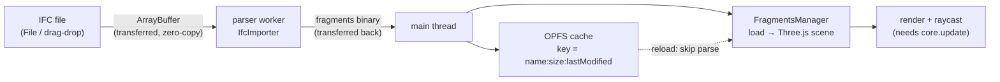

```svg
<svg xmlns="http://www.w3.org/2000/svg" width="1200" height="630" viewBox="0 0 1200 630" role="img" aria-label="How to View IFC in the Browser — the Parts Nobody Documents">
  <rect width="1200" height="630" fill="#0A0A0C"/>
  <g opacity="0.16" stroke="#5E6AD2" stroke-width="1" fill="none">
    <path d="M820 0 V630 M900 0 V630 M980 0 V630 M1060 0 V630 M1140 0 V630"/>
    <path d="M820 90 H1200 M820 180 H1200 M820 270 H1200 M820 360 H1200 M820 450 H1200 M820 540 H1200"/>
  </g>
  <g opacity="0.5" fill="#5E6AD2">
    <circle cx="900" cy="180" r="3"/><circle cx="980" cy="270" r="3"/><circle cx="1060" cy="180" r="3"/>
    <circle cx="1140" cy="360" r="3"/><circle cx="900" cy="450" r="3"/><circle cx="1060" cy="450" r="3"/>
  </g>
  <text x="80" y="92" fill="#8B5CF6" font-family="Inter, system-ui, sans-serif" font-size="22" font-weight="600" letter-spacing="6">DEV TUTORIAL</text>
  <text x="78" y="250" fill="#FAFAFA" font-family="Inter, system-ui, sans-serif" font-size="62" font-weight="800" letter-spacing="-1">
    <tspan x="78" dy="0">IFC in the browser</tspan>
    <tspan x="78" dy="76">with Three.js + web-ifc:</tspan>
    <tspan x="78" dy="76">the parts nobody documents</tspan>
  </text>
  <text x="80" y="586" fill="#A1A1AA" font-family="Inter, system-ui, sans-serif" font-size="24" font-weight="500" letter-spacing="0.5">ifcvieweronline.com</text>
  <g transform="translate(1060,540)">
    <circle r="42" fill="none" stroke="#5E6AD2" stroke-width="6" opacity="0.3"/>
    <circle r="42" fill="none" stroke="#5E6AD2" stroke-width="6" stroke-linecap="round" stroke-dasharray="198 264" transform="rotate(-90)"/>
    <text x="0" y="10" fill="#5E6AD2" font-family="Inter, system-ui, sans-serif" font-size="30" font-weight="800" text-anchor="middle">72</text>
  </g>
</svg>
```



Every IFC-in-the-browser tutorial stops at the same line: "now load the model." Roll credits. The model spins on screen, everyone claps.

Then you ship it, and the worker dies silently in production. Or raycasting returns `null` on every click. Or the page refuses to start because `crossOriginIsolated` is `false` and you have no idea why.

I built a 100% client-side IFC viewer and validator — the file never leaves the browser, no server, no upload. The happy-path tutorial took an afternoon. The three potholes below took weeks. Let me hand you the weeks.

## The minimal stack (and why each piece exists)

Three libraries do the real work:

- **web-ifc** — a WebAssembly build of the IFC parser. It reads the STEP text format and gives you typed access to entities. This is the engine.
- **@thatopen/components** + **@thatopen/fragments** — the rendering layer on top of web-ifc. Fragments is a compact binary geometry format; `IfcImporter` converts raw IFC into it, and `FragmentsManager` loads it into a scene.
- **three.js** — the WebGL renderer underneath everything.

The honest caveat up front: a chunk of your viewer runs on someone else's library. The @thatopen stack is excellent and it's also a dependency you don't control. I'm fine with that for the viewer — my differentiation lives elsewhere (the validation rules, the scoring). But know what you're standing on.

The data flow is the diagram above: file → ArrayBuffer → worker → fragments binary → scene. Keep that shape in your head; every pothole is a place where one of those arrows breaks.

## Parse in a worker, not on the main thread

A real IFC file is 50–500MB of text. Parsing it on the main thread freezes the tab. So the parse goes into a dedicated Web Worker, and the file gets there as a **transferable** `ArrayBuffer`:

```js
// main thread
const buffer = await file.arrayBuffer()
worker.postMessage(
  { type: 'parse', id, buffer, fileName: file.name },
  [buffer], // ← transfer list: zero-copy, buffer detaches here
)
```

That second argument is the whole point. The buffer is *moved*, not copied — after this line `buffer.byteLength` is `0` on the main thread. One gotcha that cost me an hour: I still needed the original bytes later for validation, so I `slice()` a copy *before* transferring. Transfer is zero-copy and fast; just don't transfer the only reference you have.

Inside the worker, `IfcImporter` does the conversion and transfers the result back the same way:

```js
const fragmentsBinary = await importer.process({ bytes, progressCallback })
const out = fragmentsBinary.buffer.slice(/* … */)
self.postMessage({ type: 'result', id, fragmentsBuffer: out }, [out])
```

One web-ifc-specific landmine: in a nested ES-module worker, web-ifc's multi-threaded WASM tries to spawn pthread sub-workers as *classic* workers. They hit your first `import` line and die with "Cannot use import statement outside a module." The fix is to force single-threaded init (`forceSingleThread = true`), which loads the ST WASM that never spawns sub-workers. You lose some parse speed; you gain a worker that actually runs.

## Render: fragments → scene

Once the binary is back on the main thread, handing it to `FragmentsManager` is the easy part — this is roughly where the tutorials end:

```js
const fragments = components.get(OBC.FragmentsManager)
const model = await fragments.load(fragmentsBuffer, { modelId })
world.scene.three.add(model.object)
await fragments.core.update(true) // render the first frame
```

The model appears. You orbit it. It feels done.

It is not done. You haven't clicked anything yet, you haven't shipped to a static host yet, and you haven't checked whether the browser even let you start. That's where the next three sections come from.

While we're here, one performance note worth doing on day one: cache the fragments binary in **OPFS** (Origin Private File System). Parsing is the expensive step; the binary is small and reusable. I key the cache on `name:size:lastModified` (prefixed `v2:` so I can bust it on format changes). Same file dropped twice → the second load skips the worker entirely and feels instant.

## Pothole 1: the page won't start (COOP/COEP)

`web-ifc` uses `SharedArrayBuffer`. Browsers only hand you `SharedArrayBuffer` when the page is **cross-origin isolated**, which requires two response headers:

```
Cross-Origin-Opener-Policy: same-origin
Cross-Origin-Embedder-Policy: require-corp
```

In dev this is trivial — set them in your Vite server config:

```js
server: {
  headers: {
    'Cross-Origin-Opener-Policy':   'same-origin',
    'Cross-Origin-Embedder-Policy': 'require-corp',
  },
},
```

Production is where it bites. I host on GitHub Pages, which **cannot set response headers**. No headers → `crossOriginIsolated === false` → WASM init fails in a way that looks like "the viewer is just broken."

The workaround is `coi-serviceworker.js` (Veaceslav Munteanu's script): a service worker that intercepts your own responses and re-injects the COOP/COEP headers client-side. Drop it in, register it, and the page reloads itself once into an isolated context. It's a hack, but it's the only way to get `SharedArrayBuffer` on a header-less static host.

Two consequences nobody mentions:

1. `require-corp` blocks cross-origin resources that don't opt in — so **don't load your WASM from a CDN**. Ship `web-ifc.wasm` locally and point `importer.wasm.path` at your own origin.
2. The service worker forces a reload on first visit. Account for it in your loading UX or it looks like a flash-of-broken-page.

## Pothole 2: the worker that worked in dev and died in prod

This one is my favorite scar because it failed *silently*.

To keep the worker bundle small, I told Rollup not to bundle three.js into it:

```js
// vite.config.ts — DON'T DO THIS
worker: {
  rollupOptions: { external: ['three'] },
},
```

Reasonable instinct: three is huge, externalize it. In dev, everything worked — Vite's dev server resolves the bare `import ... from 'three'` for you. Green across the board.

In production, the built worker shipped a literal `import { ... } from 'three'`. Browsers **cannot resolve bare specifiers inside a worker** — there's no `node_modules`, no import map. The worker failed to load. And the failure surfaced as a worker `error` event with `message: undefined`. No stack. No module name. Nothing.

I lost real time staring at `message: undefined` before realizing dev and prod resolve worker imports *differently*. The fix is to delete the `external` and let three bundle inline:

```js
worker: {
  format: 'es',
  // Do NOT externalize 'three'. Workers have no bare-specifier resolution.
  // three must be bundled inline into the worker chunk.
},
```

Yes, the worker is now ~4MB. It's cached after the first load and I never think about it again. A 4MB worker that runs beats a 40KB worker that doesn't.

The lesson generalizes: **anything that resolves at dev-server time can resolve differently at build time.** Test your workers against a production build (`vite build && vite preview`), not just `vite dev`. I now treat "works in dev" as zero evidence for worker behavior.

## Pothole 3: raycasting returns nothing

You wire up click-to-select. You build a ray from the mouse, call into the model, and get… `null`. Every click. The geometry is right there on screen.

With Fragments, `model.raycast()` runs against the GPU-side state, and that state is only current after a `core.update()`. If you toggle visibility, load geometry, or change anything and then raycast in the same tick, you're raycasting against stale state — and you get nothing.

The pattern that actually works: mutate, **update**, then raycast.

```js
const hit = await model.raycast({
  camera: world.camera.three,
  mouse,
  dom: canvas,
})

// If you just changed visibility (e.g. hiding IfcSpace to click through it):
await model.setVisible(spatialIds, false)
await fragments.core.update()        // ← without this, the next raycast is blind
const hit2 = await model.raycast({ camera: world.camera.three, mouse, dom: canvas })
```

Three more raycast traps that ate my afternoons:

- **`mouse` must be normalized device coordinates** (`-1..1`), not pixels. Getting `clientX` straight into the ray is the classic "ray points at nothing" bug.
- **`dom` must be the actual canvas**, and its `getBoundingClientRect()` must be current. If the canvas moved or resized and you cached the rect, your coordinates are off.
- **Spatial containers swallow clicks.** `IfcSpace`, `IfcBuilding`, and friends are big invisible-ish volumes that wrap everything. A naive raycast keeps hitting the space, not the wall inside it. I hide the spatial container types, update, raycast again, then restore visibility — that's the two-call dance above.

[TU EXPERIENCIA: describe el modelo real donde el raycast de espacios te volvió loco — qué tipo de edificio era y cuánto tardaste en darte cuenta de que era el IfcSpace]

## Where to go next

You now have the load-bearing parts: parse off-thread with a transferable buffer, render with FragmentsManager, and survive the three potholes — isolation headers on a header-less host, the inline-bundled worker, and the update-before-raycast rule.

What I'd build next, in order:

- **OPFS caching** if you skipped it — biggest perceived-speed win for the least code.
- **Property reading** — `web-ifc`'s `IfcAPI` lets you walk entities and psets. This is where a viewer becomes a tool: "this wall is missing its fire rating" is more useful than a pretty mesh.
- **A spatial tree** — `IfcProject → Site → Building → Storey → element`. Most IFC navigation hangs off this hierarchy.

One honest design note. Going fully client-side is a real constraint, not a free win. Buildings render and validate in your browser with zero upload — great for privacy and for never running a parser farm. But anything that needs to be *crawlable or shareable* (a report a colleague opens from a link, a social preview) can't stay client-only; in my case only a derived summary — a score and a condensed issue list, never the model or its geometry — gets server-rendered at the edge. State that tradeoff out loud in your own project. "Nothing ever touches a server" is almost never literally true, and readers can tell.

If you've got an IFC that loads fine but feels off — missing properties, GUIDs that change on every export, spaces that didn't come through — drag your worst file onto [ifcvieweronline.com](https://ifcvieweronline.com) and see what the score says. No upload, no account; it runs the whole pipeline above right in your tab. And if you hit a pothole I didn't cover, tell me — I collect them.
