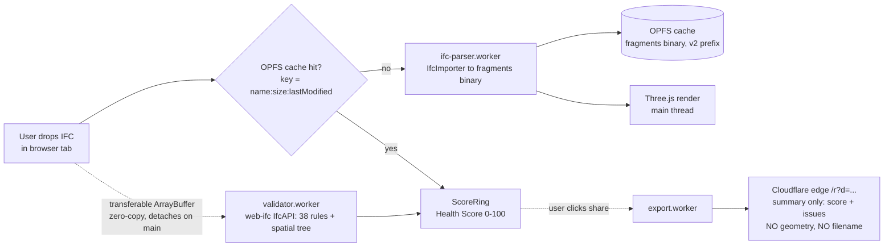

```svg
<svg xmlns="http://www.w3.org/2000/svg" width="1200" height="630" viewBox="0 0 1200 630" role="img" aria-label="I Spent 9 Months Putting a BIM Validator Entirely in the Browser">
  <rect width="1200" height="630" fill="#0A0A0C"/>
  <g opacity="0.16" stroke="#5E6AD2" stroke-width="1" fill="none">
    <path d="M820 90 L1120 90 L1120 250 L970 330 L820 250 Z"/>
    <path d="M970 90 L970 330 M820 170 L1120 170 M820 250 L1120 250"/>
    <path d="M860 360 L1080 360 L1080 520 L970 580 L860 520 Z"/>
    <path d="M970 360 L970 580 M860 440 L1080 440"/>
  </g>
  <g opacity="0.22" fill="#5E6AD2">
    <circle cx="850" cy="120" r="3"/><circle cx="910" cy="120" r="3"/><circle cx="970" cy="120" r="3"/><circle cx="1030" cy="120" r="3"/><circle cx="1090" cy="120" r="3"/>
    <circle cx="850" cy="180" r="3"/><circle cx="910" cy="180" r="3"/><circle cx="970" cy="180" r="3"/><circle cx="1030" cy="180" r="3"/><circle cx="1090" cy="180" r="3"/>
    <circle cx="850" cy="240" r="3"/><circle cx="910" cy="240" r="3"/><circle cx="970" cy="240" r="3"/><circle cx="1030" cy="240" r="3"/><circle cx="1090" cy="240" r="3"/>
  </g>
  <text x="80" y="86" fill="#8B5CF6" font-family="Inter, system-ui, sans-serif" font-size="20" font-weight="600" letter-spacing="4">ENGINEERING</text>
  <text x="80" y="250" fill="#FAFAFA" font-family="Inter, system-ui, sans-serif" font-size="62" font-weight="800">
    <tspan x="80" dy="0">9 Months Putting a BIM</tspan>
    <tspan x="80" dy="74">Validator Entirely in</tspan>
    <tspan x="80" dy="74">the Browser</tspan>
  </text>
  <text x="80" y="470" fill="#A1A1AA" font-family="Inter, system-ui, sans-serif" font-size="26" font-weight="500">No server. No upload. The file never leaves your machine.</text>
  <text x="80" y="582" fill="#A1A1AA" font-family="Inter, system-ui, sans-serif" font-size="22" font-weight="600" letter-spacing="1">ifcvieweronline.com</text>
  <g transform="translate(1050,545)">
    <circle cx="0" cy="0" r="42" fill="none" stroke="#2A2A33" stroke-width="6"/>
    <circle cx="0" cy="0" r="42" fill="none" stroke="#5E6AD2" stroke-width="6" stroke-linecap="round" stroke-dasharray="200 264" transform="rotate(-90)"/>
    <text x="0" y="9" fill="#5E6AD2" font-family="Inter, system-ui, sans-serif" font-size="28" font-weight="800" text-anchor="middle">76</text>
  </g>
</svg>
```



# Every BIM tool wants you to upload your model. I made a rule that mine never would.

That one rule cost me nine months.

Not because the rule was hard to state. Because the rule is a domino. The moment you say "the file never leaves the browser," you've quietly outlawed a server, and once the server is gone, every problem you'd normally solve with a backend you now have to solve with WebAssembly, three web workers, and a cache that lives inside the browser's own filesystem.

I want to walk through that chain — the rule, what it broke, the bug that almost broke me, and what I got for the trouble.

## The rule, and why it isn't a marketing line

IFC files are not screenshots. They're the structured guts of a building: every wall, duct, room, GUID, and property set a design team has agreed to hand over.

A lot of those models are under NDA. A lot of them are proprietary. The BIM coordinator who'd actually pay for a validator can't drag a client's federated model into a "free online tool" that posts it somewhere they can't name.

So "no upload" isn't a privacy flex. It's the only way the people I built this for are *allowed* to use it.

Most of the alternatives ask for the opposite. Even buildingSMART's own validator — which went GA in 2026, free, legitimate — wants an upload and an account, caps you at 250MB, and only checks schema conformance. The desktop options are mostly Windows-only installs. The rule I picked was the one nobody else wanted to live with.

## What the rule broke

No server means no place to run the IFC parser. So the parser had to run in the tab.

IFC parsing is not light. You're walking a STEP file with tens of thousands of entities, building a spatial tree, and resolving relationships. Do that on the main thread and the UI locks up the second someone opens a real model.

That's where the architecture stopped being a choice and started being a consequence:

- **WebAssembly** — the parsing core is `web-ifc` compiled to WASM, sitting under `@thatopen/components`. C++ speed, no native install.
- **Three web workers**, so nothing heavy touches the thread that paints pixels.
- **An OPFS cache**, because if I can't keep your file on a server, the only place to make a reload fast is the browser's own Origin Private File System.

None of that is there because it's clever. It's there because I deleted the server.

## Three workers, because one wasn't honest about the work

The pipeline split into three jobs that genuinely don't want to share a thread:

`ifc-parser.worker` takes the raw IFC and runs `IfcImporter` down to a compact **fragments** binary — the geometry the viewer actually draws.

`validator.worker` runs a separate `web-ifc` `IfcAPI` pass for the 38 rules and the spatial tree. Validation and rendering ask different questions of the same file, so I let them be different workers instead of forcing one to wait on the other.

`export.worker` handles report generation off-thread, so building a shareable summary never stutters the viewer.

The file gets into a worker as a **transferable ArrayBuffer** — zero-copy. The catch nobody warns you about: a transfer *detaches* the buffer on the main thread. It's gone. The first time, I tried to read it again for validation and got an empty husk. So now I hand off the transferable and deliberately keep a copy for the validation and export passes. Zero-copy is great until you needed that copy.

## The bug that worked perfectly in dev and died silently in production

This is the one I'd un-live if I could.

My worker build config had, reasonably enough:

```js
rollupOptions: { external: ['three'] }
```

`external` tells Rollup: don't bundle `three`, the host will provide it. Sensible for an app bundle. Quietly fatal for a worker.

Because that flag means the built worker ships a bare `import ... from 'three'`. In dev, Vite's dev server resolves that import on the fly, so everything is green. In production on GitHub Pages, there's no resolver and no `node_modules` inside a worker context. The browser hits a bare specifier it cannot resolve and the worker just... doesn't come up.

And here's the part that cost me real hours: it failed **silently**. The worker `error` event fired with `message: undefined`. No stack. No specifier. No "module not found." An empty error object for a module-resolution failure I couldn't see because it only happened in the built site.

The fix was one deletion — drop `external`, bundle `three` inline. Yes, the worker balloons to roughly 4MB. It also caches once and never bothers anyone again.

The lesson I actually keep: **dev and prod resolve worker imports differently, and a worker that fails to load can lie to you with an empty error.** [TU EXPERIENCIA: cuanto tiempo concreto perdiste persiguiendo este bug antes de mirar el `external`]

## The headers you can't set on GitHub Pages

Another tax of "no backend": I host on GitHub Pages, which is static and won't let me set response headers.

But `SharedArrayBuffer` and `measureUserAgentSpecificMemory()` — both of which the heavy WASM work leans on — only exist when the page is `crossOriginIsolated`. That requires COOP and COEP headers. Which I just said I can't set.

The escape hatch is `coi-serviceworker.js`: a tiny service worker that re-fetches the page and injects the COOP/COEP headers client-side, faking cross-origin isolation on a host that can't provide it. It's a hack. It works. I'd rather have real headers — but real headers want a server I refuse to run.

## What I gained: privacy stopped being a feature and became the product

Here's where the constraint paid me back.

Because the model never leaves the tab, "private" isn't a checkbox in my settings — it's a property of the architecture. There's no bucket to leak, no upload log to subpoena, no account to breach. The honest version of the pitch is just *the file is on your machine and it stays there.*

That reframed the whole thing. I'm not competing on having the most rules. The official validator is free and backed by buildingSMART. I'm competing on being the one a coordinator can run against a sealed client model without filing a ticket with anyone.

I have to be honest about the one exception, though, because pretending otherwise would be exactly the kind of claim I distrust in others.

## The one place a byte touches a server (and what doesn't)

You can share a report as a link. For that link to render for crawlers and social cards, *something* has to be server-rendered, and a stateless Cloudflare edge Worker does it at a route like `/r?d=...`.

What crosses the edge is **only the derived summary** — the Health Score and a condensed list of issues. No geometry. No filename. No model.

The IFC itself never leaves the browser. The thing on the edge is a flat summary you already saw on your own screen. I won't tell you "nothing ever touches a server," because that's a lie the moment a link has to be crawlable. I'll tell you exactly what does: the score and the issue list, nothing else.

## The feature I built, shipped in spirit, and then deleted

The roadmap once said "AI-assisted validation." I built it.

It was bad. The output was non-deterministic — same model, different wording, occasionally different *conclusions*. It needed a server to call a model, which broke the one rule this whole post is about. And it had no moat: anyone can pipe an IFC at an LLM.

So I killed it and replaced it with something boring. A hand-authored content table: for each of the 38 rules, how to actually fix it in Revit, ArchiCAD, Tekla, and Allplan — written out, in 10 languages. No LLM, no server, no per-request cost, and a moat that's just *the work*, which is harder to copy than a prompt.

Deleting a feature you built is the least fun decision on this list. It was also the most clearly right.

## The visible output: 4 issues or 4,000, one number

All of that machinery — the WASM, the workers, the cache, the rules — surfaces as a single thing.

A **Health Score from 0 to 100**, drawn as a ring. The curve is log-normal with diminishing returns, so the first few problems hurt your score and the four-thousandth barely moves it. A model with 4 issues and a model with 4,000 both collapse to one number you can read across a room.

That number is the point. The exporter (the architect or engineer handing off the model) runs the check before delivery; the coordinator (who owns conformance and would pay to enforce it) shares the report; the exporter opens the link, sees the score and the issues, fixes them, re-shares. The loop runs on a number, not a 60-page report nobody opens.

Because here's the pain in plain terms: an IFC can look perfect in the viewer and still be missing properties, carrying duplicate GUIDs, or sitting miles from the origin. If *you* find it, it's a five-minute fix. If your client finds it, it's an RFI — and that erodes trust and margin in a way no feature recovers.

## Was the rule worth nine months?

Honestly: the rule made everything harder and the product better.

I lost the easy paths — no server-side parsing, no quick analytics on uploaded files, no "just store it and process later." The three.js worker bug alone is a scar. The COI service worker is duct tape.

But the thing I built can do the one thing the upload-first tools structurally can't: run against a model that legally cannot be uploaded. That's not a feature I can lose in a roadmap reshuffle. It's the shape of the whole thing.

If you've got an IFC that *looks* fine but you don't quite trust it — the messiest one on your drive is the best test — drop it on [ifcvieweronline.com](https://ifcvieweronline.com) and watch the ring. Nothing uploads; you can pull your network tab and check. If the build-in-public side of this is your thing, I'll keep writing the bugs down as I hit them.

*Built solo. The viewer core is MIT and open; the cloud bits are proprietary. If you find a way to make the file leave the browser without me knowing, that's a bug — tell me.*
