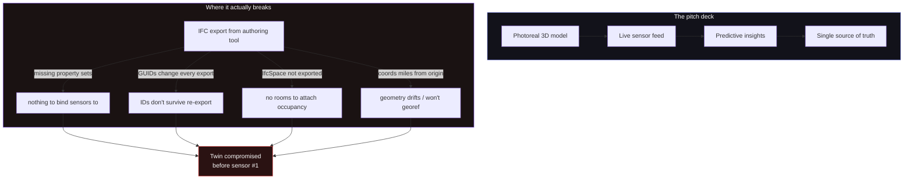

```svg
<svg xmlns="http://www.w3.org/2000/svg" width="1200" height="630" viewBox="0 0 1200 630">
  <rect width="1200" height="630" fill="#0A0A0C"/>
  <g opacity="0.16" stroke="#5E6AD2" stroke-width="1" fill="none">
    <path d="M820 0 V630 M900 0 V630 M980 0 V630 M1060 0 V630 M1140 0 V630"/>
    <path d="M820 90 H1200 M820 180 H1200 M820 270 H1200 M820 360 H1200 M820 450 H1200 M820 540 H1200"/>
  </g>
  <g opacity="0.5" fill="#5E6AD2">
    <circle cx="820" cy="90" r="3"/><circle cx="900" cy="180" r="3"/><circle cx="980" cy="90" r="3"/>
    <circle cx="1060" cy="270" r="3"/><circle cx="1140" cy="180" r="3"/><circle cx="980" cy="360" r="3"/>
    <circle cx="900" cy="450" r="3"/><circle cx="1060" cy="540" r="3"/>
  </g>
  <text x="72" y="96" fill="#8B5CF6" font-family="Inter, system-ui, sans-serif" font-size="22" font-weight="600" letter-spacing="4">ANTI-HYPE</text>
  <text x="70" y="250" fill="#FAFAFA" font-family="Inter, system-ui, sans-serif" font-size="62" font-weight="800">
    <tspan x="72" dy="0">Digital twins are broken</tspan>
    <tspan x="72" dy="74">before they start —</tspan>
    <tspan x="72" dy="74">it's a data problem.</tspan>
  </text>
  <text x="72" y="572" fill="#A1A1AA" font-family="Inter, system-ui, sans-serif" font-size="24" font-weight="500" letter-spacing="1">ifcvieweronline.com</text>
  <g transform="translate(1070,548)">
    <circle r="46" fill="none" stroke="#5E6AD2" stroke-width="6" opacity="0.25"/>
    <circle r="46" fill="none" stroke="#8B5CF6" stroke-width="6" stroke-linecap="round"
            stroke-dasharray="289" stroke-dashoffset="190" transform="rotate(-90)"/>
    <text y="10" text-anchor="middle" fill="#8B5CF6" font-family="Inter, system-ui, sans-serif" font-size="34" font-weight="800">34</text>
  </g>
</svg>
```



# Digital Twins Are Mostly Broken Before They Start — and It's a Boring Data-Quality Problem

I've shipped digital twins. Here's the part nobody puts on the conference slide: most of them were compromised before a single sensor connected.

Not because the 3D wasn't pretty. Because the model underneath was garbage and we agreed not to look too hard.

## The promise everyone signs up for

The pitch is intoxicating, and I've made it myself in a room.

You take the building model. You light it up with live data — temperature, occupancy, energy, valve states. You get a single pane of glass that mirrors reality. Operators see problems before they happen. Owners get a source of truth that outlives the contractors.

It's a genuinely good idea. That's the trap. A good idea makes everyone stop asking the dumb question.

The dumb question is: *what is the model actually made of?*

## Where it really breaks (it isn't the render)

The render is the easy 10%. Three.js and a decent IFC pipeline will give you something that spins beautifully in a browser. People see the spinning building and assume the hard part is done.

The hard part was never the geometry. It's that a digital twin is a database with a 3D skin, and the database is only as good as the IFC you fed it.

Here's what "fine in the viewer" hides:

- The model is missing property sets, so there's nothing to bind a sensor reading to. A pump renders perfectly and carries zero metadata.
- The GUIDs change on every re-export, so the stable IDs your twin relies on quietly become orphans the next time someone updates the model.
- `IfcSpace` never exported, so you have a building with no rooms — and occupancy analytics need rooms.
- The coordinates are sitting kilometres from the origin because someone modelled on the site survey, so georeferencing drifts or refuses outright.

None of that shows up when you orbit the model and go "wow." All of it shows up six months later, as an integration that doesn't.

## The data is the building. The picture is decoration.

I want to be blunt about the inversion here, because the whole industry has it backwards.

We treat the 3D as the deliverable and the data as the by-product. It's the reverse. For a twin, the IFC's *information* is the asset. The geometry is decoration you could regenerate.

IDS — Information Delivery Specification — became the official buildingSMART standard in 2024, and the way they describe it is the sharpest line in the whole space: a contract to deliver the correct *information*. Not a contract to deliver a nice picture. Information.

We've all been grading the picture and skipping the contract.

## Two scars

[TU EXPERIENCIA: el proyecto concreto de digital twin donde el modelo se veía perfecto pero los datos estaban rotos — qué faltaba (psets? spaces? GUIDs?), cómo lo descubriste, y cuánto tiempo/dinero costó. Sé específico: nombre genérico del proyecto, qué te pidieron, qué reventó.]

The second one stung more because it was avoidable.

[TU EXPERIENCIA: el momento en que un cliente o un coordinador encontró el problema antes que tú — el RFI, la llamada incómoda, la sensación de que la confianza se evaporó. Una o dos líneas, concretas.]

That second scar taught me the real economics. If *you* find the broken property set, it's a fifteen-minute fix and a re-export. If your *client* finds it, it's an RFI, a meeting, and a small permanent dent in how much they trust your handoffs. Same defect. Wildly different cost.

## Why nobody wants to fix the boring part

Validation doesn't demo. That's the whole problem in one sentence.

You cannot sell a board on "we ran a data-quality check and 14 property sets were missing." You can absolutely sell them on a glowing 3D twin of their campus. So the budget flows to the skin and starves the skeleton.

And the tooling reinforces it. The viewers people reach for are mostly Windows-only desktop apps built to *look* at the model, not interrogate it. Looking is exactly the activity that hides the defects I listed above.

Even the official answer is half an answer. buildingSMART's own validator went GA in 2026 — free, legitimate, and a real step forward. But it checks schema conformance, and not much past it. It wants an upload and an account. It caps at 250MB. No 3D, no single score you can quote, no instructions for actually fixing what it flags. It tells you the grammar is correct. It doesn't tell you the building is missing its rooms.

## This critique stings my own trade too

I'm not standing outside this. I helped build twins that looked great and shipped on weak data, and I told myself the integration phase would catch it. The integration phase is not a QA phase. It's a deadline. Nobody catches anything in the integration phase; they just paper over it.

I also have to be honest about the thing I make now. A health check on the IFC is *upstream* of the twin — it's necessary, not sufficient. A clean model with a high score can still describe the wrong building. Validation tells you the data is well-formed and complete; it cannot tell you the data is *true*. Anyone selling you "validated, therefore correct" is selling you the same comfortable lie in a new font.

So treat the boring part as a floor, not a ceiling. It just happens to be a floor almost everyone skips.

## What I'd actually do first

If I were starting a twin tomorrow, I'd refuse to talk about sensors until the source models passed a check. Not a vibe. A number.

So I built the thing I kept wishing existed: drag an IFC into a browser tab, and it runs 38 deterministic rules and collapses them into one Health Score, 0–100. A model with 4 issues and a model with 4,000 both come out as a single number you can put in an email and a contract.

Two design choices matter for this argument specifically.

First: it's 100% client-side. The IFC never leaves your machine — no upload, no account, parsed in-browser with WebAssembly. That's not a privacy slogan, it's the only way a subcontractor will actually run a check on a file they're nervous about before a handoff.

I'll be honest about the one tradeoff, because honesty is the entire point of this post. If you *share* a report link, the derived summary — the score and a condensed issue list, no geometry, no filename — does transit a stateless edge worker so a coordinator can open it and crawlers can read it. The model itself never moves. But "nothing ever touches a server" would be a lie, and I'm not going to tell you the comfortable version.

Second: when it flags a rule, it doesn't hand you AI prose. It hands you a hand-written table of how to fix that exact issue in Revit, ArchiCAD, Tekla, or Allplan. I built the AI version. It produced confident, non-deterministic slop and needed a server I didn't want. I deleted it. Boring and deterministic beat clever and wrong.

That's the whole loop the industry keeps skipping: the coordinator who owns conformance shares a check, the person who exported the model opens it, sees the score, fixes the data, re-shares. The skeleton gets fixed *before* anyone pays for the skin.

## The unglamorous conclusion

Digital twins don't mostly fail because the 3D is bad. They fail because the source IFC is bad and validating it is unsexy work that doesn't survive contact with a budget.

The fix isn't a better renderer. It's the discipline to check the data before you build anything on top of it — and to put a number on it that survives an email.

If you've got a model you're about to hand off — or worse, one you're about to build a twin on — drag your worst file into [ifcvieweronline.com](https://ifcvieweronline.com) and see what score it actually gets. It runs entirely in your tab; nothing uploads. I'd genuinely like to hear what number your gnarliest file comes back with — that's the data I'm collecting, and I'm writing more about what I find as I go.

Check the skeleton before you sell the skin.
