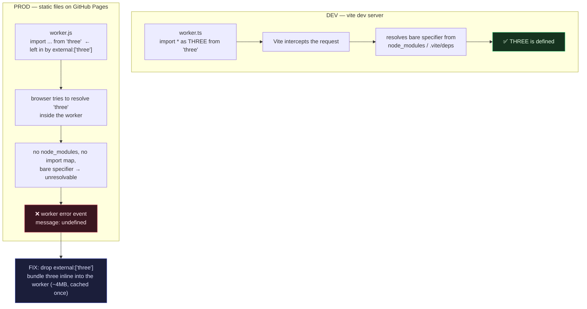

```svg
<svg xmlns="http://www.w3.org/2000/svg" width="1200" height="630" viewBox="0 0 1200 630" role="img" aria-label="WebAssembly Let Me Parse a File the Browser Should Have Choked On">
  <rect width="1200" height="630" fill="#0A0A0C"/>
  <g opacity="0.16" stroke="#5E6AD2" stroke-width="1" fill="none">
    <path d="M820 60 L1140 60 L1140 380 L820 380 Z"/>
    <path d="M820 60 L980 20 L1200 20 L1140 60"/>
    <path d="M1140 380 L1200 340 L1200 20"/>
    <path d="M820 220 L1140 220 M980 60 L980 380 M1060 60 L1060 380"/>
    <path d="M860 140 L1100 140 M860 300 L1100 300"/>
  </g>
  <g opacity="0.5" fill="#5E6AD2">
    <circle cx="860" cy="430" r="3"/><circle cx="920" cy="430" r="3"/><circle cx="980" cy="430" r="3"/><circle cx="1040" cy="430" r="3"/><circle cx="1100" cy="430" r="3"/>
    <circle cx="860" cy="480" r="3"/><circle cx="920" cy="480" r="3"/><circle cx="980" cy="480" r="3"/><circle cx="1040" cy="480" r="3"/><circle cx="1100" cy="480" r="3"/>
    <circle cx="860" cy="530" r="3"/><circle cx="920" cy="530" r="3"/><circle cx="980" cy="530" r="3"/><circle cx="1040" cy="530" r="3"/><circle cx="1100" cy="530" r="3"/>
  </g>
  <text x="80" y="92" fill="#8B5CF6" font-family="Inter, system-ui, -apple-system, sans-serif" font-size="22" font-weight="600" letter-spacing="4">TECHNICAL DEEP DIVE</text>
  <text x="80" y="250" fill="#FAFAFA" font-family="Inter, system-ui, -apple-system, sans-serif" font-size="64" font-weight="800" letter-spacing="-1">
    <tspan x="80" dy="0">WebAssembly Let Me</tspan>
    <tspan x="80" dy="76">Parse a File the Browser</tspan>
    <tspan x="80" dy="76">Should Have Choked On</tspan>
  </text>
  <text x="80" y="582" fill="#A1A1AA" font-family="Inter, system-ui, -apple-system, sans-serif" font-size="24" font-weight="500" letter-spacing="0.5">ifcvieweronline.com</text>
  <g transform="translate(1090,560)">
    <circle cx="0" cy="0" r="44" fill="none" stroke="#26262B" stroke-width="8"/>
    <circle cx="0" cy="0" r="44" fill="none" stroke="#5E6AD2" stroke-width="8" stroke-linecap="round" stroke-dasharray="217 276" transform="rotate(-90)"/>
    <text x="0" y="10" fill="#5E6AD2" text-anchor="middle" font-family="Inter, system-ui, sans-serif" font-size="30" font-weight="700">78</text>
  </g>
</svg>
```



It worked perfectly on localhost.

Then I pushed to GitHub Pages, dragged in the same IFC file, and the parser worker died with a single word: `undefined`. No stack. No line number. The worker's `error` event fired, I logged `event.message`, and the browser handed me back nothing.

That bug cost me an evening and taught me more about how web workers resolve imports than any docs ever did. Let me walk you through the whole thing — the architecture that made a 100% in-browser IFC parser possible, and the production-only bug that nearly made me give up on it.

## The thing the browser shouldn't be able to do

I build [IFC Viewer Online](https://ifcvieweronline.com) — an IFC/BIM viewer and validator that runs entirely in your browser. No upload, no server, no account. You drag a file in and it stays on your machine.

IFC files are big. A real building model is hundreds of megabytes of STEP text describing every wall, pipe, and space. The naive approach — `FileReader`, parse on the main thread — locks the tab for thirty seconds and the user assumes it crashed.

The reason this is even possible on the client is WebAssembly. The actual IFC parser is [web-ifc](https://github.com/ThatOpen/engine_web-ifc), a C++ engine compiled to WASM. It chews through a STEP file at near-native speed inside a sandbox. Pair that with [`@thatopen/components`](https://github.com/ThatOpen/engine_components) for the geometry pipeline and Three.js for rendering, and you get a desktop-grade BIM tool that ships as static files.

That's the headline. The interesting part is everything I had to do to keep the main thread alive.

## Three workers, one rule: never block the UI

The rule I gave myself: the main thread renders and handles input. It does not parse, it does not validate, it does not zip exports. Everything heavy goes to a worker.

So there are three.

**`ifc-parser.worker`** takes the raw IFC bytes, runs `IfcImporter` from `@thatopen/fragments`, and hands back a *fragments binary* — a compact, render-ready geometry format. This is the one that pulls in Three.js, which matters in a minute.

**`validator.worker`** boots its own web-ifc `IfcAPI` instance, walks the model, and runs 38 conformance rules — missing property sets, duplicate GUIDs, spaces that didn't export, geometry parked miles from the origin. It also builds the spatial tree (project → site → building → storey).

**`export.worker`** handles JSON / CSV / BCF / certificate generation and zips the result.

Three isolated contexts, three `postMessage` channels. The main thread orchestrates and never feels the weight.

> One gotcha worth its own paragraph: web-ifc's multithreaded WASM spawns pthread sub-workers, and Emscripten uses `self.location.href` as the sub-worker script URL. Inside a *nested ES-module worker*, that URL is **my** worker, not web-ifc's — so the sub-workers loaded my module as a classic script and died on the first `import`. The fix was forcing single-threaded WASM (`forceSingleThread = true`) in the parser worker. Nested workers are a minefield; I'll come back to that theme.

## OPFS: parsing once, then never again

Parsing a large IFC is expensive. Doing it every time you reload the tab is rude.

So after the first parse I write the fragments binary to the [Origin Private File System](https://developer.mozilla.org/en-US/docs/Web/API/File_System_API/Origin_private_file_system) — a private, origin-scoped filesystem the browser gives you, no permission prompt. On the next load I check the cache first; if it's a hit, I skip web-ifc entirely and reloads are near-instant.

The cache key is the honest part:

```
v2:<file.name>:<file.size>:<file.lastModified>
```

Name, size, last-modified, prefixed with a format version. If you re-export the model, `size` and `lastModified` change, the key misses, and you get a fresh parse. Bump `v2` and every old entry is abandoned wholesale — that's my invalidation lever for when the fragments format itself changes.

I store three things per entry: the `.frag` binary, the original `.ifc` bytes (the validator and exporter need the source, not just geometry), and a `.meta.json`. It's a tiny hand-rolled cache, no library. OPFS is one of those APIs that sounds exotic and turns out to be forty lines of `getDirectoryHandle` / `createWritable`.

## And then production said `undefined`

Here's the scar.

The parser worker imports Three.js transitively through `@thatopen/fragments`. In my Vite config, I had — for reasons that felt smart at the time, probably to "keep the worker small" — this:

```js
worker: {
  rollupOptions: {
    external: ['three'],
  },
}
```

`external: ['three']` tells Rollup: *don't bundle three, leave the import alone, someone else will provide it.* For the main app bundle that's fine — there's an import map, there's a shared chunk, the browser resolves it.

For a worker, it's a trap.

The built worker shipped with a literal `import ... from 'three'` still in it. A bare specifier. And a web worker on a static host has **no module resolution** — no `node_modules`, no import map, nothing that turns `'three'` into a URL. The browser hit that line, couldn't resolve it, and aborted module load before my code ran at all.

Which is why I got nothing. The failure happened during *module instantiation*, not during execution, so there was no try/catch that could catch it and no meaningful message to surface. The worker's `error` event fired with `message: undefined`.

## Why dev lied to me

The part that burned the most time: it was flawless in `vite dev`.

In development, Vite is a live module server. When the worker asks for `'three'`, the dev server intercepts the request and resolves the bare specifier on the fly from `node_modules` (well, `.vite/deps`). The import just works. There is no static file with an unresolvable specifier in it — because there is no static file at all.

In production there's no server. Just files Rollup wrote to `dist/`. And Rollup, obeying `external: ['three']`, had faithfully written a file that could never load.

Dev and prod resolve worker imports through completely different machinery. Dev hides exactly this class of bug.

The fix was deleting four words:

```js
worker: {
  format: 'es',
  // Do NOT externalize 'three'. Workers have no bare-specifier resolution;
  // three must be bundled inline into the worker chunk.
}
```

Drop `external`, let Rollup bundle Three.js straight into the worker. The worker chunk balloons to ~4MB — but it's fetched once, cached by the browser, and never blocks the main thread. A 4MB worker you load in the background beats a worker that doesn't load at all.

[TU EXPERIENCIA: si recuerdas el momento exacto en que viste `message: undefined` en el DevTools de producción — qué navegador, qué pensaste primero que era — ponlo aquí en una o dos líneas, hace el relato más real.]

## The transferable buffer that vanished from under me

While I'm confessing worker bugs, here's the other one that bit me.

To send a big buffer to a worker without copying it, you use a [transferable](https://developer.mozilla.org/en-US/docs/Web/API/Web_Workers_API/Transferable_objects):

```js
worker.postMessage({ type: 'parse', buffer }, [buffer])
```

That second argument moves ownership of the `ArrayBuffer` into the worker — zero-copy, instant, no matter how big. Beautiful.

The catch nobody warns you about loudly enough: once transferred, the buffer is **detached** on the sending side. Its `byteLength` is now `0`. The bytes are gone from your context.

I learned this because I transferred the IFC buffer to the parser, then tried to reuse the *same* buffer to kick off validation — and got an empty array. The buffer had left the building.

The fix is simple once you understand the model: transfer is a move, not a share. If the main thread still needs the data, keep a copy *before* you transfer. So I clone the bytes for validation/export and transfer the original to the parser. The fragments binary comes back the same way — `slice()` to get a standalone `ArrayBuffer`, then transferred back so the round trip stays zero-copy in both directions.

The mental model that finally stuck: `postMessage` with transferables is `std::move`, not a deep copy. Treat the buffer as consumed the instant you hand it over.

## The header tax of running this in the browser

One more cost of doing this client-side, because it's the kind of thing that doesn't show up until you ship.

`SharedArrayBuffer` and `measureUserAgentSpecificMemory()` — both needed for serious WASM work — only exist when the page is [`crossOriginIsolated`](https://developer.mozilla.org/en-US/docs/Web/API/crossOriginIsolated). That requires two response headers: `Cross-Origin-Opener-Policy: same-origin` and `Cross-Origin-Embedder-Policy: require-corp`.

GitHub Pages can't set response headers. So I inject them client-side with [`coi-serviceworker`](https://github.com/gzuidhof/coi-serviceworker) — a tiny service worker that reloads the page once and re-serves it with the COOP/COEP headers in place. It's a hack. It works. It's also the price of refusing to run a backend.

## What I'd tell past me

Three things, if I could go back to that evening.

**Dev servers are compilers in disguise.** Vite resolving a bare specifier on the fly is not a behaviour your static host will reproduce. Any time something works in dev and you don't fully understand *why*, assume prod will disagree.

**`external` in a worker config almost always means a broken worker.** Workers don't get import maps for free. If a dependency isn't bundled in, it isn't there.

**Transferables are moves.** Copy first if you still need the data.

The honest tradeoff in all of this: I refuse to upload your model to a server, so I pay for it in service worker hacks, 4MB worker bundles, and bugs that only appear in production. I think it's worth it — the file genuinely never leaves your machine. (The one place I *don't* hide the line: if you share a report link, only the derived summary — the score and a condensed issue list, no geometry, no filename — is rendered at the edge so the link is crawlable. The model itself stays in the browser. I'd rather say that out loud than pretend nothing touches a server.)

If you've got an IFC sitting on your drive that you suspect is quietly broken — wrong coordinates, missing properties, duplicate GUIDs — drag it onto [ifcvieweronline.com](https://ifcvieweronline.com) and see what the parser makes of it. Nothing uploads; worst case the worker tells you what's wrong with the file. If it chokes on yours, I'd genuinely like to know — that's how the next bug gets found.
