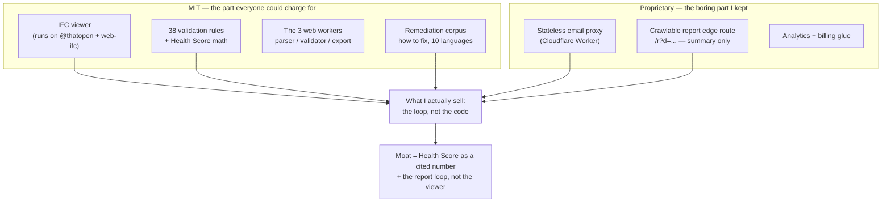

```svg
<svg xmlns="http://www.w3.org/2000/svg" width="1200" height="630" viewBox="0 0 1200 630" role="img" aria-label="I Open-Sourced the Hard Part and Kept the Boring Part">
  <rect width="1200" height="630" fill="#0A0A0C"/>
  <g opacity="0.16" stroke="#5E6AD2" stroke-width="1" fill="none">
    <path d="M820 70 L1130 70 L1130 560 L820 560 Z"/>
    <path d="M820 70 L1130 560 M1130 70 L820 560"/>
    <path d="M975 70 L975 560 M820 315 L1130 315"/>
  </g>
  <g opacity="0.22" fill="#5E6AD2">
    <circle cx="860" cy="120" r="2.5"/><circle cx="935" cy="120" r="2.5"/><circle cx="1010" cy="120" r="2.5"/><circle cx="1085" cy="120" r="2.5"/>
    <circle cx="860" cy="220" r="2.5"/><circle cx="935" cy="220" r="2.5"/><circle cx="1010" cy="220" r="2.5"/><circle cx="1085" cy="220" r="2.5"/>
    <circle cx="860" cy="320" r="2.5"/><circle cx="935" cy="320" r="2.5"/><circle cx="1010" cy="320" r="2.5"/><circle cx="1085" cy="320" r="2.5"/>
    <circle cx="860" cy="420" r="2.5"/><circle cx="935" cy="420" r="2.5"/><circle cx="1010" cy="420" r="2.5"/><circle cx="1085" cy="420" r="2.5"/>
    <circle cx="860" cy="510" r="2.5"/><circle cx="935" cy="510" r="2.5"/><circle cx="1010" cy="510" r="2.5"/><circle cx="1085" cy="510" r="2.5"/>
  </g>
  <text x="80" y="92" fill="#8B5CF6" font-family="Inter, system-ui, sans-serif" font-size="22" font-weight="600" letter-spacing="4">OPEN CORE</text>
  <text x="76" y="248" fill="#FAFAFA" font-family="Inter, system-ui, sans-serif" font-size="74" font-weight="800" letter-spacing="-1.5">
    <tspan x="78" dy="0">I Open-Sourced the</tspan>
    <tspan x="78" dy="86">Hard Part. I Kept the</tspan>
    <tspan x="78" dy="86">Boring Part.</tspan>
  </text>
  <text x="80" y="588" fill="#A1A1AA" font-family="Inter, system-ui, sans-serif" font-size="24" font-weight="500" letter-spacing="0.5">ifcvieweronline.com</text>
  <g transform="translate(1070,560)">
    <circle cx="0" cy="0" r="44" fill="none" stroke="#5E6AD2" stroke-width="6" opacity="0.3"/>
    <circle cx="0" cy="0" r="44" fill="none" stroke="#8B5CF6" stroke-width="6" stroke-linecap="round" stroke-dasharray="207 276" transform="rotate(-90)"/>
    <text x="0" y="9" fill="#8B5CF6" font-family="Inter, system-ui, sans-serif" font-size="30" font-weight="700" text-anchor="middle">74</text>
  </g>
</svg>
```



# I Open-Sourced the Hard Part and Kept the Boring Part

I gave away the thing people told me to charge for — a full IFC validator that turns a messy BIM model into a single Health Score — and I kept a stateless email proxy and an edge route that renders a summary page.

A validator is the part with a moat-shaped silhouette. An email proxy is a 90-line file that forwards a POST to Resend.

Backwards, right? Let me show you the math, because once I drew the line it stopped being backwards and started being the only line that made sense.

## What's MIT and what isn't

The open part is the whole thing you'd actually use. The IFC viewer. The 38 validation rules. The Health Score curve that collapses 4 issues or 4,000 issues into one number 0–100. The three web workers that do the parsing, the rule-checking, and the export. The hand-authored remediation table that tells you how to fix each rule in Revit, ArchiCAD, Tekla, and Allplan, in ten languages.

That's MIT. Fork it, ship it, rip my name off it. I won't chase you.

The proprietary part is comically small. A Cloudflare Worker that takes an email and forwards it so I can send a "your report is ready" mail. An edge route, `/r?d=...`, that server-renders a report summary so a crawler or a social card unfurl can read it. Some analytics and billing glue.

That's it. The hard engineering is free. The plumbing is closed.

## The viewer is not the moat — and it can't be

Here's the part founders don't like to say out loud about their own product: my viewer is a commodity.

It runs on `@thatopen/components` and `web-ifc`. `@thatopen` is, effectively, a competitor's library. The hard geometry — parsing the IFC, building fragments, rendering it in Three.js without melting your laptop — is *their* WebAssembly and *their* abstractions. I orchestrate it. I did not invent it.

So if I treated "the viewer" as my crown jewel and closed it, I'd be guarding a thin wrapper over open WASM that anyone could re-glue in a weekend. Closing it would buy me nothing and cost me every contributor and every bit of trust.

The honest read: a 3D IFC viewer in the browser is now table stakes. Privacy ("the file never leaves your machine") is table stakes. Even validation is converging — buildingSMART shipped their official validator GA in 2026.

If your differentiator is something three other people can also do, it's not a differentiator. It's a feature.

## Where the moat actually is

The moat is not code. That took me embarrassingly long to accept.

The moat is the Health Score *as a number people cite*. "My model scored 74" is a sentence a BIM coordinator can put in an email. The instant someone pastes that number into a handoff conversation, the score is doing the work — not the renderer.

The moat is the remediation corpus. Thirty-eight rules, each with real instructions for four authoring tools, hand-written in ten languages. No LLM generated it. It's boring, finite, and a pain to maintain — which is exactly why it's defensible. Nobody clones a content table for fun.

And the moat is the loop. A coordinator shares a report link. The exporter — the architect or engineer who was told to "run a check before you hand this off" — opens it, sees their score and their issues, fixes them, and re-shares. The buyer and the free user are different people, and the free user builds the thing the buyer pays to enforce.

None of that lives in the MIT code. It lives in adoption, in a number becoming a habit, in a link getting forwarded.

## "But the buildingSMART one is official and free"

It is. And I'd be lying if I said that didn't sting when it went GA.

But look at the shape of it. Their validator checks schema conformance, which matters — IDS became the official buildingSMART standard in 2024, "a contract to deliver the correct information," and that's real. But theirs requires an upload and an account, caps at 250MB, has no 3D viewer, no single score, and no "here's how to fix it in Revit."

Mine never uploads — the IFC stays in your browser tab. It renders. It gives you one number. It tells you how to fix each issue.

We're not the same tool, and pretending the official one doesn't exist would be the fastest way to lose credibility. Different shape, different job. The official one is a gate. Mine is a mirror you hold up before you reach the gate.

## The honest privacy line I won't fudge

When I say "the file never leaves your browser," I mean the IFC. The geometry. The filename. That's true, and the parser, validator, and export all run on three local web workers with an OPFS cache so reloads are near-instant.

But the shareable report is crawlable, and crawlable means *something* has to reach a server, because Googlebot and a Slack unfurl don't run your client-side JavaScript.

So I drew a hard line. Only the derived summary transits the edge — the score plus a condensed issue list. No geometry. No filename. No model. A stateless Cloudflare Worker renders that summary as HTML so it's indexable and unfurls nicely (the D-21 tradeoff, if you read the roadmap).

I could market this as "nothing ever touches a server." It would be a lie, and the people I'm building for — the ones who care about privacy enough to notice — would catch it. So I say the true thing: the model never leaves, the summary does, and here's exactly which bytes.

That distinction is also *why* the proxy and the edge route are the proprietary part. They're the only things that talk to my infrastructure at all.

## The feature I killed proves the point

The roadmap once said "AI-assisted validation." I built it. It was bad.

The output was non-deterministic — run the same model twice, get two different "insights." It needed a server, which broke my one real rule: no backend in the path of your file. And it had no moat, because anyone can pipe a model summary into an LLM. I'd have been paying per request to ship slop that contradicted itself.

So I deleted it (that's the D-22 decision) and replaced it with the most boring thing imaginable: a deterministic content table of how to fix each of the 38 rules, hand-written, no model, no per-request cost.

Worse demo. Better business. The boring deterministic thing is the moat; the impressive AI thing was a liability with a server bill attached.

[TU EXPERIENCIA: el momento exacto en que viste el output de la "AI validation" contradecirse — qué modelo, qué dijo las dos veces]

## The real risk: giving away too much

I'm not going to pretend open-core is clean. The obvious failure mode is that I open-sourced enough that someone forks the MIT core, bolts on their own email proxy in an afternoon, and runs the same product.

They can. Genuinely. The code is the easy part to copy.

What they can't copy in an afternoon is the corpus in ten languages, the score that's already a number in someone's email, and a report loop that's already circulating. The defensibility was never the lines of code — it's the stuff that takes years and adoption to accrete. If I'd closed the validator, I'd have protected the *cheap* thing and left the expensive thing undefended.

The other risk is subtler: open-core can become an excuse to never charge. The free tier has to be genuinely complete or it's bait. The paid tier has to be a thing the *buyer* — the coordinator who owns conformance — actually wants to pay to enforce. If I blur those, I get a popular tool and no business. I think about that line more than any line in the code.

## The math, finally

Close the viewer: protect a wrapper over a competitor's WASM, lose contributors, gain nothing, and *still* not have a moat.

Open the viewer and validator: lose nothing real (it was never defensible), gain trust, gain forks that feed the loop, and keep my actual moat — the number, the corpus, the loop — which lives in adoption, not in source.

The hard part has no moat. The boring part barely needs protecting. So I gave away the hard part to build the only moat that matters, and kept the boring part because it's the only thing that touches my server.

If you've got an IFC sitting on your machine that you suspect is quietly broken — wrong coordinates, missing properties, GUIDs that won't sit still — drag your worst file onto [ifcvieweronline.com](https://ifcvieweronline.com) and see what number it gives you. It runs locally; the model never leaves the tab. If the score's bad, tell me why you think it's wrong — that feedback is the part I can't open-source.
