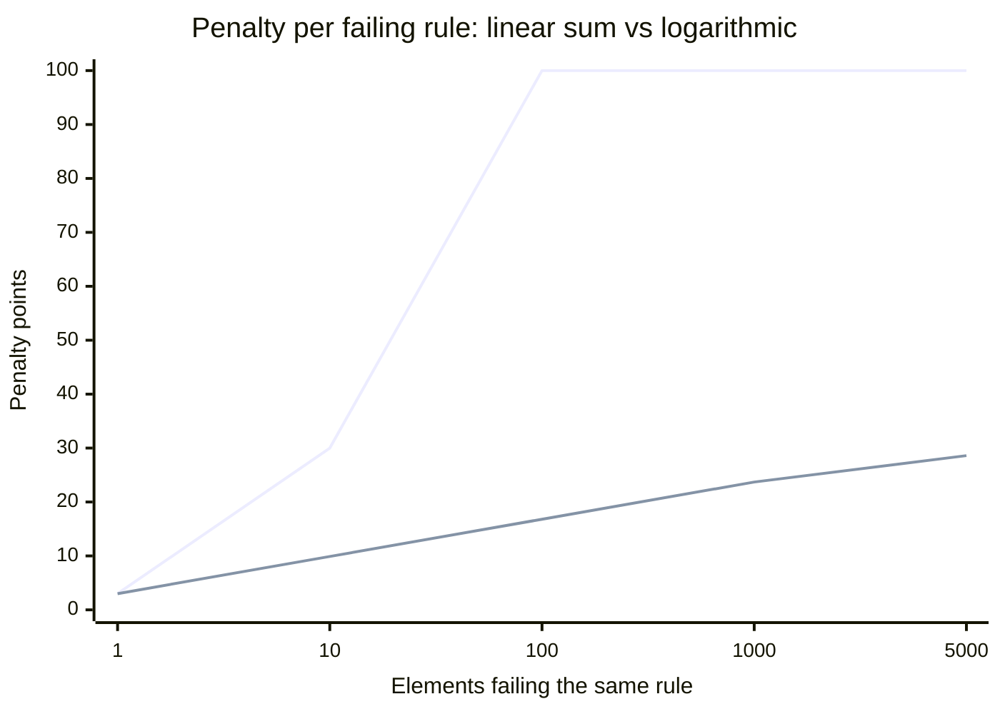

```svg
<svg xmlns="http://www.w3.org/2000/svg" width="1200" height="630" viewBox="0 0 1200 630" role="img" aria-label="How Do You Reduce a Broken Building to a Single Number?">
  <rect width="1200" height="630" fill="#0A0A0C"/>
  <g opacity="0.16" stroke="#5E6AD2" stroke-width="1" fill="none">
    <path d="M820 0 V630 M900 0 V630 M980 0 V630 M1060 0 V630 M1140 0 V630"/>
    <path d="M820 90 H1200 M820 180 H1200 M820 270 H1200 M820 360 H1200 M820 450 H1200 M820 540 H1200"/>
  </g>
  <g opacity="0.5" fill="#5E6AD2">
    <circle cx="900" cy="180" r="3"/><circle cx="980" cy="270" r="3"/><circle cx="1060" cy="360" r="3"/>
    <circle cx="1140" cy="180" r="3"/><circle cx="900" cy="450" r="3"/><circle cx="980" cy="90" r="3"/>
  </g>
  <text x="80" y="96" fill="#8B5CF6" font-family="Inter, system-ui, sans-serif" font-size="22" font-weight="600" letter-spacing="4">ENGINEERING</text>
  <text x="78" y="250" fill="#FAFAFA" font-family="Inter, system-ui, sans-serif" font-size="74" font-weight="800" letter-spacing="-1">
    <tspan x="78" dy="0">How Do You Reduce</tspan>
    <tspan x="78" dy="86">a Broken Building</tspan>
    <tspan x="78" dy="86">to a Single Number?</tspan>
  </text>
  <text x="80" y="582" fill="#A1A1AA" font-family="Inter, system-ui, sans-serif" font-size="24" font-weight="500" letter-spacing="1">ifcvieweronline.com</text>
  <g transform="translate(1060,520)">
    <circle cx="0" cy="0" r="52" fill="none" stroke="#26262B" stroke-width="8"/>
    <circle cx="0" cy="0" r="52" fill="none" stroke="#5E6AD2" stroke-width="8" stroke-linecap="round"
      stroke-dasharray="245 327" transform="rotate(-90)"/>
    <text x="0" y="12" fill="#5E6AD2" font-family="Inter, system-ui, sans-serif" font-size="34" font-weight="700" text-anchor="middle">74</text>
  </g>
</svg>
```



A model dropped on my viewer had 4,317 issues. The next one had 4. Both are real buildings. Both have to come out as one number between 0 and 100.

That constraint sounds arbitrary until you try to ship the alternative.

## Why not just show the list?

The honest first version of any validator is a list. You ran 38 rules, here are the failures, scroll away. It feels rigorous. It is also useless to the person who actually has to make a decision.

A BIM coordinator does not want a list. They want to know one thing: *is this file good enough to accept, yes or no?* A list of 4,317 rows does not answer that. It buries it.

And the exporter — the architect who got told "run a check before you hand off" — opens a 4,317-row list and closes the tab. There is no closure in a list. You can't tell if you're winning.

So the number isn't decoration. It's the only thing that turns validation into a decision. The list is still there, one click down, ranked by impact. But the headline is a score, because a score is a verdict and a list is homework.

## The first attempt was the obvious one. It was wrong.

Severity weighting came first, and that part held up. Not every failure is equal. A broken schema reference is fatal; a missing classification code is a paperwork nuisance. So each rule's category carries a weight per severity.

The actual table, lightly:

- schema errors: 5 points each
- spatial / clash errors: 4
- quality, LOD, ISO-19650 errors: 3
- classification, MEP errors: 2
- warnings are roughly a third of that, info a tenth

Then I did the naive thing: penalty = weight × count, sum it, subtract from 100.

Drop a real federated model on that and the score is 0. Always 0. Every time.

## The "always zero" bug was the design, not a typo

Here's the trap. In IFC, defects are *systematic*, not independent. If the Revit exporter didn't write materials, it didn't write them for one wall — it didn't write them for all 5,000 walls.

That's **one** problem. One setting, one fix, one re-export. But `weight × 5000` is a penalty of fifteen thousand against a budget of a hundred. The model is at 0 before the second rule even runs.

So every model with any systematic defect scored 0. A file with 4 issues and a file with 4,000 looked identical: both broken, both zero, no signal. The number was technically computed and informationally dead.

I'd built a smoke detector that goes off the instant there's a stove.

## Logarithmic, because a problem is a problem once

The fix is to charge for the *existence* of a defect class, not the cardinality of its victims. The first occurrence of a failing rule costs full weight. Each additional one costs steeply less:

```
penalty = weight × (1 + ln(count))
```

One missing-material element costs the full weight. Five thousand of them cost about `weight × 9.5` — not `weight × 5000`. The curve in the chart above is the whole argument: linear pins to the floor by a hundred elements; logarithmic keeps climbing slowly, so 5 systematic defects and 5,000 instances of one defect land in genuinely different places.

This matches how the work actually gets done. You don't fix 5,000 walls. You fix the export setting and re-run. The score should reward *clearing a class of problem*, and it does — the per-rule penalties are sorted so the top row is the single biggest drag on your number. Fix that one thing, watch it jump the most.

That sorting turned out to matter more than the curve. "What do I fix first" is the real question, and the score can answer it because it knows what each rule is worth.

## The gamification risk I keep arguing with myself about

Here is where I'm least sure I'm right.

The moment you show a number, people optimize the number. That's not a hypothetical — it's the entire reason Health Scores work *and* the entire reason they rot. Someone will find that suppressing the info-level rules buys them 8 points and they'll do it, and now the score is theater.

I've leaned toward two guardrails, and I still don't love either.

One: the weights are not user-tunable in a way that flatters you. You can override a rule's severity for your own workflow, sure, but the headline weighting is fixed so a "94" means roughly the same thing on my file as on yours. A score nobody can game is also a score nobody can adapt. I picked comparability. I'm not certain that's right for every team.

Two: the score is never the only thing on screen. The ranked issue list is one click away, always. The number is the hook; the list is the truth. If the score ever drifts from the work, the list keeps you honest.

[TU EXPERIENCIA: una anecdota real de cuando un cliente o tu mismo "optimizo el numero" en vez del modelo — un caso concreto que viste]

## What number is "good enough"?

Everyone asks. I refuse to draw the line for them, and that's deliberate.

There is no universal pass mark for an IFC, because conformance is a *contract*. Since 2024, that contract has a name in this industry — IDS, the buildingSMART standard for "deliver exactly this information." What's acceptable on a concept model is a fail on a tender deliverable. A 78 might be fine for coordination and unacceptable for handover.

So the score is a thermometer, not a verdict on your career. 100 means the 38 rules found nothing. A high 90 usually means cosmetic, info-level stuff. Once you're dragging in the 60s, something systematic is broken and the top of the list will tell you what.

The number's job is to make you *look*. The contract is between you and your client. I'm not going to pretend a single integer encodes their requirements.

## Where the official tooling is genuinely better — and where it isn't

I should be straight about the competition, because it got real this year.

buildingSMART shipped their official validator to general availability in 2026. It is free and it is authoritative on one thing: schema conformance. If you need a stamp that says "this is valid IFC," theirs is the one that counts, and mine is not trying to be.

But it makes you upload the file. It makes you make an account. It caps at 250 MB. It has no 3D viewer, no remediation, and — the part I care about — no single number. It tells you *valid or not*. It doesn't tell you *how broken, and what to fix first*.

That gap is the whole reason a Health Score exists. Schema-valid and actually-good are different claims. A file can pass schema and still be missing every property your client asked for, with spaces that didn't export and an origin a few kilometres from where it should be. Looks fine in the viewer. Costs you an RFI later.

## The honest part about "private"

The model never leaves your browser. The parsing, the 38 rules, the score — all of it runs locally on WebAssembly. No upload, no account.

One asterisk, because I won't pretend otherwise: when you *share* a report so it shows up for a crawler or in a Slack unfurl, the derived summary — the score and a condensed issue list — does pass through an edge worker to be rendered. No geometry. No filename. Not the IFC. But that summary does touch a server, and saying "nothing ever does" would be a lie I'd rather not tell.

## The point of one number

Four problems or four thousand, it collapses to one integer, and that integer is a question more than an answer. It asks: *is this good enough to hand off, and if not, what's the one thing I fix first?*

The list was always there. The score just decides whether anyone reads it.

If you've got a file you don't trust — the one that looks fine but you suspect isn't — drag it onto [ifcvieweronline.com](https://ifcvieweronline.com) and see what number it gets. Nothing leaves your machine. I'd genuinely like to know which of the 38 rules tops your worst file's list — that's the data that tells me whether the weights are right.
