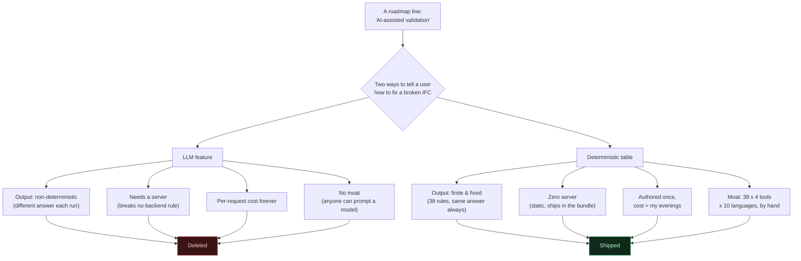

```svg
<svg xmlns="http://www.w3.org/2000/svg" width="1200" height="630" viewBox="0 0 1200 630" role="img" aria-label="I killed my AI-powered validation feature. Here's the boring thing I shipped instead.">
  <rect width="1200" height="630" fill="#0A0A0C"/>
  <g opacity="0.18" stroke="#5E6AD2" stroke-width="1" fill="none">
    <path d="M820 70 L1130 70 L1130 380 L820 380 Z"/>
    <path d="M880 70 L880 380 M940 70 L940 380 M1000 70 L1000 380 M1060 70 L1060 380"/>
    <path d="M820 130 L1130 130 M820 190 L1130 190 M820 250 L1130 250 M820 310 L1130 310"/>
    <path d="M820 70 L1130 380 M1130 70 L820 380"/>
  </g>
  <g opacity="0.5" fill="#5E6AD2">
    <circle cx="880" cy="470" r="3"/><circle cx="940" cy="470" r="3"/><circle cx="1000" cy="470" r="3"/><circle cx="1060" cy="470" r="3"/><circle cx="1120" cy="470" r="3"/>
    <circle cx="880" cy="520" r="3"/><circle cx="940" cy="520" r="3"/><circle cx="1000" cy="520" r="3"/><circle cx="1060" cy="520" r="3"/><circle cx="1120" cy="520" r="3"/>
  </g>
  <text x="80" y="90" fill="#8B5CF6" font-family="Inter, system-ui, sans-serif" font-size="22" font-weight="600" letter-spacing="6">DECISION CASE STUDY</text>
  <text x="80" y="220" fill="#FAFAFA" font-family="Inter, system-ui, sans-serif" font-size="68" font-weight="800" letter-spacing="-1.5">
    <tspan x="80" dy="0">I killed my "AI-powered</tspan>
    <tspan x="80" dy="80">validation" feature.</tspan>
    <tspan x="80" dy="80">I shipped boring instead.</tspan>
  </text>
  <text x="80" y="585" fill="#A1A1AA" font-family="Inter, system-ui, sans-serif" font-size="24" font-weight="500" letter-spacing="0.5">ifcvieweronline.com</text>
  <g transform="translate(1070,560)">
    <circle cx="0" cy="0" r="44" fill="none" stroke="#1F1F26" stroke-width="8"/>
    <circle cx="0" cy="0" r="44" fill="none" stroke="#5E6AD2" stroke-width="8" stroke-linecap="round" stroke-dasharray="207 276" transform="rotate(-90)"/>
    <text x="0" y="11" fill="#5E6AD2" font-family="Inter, system-ui, sans-serif" font-size="34" font-weight="800" text-anchor="middle">75</text>
  </g>
</svg>
```



# I Killed My "AI-Powered Validation" Feature. Here's the Boring Thing I Shipped Instead

The roadmap said "AI-assisted validation." I built it. I looked at the output for about ten minutes. Then I deleted the whole branch.

What I shipped in its place is so boring I'm almost embarrassed to describe it. It's a table. A big, hand-typed table of how to fix things. No model, no inference, no spinner that says "thinking."

It's also far more useful than the AI feature was ever going to be. This is the story of why.

## The temptation was real

I want to be honest about how I got there, because "I was never tempted by AI" would be a lie and you'd smell it.

My tool validates IFC files — the BIM exchange format — entirely in your browser. It runs 38 checks and collapses them into a single Health Score from 0 to 100. Missing properties, duplicate GUIDs, spaces that didn't export, coordinates a mile from the origin. The stuff that looks fine in a viewer and blows up in someone else's.

The score tells you *that* something is wrong. The natural next question is *how do I fix it.* And in 2026, the reflexive answer to "how do I explain something to a user" is: pipe it through a language model.

It demos beautifully. You feed it the issue list, it writes a paragraph, the paragraph sounds like a knowledgeable colleague. I had it working. On a good run it was genuinely impressive.

The problem was the bad runs. And there were a lot of bad runs.

## Why it was slop

Three things killed it. Any one of them would have been enough.

**It was non-deterministic.** Same file, same issue, ask twice, get two different answers. Sometimes it told you to fix duplicate GUIDs in Revit by regenerating element IDs. Sometimes it invented a menu item that doesn't exist. For a *validation* tool — a thing whose entire job is to be trustworthy about correctness — an answer that changes every time you ask is poison. A BIM coordinator can't put "the AI said so, roughly" in a handover contract.

**It needed a server.** My one non-negotiable rule is that the IFC file never leaves your browser. No upload, no account, no backend. That's not a marketing line, it's the architecture — web-ifc runs as WebAssembly, the parsing and validation happen in web workers, nothing transits the network. The second I add an LLM call, I either ship model weights I can't, or I phone home to an API. Either way I've broken the one promise that makes the tool different from everything else.

**It had no moat.** This is the one that actually stung. Any competitor — including buildingSMART's own validator — can wire up the same API in an afternoon. "We also have an AI assistant" is not a position. It's table stakes that cost me money on every request.

## The "model can fix it" daydream

Here's the daydream I had to talk myself out of.

"But the model *understands* IFC. It can reason about a file it's never seen. The table can only cover what I anticipated."

Right. And that's exactly the problem.

The set of validation rules is *finite.* There are 38 of them. I wrote them. Each one fires for a specific, known reason. There is no novel, surprising IFC defect that my table can't anticipate, because the table is generated from the same rules that detect the issue in the first place.

The LLM's "ability to handle the unknown" was solving a problem I don't have, while failing at the problem I do have: giving the same correct answer every time.

[TU EXPERIENCIA: si recuerdas un caso concreto donde el output del LLM inventó un paso o un menú que no existe, descríbelo aquí — un ejemplo real es lo que vende este punto.]

## The boring thing I shipped

So I deleted it and wrote a table.

For each of the 38 rules, I hand-authored how to fix that specific issue in the four tools people actually export from: Revit, ArchiCAD, Tekla, and Allplan. Real menu paths. Real settings. The thing you'd tell a colleague over their shoulder.

Then I translated all of it into 10 languages. By hand, with help, not by piping it through a model — because the menu commands have to be the *literal* localized strings the software shows, and a translation model will happily paraphrase "Project Base Point" into something Revit never says.

That's 38 rules × 4 tools × 10 languages of content. It is the least glamorous artifact I have ever produced.

It is also the thing the AI feature was pretending to be.

## Why boring won

Look at the tradeoff side by side and the AI version stops looking clever.

- **Deterministic.** The fix for "duplicate GUIDs in Revit" is the same today, tomorrow, and on someone else's machine. That's what a validation tool owes you.
- **Zero server.** It's static content. It ships in the bundle. The file still never leaves your browser. Promise intact.
- **No per-request cost.** I paid for it once, in evenings. Marginal cost per user: zero.
- **An actual moat.** Anyone can call an LLM API. Almost nobody is going to hand-write and maintain remediation steps for 38 rules across four authoring tools in ten languages. The grind *is* the defensibility.

The AI feature optimized for the demo. The table optimizes for the moment someone is actually angry at a broken file at 6pm and needs the real answer, the same answer, now.

## Where I'll admit the AI crowd has a point

I'm not anti-AI. I'd be a hypocrite — there's a model in my editor as I type this.

If my problem space were genuinely open-ended — free text, infinite inputs, no enumerable set of outcomes — a table would be the wrong tool and I'd lose to whoever embraced the model. Generation is the right call when the output space is large and fuzzy.

Validation is the opposite. It's finite and it demands repeatability. I picked the technology that fits the shape of the problem instead of the technology that was on the roadmap because it was on everyone's roadmap.

That's the whole lesson, honestly. "AI-powered" is not a feature. It's a means. And for a problem with 38 known answers, it was the wrong means dressed up as an exciting one.

## The honest footnote

One place a server *does* touch my data, and I won't pretend otherwise: when you share a report link, a condensed summary — the score and a stripped issue list, no geometry, no filename — gets server-rendered at the edge so it's crawlable and shows a preview on social. The IFC model still never leaves your browser. But "the summary touches a server" is true, and saying "nothing ever hits a server" would be the exact kind of overclaim I just spent an article complaining about.

## What I'd tell past me

Build the AI version if you want to feel the disappointment yourself — it's a fast way to learn. But then ask the three questions before you ship it: Is it deterministic where it needs to be? Does it break an architectural promise? Could a competitor copy it in an afternoon?

For me the answers were no, yes, yes. So it died, and a table lived.

If you've got an IFC sitting on your drive that looks fine but you don't quite trust, drag your worst one onto [ifcvieweronline.com](https://ifcvieweronline.com) and see what the score says — no upload, no account, and when it flags something, the fix you'll get is the boring, repeatable kind.

*If you build things and keep wrestling with where AI actually belongs versus where it's just hype, follow along — I write these as I make the calls, scars included.*
