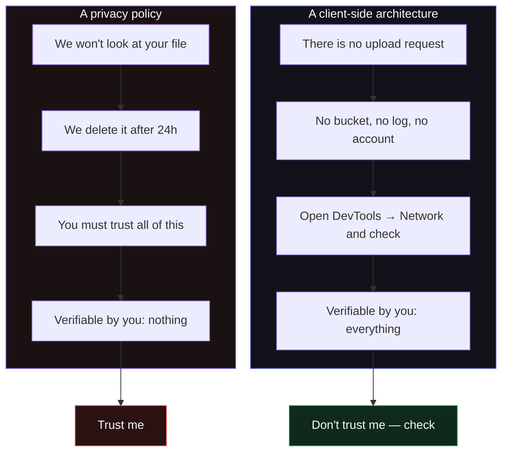

```svg
<svg xmlns="http://www.w3.org/2000/svg" width="1200" height="630" viewBox="0 0 1200 630" role="img" aria-label="You Can't Audit a Promise — Why No Upload Has to Be Architecture">
  <rect width="1200" height="630" fill="#0A0A0C"/>
  <g opacity="0.16" stroke="#5E6AD2" stroke-width="1" fill="none">
    <path d="M820 80 L1120 80 L1120 540 L820 540 Z"/>
    <path d="M820 80 L970 40 L1200 40 L1120 80"/>
    <path d="M1120 540 L1200 500 L1200 40"/>
    <path d="M820 310 L1120 310 M970 80 L970 540"/>
  </g>
  <g opacity="0.22" fill="#5E6AD2">
    <circle cx="860" cy="130" r="3"/><circle cx="930" cy="130" r="3"/><circle cx="1000" cy="130" r="3"/><circle cx="1070" cy="130" r="3"/>
    <circle cx="860" cy="220" r="3"/><circle cx="930" cy="220" r="3"/><circle cx="1000" cy="220" r="3"/><circle cx="1070" cy="220" r="3"/>
    <circle cx="860" cy="410" r="3"/><circle cx="930" cy="410" r="3"/><circle cx="1000" cy="410" r="3"/><circle cx="1070" cy="410" r="3"/>
    <circle cx="860" cy="480" r="3"/><circle cx="930" cy="480" r="3"/><circle cx="1000" cy="480" r="3"/><circle cx="1070" cy="480" r="3"/>
  </g>
  <text x="80" y="92" fill="#8B5CF6" font-family="Inter, system-ui, sans-serif" font-size="22" font-weight="600" letter-spacing="5">TRUST</text>
  <text x="78" y="250" fill="#FAFAFA" font-family="Inter, system-ui, sans-serif" font-size="68" font-weight="800" letter-spacing="-1.5">
    <tspan x="78" dy="0">You Can't Audit</tspan>
    <tspan x="78" dy="82">a Promise</tspan>
    <tspan x="78" dy="82" font-size="38" font-weight="600" fill="#A1A1AA">so I made "no upload" the architecture</tspan>
  </text>
  <text x="80" y="588" fill="#A1A1AA" font-family="Inter, system-ui, sans-serif" font-size="24" font-weight="600" letter-spacing="0.5">ifcvieweronline.com</text>
  <g transform="translate(1070,548)">
    <circle cx="0" cy="0" r="44" fill="none" stroke="#26262B" stroke-width="8"/>
    <circle cx="0" cy="0" r="44" fill="none" stroke="#5E6AD2" stroke-width="8" stroke-linecap="round" stroke-dasharray="188 277" transform="rotate(-90)"/>
    <text x="0" y="11" fill="#5E6AD2" font-family="Inter, system-ui, sans-serif" font-size="32" font-weight="800" text-anchor="middle">68</text>
  </g>
</svg>
```



# You Can't Audit a Promise

Every BIM tool that asks for your file promises to take care of it. "We respect your privacy." "Your data is secure." "Deleted after processing."

I believe most of them mean it. That's not the problem. The problem is that a promise is the one part of a product you can never inspect. You can read the privacy policy. You cannot read the server. You hand over a federated client model and then you *trust* — that no one copies it, that the bucket isn't misconfigured, that the "deleted after 24 hours" cron actually runs, that the company doesn't get acquired by someone with different ideas.

In most software that asymmetry is tolerable. In construction it isn't, and I want to explain why I built the whole tool around refusing to ask for that trust in the first place.

## The file *is* the intellectual property

An IFC isn't a document about a building. For the people I build for, it more or less *is* the building — every wall, duct, room, GUID, quantity, and property set a design team negotiated and agreed to deliver. A federated model can carry several firms' work and sit under an NDA that names none of them out loud.

So when a BIM coordinator considers dragging a client's model into a "free online IFC checker," the question isn't "do I like this tool's features." It's "am I contractually allowed to put this file on a stranger's infrastructure at all." For a lot of real work, the answer is simply no — before features ever enter the conversation.

That single fact reframes privacy from a nice-to-have into a *gate*. A tool that requires an upload isn't slightly less private. For the confidential cases, it's unusable.

## A promise is a liability you're asked to insure

Think about what "we delete your file after processing" actually asks of you.

It asks you to insure, on the client's behalf, against every way that promise could quietly fail: a logging layer that captured the upload, a backup that outlived the deletion, an analytics pipeline that sampled the bytes, a breach two years from now, a change of ownership, a government request, a junior engineer who pulled a copy to "test something." None of those require bad intent. They require an ordinary server doing ordinary server things.

You can't see any of it. The policy is a sentence; the system is a thousand moving parts you'll never be shown. When something does leak, "but their privacy policy said…" is not a defense you get to use with your client.

The honest summary: an upload-based tool converts *their* good intentions into *your* unverifiable risk.

## The constraint that deletes the risk instead of insuring it

So I picked a different rule, and I picked it precisely because it's verifiable: **the IFC file never leaves your browser.**

Not "leaves and gets deleted." Not "leaves encrypted." Doesn't leave. The parsing, the 38 validation rules, the Health Score, the 3D — all of it runs locally, in your tab, on WebAssembly and three web workers, with an OPFS cache so reloads are instant. There is no upload endpoint to point a file at. There is no bucket to misconfigure, no log to subpoena, no account to breach, no retention policy to believe in.

This is the difference that matters: I'm not asking you to trust that I'll handle your file well. I'm building it so I never touch your file at all. You can't leak what you never receive.

And here's the part you can't do with a promise — **you can check.** Open DevTools, go to the Network tab, drop your model in, and watch. There is no request carrying your file. That's not a slogan you have to take on faith; it's an observation you can make in ten seconds against my running site. A privacy policy you have to believe is strictly weaker than a network tab you can read.

## Constraints don't cost you trust. They manufacture it.

The reason this is sturdier than any promise is that it's a *property of the architecture*, not a *commitment of the operator*. Promises depend on the operator continuing to behave. Properties hold even if the operator turns evil, gets bored, or gets bought.

I can't decide one Tuesday to start harvesting uploads, because there are no uploads. A future acquirer can't monetize a data lake that was never filled. The privacy isn't something I maintain with discipline; it's something the shape of the system makes unavailable to me. That's a much better thing to be able to say — *I structurally cannot do the bad thing* beats *I promise I won't.*

That's what people miss about a hard constraint. "The file never leaves the browser" looked, for nine months, like a tax I was paying in WASM headaches and service-worker hacks. What I was actually buying was the ability to make a claim a competitor with a server can't honestly make — not because they're worse people, but because the moment a file lands on your machine, "trust us" is the *only* thing you can offer.

## The honest part: client-side is not zero-trust

I'd be doing the exact thing I'm criticizing if I told you this is magic and there's nothing left to trust. There is. I just want it to be the *small, checkable* kind.

When your file stays in the browser, you're no longer trusting my server with your model — but you are still trusting **the code I serve to your browser.** A client-side app is still software I wrote, running on your data. If I shipped a malicious bundle that *did* phone home, the file would be local right up until the moment my JavaScript decided otherwise. "Client-side" moves the trust boundary; it doesn't delete it.

So let me be precise about what's actually verifiable and what still rests on me:

- **Verifiable by you, right now:** that no request carries your IFC. Network tab, every time you use it.
- **Verifiable in principle:** the viewer/validator core is MIT and open — you (or anyone) can read exactly what it does with the bytes.
- **Still trust in me:** that the bundle you're served matches that open source, that I don't slip something in later. That's a real, ongoing trust. It's just a *narrow* one — "does the served JS match the public code" — instead of the *broad, opaque* one an upload demands ("what does an entire backend you'll never see do with my model, forever").

I'd rather hand you a small trust you can shrink further by reading the source than a large one you can only take on faith.

## The one place a byte does leave — said plainly

There's exactly one exception, and burying it would undercut the entire argument.

You can share a report as a link. For that link to render for a colleague who doesn't have the file — and for a crawler or a Slack unfurl to read it — *something* has to be server-rendered. A stateless Cloudflare edge route at `/r?d=...` does that.

What crosses the edge is **only the derived summary**: the Health Score and a condensed list of issues you already saw on your own screen. No geometry. No filename. No model. The IFC itself never makes the trip. I won't tell you "nothing ever touches a server," because the instant a link has to be crawlable, that's a lie. I'll tell you exactly what does: a score and an issue list, only when you choose to share one.

[TU EXPERIENCIA: el caso real donde "no puedo subir este archivo" te bloqueó de usar una herramienta — el modelo confidencial, la cláusula del NDA, o el cliente que prohibió herramientas online. Una o dos líneas concretas; es la prueba viva de por qué la restricción importa.]

## Why the buyer and the constraint are the same decision

This isn't only an ethics argument; it's why the thing can exist as a product at all.

The person who'd pay to *enforce* model quality is the coordinator who owns conformance. The person who has to *run the check* is the exporter — the architect or engineer handing the model off. That loop only runs if the exporter can drag their nervous, pre-handoff, possibly-NDA'd file into the tool **without filing a ticket with anyone.** An upload box kills that on contact. A network tab that shows nothing leaving keeps it alive.

So the constraint isn't in tension with the business. It *is* the business. The privacy is what makes the file get dropped in, and the file getting dropped in is the whole loop.

## The takeaway

"We care about your privacy" is a promise, and a promise is the one component of any tool you are never allowed to inspect. For data that's under NDA before it's even finished, that's not good enough — not because vendors are villains, but because you can't audit good intentions.

A constraint you can verify beats a promise you must believe. "The file never leaves your browser" is the second kind. Don't take my word for it — that's the entire point.

If you've got a model you're not allowed to upload anywhere — the confidential one, the federated one, the one with three firms' work in it — drag it onto [ifcvieweronline.com](https://ifcvieweronline.com) and open your network tab while you do. Watch nothing leave. Then read the score. And if you find a single request carrying your file, that's a bug, and I want to know about it before you do anything else.
