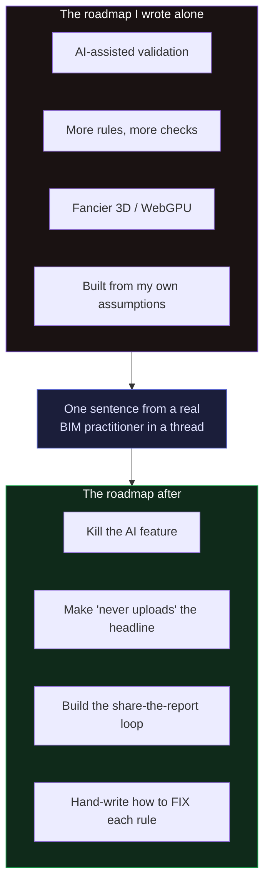

```svg
<svg xmlns="http://www.w3.org/2000/svg" width="1200" height="630" viewBox="0 0 1200 630" role="img" aria-label="One Comment From a Stranger Rewrote My Roadmap">
  <rect width="1200" height="630" fill="#0A0A0C"/>
  <g opacity="0.16" stroke="#5E6AD2" stroke-width="1" fill="none">
    <path d="M820 90 L1130 90 L1130 250 L975 330 L820 250 Z"/>
    <path d="M975 90 L975 330 M820 170 L1130 170"/>
    <path d="M860 370 L1090 370 L1090 520 L975 580 L860 520 Z"/>
    <path d="M975 370 L975 580 M860 445 L1090 445"/>
  </g>
  <g opacity="0.5" fill="#5E6AD2">
    <circle cx="850" cy="120" r="3"/><circle cx="910" cy="120" r="3"/><circle cx="975" cy="120" r="3"/><circle cx="1040" cy="120" r="3"/><circle cx="1100" cy="120" r="3"/>
    <circle cx="850" cy="430" r="3"/><circle cx="910" cy="430" r="3"/><circle cx="975" cy="430" r="3"/><circle cx="1040" cy="430" r="3"/><circle cx="1100" cy="430" r="3"/>
  </g>
  <text x="80" y="92" fill="#8B5CF6" font-family="Inter, system-ui, sans-serif" font-size="22" font-weight="600" letter-spacing="5">FOUNDER STORY</text>
  <text x="78" y="240" fill="#FAFAFA" font-family="Inter, system-ui, sans-serif" font-size="64" font-weight="800" letter-spacing="-1.5">
    <tspan x="78" dy="0">One comment from a</tspan>
    <tspan x="78" dy="78">stranger rewrote my</tspan>
    <tspan x="78" dy="78">whole roadmap.</tspan>
  </text>
  <text x="80" y="568" fill="#A1A1AA" font-family="Inter, system-ui, sans-serif" font-size="24" font-weight="500" letter-spacing="0.5">I had zero users at the time · ifcvieweronline.com</text>
  <g transform="translate(1075,548)">
    <circle cx="0" cy="0" r="44" fill="none" stroke="#26262B" stroke-width="8"/>
    <circle cx="0" cy="0" r="44" fill="none" stroke="#8B5CF6" stroke-width="8" stroke-linecap="round" stroke-dasharray="196 277" transform="rotate(-90)"/>
    <text x="0" y="11" fill="#8B5CF6" font-family="Inter, system-ui, sans-serif" font-size="32" font-weight="800" text-anchor="middle">71</text>
  </g>
</svg>
```



# One Comment From a Stranger Rewrote My Roadmap

I want to tell this story with the embarrassing number left in, because the number is the point: at the time this happened, my project had roughly zero users. No traction to protect, no community to consult. Just me, a side project, and a roadmap I'd written entirely inside my own head.

That roadmap was confident. It was also mostly wrong, and I didn't find out from a metric. I found out from one comment, written by someone who has no idea they changed anything.

## The roadmap I invented alone

Here's what I'd convinced myself to build, in order, with the certainty that only comes from never having shown the thing to a real user:

- **AI-assisted validation.** Obviously. It was 2026; everything had an AI feature; mine would too.
- **More rules.** If 38 checks were good, 60 would be better. Coverage as a virtue.
- **Fancier rendering.** WebGPU, point clouds, the works. Make the 3D pop.

Notice what every item has in common. Each one is a thing *I* found interesting to build. None of them came from watching a single person try to do their actual job. I was optimizing for the version of the product that was fun to work on, dressed up as a plan.

This is the classic solo-dev failure and I walked straight into it: with no users, the loudest voice in the room is your own, and your own voice mostly wants to build cool stuff.

## Where the comment came from

I wasn't doing formal user research. I was doing the cheap version: reading. Lurking in the places where BIM people complain to each other — the BIM subreddits, the openBIM forums, the GitHub issues on IFC tooling, the threads where someone posts a model that "looks fine but the client rejected it." I was mining real pain instead of guessing at it.

And in one of those threads, somebody who clearly does this for a living said something offhand. Not to me. Not about my tool. Just venting about their week.

[TU EXPERIENCIA: el comentario REAL — copia la frase (o parafraséala fielmente) y di dónde la viste (r/bim, r/Revit, OSArch, un issue de GitHub). Lo concreto es lo que hace creíble toda la pieza: la voz exacta de un practicante real diciendo el problema en sus propias palabras.]

It landed wrong in the best way. Because it didn't match the roadmap at all. The thing this person was actually angry about wasn't a missing feature on my list. It was something I'd quietly assumed was already solved, or didn't matter, or was somebody else's job.

## What the comment exposed

The sentence was small. What it revealed wasn't.

It told me the real pain wasn't *detecting more kinds of problems* — it was the workflow around the problems people already knew they had. They didn't need me to be cleverer at finding defects. They needed to be able to **catch a defect before a client did, on a file they weren't allowed to upload anywhere, and then hand someone a thing that says "fix this, here's how."**

Read my roadmap against that and it falls apart:

- "AI-assisted validation" was solving *novelty* — handling defects nobody anticipated. But the comment was about a defect everyone anticipates and still ships. Wrong problem.
- "More rules" was adding *detection* to someone who was already drowning in detection and starving for *resolution*.
- "Fancier 3D" was polishing the exact surface — the pretty render — that *hides* the failures the comment was about. I'd have been making the lie more convincing.

One real sentence outranked three features I'd been sure about. That's not a knock on my judgment specifically; it's the whole reason you talk to users. The inside of your own head is a hall of mirrors. One outside voice breaks it.

## What I actually changed

I didn't pivot the company. I had no company. I re-pointed the work, and the redirect was sharp:

**I killed the AI validation feature.** I'd built it. The output was non-deterministic — same model, different wording, occasionally different conclusions — it needed a server (which broke my one hard rule that the file never leaves your browser), and it had no moat. The comment made it obvious I was polishing the wrong thing. So I deleted the branch.

**I made "the file never leaves your browser" the headline, not a footnote.** The comment reframed privacy from a feature into *the unlock*. The person with the broken file couldn't run it through anything that demanded an upload. Client-side wasn't a nice property; it was the only reason they could use the tool at all. So I stopped treating "no upload" as a checkbox and started treating it as the entire pitch.

**I built the loop instead of more rules.** The real job wasn't "find more issues." It was: a coordinator shares a report, the person who exported the model opens it, sees the score, fixes the data, re-shares. So I built the shareable report and pointed everything at that loop — the thing that turns a check into a handoff.

**I replaced the AI feature with the most boring thing I've ever made:** a hand-written table of how to fix each of the 38 rules in Revit, ArchiCAD, Tekla, and Allplan, in ten languages. The comment wanted *resolution*, not more *detection*. A deterministic "here's how to fix it" beats a confident-sounding paragraph that changes every time you ask.

Every one of those came from a sentence somebody wrote without knowing I existed.

## The uncomfortable lesson about zero users

The instinct, when you have no users, is to wait until you have some before you let anyone influence the plan. "I'll do customer research once there's a product worth researching." That's backwards, and this taught me why.

When you have zero users, you have zero counter-pressure to your own assumptions, which is *exactly* when your roadmap is most likely to be fiction. The cost of being wrong is also at its lowest — there's nothing built on top of the bad decisions yet. So the pre-traction phase is the cheapest time to be corrected and the time you're least likely to seek it out. I got lucky that I was reading at all.

You don't need a user base to get this. You need to go where your users already complain and *take one of them at their word over yourself.* I had no analytics, no interviews, no signups. I had a thread and the humility — eventually — to believe a stranger over my own plan.

## The honest caveats, because this isn't a fairy tale

One comment is a signal, not a mandate. I didn't rebuild the entire product around a single sentence; I used it to *re-rank* things I was already unsure about, and then I went looking for whether other practitioners said the same shape of thing. (They did. The pain was everywhere once I knew to look for it.) A sample size of one tells you where to look, not what to conclude.

And I'll be straight about where I still don't know if I'm right: I've bet the roadmap on a workflow loop that, as I write this, barely anyone has run yet. The comment told me the *problem* is real. It can't tell me my *solution* will get adopted. That part is still unproven, and I'm not going to dress up a hunch as validation — that would be the same self-deception that wrote the original roadmap.

The model still never leaves your browser, by the way — and I'll keep the one honest asterisk I always keep: if you *share* a report, only the derived summary (the score and a condensed issue list, no geometry, no filename) transits an edge worker so the link is readable by someone without the file. The roadmap changed. That line didn't.

## If you're building something nobody uses yet

Go read where your users complain. Not your reviews — you don't have any. *Their* threads, the ones that have nothing to do with you. Then find the one sentence that contradicts your plan and sit with the discomfort instead of explaining it away.

The roadmap you wrote alone is a story you told yourself. One real practitioner, venting on a Tuesday, will tell you a truer one for free.

If you work with IFC and something about your handoffs has been quietly broken for years — the kind of thing you'd vent about in a thread — drag your worst file onto [ifcvieweronline.com](https://ifcvieweronline.com) and see what it says. Nothing uploads. And if it gets the problem *wrong*, tell me — wrong-but-specific feedback from someone who does this for real is, as this whole post is about, worth more than anything I'd come up with alone.
