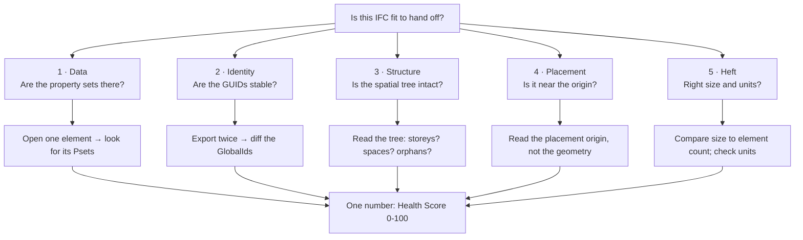

```svg
<svg xmlns="http://www.w3.org/2000/svg" width="1200" height="630" viewBox="0 0 1200 630" role="img" aria-label="How to Tell if an IFC File Is Any Good — A Field Guide">
  <rect width="1200" height="630" fill="#0A0A0C"/>
  <g opacity="0.16" stroke="#5E6AD2" stroke-width="1" fill="none">
    <path d="M820 60 L1140 60 L1140 250 L980 330 L820 250 Z"/>
    <path d="M980 60 L980 330 M820 155 L1140 155"/>
    <path d="M850 360 L1110 360 L1110 540 L980 590 L850 540 Z"/>
    <path d="M980 360 L980 590 M850 450 L1110 450"/>
  </g>
  <g opacity="0.22" fill="#5E6AD2">
    <circle cx="850" cy="100" r="3"/><circle cx="915" cy="100" r="3"/><circle cx="980" cy="100" r="3"/><circle cx="1045" cy="100" r="3"/><circle cx="1110" cy="100" r="3"/>
    <circle cx="850" cy="200" r="3"/><circle cx="915" cy="200" r="3"/><circle cx="980" cy="200" r="3"/><circle cx="1045" cy="200" r="3"/><circle cx="1110" cy="200" r="3"/>
  </g>
  <text x="80" y="92" fill="#8B5CF6" font-family="Inter, system-ui, sans-serif" font-size="22" font-weight="600" letter-spacing="5">FIELD GUIDE</text>
  <text x="78" y="248" fill="#FAFAFA" font-family="Inter, system-ui, sans-serif" font-size="62" font-weight="800" letter-spacing="-1">
    <tspan x="78" dy="0">How to Tell if an</tspan>
    <tspan x="78" dy="76">IFC File Is Any Good</tspan>
    <tspan x="78" dy="76" font-size="38" font-weight="600" fill="#A1A1AA">the five things that quietly break</tspan>
  </text>
  <text x="80" y="592" fill="#A1A1AA" font-family="Inter, system-ui, sans-serif" font-size="24" font-weight="600" letter-spacing="0.5">ifcvieweronline.com</text>
  <g transform="translate(1058,520)">
    <circle cx="0" cy="0" r="52" fill="none" stroke="#26262B" stroke-width="8"/>
    <circle cx="0" cy="0" r="52" fill="none" stroke="#5E6AD2" stroke-width="8" stroke-linecap="round" stroke-dasharray="229 327" transform="rotate(-90)"/>
    <text x="0" y="12" fill="#5E6AD2" font-family="Inter, system-ui, sans-serif" font-size="34" font-weight="800" text-anchor="middle">70</text>
  </g>
</svg>
```



# How to Tell if an IFC File Is Any Good: A Field Guide

Here is the single most expensive misconception in openBIM: *if it looks right in the viewer, it's right.*

It isn't. An IFC can render flawlessly — every wall in place, every level correct, spinning beautifully — and be quietly, structurally broken in ways the 3D will never show you. The viewer draws the geometry. Almost everything that actually breaks an IFC handoff lives in the parts that aren't geometry.

This is a field guide to those parts. Whether you're about to *send* a model or you just *received* one you didn't make, there are five places where an IFC goes bad. Each has a symptom that gives it away and a check you can run in minutes. Learn to read these five and you'll catch problems while they're still a five-minute fix — instead of after your client turns them into an RFI.

Keep it as a checklist. I'll keep it updated.

## Why "looks fine" is a trap

The reason this misconception is so durable is that the failures are *invisible by construction.*

The viewer's job is to render geometry. Missing properties have no geometry. A churned GUID has no geometry. A room that didn't export, an element filed under the wrong storey, a model sitting four kilometres from origin that the viewer helpfully auto-framed for you — none of those change a single triangle you can see. So you orbit the model, everything looks great, and you ship a file whose *information* is broken while its *picture* is perfect.

The discipline this whole guide is built on: **read the IFC as an IFC** — the entities, the tree, the data — not as a pretty mesh. The picture is the one view guaranteed to hide the defect.

## Failure 1 — Data: the properties didn't make the trip

**The symptom.** Downstream, elements are fully shaped but their property panels are bare. Schedules come back blank. The receiving model checker reports "missing required property" against half your walls. Geometry: perfect.

**What's happening.** The authoring tool didn't export the parameters you assumed it would. Revit only writes the property sets your IFC Export Setup maps; a shared parameter that isn't in the mapping lives in Revit and never gets written to the IFC. The value exists on your screen and nowhere in the file.

**The check.** Open one representative element — a wall, a door — and look for its property sets. If `Pset_WallCommon` is empty or absent, the mapping didn't run the way you thought, and one well-chosen element tells you the whole batch is wrong. You don't inspect 4,000 elements; you inspect one and infer the export setting.

This is the quietest of the five because nothing looks wrong until someone needs the data.

## Failure 2 — Identity: the GUIDs won't sit still

**The symptom.** Revision two lands and the coordinator's diff tool thinks the entire model is new — thousands of "deletions" of elements that are visibly still there, plus thousands of "additions." Every BCF issue pinned to an element now points at nothing.

**What's happening.** A `GlobalId` is supposed to be an element's permanent identity across its whole life. But copying elements, deleting and recreating them, round-tripping through another format, or flipping an exporter setting can all quietly mint *new* GUIDs for the same physical thing. The geometry is identical; the identity rolled over. (Don't confuse this with the Express ID — the `#1432` line number — which was never meant to survive an export and should never be used to match elements between files.)

**The check.** Export twice without touching the model in between, then diff the `GlobalId`s. If a meaningful chunk changed across two identical exports, your IDs are unstable and no downstream workflow can trust them. This is the one failure you can *only* catch by comparing two files — a single file looks fine.

## Failure 3 — Structure: the spatial tree is broken

**The symptom.** "What's on level 3?" returns garbage. By-storey filters and quantity takeoffs are wrong. Or the rooms are simply *gone* — areas and occupancy data evaporated.

**What's happening.** IFC isn't a bag of geometry; it's a hierarchy — project → site → building → storey → element. Every physical thing should be *contained* by that structure. Two ways it breaks: elements land at the building/site root instead of a storey (right place visually, wrong container), or `IfcSpace` never exported at all (Revit Rooms only become `IfcSpace` if you tick the option and the rooms are bounded and placed).

**The check.** Read the spatial tree, not the model. Are all your storeys present? Is anything sitting directly under the building or site instead of a level? Did any `IfcSpace` make it across? Thirty seconds in a tree view answers all three — and the 3D will look totally fine either way, because rooms were never visible geometry to begin with.

## Failure 4 — Placement: it's nowhere near the origin

**The symptom.** You open the export and see nothing, or a horizon-line of clipping artefacts. Or it federates against a partner model and the two won't share a viewport.

**What's happening.** The project base point, survey point, and "export coordinate system" setting didn't agree, so the model is sitting thousands of metres or kilometres from the origin. Far-from-origin coordinates wreck floating-point precision: geometry jitters, z-fights, clips.

**The check.** Don't judge by where the geometry *appears* — a viewer may auto-frame and hide it completely. Read the *placement origin numbers*. If your model's base sits at coordinates with six or seven significant digits when it should be near zero, that's your bug, however nicely it framed up on screen.

## Failure 5 — Heft: wrong size, wrong units

**The symptom.** The file is implausibly large for its element count and chokes machines and CDE uploads — or, the sneaky version, the model imports at 1/1000th scale or 1000× too big because someone exported in millimetres into a metres workflow.

**What's happening.** Two unrelated things share this slot. Bloat usually means over-tessellated geometry, no instancing of repeated objects, or exporting *everything* (2D, links, fabrication detail) — fixable per tool, but watch the trap where stripping data to shrink the file also deletes the properties the contract needs. The unit problem is `IfcUnitAssignment` not matching what the recipient expects; it's rare but spectacular when it bites.

**The check.** Sanity-check the file size against the element count (a few hundred thousand simple elements should not be a gigabyte), and confirm the length unit is what the recipient expects. If a slim re-export is the goal, verify it still carries the required data — smaller and broken is worse than big.

## The thing all five have in common

Notice the pattern. Every one of these is invisible in the render and visible the moment you read the file as data. And every one of them costs about five minutes if *you* find it and an RFI — plus a dent in a client relationship — if *they* do. Same defect, wildly different price, decided entirely by who looks first.

That asymmetry is the whole argument for checking before you send. The author who validates by looking at their authoring tool is using the one instrument guaranteed to hide all five failures.

## Collapsing five checks into one number

Running five manual inspections on every handoff is more discipline than most people sustain. So the tool I built runs them — 38 deterministic rules covering all five families — and collapses the result into a single **Health Score from 0 to 100**, drawn as a ring.

A model with 4 issues and a model with 4,000 both come out as one number, on a diminishing-returns curve, because IFC defects are *systematic*: if the exporter didn't write materials for one wall, it didn't write them for all 5,000, and that's one problem to fix, not 5,000. The score is severity-weighted, so a handful of nasty problems hurts more than a thousand cosmetic ones, and the issue list underneath is ranked so the top row is the single biggest drag on your number — *fix that first.*

It runs **100% in your browser.** The IFC never leaves your machine — no upload, no account — which matters because the files most worth checking are exactly the confidential ones you can't put on a stranger's server. (The one honest asterisk: if you *share* a report link, only the derived summary — score plus a condensed issue list, no geometry, no filename — transits an edge worker so the link is readable by someone without the file. The model stays in your tab.)

And when it flags a rule, it doesn't hand you AI prose. It hands you a hand-written fix for that exact issue in Revit, ArchiCAD, Tekla, or Allplan — because the question after "what's wrong" is always "how do I fix it."

## What a number can't tell you

I won't oversell the score, because the honest limit is part of the field guide.

A high Health Score means the file is *well-formed and complete* against 38 rules. It does **not** mean the model is *correct* — that it describes the right building, with the right design, meeting the actual brief. Validation checks that the data is there and structurally sound; it cannot check that the data is *true*. And there's no universal pass mark: conformance is a contract (since 2024 that contract has a name — IDS, the buildingSMART standard for "deliver exactly this information"), so a 78 that's fine for coordination can be a fail for a tender handover.

The score's job is to make you *look*, and to tell you what to fix first. The contract is between you and your client. Treat the number as a floor you clear before the conversation, not a verdict that ends it.

## Further reading (the deep dives)

This guide is the map; each failure has its own territory:

- **The four ways a Revit export breaks, in detail** → [ifcvieweronline.com/blog/revit-ifc-export-breaks](https://ifcvieweronline.com/blog/revit-ifc-export-breaks)
- **Why GUIDs change on every export, and how to keep them stable** → [ifcvieweronline.com/blog/ifc-guids-changing-every-export](https://ifcvieweronline.com/blog/ifc-guids-changing-every-export)
- **Why your IFC is enormous, and how to shrink it without breaking it** → [ifcvieweronline.com/blog/reduce-ifc-file-size](https://ifcvieweronline.com/blog/reduce-ifc-file-size)
- **The free IFC viewers compared, including where mine loses** → [ifcvieweronline.com/blog/free-online-ifc-viewers-compared](https://ifcvieweronline.com/blog/free-online-ifc-viewers-compared)
- **Building the browser pipeline yourself (web-ifc + Fragments)** → [ifcvieweronline.com/blog/view-ifc-web-threejs-fragments](https://ifcvieweronline.com/blog/view-ifc-web-threejs-fragments)

## The one-paragraph version

If it looks fine in the viewer, that tells you about the geometry and nothing else. Before you trust an IFC — yours or one you received — read it as data: are the properties there, are the GUIDs stable, is the spatial tree intact, is it near the origin, and is it a sane size in the right units? Five checks. The version of you that runs them ships clean files. The version that doesn't ships RFIs.

Take the file you trust least — the one that exported weird, or the one a client sent that you have to build on — and drag it onto [ifcvieweronline.com](https://ifcvieweronline.com). Nothing uploads; you'll have the score and the ranked issue list in seconds. Run it before the person downstream does.
