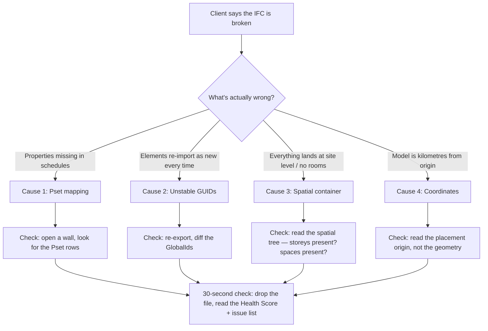

```svg
<svg xmlns="http://www.w3.org/2000/svg" width="1200" height="630" viewBox="0 0 1200 630" role="img" aria-label="Why Your Revit IFC Export Breaks — and the 30-Second Check That Catches It">
  <rect width="1200" height="630" fill="#0A0A0C"/>
  <g opacity="0.16" stroke="#5E6AD2" stroke-width="1" fill="none">
    <path d="M820 0 V630 M900 0 V630 M980 0 V630 M1060 0 V630 M1140 0 V630"/>
    <path d="M820 90 H1200 M820 180 H1200 M820 270 H1200 M820 360 H1200 M820 450 H1200 M820 540 H1200"/>
  </g>
  <g fill="#5E6AD2" opacity="0.5">
    <circle cx="900" cy="180" r="3"/><circle cx="980" cy="270" r="3"/><circle cx="1060" cy="180" r="3"/>
    <circle cx="1140" cy="360" r="3"/><circle cx="900" cy="450" r="3"/><circle cx="1060" cy="450" r="3"/>
  </g>
  <text x="80" y="92" fill="#8B5CF6" font-family="Inter, system-ui, sans-serif" font-size="22" font-weight="600" letter-spacing="6">REVIT · IFC PLAYBOOK</text>
  <text x="80" y="250" fill="#FAFAFA" font-family="Inter, system-ui, sans-serif" font-size="62" font-weight="800" letter-spacing="-1">
    <tspan x="80" dy="0">Why Your Revit IFC</tspan>
    <tspan x="80" dy="74">Export Breaks — and</tspan>
    <tspan x="80" dy="74">the 30-Second Check</tspan>
  </text>
  <text x="80" y="588" fill="#A1A1AA" font-family="Inter, system-ui, sans-serif" font-size="24" font-weight="500">ifcvieweronline.com</text>
  <g transform="translate(1060,540)">
    <circle r="52" fill="none" stroke="#5E6AD2" stroke-width="6" opacity="0.25"/>
    <circle r="52" fill="none" stroke="#5E6AD2" stroke-width="6" stroke-linecap="round" stroke-dasharray="245 327" transform="rotate(-90)"/>
    <text x="0" y="10" fill="#5E6AD2" font-family="Inter, system-ui, sans-serif" font-size="34" font-weight="700" text-anchor="middle">61</text>
  </g>
</svg>
```



Your IFC looks perfect in Revit. You orbit it, the walls are there, the levels are right, you hit export and send it.

Your client opens it three days later and half the properties are gone. Fire ratings, types, the data their model checker keys on — empty. Now it's an RFI, and the RFI has your name on it.

I've shipped that exact file. The maddening part is that nothing looked wrong on my screen, because Revit shows you *its* model, not the IFC you handed over.

This is the short version of what actually breaks, and how to catch each one in about thirty seconds — without reopening Revit.

## "Broken" is four different bugs wearing the same word

When someone says "the export is broken," they almost never mean the geometry corrupted. The triangles are fine. What broke is one of four things, and each one has a different fingerprint:

1. Property sets didn't map, so the data is missing.
2. GUIDs changed, so nothing tracks between revisions.
3. The spatial container is wrong, so elements aren't filed under a storey — or rooms vanished entirely.
4. The model sits kilometres from origin, so it loads as an empty scene or fights every federation.

Guessing which one bit you is the trap. The point of this playbook is to *read the symptom* and go straight to the cause.

## Cause 1: Pset mapping — the data is there, until it isn't

This is the silent one. Geometry exports clean, so you never suspect it.

What happened: Revit doesn't export every parameter by default. It exports what your *IFC Export Setup* tells it to — via the property set mapping file (the `IFCExportConfiguration`, plus whatever mapping table you point it at). If a shared parameter isn't in that mapping, or you used the wrong setup, the value lives in Revit and never makes the trip.

How it looks downstream: the element is there, fully shaped, but its property panel is bare. Schedules in the receiving tool come back blank. The model checker reports "missing required property" against half your walls.

The reason it slips through: in Revit you see the live parameter. In the IFC, that parameter was never written. Same screen would never show you the difference.

The fast tell: open one representative element — a wall, a door — and look for its Psets. If `Pset_WallCommon` is empty or absent, mapping didn't run the way you thought. You don't need to inspect 4,000 elements; one well-chosen element tells you the export setup was wrong for the whole batch.

## Cause 2: GUIDs — every export is a fresh stranger

This one doesn't hurt you. It hurts the coordinator on the receiving end, which is worse, because they're the one with the authority to bounce your file.

A GlobalId is supposed to be the stable identity of an element across its life. Revit *can* keep it stable. But certain edits — copying elements, group edits, some round-trips, regenerating after a model surgery — quietly mint new GUIDs.

[TU EXPERIENCIA: describe el caso real donde los GUIDs cambiaron entre dos exports — qué edición lo provocó y cómo lo descubriste]

The damage shows up on revision two. The coordinator imports your update, and instead of recognising 3,000 existing elements and changing 12, their tool sees 3,000 brand-new elements and 3,000 deletions. Every issue, every clash comment, every annotation pinned to the old IDs is now orphaned. They have to re-coordinate from scratch.

The fast tell: export twice without touching the model in between, then diff the GlobalIds. If a meaningful chunk changed across two identical exports, your IDs are unstable and no downstream workflow can trust them. You will not catch this by looking at one file — you catch it by comparing two.

## Cause 3: Spatial container — elements with no home, rooms that ghosted

IFC isn't a bag of geometry. It's a hierarchy: project → site → building → storey → element. Every physical thing is supposed to be *contained* by a spatial structure. Break that link and tools that walk the tree — quantity takeoff, code checking, anything that asks "what's on level 3" — get nothing useful.

Two flavours of this break:

Elements land at the wrong level, or at the building/site root instead of a storey. The geometry is in the right place visually, but it's filed under the wrong container, so by-storey filters and takeoffs are wrong.

Spaces (rooms) simply didn't export. Revit Rooms become `IfcSpace` only if you tick the option and the rooms are bounded and placed. Miss that, and your areas, occupancy, and room data evaporate — and again, the 3D looks totally fine because rooms were never visible geometry anyway.

The fast tell: read the spatial tree, not the model. Are all your storeys present? Is anything sitting directly under the building or site instead of a level? Did any `IfcSpace` make it across at all? Thirty seconds in a tree view answers all three.

## Cause 4: Coordinates far from origin — the empty-scene trap

You open the export and the viewer shows… nothing. Or a horizon-line of clipping artefacts. Geometry's fine; it's just sitting 6,000 kilometres from the origin because the project base point, survey point, and the "export coordinate system" setting didn't agree.

Far-from-origin coordinates wreck floating-point precision, so geometry jitters, z-fights, or clips. Federate that against a model authored near origin and the two won't even share a viewport.

The fast tell — and this is the one people get wrong — don't judge by where the geometry *appears*. A viewer may auto-frame and hide the problem. Read the *placement origin* numbers. If your model's base sits at coordinates with six or seven significant digits when it should be near zero, that's your bug, regardless of how nicely it framed up on screen.

## The 30-second check: stop sending files you haven't read

Here's the workflow shift. The reason all four bugs ship is that the author validates by *looking at Revit*, and Revit is the one tool guaranteed to hide them. You have to read the IFC as the IFC — the thing your client will actually open.

You can do that without installing a desktop checker, without an account, and without uploading anything. Drag the exported file into a browser-based viewer that runs the file locally, reads the actual IFC entities, and reports back:

- Are the property sets populated, on real elements?
- Are the GUIDs stable across exports?
- Is the spatial tree intact — storeys present, spaces present, nothing orphaned?
- Is the placement near origin?

The version I built collapses all 38 of its checks into one number — a Health Score from 0 to 100. A file with 4 issues and a file with 4,000 both come back as a single figure, severity-weighted on a diminishing-returns curve, so a handful of nasty problems hurts more than a thousand cosmetic ones. The point isn't the number for its own sake; it's that you get a *go / no-go* read before you hit send, and a ranked list of what to fix first.

That's the difference between you finding the missing Psets and your client finding them. One is a thirty-second fix. The other is an RFI, a delay, and a dent in the relationship you spent a year building.

## Where this fits in honest territory

A fair question: doesn't buildingSMART's official validator do this now? It went GA in 2026 and it's genuinely good at what it does — schema conformance. But it requires an upload and an account, caps at 250 MB, has no 3D viewer, no single score, and won't tell you *how* to fix anything. It answers "is this valid IFC," not "is this file fit to send."

And most free desktop IFC viewers are Windows-only apps you have to install. Mine runs in the browser and the file never leaves your machine — the only thing that ever touches a server is a derived summary, *if* you choose to share a report link. No geometry, no filename. I'd rather be straight about that than pretend nothing ever touches the network.

So this isn't a pitch to switch tools. It's a habit: read the IFC before you send the IFC.

If you want to try it, throw your worst, weirdest, most-argued-about export at it and see what the score says: **[ifcvieweronline.com](https://ifcvieweronline.com)**. If it catches something Revit hid from you, that's the whole point — and I'd genuinely like to hear what it found.
