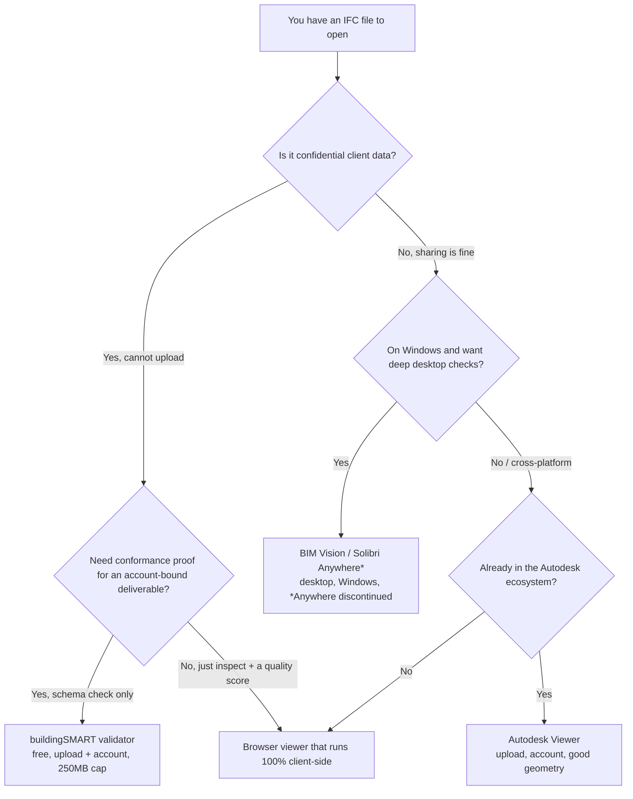

```svg
<svg xmlns="http://www.w3.org/2000/svg" width="1200" height="630" viewBox="0 0 1200 630">
  <rect width="1200" height="630" fill="#0A0A0C"/>
  <g opacity="0.16" stroke="#5E6AD2" stroke-width="1" fill="none">
    <path d="M820 90 L1120 90 L1120 540 L820 540 Z"/>
    <path d="M820 90 L970 30 L1200 30 L1120 90"/>
    <path d="M1120 540 L1200 480 L1200 30"/>
    <path d="M820 240 L1120 240 M820 390 L1120 390 M970 90 L970 540 M1045 90 L1045 540"/>
  </g>
  <g opacity="0.5" fill="#5E6AD2">
    <circle cx="860" cy="130" r="3"/><circle cx="935" cy="130" r="3"/><circle cx="1010" cy="130" r="3"/><circle cx="1085" cy="130" r="3"/>
    <circle cx="860" cy="280" r="3"/><circle cx="935" cy="280" r="3"/><circle cx="1010" cy="280" r="3"/><circle cx="1085" cy="280" r="3"/>
    <circle cx="860" cy="430" r="3"/><circle cx="935" cy="430" r="3"/><circle cx="1010" cy="430" r="3"/><circle cx="1085" cy="430" r="3"/>
  </g>
  <text x="80" y="92" fill="#8B5CF6" font-family="Inter, system-ui, sans-serif" font-size="22" font-weight="600" letter-spacing="5">COMPARISON</text>
  <text x="76" y="250" fill="#FAFAFA" font-family="Inter, system-ui, sans-serif" font-size="66" font-weight="800">
    <tspan x="76" dy="0">Free Online IFC Viewers</tspan>
    <tspan x="76" dy="80">in 2026, Compared</tspan>
    <tspan x="76" dy="80" font-size="40" font-weight="600" fill="#A1A1AA">by someone who built one</tspan>
  </text>
  <text x="80" y="588" fill="#A1A1AA" font-family="Inter, system-ui, sans-serif" font-size="24" font-weight="600" letter-spacing="1">ifcvieweronline.com</text>
  <g transform="translate(1060,540)">
    <circle cx="0" cy="0" r="44" fill="none" stroke="#2A2A33" stroke-width="8"/>
    <circle cx="0" cy="0" r="44" fill="none" stroke="#5E6AD2" stroke-width="8" stroke-linecap="round" stroke-dasharray="207 276" transform="rotate(-90)"/>
    <text x="0" y="11" fill="#5E6AD2" font-family="Inter, system-ui, sans-serif" font-size="30" font-weight="800" text-anchor="middle">74</text>
  </g>
</svg>
```



I built one of these. So take everything below with a grain of salt.

But I went looking for the comparison I'm about to write before I started building, couldn't find an honest one, and the dishonest ones cost me a week of going down wrong roads. So here it is — including the parts where my own tool loses.

### The actual problem, not the feature list

An IFC opens fine in the viewer. The geometry looks right. You rotate it, it spins, everyone nods.

Then your client opens it and the spaces didn't export, half the elements are missing the property set the contract asked for, the GUIDs changed since last week so their diff tool thinks the whole model is new, and the building is sitting four kilometres from the origin.

If you catch that yourself, it's a ten-minute fix. If your client catches it, it's an RFI, and an RFI on a deliverable erodes trust in a way that's hard to win back.

So the real question isn't "which viewer renders the prettiest mesh." It's "which one tells me my file is broken before my client does, without me having to email the file to a stranger's server."

That reframing kills about half the tools on sight.

### The friction table

Here's what actually matters when you're choosing, scored honestly.

| Tool | Runs in browser | Upload required | Account | Size cap | 3D viewer | Validation | OS | Price |
|---|---|---|---|---|---|---|---|---|
| **buildingSMART validator** | Yes | Yes (file leaves browser) | Yes | ~250 MB | No | Schema conformance + IDS | Any | Free |
| **Autodesk Viewer** | Yes | Yes (file leaves browser) | Yes | Large | Yes (good) | None | Any | Free |
| **BIM Vision** | No (desktop) | No | No | None practical | Yes (good) | Windows only | Free |
| **Solibri Anywhere** | No (desktop) | No | Varies | None practical | Some (limited) | Windows/Mac | Free — *being discontinued* |
| **Mine (ifcvieweronline.com)** | Yes | **No (file never leaves browser)** | No | Browser memory, not a hard cap | Yes | 38 rules → one Health Score | Any | Free (open-core) |

A few of those cells deserve a footnote, because the headline "free" hides the friction that actually wastes your afternoon.

### buildingSMART's validator is the big 2026 news, and it's narrower than the headlines

This is the one that changed the landscape. buildingSMART shipped their **official** validator to general availability in 2026. Free, vendor-neutral, and it's the closest thing the industry has to a referee. If a contract specifies IDS — which became the official buildingSMART standard back in 2024, basically "a contract that says deliver exactly this information" — this is where you prove conformance.

I'm not going to pretend mine competes with that. It doesn't. For the official stamp, use the official tool.

But know what you're getting. It checks **schema conformance** — is this valid IFC, does it satisfy the IDS — and that's it. You have to **upload** the file. You need an **account**. There's a **~250 MB cap**. There's **no 3D viewer**, so you can't see the thing you're validating. There's **no single score** you can hand to a non-technical PM, and **no remediation** — it'll tell you something is wrong, not how to fix it in Revit.

So it's authoritative and narrow. Great as a referee. Awkward as a daily driver.

### Autodesk Viewer is the safe default, and that's the problem

Autodesk Viewer renders IFC well. The geometry handling is better than mine in places — I'll come back to that. If you're already in the Autodesk world, it's the path of least resistance.

The friction is the same shape as buildingSMART's: you **upload** the file, you need an **account**, and your model now lives on someone else's infrastructure. No validation to speak of. It's a viewer, full stop. It shows you the model is there; it doesn't tell you the model is *correct*.

For a lot of confidential client work, "upload to Autodesk" is a non-starter before you even get to features.

### The desktop tools are good and stuck on Windows

BIM Vision is genuinely good. No upload, no account, no size anxiety, solid checking. I have nothing bad to say about it except the thing you already noticed: **it's a Windows desktop app.** If you're on a Mac, on a locked-down machine, or you just got the file on your phone twenty minutes before a call, it's not an option.

Solibri Anywhere was the other free desktop name people reached for. The catch is that it's **being discontinued**, which is exactly the situation that sent a lot of people looking for a browser tool in the first place. Building your workflow on a tool that's sunsetting is its own kind of risk.

[TU EXPERIENCIA: si tienes una anécdota real de haber dependido de Solibri Anywhere o BIM Vision y haberte quedado tirado en un Mac / máquina bloqueada, cuéntala aquí en una o dos líneas concretas.]

### What I built, and why

Mine runs **100% in the browser.** The IFC file never leaves your machine — no upload, no server, no account. It parses with web-ifc compiled to WebAssembly, renders with Three.js on top of @thatopen/components, and the whole thing is free on GitHub Pages. The core is MIT; only the cloud bits are proprietary.

Then it runs **38 validation rules** and collapses them into one number: a **Health Score from 0 to 100**, drawn as a ring. A model with 4 issues and a model with 4,000 both come out as a single score, on a diminishing-returns curve, so the number means roughly the same thing across files of wildly different sizes.

That score is the whole point. It's the thing a BIM coordinator can quote in a meeting and an exporting architect can be told to clear before handoff. The coordinator shares a report link, the exporter opens it, sees the score and the issues, fixes them, re-shares. That loop is why it exists.

### Now the part nobody who's selling you a tool writes: where mine loses

**1. It is not the official referee.** buildingSMART's validator is. If your contract says "validated against this IDS by the official tool," my Health Score is not a substitute, and I won't pretend it is. Mine is for catching problems fast and early; theirs is for the stamp.

**2. Big-model rendering.** Because everything runs in the browser tab, on huge models I'm bounded by browser memory in a way a native desktop app like BIM Vision is not. The desktop tools and Autodesk's mature pipeline will chew through certain monster files more gracefully than I do. I cache the parsed result so reloads are near-instant, but the first parse of a genuinely massive file is on your machine's RAM, not a server's.

**3. The honest privacy asterisk.** I say "the file never leaves the browser," and that's true — the IFC, the geometry, the filename all stay local. But if you *share* a report, the derived summary (the score and a condensed issue list, no geometry, no filename) does transit a small edge worker so the link can be crawled and previewed. That's a real tradeoff I made on purpose, and I'd rather state it than let you find it. The model stays put; the summary you chose to share does not.

I'd also gently warn you off anything that promises AI-powered validation. I built that. The output was non-deterministic mush, it needed a server (breaking my own no-backend rule), and it had no real advantage. I deleted it and replaced it with a boring deterministic table: how to fix each of the 38 rules in Revit, ArchiCAD, Tekla and Allplan, hand-written in ten languages. Boring beat clever.

### So, which one when

If you need the **official conformance stamp** against an IDS: buildingSMART's validator, and accept the upload, the account, and the 250 MB ceiling.

If you live in **Autodesk** and just need to look at geometry, and uploading is fine: Autodesk Viewer.

If you're on **Windows** and want deep desktop checking with no upload at all: BIM Vision (and grab it before Solibri Anywhere's sunset pushes everyone there at once).

If you want to **drag a confidential file into a browser tab on any OS, see it in 3D, and get one number telling you whether it's safe to hand off** — without it leaving your machine — that's the gap I built into.

### One thing to try

Don't take my word on any of this. Take your **worst** file — the one that exported weird last time, the one with the spaces that didn't come through — and drag it into [ifcvieweronline.com](https://ifcvieweronline.com). Nothing uploads; you'll see the score and the issue list in a few seconds. If it tells you something true that you didn't know, [the blog](https://ifcvieweronline.com/blog) goes deeper on the specific failures. If it doesn't, you've lost ten seconds and learned your file is cleaner than you feared.

Either way, run it before your client does.
