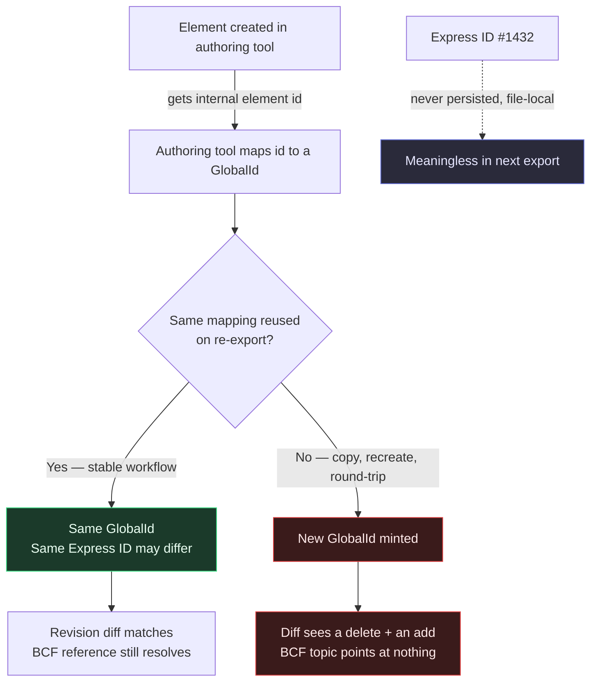

```svg
<svg xmlns="http://www.w3.org/2000/svg" width="1200" height="630" viewBox="0 0 1200 630">
  <rect width="1200" height="630" fill="#0A0A0C"/>
  <g opacity="0.16" stroke="#5E6AD2" stroke-width="1" fill="none">
    <path d="M820 70 L1130 70 L1130 320 L820 320 Z"/>
    <path d="M820 70 L975 30 L1130 70"/>
    <path d="M1130 320 L975 360 L820 320"/>
    <path d="M975 30 L975 360"/>
    <path d="M820 195 L1130 195"/>
  </g>
  <g opacity="0.12" fill="#5E6AD2">
    <circle cx="860" cy="430" r="3"/><circle cx="910" cy="430" r="3"/><circle cx="960" cy="430" r="3"/><circle cx="1010" cy="430" r="3"/><circle cx="1060" cy="430" r="3"/><circle cx="1110" cy="430" r="3"/>
    <circle cx="860" cy="480" r="3"/><circle cx="910" cy="480" r="3"/><circle cx="960" cy="480" r="3"/><circle cx="1010" cy="480" r="3"/><circle cx="1060" cy="480" r="3"/><circle cx="1110" cy="480" r="3"/>
    <circle cx="860" cy="530" r="3"/><circle cx="910" cy="530" r="3"/><circle cx="960" cy="530" r="3"/><circle cx="1010" cy="530" r="3"/><circle cx="1060" cy="530" r="3"/><circle cx="1110" cy="530" r="3"/>
  </g>
  <text x="80" y="92" fill="#8B5CF6" font-family="Inter, system-ui, sans-serif" font-size="20" font-weight="600" letter-spacing="4">TROUBLESHOOTING</text>
  <text x="80" y="270" fill="#FAFAFA" font-family="Inter, system-ui, sans-serif" font-size="64" font-weight="800" letter-spacing="-1">
    <tspan x="80" dy="0">IFC GUIDs Change</tspan>
    <tspan x="80" dy="78">on Every Export</tspan>
    <tspan x="80" dy="78" fill="#A1A1AA" font-size="40" font-weight="600">Here's why — and how to stop it</tspan>
  </text>
  <text x="80" y="585" fill="#A1A1AA" font-family="Inter, system-ui, sans-serif" font-size="24" font-weight="600" letter-spacing="0.5">ifcvieweronline.com</text>
  <g transform="translate(1075,560)">
    <circle r="42" fill="none" stroke="#26263a" stroke-width="6"/>
    <circle r="42" fill="none" stroke="#5E6AD2" stroke-width="6" stroke-linecap="round" stroke-dasharray="190 264" transform="rotate(-90)"/>
    <text x="0" y="9" fill="#5E6AD2" font-family="Inter, system-ui, sans-serif" font-size="28" font-weight="700" text-anchor="middle">72</text>
  </g>
</svg>
```



You fixed a wall last week. You added the fire rating, re-exported, sent it off, closed the issue.

This week the same wall is back — flagged as a brand-new element with the same missing property. You open both files side by side. The geometry is identical. The wall is in the same place. But the diff swears it's a different object.

It is. The wall didn't change. Its ID did.

## The thing everyone confuses first

There are two numbers attached to every element in an IFC file, and people use the word "ID" for both. They are not the same, and conflating them is where the pain starts.

The first is the **Express ID** — the `#1432` you see at the start of a line in the raw STEP file: `#1432=IFCWALLSTANDARDCASE(...)`. It's a line number, basically. A pointer so other lines can reference this one within *this single file*.

The second is the **GlobalId** — a 22-character string like `2O2Fr$t4X7Zf8NOew3FNr2`. This is the one that's supposed to be permanent. The IFC name for it is `GlobalId`; people say "GUID" because it's an IFC-encoded UUID under the hood.

## Why the Express ID is a trap

The Express ID is local to the file. It is not an identity. It's an address.

Re-export the same model and the importer is free to write the lines in a different order — so the wall that was `#1432` is now `#2008`. Nothing is wrong. Express IDs were never meant to survive an export.

I've watched people build "change tracking" by comparing Express IDs across two files. It produces a diff where every element on earth has changed, every time, forever. The tool isn't broken. It's reading the wrong number.

If you take one thing from this: **never use the Express ID to match elements between two files.** It's the line number. Match on `GlobalId`.

## So why does the GlobalId change too?

Here's the part that actually bites. The GlobalId is *supposed* to be stable across exports — same element, same GUID, revision after revision. That's the entire promise.

The promise breaks the moment the authoring tool can't (or doesn't) reuse its mapping from internal element to GlobalId.

In Revit, every element has an internal `ElementId` and a Revit `UniqueId`. The IFC exporter takes that and derives the IFC GlobalId. If that derivation is deterministic and the element is stable, you get the same GUID next time. If anything in that chain breaks, you get a freshly minted one — and a new GUID means a new identity to every downstream tool.

What breaks the chain, in practice:

- **You copied the element** instead of editing it. A copy is a new element with a new internal id, so a new GUID. The wall *looks* the same; it isn't the same object.
- **You deleted and recreated** it. Same story. Round-tripping through a "delete the wall, draw it again" fix guarantees a new GUID.
- **You round-tripped through another format** (imported the IFC back in, re-modelled, re-exported). The internal-to-GUID lineage is gone.
- **The exporter setting changed.** Some exporters can be told to regenerate or to preserve GUIDs. Flip that and your whole file re-IDs.
- **You linked the same content from a different host file** with a different episode, so the derivation salt differs.

The killer is that none of these throw an error. The export succeeds. The model looks perfect in the viewer. The GUIDs quietly rolled over.

## The cost is downstream, which is why it hurts

A churning GlobalId does nothing visible in the model. It wrecks everything that depends on identity *across* files.

**Revision diffs become noise.** Compare rev B against rev A by GlobalId and a re-IDed element shows up as one delete plus one add. If 30% of your GUIDs rolled, your diff is 30% lies. Coordinators stop trusting the diff, which means they stop using it, which means changes slip through unreviewed.

**BCF de-references.** This is the expensive one. A BCF topic — "this beam clashes with this duct" — points at elements by GlobalId. Re-export with new GUIDs and the topic now points at IDs that no longer exist in the file. The issue is still real; the pin is floating in space attached to nothing. Multiply that across a coordination round and you've lost the audit trail of who-flagged-what.

IDS became the official buildingSMART standard in 2024 — a contract for what information a model must deliver. A contract assumes the things it describes can be *found* tomorrow. Unstable GUIDs quietly void that assumption.

[TU EXPERIENCIA: el caso real donde un GUID inestable rompió un BCF o un diff — el proyecto, qué se perdió, cuánto tardaste en darte cuenta]

## How to keep them stable, per tool

There's no universal switch. It's per authoring tool, and it's mostly discipline plus one or two settings.

**Revit.** Edit elements in place; don't delete-and-redraw to "fix" something. Avoid copy-pasting elements you intend to track. In the IFC export setup, leave GUID handling on the preserve/store behaviour rather than regenerate — Revit can write the IFC GUIDs back as a parameter so they're pinned to the element for next time. The big rule: the element's Revit `UniqueId` must survive between revisions, so don't do anything that recreates the element.

**ArchiCAD.** GUIDs are tied to the element's internal ID and are generally stable if you edit in place. The traps are the same: copying elements, and pasting from another file mints new IDs. Keep the IFC translator's ID settings consistent across team members — if one person exports with a different translator preset, you get drift.

**Tekla.** Each object carries a persistent GUID. It stays put as long as the object isn't deleted and recreated. The usual culprit is regenerating or recreating connections/parts during a model cleanup.

**Allplan.** Same principle: stable per object while the object persists; recreating geometry re-IDs it.

The pattern across all four is identical, and it's behavioural more than technical: **a GlobalId is only as stable as the element it's attached to. Recreate the element and you've recreated the identity.** Tool settings prevent gratuitous regeneration; they can't rescue an element you deleted and redrew.

## How I check for it (and why I built the check this way)

I got tired of finding this out the slow way — i.e. the client finding it for me. So the validator I built scores GUID quality as one of its checks: it flags duplicate GlobalIds in a single file and structurally invalid ones.

Cross-export stability you can only catch by comparing two revisions, so the practical move is to diff rev N against rev N-1 *by GlobalId* and watch the delete-plus-add count. A sudden spike of "deletions" that are visibly still in the model is your re-ID smell. The geometry didn't go anywhere; the identity did.

One honest scar from building this: the auto-fix that *generates* a fresh, spec-compliant GUID for an element missing one had a bug where the first character could exceed the value the IFC GUID encoding allows for the leading sextet. It produced strings that looked like GUIDs and passed a casual eye but were technically out of range. Fixed now — first character clamped — but it's a good reminder that "looks like a GUID" and "is a valid GUID" are different tests, and most viewers only do the first one.

## The uncomfortable summary

Express ID = the line number. Throw it away the moment you close the file.

GlobalId = the identity. Treat it like one: edit elements in place, don't copy-or-recreate the things you need to track across revisions, keep export settings consistent across the team, and check the GUID quality before you hand off — not after the RFI lands.

Finding a churned GUID yourself is a five-minute settings conversation. Your client finding it is an RFI, a trust hit, and a margin hit on a job you'd already moved on from.

If you want to sanity-check a file right now, drag your worst IFC — the one with the revision history you don't fully trust — onto [ifcvieweronline.com](https://ifcvieweronline.com). It runs entirely in your browser; the file never uploads anywhere. You'll get a Health Score and the GUID issues called out by name. If GUID stability is a recurring fight on your projects, the writeups on the export-side fixes are worth a subscribe.

*One honest caveat on that "never uploads" claim: if you choose to share a report link, a condensed summary — the score and the issue list, no geometry and no filename — does pass through an edge service so the link can be read by people who don't have the file. The model itself stays in your browser. I'd rather say that plainly than pretend nothing ever touches a server.*
