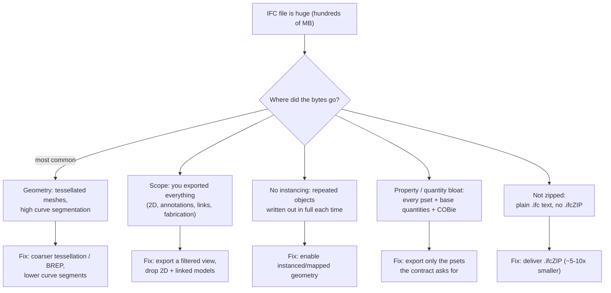

```svg
<svg xmlns="http://www.w3.org/2000/svg" width="1200" height="630" viewBox="0 0 1200 630" role="img" aria-label="Why Your IFC File Is 900 MB and How to Make It Smaller">
  <rect width="1200" height="630" fill="#0A0A0C"/>
  <g opacity="0.16" stroke="#5E6AD2" stroke-width="1" fill="none">
    <path d="M820 70 L1130 70 L1130 560 L820 560 Z"/>
    <path d="M820 70 L975 30 L1200 30 L1130 70"/>
    <path d="M1130 560 L1200 520 L1200 30"/>
    <path d="M820 200 L1130 200 M820 330 L1130 330 M820 450 L1130 450 M975 70 L975 560"/>
  </g>
  <g opacity="0.5" fill="#5E6AD2">
    <circle cx="860" cy="120" r="3"/><circle cx="935" cy="120" r="3"/><circle cx="1010" cy="120" r="3"/><circle cx="1085" cy="120" r="3"/>
    <circle cx="860" cy="265" r="3"/><circle cx="935" cy="265" r="3"/><circle cx="1010" cy="265" r="3"/>
    <circle cx="860" cy="390" r="3"/><circle cx="935" cy="390" r="3"/>
  </g>
  <text x="80" y="92" fill="#8B5CF6" font-family="Inter, system-ui, sans-serif" font-size="20" font-weight="600" letter-spacing="4">TROUBLESHOOTING</text>
  <text x="78" y="265" fill="#FAFAFA" font-family="Inter, system-ui, sans-serif" font-size="64" font-weight="800" letter-spacing="-1">
    <tspan x="78" dy="0">Why Your IFC File</tspan>
    <tspan x="78" dy="78">Is 900 MB — and</tspan>
    <tspan x="78" dy="78">How to Shrink It</tspan>
  </text>
  <text x="80" y="588" fill="#A1A1AA" font-family="Inter, system-ui, sans-serif" font-size="24" font-weight="600" letter-spacing="0.5">ifcvieweronline.com</text>
  <g transform="translate(1075,560)">
    <circle r="42" fill="none" stroke="#26263a" stroke-width="6"/>
    <circle r="42" fill="none" stroke="#5E6AD2" stroke-width="6" stroke-linecap="round" stroke-dasharray="169 264" transform="rotate(-90)"/>
    <text x="0" y="9" fill="#5E6AD2" font-family="Inter, system-ui, sans-serif" font-size="28" font-weight="700" text-anchor="middle">64</text>
  </g>
</svg>
```



Your IFC export is 900 MB. The Revit project it came from is a third of that. Your client's machine chokes opening it, the upload to the CDE times out, and federating it grinds the coordination model to a crawl.

The good news: an oversized IFC is almost never mysterious. The bytes went to one of five places, and four of them are settings you can change before the next export. Here's where the weight actually is, how to take it off per authoring tool, and the one mistake that makes a "smaller" file worse than the big one.

## First, understand what's heavy in an IFC

An IFC file is text — a STEP file, human-readable lines describing entities. That means two very different things take up space, and they shrink in completely different ways:

1. **Geometry.** How each wall, pipe, and fitting is *shaped*. This is almost always the bulk of a bloated file, and it's where the biggest wins are.
2. **Data.** Property sets, quantities, classifications, materials — the *information* attached to each element. Usually smaller, but it adds up across hundreds of thousands of elements.

Most "my IFC is huge" problems are geometry problems wearing a data costume. So start there.

## Cause 1: tessellated geometry and over-segmented curves (the usual culprit)

This is where the megabytes really live.

When an authoring tool exports geometry, it can write a clean parametric/BREP solid — or it can *tessellate* it into a triangle mesh. Tessellation is heavier, and the finer the mesh, the heavier it gets. A single curved pipe fitting exported at high facet resolution can carry hundreds of triangles, each one a few lines of coordinates. Multiply by every fitting, every bolt, every fancy furniture family with a million-poly mesh someone downloaded, and you get a file that's 80% triangles describing things nobody will ever zoom in on.

The related trap is **curve and arc segmentation**: a circular column approximated by 64 line segments instead of 16. Visually identical at normal zoom, four times the data.

**How to tell it's this:** the geometry is detailed, you've got lots of curved/round/imported content (MEP fabrication, detailed families, manufacturer objects), and the file is far bigger than the element count alone would suggest.

**Fix:** export with a coarser tessellation/Level of Detail setting, prefer BREP/swept solids over faceted meshes where your tool allows it, and lower the curve segmentation. Strip or simplify the heavy downloaded families that don't need their full mesh in a coordination deliverable.

## Cause 2: you exported everything (scope creep)

The second-biggest win is usually free: you exported far more than the recipient needs.

By default many setups dump *the whole model* — 2D linework and annotations, view-specific elements, linked/host models merged in, every MEP fabrication detail, every nut and washer. If the recipient is doing coordination or quantity takeoff, they don't need your detail components or your annotation crap inflating the file.

**Fix:** export a **filtered view or model subset.** In Revit, export from a 3D view whose visibility is set to only the categories that matter, rather than the whole project. Exclude 2D elements and don't merge linked models into the export unless the recipient asked for a federated single file. Send the disciplines as separate IFCs if that's the workflow — three lean files beat one monster.

## Cause 3: no instancing — the same object written out a thousand times

IFC can describe a repeated object *once* and then place it many times (mapped/instanced geometry). Or it can write the full geometry of every single instance, so your 1,200 identical doors become 1,200 full mesh definitions instead of one definition referenced 1,200 times.

**How to tell:** lots of repetition in the model (typical floors, repeated families, standard components) and a size that scales with *count* rather than *uniqueness*.

**Fix:** enable instanced/mapped geometry in the export options if your tool exposes it. Not every exporter does this well, but where it's available it can dramatically cut the size of repetitive models.

## Cause 4: property and quantity bloat

Geometry is usually the bigger problem, but data bloat is real on information-heavy models. Exporting *every* property set, base quantities for everything, full COBie data, and every classification onto hundreds of thousands of elements adds up — and a lot of it is data the recipient never asked for.

**Fix — carefully:** export only the property sets the deliverable actually requires. If the contract (often an IDS — the buildingSMART standard for "deliver exactly this information") specifies which psets are needed, map *those* and skip the rest. Drop base quantities and COBie if they're not part of this handoff.

This is the cause with a landmine attached, and it gets its own warning below — because "strip the properties to shrink the file" is exactly how people accidentally ship a smaller, broken file.

## Cause 5: you're shipping plain text when you could ship a zip

The cheapest win of all: IFC is text, and text compresses brilliantly. The `.ifcZIP` format is just a zipped IFC, and every compliant tool reads it. Compression ratios of 5–10× are normal.

**Fix:** deliver `.ifcZIP` instead of `.ifc` if your recipient's tools accept it (almost all do). This doesn't fix a bloated model — the uncompressed size on their machine is the same — but for transfer, storage, and CDE upload limits it's an instant, lossless win. Do this *and* the geometry fixes, not instead of them.

## The trap: a smaller file that's now broken

Here's the mistake I want to save you from, because it's the one that turns a file-size task into an RFI.

The fastest way to shrink an IFC is to export less. The fastest way to *break* an IFC is also to export less. Those are the same knob. Turn down the property sets too far and you've dropped the fire ratings, types, and classifications the client's model checker keys on. Filter the view too aggressively and the spaces (`IfcSpace`) didn't export, so their area takeoff is empty. Now your file is half the size and missing exactly the data it existed to carry.

The file got smaller. The deliverable got worse. And it'll look fine in your viewer, because the geometry you kept renders perfectly — the missing *information* is invisible on screen.

[TU EXPERIENCIA: el caso real donde adelgazaste un IFC y rompiste algo — qué pset o qué spaces perdiste al filtrar, y cómo te enteraste. Concreto: hace creíble la advertencia.]

So the discipline is: shrink the geometry aggressively, shrink the *data* surgically, and **verify the slim export still carries what the contract asked for** before you send it.

## How to check the slim version didn't lose anything

This is the part most "reduce file size" advice skips, and it's the part that saves you the RFI.

After you re-export a leaner file, read it *as an IFC* — not by orbiting it in 3D, which only shows the geometry you kept. Drag the new export into a browser-based viewer that runs the file locally and reads the actual entities: are the required property sets still populated on real elements? Did the spaces survive the filter? Is the spatial tree (project → site → building → storey) still intact? Are the GUIDs still stable?

The tool I built collapses those checks into a single **Health Score from 0 to 100** across 38 rules, so you can put the *before* and *after* exports side by side and confirm you shrank the file without gutting it. If the lean version's score craters because properties or spaces vanished, you stripped too much — better to learn that on your screen than from your client's.

It runs **100% in your browser** — the IFC never leaves your machine, no upload, no account. Worth noting honestly for big files: because it parses client-side, a genuinely massive first parse is bounded by your machine's RAM rather than a server's, though it caches the result so reloads are instant. (And the only thing that ever touches a server is a derived summary — score plus issue list, no geometry, no filename — *if* you choose to share a report link.)

## The order of operations that actually works

1. **Zip it** (`.ifcZIP`) — free, lossless, do it every time.
2. **Cut the scope** — export a filtered view, drop 2D and unneeded linked models, split by discipline.
3. **Tame the geometry** — coarser tessellation/LOD, prefer solids over heavy meshes, lower curve segmentation, fix the monster families.
4. **Trim the data surgically** — export only the property sets the deliverable requires, not every pset by default.
5. **Verify** — re-read the lean export and confirm the required data and spaces survived before you send it.

Do those in order and a 900 MB file routinely comes back as a fraction of the size, with everything the recipient actually needs still in it.

If you've got an export that's somehow enormous and you're about to start hacking settings to shrink it, run the original through [ifcvieweronline.com](https://ifcvieweronline.com) first so you have a baseline — then run the slimmed version and compare. Nothing uploads; it's just a fast way to make sure "smaller" didn't quietly become "broken."
