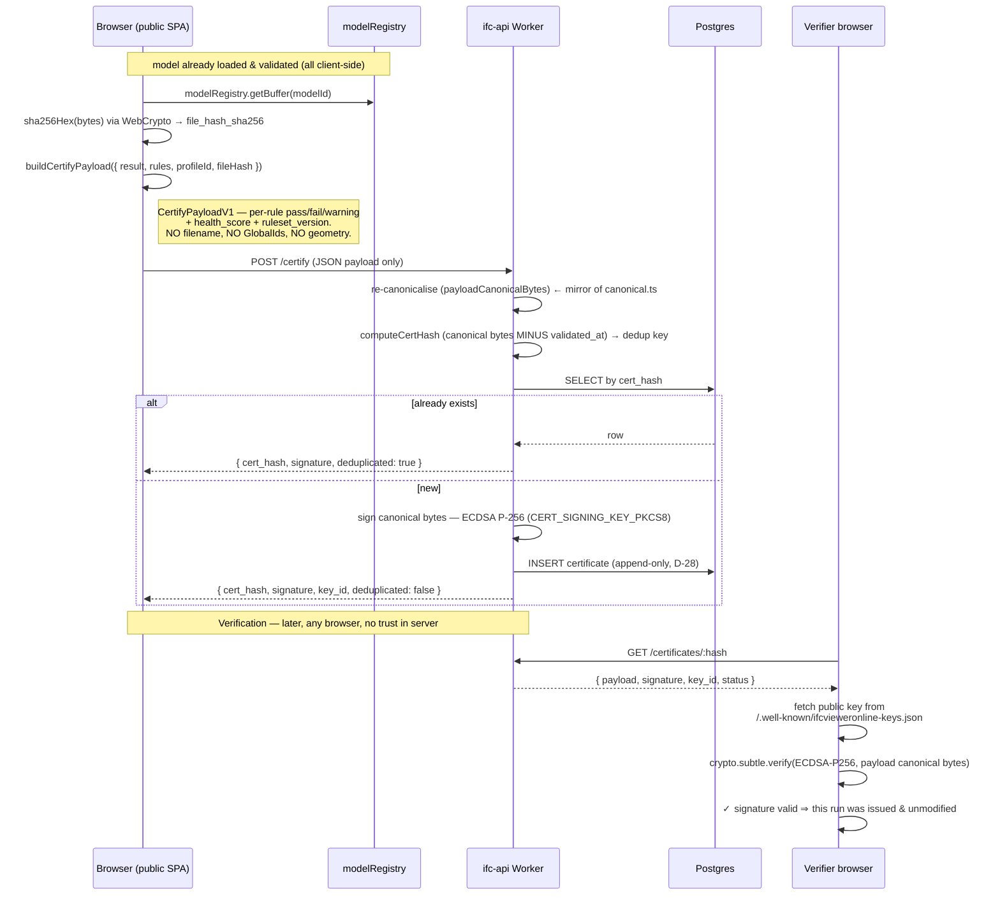
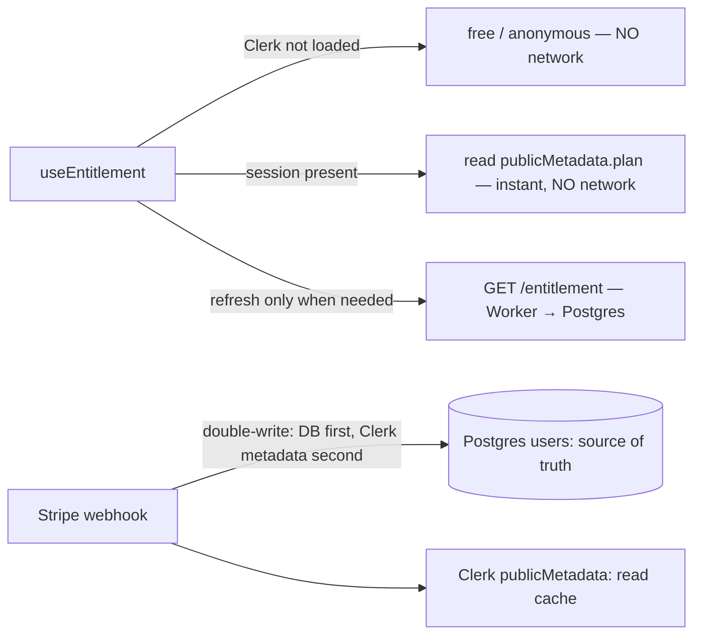

# CDE Architecture — the conformance platform, system-level

> **Read order:** [`CDE_VISION.md`](./CDE_VISION.md) (why) → [`CONFORMANCE_DOMAIN.md`](./CONFORMANCE_DOMAIN.md) (what is persisted) → **this file** (how the system is wired) → [`INTEGRATIONS.md`](./INTEGRATIONS.md) (external contracts) → [`CONFORMANCE_PATTERNS.md`](./CONFORMANCE_PATTERNS.md) (implementation conventions) → [`CDE_ROADMAP.md`](./CDE_ROADMAP.md) (when).
>
> This is a public, MIT-repo-appropriate document. It covers the **system architecture at architecture altitude** only: no secrets, no pricing, no go-to-market. The strategy/monetization counterpart lives in `docs-planning/vision/` (gitignored, private).

The product has pivoted from a browser-only IFC viewer/validator into a **delivery-conformance platform — "DocuSign for BIM deliveries"**: a neutral, signed checkpoint that proves a BIM handoff met its contractual/EIR requirements *at the moment it was delivered*. Architecturally that pivot was small on the client and additive on the server: **~60–70 % of the core already shipped before the pivot** (the IDS 1.0 engine, the frozen `certify/` module, the stateless `cf-worker/`, the share-report codec, `ui=client`, `bcfStore`). What was genuinely new is a **private cloud layer** — a second Cloudflare Worker (`ifc-cloud-api`) with a Postgres database — that persists the signed artifact and, much later, opt-in server-side processing.

> **As-built status (2026-07-12).** This architecture is no longer a blueprint. The private
> `ifc-cloud-api` Worker + Postgres (Supabase EU — 15 tables / 10 enums, RLS + D-28 triggers
> verified live) are **in production serving F1**: anonymous signed certificate issuance, public
> `/verify`, deep verification. The **F2 account layer** (entitlement, tenant boundary, ruleset
> sync, history, branding, billing-by-redirect, webhooks) is deployed **dark** behind
> configuration switches. Both F0 spikes are closed: S-1 = Scenario A (embedded Clerk works under
> real COEP; social OAuth by redirect), R-2 = driver-adapter smoke green. Sections below stand as
> the governing design; where production taught a rule the blueprint missed, it is called out
> inline (per-request Prisma client, §4.1; as-built session boundary, §6).

This document draws the two-tier picture, the privacy boundary, the data flows, and a reused-vs-new inventory. The immutable/append-only storage guarantees are established in **D-28**; the single exception to the "model never leaves the browser" invariant is **D-27** (opt-in, paid, short-retention, F6-only).

---

## 1. Two-tier architecture

```
┌──────────────────────────────────────────────────────────────────────────────┐
│  TIER 1 — PUBLIC MIT SPA  (github.com/j03rul4nd/ifc-viewer-online → Vercel)    │
│  Byte-for-byte identical for the anonymous free user, at every phase.          │
│                                                                                │
│   • IFC parse / render / validate  → all client-side, in Web Workers (WASM)    │
│   • 44 validation rules + IDS 1.0 engine + EIR compiler  (one engine)          │
│   • Local sha256(IFC bytes) via WebCrypto                                      │
│   • Entitlement UI (lazy) + certify payload builder + verify view              │
│                                                                                │
│   Talks to the edge over HTTPS with DERIVED JSON ONLY — never the model.       │
└───────────────┬──────────────────────────────────────┬───────────────────────┘
                │ (existing, stateless)                  │ (new, stateful)
                ▼                                        ▼
┌───────────────────────────────┐      ┌────────────────────────────────────────┐
│  cf-worker/  (PUBLIC, MIT)     │      │  ifc-cloud-api  (PRIVATE repo)           │
│  ifc-viewer-email-capture      │      │  ifc-api Worker — clone of cf-worker     │
│                                │      │  patterns (CORS allowlist, fail-open     │
│  POST /subscribe   (Resend)    │      │  rate-limit bindings, smoke-test.mjs)    │
│  GET  /r?d=…       (crawlable) │      │                                          │
│  GET  /badge       (SVG)       │      │  /certify · /verify lookups · billing ·  │
│  GET/POST /bench   (KV)        │      │  entitlement · webhooks · org · api      │
│                                │      │        │                                 │
│  Stateless. No DB. No secrets  │      │        ▼                                 │
│  beyond RESEND_API_KEY.        │      │  Postgres (Supabase, EU) via Prisma      │
└───────────────────────────────┘      │  driver-adapter  ·  R2 (F6 only)         │
                                        └────────────────────────────────────────┘
```

### Why a second, private Worker rather than extending `cf-worker/`

| | |
|---|---|
| **Alternatives considered** | (a) Add DB + auth + billing routes to the existing public `cf-worker/`. (b) A separate serverless platform (Vercel Functions / a Node service). (c) The private `ifc-cloud-api` Worker cloning `cf-worker/` conventions. |
| **Decision** | (c) — a **new private repo `ifc-cloud-api`** running a second Cloudflare Worker, initialised by copying `cf-worker/` patterns verbatim (the CORS allowlist at `cf-worker/worker.js:27,66`, the fail-open `underLimit()` rate-limit pattern at `worker.js:100`, the `[[unsafe.bindings]]` shape in `cf-worker/wrangler.toml`, the smoke-test harness, and the "documented cross-boundary contract + mirror test" discipline of `src/lib/share-report.ts`). |
| **Reason** | The public repo is MIT — it must never contain Stripe/Clerk secrets or a DB binding. `cf-worker/` is **pure stateless** and that is load-bearing to the D-21 privacy story; mixing a database and payment keys into it contaminates that story both conceptually and operationally. The two Workers also have different risk/rate-limit profiles, and the existing Worker (`ifc-viewer-email-capture`) has routes already indexed by crawlers. Keeping them separate keeps the anonymous free path provably unchanged. |
| **Consequences** | Two deploy targets. The SPA reaches the cloud layer only through `VITE_API_URL`; **without that variable the entire product behaves exactly as today** (same pattern as the existing `VITE_REPORT_URL` gate for the crawlable route). The public repo ships only a typed HTTP client (`src/lib/cloud/api-client.ts`, new), the entitlement hook/components, and UI — a fork with no backend gets nothing of value. |

**Invariant preserved:** CONTEXT.md invariant 1 ("no server-side processing of the model") holds unchanged in F0–F5. Stateless edge compute that never receives the IFC bytes is already permitted (D-21). The `ifc-cloud-api` Worker is stateful (it has a DB) but in F0–F5 it still only ever receives **derived JSON** — see §3.

---

## 2. Certificate data flow (F1, the load-bearing path)

The signed `ConformityReport` is the artifact every later phase monetizes, and it is issuable **anonymously with zero auth**. The whole flow reuses the already-frozen `src/lib/certify/` module (`canonical.ts`, `build-payload.ts` — 23 tests). The critical property: the browser computes the file hash locally, and **only a small JSON payload crosses the edge** — never the model, never the filename, never element data.



**What the signature attests — and what it does not.** The signature proves the `ConformityReport` was **issued by us and has not been altered since**, and (via `file_hash_sha256`) that it refers to *a specific byte-stream*. It does **not** prove the score was computed by an honest client — a determined issuer can run a doctored validator locally and submit a favourable payload for a real file hash (**R-5, forge-at-origin**). The mitigation is **deep-verification V2** (F1.5, `DA-9`): the verifier drops in the IFC file, the app re-hashes it (confirming `file_hash_sha256`) and optionally re-runs the engine in-browser to reproduce the score. Never describe the certificate as "impossible to forge"; it attests **integrity of issuance**, not re-execution. See [`INTEGRATIONS.md`](./INTEGRATIONS.md) §2 for the contract and `docs-planning/05` R-5.

**Frozen contract.** `src/lib/certify/canonical.ts` is dependency-free by design so it can be **copied verbatim into the Worker**. `canonicalJson()` sorts keys by UTF-16 code unit, drops `undefined`, and throws on non-finite numbers — a one-byte divergence between client and Worker breaks every signature (R-8). The frozen vectors in `canonical.test.ts` (12 tests) + `build-payload.test.ts` (11 tests) are the shared contract; the Worker's suite must mirror them. See [`CONFORMANCE_PATTERNS.md`](./CONFORMANCE_PATTERNS.md) §3.

---

## 3. The privacy boundary — drawn explicitly

The single most important architectural line is **what crosses the network edge**. It differs by phase, and the difference is governed by **D-27**.

```
                          ┌─────────── THE EDGE ───────────┐
   IN THE BROWSER         │        crosses the wire        │        ON THE SERVER
   (always)               │                                │
─────────────────────────┼────────────────────────────────┼──────────────────────────
 IFC bytes                │   ✗ never (F0–F5)              │   —
 element names, GlobalIds │   ✗ never                      │   —
 coordinates, geometry    │   ✗ never                      │   —
 filename                 │   ✗ never (excluded from       │   —
                          │     CertifyPayloadV1 by design)│
─────────────────────────┼────────────────────────────────┼──────────────────────────
 sha256(IFC bytes)        │   ✓ file_hash_sha256 (64 hex)  │   stored (dedup, lookup)
 per-rule pass/fail       │   ✓ rules_result[]             │   stored (signed payload)
 health_score (0–100)     │   ✓ integer                    │   stored + /bench aggregate
 ruleset_version          │   ✓ fingerprint string         │   stored
─────────────────────────┼────────────────────────────────┼──────────────────────────
 IFC bytes (F6 ONLY)      │   ⚠ ONLY under D-27:           │   processed in a container,
                          │     opt-in · paid · authed     │   deleted ≤ 72 h, even on
                          │     · consented · SSRF-guarded │   failure. R2 staging.
                          └────────────────────────────────┘
```

- **F0–F5 (all phases before the CDE monitor):** the anonymous free user's network footprint is **byte-for-byte identical to today** — this is a hard, per-phase acceptance criterion (empty Network tab diff vs `main`, per `docs-planning/01` §12). The only things that transit the edge are (a) a locally-computed `sha256` and (b) derived JSON summaries (the `CertifyPayloadV1`, the condensed shared-report payload for `/r`, an integer score for `/bench`). This is exactly the boundary D-21 already established and the `certify/` module already enforces (`build-payload.ts` never reads model-identifying data).

- **F6 (cloud processing + CDE monitor) — the exception, gated on D-27.** A CDE watcher cannot run inside the sender's browser, so automatic per-milestone conformance requires the model to reach a server. **D-27 formally amends invariant 1** to permit this under conditions that are *all* mandatory and none skippable: (a) explicit per-action opt-in consent, never a default; (b) **never for anonymous or free users** — authenticated paid plans only; (c) short retention (72 h working window) with guaranteed deletion even on failure; (d) honest copy — the privacy proof point becomes *"your IFC model never leaves your browser unless you opt into cloud processing"*, and marketing never claims blanket client-only once F6 ships; (e) SSRF/security hardening on any pull ingest; (f) new GDPR RAT rows + DPAs before any code. **D-27 is founder-gated** — this document proposes it; it does not silently break invariant 1.

> **Do not present F6 as imminent.** It is gated on *both* the D-27 amendment *and* a real demand signal (≥1 client with a concrete CDE willing to wire the webhook). See [`CDE_ROADMAP.md`](./CDE_ROADMAP.md) F6.

---

## 4. The persistence layer

### 4.1 Prisma driver-adapter on Cloudflare Workers (concept level)

Prisma's default query engine is a native Node binary that does **not** run in a V8 isolate. The resolved path (decided, and verified green by the F0 spike — R-2):

| Choice | Value | Rationale |
|---|---|---|
| **Driver** | `@prisma/adapter-pg` (the `pg` driver) with `previewFeatures = ["driverAdapters"]` and `nodejs_compat` in the Worker's `wrangler.toml` | Cloudflare officially supports outbound TCP via Node compat in Workers. No recurring third-party service. |
| **NOT** | Prisma Accelerate | Extra recurring cost, an extra GDPR sub-processor to document, and an added latency hop — the adapter gives the same result without a third party. |
| **Connection** | Supabase pooler (**Supavisor**) in transaction mode, **port 6543**, `?pgbouncer=true&connection_limit=1` | Mandatory in a serverless environment that opens/closes a connection per request. |
| **Client lifetime** | **One `PrismaClient` per request**, `$disconnect()` deferred via `ctx.waitUntil()` — **never cache the client per isolate** | **Production lesson (2026-07-10), now a hard rule:** an isolate-cached client holds a pooled connection that Supavisor drops when idle → the next request hangs ("worker canceled — code had hung", ~50 % intermittent 500s). Fixed by per-request client + deferred disconnect; any new route must follow it. |
| **Optional** | Cloudflare Hyperdrive in front of the same string | Transparent to Prisma; noted as the latency lever (F0 measured ~223 ms p50 from a laptop; re-measure from the edge) — enable only on measured need. |

**Two-URL pattern** (a class of bug this prevents at the schema level):

| Variable | Value | Used by |
|---|---|---|
| `DATABASE_URL` | pooled Supavisor `:6543` | Worker at runtime (via adapter) |
| `DIRECT_URL` | direct `:5432` (or local Postgres in dev) | `prisma migrate deploy` only — **never** in the Worker |

`prisma migrate` cannot run through pgbouncer transaction mode (advisory locks + multi-statement DDL), hence the direct URL. The migration flow itself has a known Supabase gotcha (**R-9, `P3014`**: the migration role lacks `CREATEDB` for the shadow DB) — dodged by running `prisma migrate dev` against a **local docker-compose Postgres**, with Supabase receiving only `prisma migrate deploy`. Full flow and CI drift-check in [`CONFORMANCE_PATTERNS.md`](./CONFORMANCE_PATTERNS.md) §8; schema in `docs-planning/02-esquema-supabase.md`.

### 4.2 Immutable & append-only storage (D-28)

The conformance domain's integrity spine, enforced at the DB layer, not just in application code:

- **`ConformityReport` (the `certificates` table) is append-only + immutable.** `cert_hash` is the PK (= `sha256` of the canonical payload *minus* `validated_at`, the dedup key). Only `status` may change (`valid → revoked`); the payload and signature are **never** UPDATEd and rows are **never** DELETEd — it is a verifiable public artifact. Re-certifying the same file+ruleset+outcome on another day yields the same `cert_hash` and reuses the stored row (`computeCertHash` in `canonical.ts`).
- **`Submission` is immutable on submit** and **`AuditLog` is append-only** (D-28) — a correction is a *new* `Submission` revision, never an edit; every state transition writes one immutable, actor-attributed `AuditLog` entry. Entity-level detail lives in [`CONFORMANCE_DOMAIN.md`](./CONFORMANCE_DOMAIN.md).
- **GDPR erasure = anonymise, not delete.** On the Clerk `user.deleted` webhook, `certificates.user_id` is set NULL (`onDelete: SetNull`) — the report survives because it is a public immutable artifact; the *link to the person* is removed. `AuditLog.actor_user_id` behaves the same way. This is the deliberate tension between "append-only evidence" and "right to erasure", resolved by minimising what is stored (no email/name/filename ever — `docs-planning/02` §6).
- **Growth is monotonic, and that is the point.** No TTL; permanence *is* the value. Append-only + dedup keeps it bounded (~5 KB/cert → 100 k certs ≈ 500 MB, within tier — R-7).

**Data & retention at a glance** (the groundwork for the GDPR RAT rows — the RAT itself lives with the legal docs, not here):

| Data | Where | Retention | Erasure behaviour |
|---|---|---|---|
| `CertifyPayloadV1` (per-rule aggregate, score, hashes) | Postgres `certificates` | **Permanent** (no TTL — permanence is the value) | Row persists; `user_id`/`org_id` links `SetNull` |
| `file_hash_sha256` | Postgres (inside payload + column) | Permanent | Not personal data — a digest of a file the server never saw |
| `AuditLog` entries | Postgres | Permanent, append-only | Entry persists; `actor_user_id` `SetNull` |
| User row (`plan`, Clerk id, Stripe customer id — **never email/name**) | Postgres `users` | Life of the account | Deleted on Clerk `user.deleted` webhook (links cascade to `SetNull`) |
| IFC bytes (F6 only, D-27) | R2 staging | **≤ 72 h working window, deleted even on failure** | N/A — never retained |
| Logs | Workers | Platform default | No PII by rule (§9) — nothing to erase |

### 4.3 Multi-tenant isolation & cost control — why the bill cannot explode before F6

Tenant model: **one shared Postgres, `workspace_id` denormalized on every tenant-owned row, isolation enforced twice** (tenant-scoped repository in the Worker + RLS backstop via `SET LOCAL app.workspace_id` inside each `$transaction` — transaction-scoped on purpose, so it survives Supavisor transaction pooling where a session `SET` would leak). Full decision table, alternatives (schema-per-tenant, DB-per-tenant — both rejected) and acceptance criteria: [`CONFORMANCE_DOMAIN.md`](./CONFORMANCE_DOMAIN.md) §4.2.

The cost model is deliberately boring. Where a SaaS bill actually explodes, and what structurally prevents it here:

| Cost vector | Exposure in F0–F5 | Guard |
|---|---|---|
| Object storage / egress | **Zero** — no model bytes are ever stored before F6 (invariant 1) | Architecture, not policy |
| DB storage | ~5 KB/certificate, integers elsewhere; 100k certs ≈ 500 MB (R-7) | Append-only + dedup; no TTL needed |
| DB compute | Dashboard queries | Composite `(workspace_id, …)` indexes; **mandatory pagination** (max page size, no unbounded SELECT); `statement_timeout` on the `ifc_api` role so one bad query self-terminates |
| Worker invocations | Micro-cents per request | Per-IP rate limits (fail-open) + per-plan quotas (fail-closed) |
| Noisy neighbour | One tenant hammering the API | Per-key rate limiting (F4) + `usage_counters` quotas per workspace (`429 quota_exceeded`) — a single tenant can saturate *their* quota, never the shared pool |
| Webhook/email fan-out | Resend calls | Same fail-open limiter pattern as `/subscribe` |
| **F6 compute + R2** | The only phase with real marginal cost | Doubly gated (D-27 + signal); per-plan `max_ingest_bytes` / `jobs_per_day`; 72 h deletion is a cost bound as much as a privacy bound |

Operational guards (all cheap, all F2 tasks, none optional):

- **Quotas are checked in the Worker before the write**, against `usage_counters` incremented **in the same transaction** as the metered write — a crash between write and count can never leak free usage ([`CONFORMANCE_DOMAIN.md`](./CONFORMANCE_DOMAIN.md) §3.9).
- **Fail-open vs fail-closed is pinned per class:** abuse rate-limiting fails open (infra hiccup never blocks a free user); paid-quota checks fail closed (unreadable counter ⇒ refuse the write). Never swap these.
- **Budget kill-switch:** every expensive endpoint group sits behind an env flag (`FEATURE_VERIFY_BATCH`, later `FEATURE_MONITOR`) — the same unset-the-variable rollback the SPA already uses for `VITE_API_URL`. Disabling a surface is a panel action, not a deploy.
- **Daily usage rollup + alert** at 80% of any workspace quota and at a global daily-spend threshold — observability before invoices, not after.

The anonymous free path stays byte-identical and unmetered at every phase — it is rate-limited per IP (`CERTIFY_LIMITER`), never quota'd, because it is the moat-building loop, not a cost centre. The entitlement/role axes are split deliberately: plan limits gate *how much*, roles ([`CONFORMANCE_DOMAIN.md`](./CONFORMANCE_DOMAIN.md) §3.8) gate *who may*, RLS gates *whose rows* — one testable axis per layer.

---

## 5. R2 — where object storage fits (and does not)

Cloudflare R2 appears **only in F6**, and only under D-27.

- **F0–F5:** no object storage at all. The model is never uploaded, so there is nothing to store. The database holds only derived JSON + hashes (§3, §4.2).
- **F6 (D-27-gated):** R2 is the short-lived staging area for a model that a paid, consenting user opted into cloud processing (pull `{file_url}` download or push multipart). The container runtime downloads → validates → **deletes within the 72 h working window, even on failure**. R2 is a working buffer, **never** a document vault — we ride *on top of* the team's existing CDE (Aconex/ACC/Dalux/SharePoint), we do not compete on being their storage. The outbound webhook carries only the condensed `ConformityReport` (`{job_id, file_hash, health_score, counts, verify_url}`) — never the model.

> The container runtime for F6 processing is an open decision (**DA-7**: Cloudflare Containers vs Fly.io vs Railway — deferred until the F6 signal opens).

---

## 6. Cross-origin isolation (COOP/COEP) and its consequence for auth

The app requires **cross-origin isolation** (D-07): `coi-serviceworker.js` injects `Cross-Origin-Opener-Policy: same-origin` + `Cross-Origin-Embedder-Policy: require-corp` on every page of the origin, because `SharedArrayBuffer` (and `performance.measureUserAgentSpecificMemory()`) require it. `vercel.json` does **not** set these headers — the service worker is what enables isolation (`docs/DEPLOYMENT.md`).

This has a direct architectural consequence for the new auth/pay layer:

- Under `COEP: require-corp`, any cross-origin script or iframe that does **not** send a correct `Cross-Origin-Resource-Policy`/CORP header is **blocked**. ClerkJS loads from its CDN and mounts iframes; embedded Stripe mounts iframes.
- **Therefore Stripe is redirect-only.** Checkout and the customer portal are always a *full-page navigation* to `stripe.com` (not subject to our page's COEP), never an embedded Stripe element. Return is via `?billing=success`, and entitlement reflects without a manual reload via short polling of `GET /entitlement` (≤30 s).
- **Clerk under real COEP was the single biggest de-risking spike (S-1, R-1)** — run in F0 and
  **resolved: Scenario A.** Embedded ClerkJS works under the real `require-corp` COEP (full
  sign-in verified headless against a production build, zero COEP/CORP blocks). One caveat is
  binding: **social OAuth must use redirect mode** — COOP kills popups by design. Plan B
  (redirect-based auth via Clerk Hosted Pages) stays documented as the fallback but was not needed.

**Consequence for the bundle — the as-built session boundary** *(supersedes the originally
planned `pro-entry.ts` module)*: none of Clerk/Stripe is in the anonymous path. `main.tsx` mounts
a **conditional lazy ClerkProvider** only when `VITE_CLERK_PUBLISHABLE_KEY` exists; inside that
lazy **`vendor-auth`** chunk a `ClerkSessionBridge` mirrors the session into
`src/stores/cloudAccountStore.ts` — an eager, Clerk-free store that is the **only** thing the
anonymous bundle knows about accounts (and the bridge is its only writer). **Every** file that
imports `@clerk/*` is reached only through a dynamic `import()` / `React.lazy` into `vendor-auth`
(today: `ClerkSessionBridge`, `AccountModal`, `AuthPage` — the set grows as F2 grows, but the
loading discipline does not), so the invariant holds **by import-graph construction** and is
auditable with a grep of the eager chunks, not by convention. Post-checkout freshness (`?billing=success` → ≤30 s
entitlement polling) lives in the bridge. Acceptance criterion: `dist/assets/index-*.js` contains
no `clerk`/`stripe` string after build. See [`CONFORMANCE_PATTERNS.md`](./CONFORMANCE_PATTERNS.md) §2.

---

## 7. Entitlement — single source of truth

The cloud layer's authorization model (detailed pattern in [`CONFORMANCE_PATTERNS.md`](./CONFORMANCE_PATTERNS.md) §1):



- **Source of truth** = the `plan`/`planStatus`/`graceUntil` columns in Postgres `users`. **Read cache** = Clerk `publicMetadata` (read from the already-loaded session, no network).
- The **double-write happens exclusively in the Stripe webhook** in the Worker: `UPDATE users` (truth) first, then `PATCH` Clerk metadata (cache). If the cache write fails it retries; `GET /entitlement` always serves the truth. Never the other way round.
- Worker session auth verifies the Clerk JWT (`Authorization: Bearer`) with `jose`/`@clerk/backend` (cached JWKS, checks `exp` + `azp`); no Clerk API call on the hot path. Users are created in the DB **lazily** on the first authenticated request needing a row.

---

## 8. Reused vs new inventory

| Concern | Status | What / where |
|---|---|---|
| IFC parse / render | **Reuse** | `@thatopen/*` + `web-ifc` WASM in `src/workers/ifc-parser.worker.ts` (D-01/D-02). Commodity — never differentiate. |
| Validation engine (44 rules) | **Reuse** | `src/workers/validator.worker.ts`, `DEFAULT_RULES` in `src/types/index.ts`, `calculateQualityScore` in `src/lib/validator.ts`. |
| IDS 1.0 engine | **Reuse** | `src/lib/ids/` (golden-tested vs 100 bSI testcases) + `src/workers/ids.worker.ts`; `runIds` in `ids-runner.ts`. |
| EIR profiles → IDS | **Reuse** | `src/lib/eir/` (`compileEirToIds`) — one engine, many rule sources. |
| Signed-payload codec | **Reuse (frozen)** | `src/lib/certify/canonical.ts` + `build-payload.ts` (23 tests, ECDSA P-256 contract). Copied into the Worker. |
| Crawlable report / badge / bench | **Reuse** | `cf-worker/worker.js` (`/r`, `/badge`, `/bench`) + `src/lib/share-report.ts` codec. |
| BCF 2.1/3.0 round-trip | **Reuse** | `bcfStore` + `bcf-parser.worker.ts` (import) + `src/lib/bcf.ts` (export); shared `getCameraViewpoint()` (D-24). |
| Embeddable receiver view | **Reuse + extend** | `ui=client` skin (D-25) is the seed of the P3 `ui=receiver` preset; `src/sdk/` + `src/lib/url-params.ts`. |
| Local file hashing | **Reuse** | WebCrypto `sha256Hex` over `modelRegistry.getBuffer(modelId)` (invariant 14). |
| — | | |
| Private cloud Worker | **Shipped (F0/F1, live)** | `ifc-cloud-api` repo (`ifc-api` Worker, TS + Hono) — clones `cf-worker/` conventions; `/certify` + `/certificates/:hash` + `/stats` in production. |
| Postgres persistence | **Shipped (F0, live)** | Supabase (EU) via Prisma `adapter-pg` + Supavisor; 15 tables / 10 enums migrated with RLS + D-28 triggers verified live; per-request client rule (§4.1). |
| Entitlement / auth / billing | **Shipped dark (F2)** | `useEntitlement`/`RequirePlan` + `cloudAccountStore`/`ClerkSessionBridge` (public UI, lazy `vendor-auth`); Clerk + Stripe routes in the private Worker behind secrets + `FEATURE_BILLING`. |
| Cloud client layer | **Shipped (F1/F2)** | `src/lib/cloud/api-client.ts` (anonymous) + `account-client.ts` (authenticated) — the **only** HTTP door per audience; every later phase extends these, never adds a second layer. |
| Domain entities | **Schema shipped (F0); workflow phased** | All 7 entities authored once in F0 (Workspace / Project / Milestone / Submission / ValidationRun / ConformityReport / AuditLog); F1–F5 write only `conformity_reports` + billing/org/API tables — the Submission/Milestone workflow waits for a real P2 signal (see [`CDE_ROADMAP.md`](./CDE_ROADMAP.md) §2 scope honesty). |
| verify-batch API | **Half-shipped (F4)** | `api_keys` mgmt (table, CRUD, show-once UI, fail-closed quota) shipped dark with F2; remaining: `POST /api/v1/verify-batch` + `api_usage` + per-key rate limit. |
| Cloud processing / CDE monitor | **Not built (F6, D-27 + signal gated)** | container runtime, R2 staging, `monitor_configs`, HMAC-signed outbound webhook. |

---

## 9. System-level data-flow summary

```mermaid
flowchart TD
    subgraph Client["Public SPA (byte-identical for anon)"]
        L[Load IFC → OPFS + parser worker] --> VAL[Validate: 44 rules / IDS / EIR — one engine]
        VAL --> SCORE[calculateQualityScore → ValidationRun]
        SCORE --> HASH[WebCrypto sha256 of IFC bytes]
        HASH --> PAY[buildCertifyPayload → CertifyPayloadV1]
    end

    PAY -->|"POST /certify (JSON only)"| API[ifc-api Worker]
    API -->|sign ECDSA P-256 · dedup| DB[(Postgres · append-only · D-28)]
    API -->|"GET /certificates/:hash"| VERIFY[/verify in any browser · WebCrypto/]
    VERIFY -.->|public keys| WK[/.well-known/ifcvieweronline-keys.json]

    SCORE -->|"condensed JSON"| SHARE[share-report.ts]
    SHARE -->|"GET /r?d="| CFW[cf-worker · crawlable HTML + OG + JSON-LD]

    subgraph F6["F6 ONLY — D-27 gate + signal gate"]
        CDE[Team's existing CDE] -->|"pull file_url / push multipart"| ING[POST /monitor/ingest]
        ING --> R2[(R2 · ≤72h · delete on failure)]
        R2 --> PROC[container: validate → condensed ConformityReport]
        PROC -->|"HMAC-signed webhook · NO model bytes"| CDE
    end
```

**Failure & retry posture (edge):** all Workers follow the `cf-worker/` conventions — CORS by allowlist, fail-open rate limiting (an infra hiccup never blocks a legitimate free user), `{ error: { code, message } }` bodies, no PII in logs. On the client, every cloud call returns `Result<T,E>` (D-12) and **degrades, never blocks**: if `/certify` is unreachable the user still gets the local unsigned JSON certificate (the F1 acceptance criterion in [`INTEGRATIONS.md`](./INTEGRATIONS.md) §2). The F6 outbound webhook retries with backoff (3 attempts / 24 h) and marks a config `failing` after N failures; the result is always readable in the dashboard. SSRF hardening on pull ingest (HTTPS-only, domain allowlist, private/metadata-IP block, size + timeout caps) is a hard acceptance criterion — see [`INTEGRATIONS.md`](./INTEGRATIONS.md) §3.

**Rollout / rollback (per backend-touching phase):** deploy the Worker first → run its smoke test against production → only then set `VITE_API_URL` in the Vercel panel (the SPA feature-detects it). Rollback is **unsetting the variable**: the SPA reverts to today's behaviour with zero code changes — the same gate pattern `VITE_REPORT_URL` already proves.

---

## 10. Cross-references

| For… | See |
|---|---|
| What each entity is, its fields and state machine | [`CONFORMANCE_DOMAIN.md`](./CONFORMANCE_DOMAIN.md) |
| Every external contract (SDK/embed, certify, CDE connectors, BCF, verify-batch) with sequence diagrams | [`INTEGRATIONS.md`](./INTEGRATIONS.md) |
| The engineering conventions these systems must follow (entitlement gating, mirror contract, Result monad, zod, migrations) | [`CONFORMANCE_PATTERNS.md`](./CONFORMANCE_PATTERNS.md) |
| The phased build order F0..F6, gates and files-to-touch | [`CDE_ROADMAP.md`](./CDE_ROADMAP.md) |
| Why the niche is defensible | [`CDE_VISION.md`](./CDE_VISION.md) |

---

*Last updated: 2026-07-12 (rev 3 — **blueprint → as-built**: production status block; both F0 spikes closed (S-1 = Scenario A, R-2 green); per-request Prisma client rule added to §4.1 as a hard rule (production incident 2026-07-10); §6 rewritten to the as-built session boundary (conditional lazy ClerkProvider + `ClerkSessionBridge` + `cloudAccountStore` supersede the planned `pro-entry.ts`); §8 inventory upgraded from New/Reuse to Shipped/Shipped-dark/Half-shipped/Not-built with the one-HTTP-door cloud-client row) · Previous: rev 2 2026-07-06 (§4.3 multi-tenant isolation + cost control) · Status: cloud layer LIVE for F0–F1.5, F2 deployed dark; F3+ per [`CDE_ROADMAP.md`](./CDE_ROADMAP.md) · Public SPA unchanged and byte-identical for anonymous users at every phase · Governing decisions D-27 (opt-in server processing, F6-only, ⏸️ written 2026-07-04 but founder-gated — not ratified) + D-28 (immutable Submission / append-only AuditLog, active) are in DECISIONS.md*
