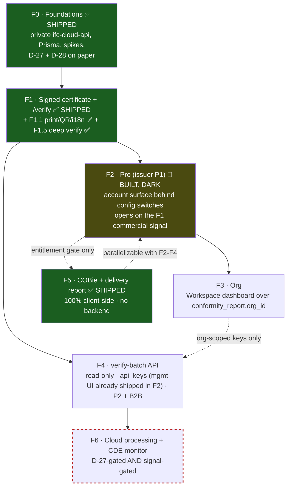

# CDE Roadmap — Delivery‑Conformance Platform (F0..F6)

> **Status: execution blueprint — now partially SHIPPED.** The pivot is decided: grow the app from a
> **conformance gate** (a signed checkpoint that sits *in front of* whatever CDE a team already
> pays for — Aconex / ACC / Dalux / Trimble / SharePoint) into a **lightweight CDE** for small/mid
> AEC teams — "DocuSign for BIM deliveries." This document is the forward build plan: phases
> **F0..F6** with goals, gates, ordered tasks, files‑to‑touch, and the moat each phase compounds.
>
> **Where we are (2026‑07‑14):** **F0 ✅ · F1 ✅ · F1.1 ✅ · F1.5 ✅ · F5 ✅ (COBie + delivery report, client‑side) — live.**
> A **v5 platform super‑admin console** (`/admin/*` Worker routes + `AdminView.tsx`) also shipped 2026‑07‑13/14 as a cross‑cutting operator layer (see `CONFORMANCE_DOMAIN.md` §3.8 / schema v5), orthogonal to the F0–F6 phase line below.
> Anonymous signed `ConformityReport` issuance, public `/verify` with in‑browser signature check,
> printable certificate + QR, ×10 localisation, and deep verification (drop the file → local
> re‑hash + optional local re‑run) are all deployed. **F2 is ~95 % built and deliberately dark**:
> the entire account surface (entitlement, ruleset sync, certificate history, issuer branding,
> API‑key management, Stripe‑by‑redirect billing, webhooks, in‑place sign‑in + `/welcome`
> onboarding) exists behind configuration switches and activates without a code change.
> **2026‑07‑13:** §F2‑TRIGGERS is closed (all four upsell entry points live) and §F2‑PROFILES has
> its first shipped profile (`builtin-simba21-general`, officially sourced). What remains is
> §F2‑ACT (the activation runbook — configuration only) plus further profiles as sources land.
> The **F1 commercial exit signal** (measured by server‑side counters, see the private suite) is
> what opens activation — engineering readiness explicitly does not.
>
> **Public doc.** Product / architecture / integration / tasks only. **No pricing, no go‑to‑market,
> no monetization specifics** — those live in the private `docs-planning/vision/*.md` suite.
>
> Read alongside: [`CDE_VISION.md`](./CDE_VISION.md) (why) · [`CONFORMANCE_DOMAIN.md`](./CONFORMANCE_DOMAIN.md)
> (the 7 entities) · [`CDE_ARCHITECTURE.md`](./CDE_ARCHITECTURE.md) (how the system is shaped) ·
> [`INTEGRATIONS.md`](./INTEGRATIONS.md) (the external contracts) · [`CONFORMANCE_PATTERNS.md`](./CONFORMANCE_PATTERNS.md)
> (the engineering conventions each phase must follow).

---

## 0. Now / Next / Later — the execution picture at a glance

Scan this first; everything below is the detail. "Opens when" is always a **gate condition**,
never a date — nothing in this plan is calendar-driven.

| Horizon | Work | Who | Opens when |
|---|---|---|---|
| **Now** | Put the shipped artifact in circulation and watch the F1 exit counters (server-side `GET /stats`, not client analytics). | Founder | Nothing — F1 is live in production. |
| **Now** | Keep the shipped surface honest on every change: canonical mirror test, locale-parity test, anon-footprint grep, rule-count guard. | Executor (continuous) | — |
| **Next** | **F2 activation (§F2-ACT)** — configuration, not construction: secrets + flags + one env var + smoke. | Founder + executor (smoke) | F1 commercial signal **+** the pricing decision (both private-suite gates). |
| **Next** | F2 close-out packages: ~~§F2-TRIGGERS~~ **done 2026-07-13** (all four entry points live) · **§F2-PROFILES** first profile shipped (`builtin-simba21-general`, SIMBA 2.1); further profiles as official sources land. | Executor | PROFILES (remaining): official requirement sources in hand. |
| ~~**Next (parallel)**~~ **✅ SHIPPED (2026-07-14)** | F5 COBie 2.4 + delivery report — 100 % client-side, zero backend. `src/lib/cobie/*` (mapping/extract/lazy-exceljs XLSX/FM-readiness) + `cobieStore` + `src/lib/delivery-report.ts`, wired into the export dialog. | Executor | — (done). |
| **Later** | F3 Org dashboard · F4 verify-batch endpoint (+ `api_usage`). | Executor | F3: F2 live + 1 real org with ≥2 issuers. F4: 1 real B2B/CI integrator (needs only F1). |
| **Blocked** | F6 cloud processing + CDE monitor. | — | **D-27 ratified AND a real demand signal — both.** Do not start; do not present as imminent. |

---

## 1. The one rule that orders everything

**Grow the *artifact* before the *platform*.** The signed **`ConformityReport`** (moat #1) is the
single asset every later phase monetizes; it is buildable *anonymously, with zero auth*, reusing the
already‑frozen `src/lib/certify/`. So it ships first (**F1**), before any billing, org, or
server‑side model work. Auth, orgs, and B2B surfaces are layers *on top of* an artifact that already
exists and is already being shared.

Two facts anchor the whole plan and appear as a **recurring acceptance criterion in every phase**:

1. **The anonymous, free user's network footprint stays byte‑for‑byte identical to today.** No new
   cookies, no auth libraries in the main bundle, no new network calls for anyone who does not
   explicitly click "Sign in" / "Go Pro." (`docs-planning/01` §12 — provably empty Network tab.)
2. **No IFC bytes cross an origin the user did not choose.** Through F0–F5 only *derived JSON
   summaries* + a *locally‑computed `sha256`* transit the edge (per D‑21). Server‑side model
   processing exists **only** in F6 and **only** behind the **D‑27** privacy‑invariant amendment.

Both are hard invariants, not aspirations. See [`CONTEXT.md`](../CONTEXT.md) invariant 1 and D‑27.

**Reconciliation with the distribution-led plan (`ROADMAP.md` v2):** building this platform does **not**
suspend the "distribute, don't just build" resolution. **F1 is a build-AND-distribute phase**: shipping
the signed `ConformityReport` and putting it in circulation (the free anonymous issuer sharing
badge + `/verify` links is what builds moats #1/#3) are the *same* milestone. Every phase after F1
opens only on a commercial signal, not on engineering readiness — the signal gates live in the private
planning suite.

### Certificate‑first ordering — Alternatives considered

| Order | Reason rejected / chosen |
|---|---|
| Pro (billing) first, then certificate | **Rejected.** Billing carries the two hardest spikes (COOP/COEP‑vs‑Clerk, Prisma‑on‑Workers) and has *nothing to sell* until certificates exist. History and branding are meaningless without a corpus of `ConformityReport`s to keep and brand. |
| Certificate first (**F1**), Pro second (**F2**) | **Chosen.** Least auth dependency (anonymous issuance works), validates demand for the artifact *before* building payments, and creates the exact asset F2/F3/F4 monetize. See `docs-planning/00` §4. |
| Cloud processing (F6) early to differentiate | **Rejected.** Breaks invariant 1 as written (needs D‑27), needs different infra (container, not Worker — DA‑7), and has no documented demand signal. Deferred to F6, doubly gated. |

---

## 2. Phase dependency graph

- **F1 was the pivot** (dark green = shipped): everything monetizable descends from the artifact it
  ships — and the artifact is now live and circulating.
- **F2 is amber**: code-complete except the packaged profiles (content-blocked) and two upsell
  trigger points; **dark by design** until the F1 exit signal. Activation is configuration
  (secrets + feature flags + one env var on the SPA host, §F2-ACT), never a rebuild — this keeps
  "distribute first" honest while removing engineering latency from the moment the signal appears.
- **F5 is parallelizable** with F2–F4 — pure client work, a different skill profile (parser/UI, not infra).
- **F6 is dashed/red**: do **not** build until *both* gates open (see §F6). It is specified so it is
  ready when the signal appears, not because it is imminent.

> **Scope honesty — `Submission`/`Milestone`/`AuditLog` are designed, not scheduled.** F1–F5 write
> only `conformity_reports` (+ billing/org/API tables). The full delivery-record workflow — P1
> creates a `Submission` against a `Milestone`, P2 verifies/rejects, `AuditLog` chains the
> evidence — is **domain-designed now** (so nothing built today contradicts it) but gets a phase
> **only when a real verifier (P2) signal exists**, the same treatment P3's receiver flow gets.
> F0 authors the Prisma schema for all 7 entities once (cheap, and it keeps the frozen triggers
> honest), but no earlier phase should grow Submission UI "because the tables exist."

---

## 3. Which moat each phase compounds

| Phase | Builds moat | Note |
|---|---|---|
| **F0** | *(none — pure enablement)* | De‑risks R‑1/R‑2/R‑9 so no later phase is built on sand. |
| **F1** | **#1 — the citable signed number** | The `ConformityReport` artifact every later phase monetizes. |
| **F2** | **#1** (server‑side history the fork cannot replicate) + **#2** (ruleset sync feeds the corpus) | First value a MIT fork cannot copy: it lives on the server. |
| **F3** | **#1** (org‑level aggregation only our backend can produce) | A *team* of issuers deepens the citable number. |
| **F4** | **#1** (B2B measured‑usage surface — counters only we run) | First non‑issuer consumption path. |
| **F5** | **#2 — remediation corpus** (extends the deterministic fix corpus to delivery prose) | Convenience/retention; strengthens the issuer's daily habit. |
| **F6** | **#3 — crawlable/embeddable loop** (CDE‑monitor + `ui=receiver` embed) + **#1** (auto‑issue) | The moat CDEs cannot follow neutrally — but D‑27 + signal gated. |

Moats, verbatim, are the three from the distribution‑led plan (`ROADMAP.md` v2) re‑framed for
conformance: **#1** the signed `ConformityReport` as a cited standard; **#2** the i18n + tool‑specific
remediation corpus (`src/i18n/rule-remediation.ts`, ~440 entries, D‑22); **#3** the crawlable/embeddable
delivery loop (`/r` route in `cf-worker/worker.js`, D‑21; `ui=client`→`ui=receiver`, D‑25).

---

## 4. What already exists (reuse, never rebuild)

~60–70 % of the conformance core already ships and is verified in code. Every phase below *extends*
these; none rebuilds them.

| Asset | Where (verified) | Reused by |
|---|---|---|
| Frozen certify codec + payload builder | `src/lib/certify/canonical.ts` (`CertifyPayloadV1`, `payloadCanonicalBytes`, `computeCertHash`), `src/lib/certify/build-payload.ts` (`buildCertifyPayload`, `computeRulesetVersion`), 23 tests | **F1** |
| In‑memory certificate shape | `ValidationCertificate` + `buildCertificate()` in `src/components/ValidationExportModal.tsx` | **F1** (source of the payload) |
| Health Score | `calculateQualityScore` / `explainQualityScore` in `src/lib/validator.ts` | **F1** (`health_score`) |
| IDS 1.0 engine (golden‑tested vs 100 bSI testcases) | `src/lib/ids/ids-engine.ts` (`runIdsChecks`), `src/lib/ids/ids-runner.ts` (`runIds`), `ids.worker.ts` | **F1** (`ids_spec_hash`), Project ruleset |
| EIR profiles → IdsDocument | `src/lib/eir/eir-compiler.ts` (`compileEirToIds`) | Project `ruleset_version` |
| Stateless edge Worker (pattern to clone) | `cf-worker/worker.js` — routes `/subscribe`, `/r`, `/badge`, `/bench`; CORS allowlist, fail‑open rate‑limit bindings, `smoke-test.mjs` | **F0** (private `ifc-cloud-api` cloned from it) |
| Cross‑boundary codec discipline | `src/lib/share-report.ts` (`buildShareUrl`, `buildBadgeMarkdown`, `buildBadgeUrl`) + its mirror test | **F1** (mirror pattern), **F3** (badge reuse) |
| Remediation corpus (D‑22) | `src/i18n/rule-remediation.ts` (~440 entries) | **F5** (delivery‑report prose) |
| Embed / SDK / receiver‑view seed | `src/sdk/ifc-viewer-sdk.ts`, `src/lib/url-params.ts`, `ui=client` (D‑25) | **F4+** (`ui=receiver`), **F6** |
| BCF 2.1/3.0 round‑trip | `bcfStore` + `bcf-parser.worker`/`bcf-export.worker`, `src/lib/bcf.ts` | Submission review artifacts |
| **Cloud clients (shipped F1/F2)** | `src/lib/cloud/api-client.ts` (anonymous: `certify`, `getCertificate` — `Result`, zero fetch without `VITE_API_URL`) · `src/lib/cloud/account-client.ts` (authenticated: entitlement, keys, rulesets, history, billing) | **F3/F4** extend these; never add a second HTTP layer |
| **Entitlement primitives (shipped F2)** | `src/hooks/useEntitlement.ts` · `src/components/pro/RequirePlan.tsx` · `ProUpsellModal.tsx` · `SavedRulesetPicker.tsx` | **F3** (role-aware gating), **F5** (Pro variant gate) |
| **Session boundary (shipped F2, as‑built)** | `src/stores/cloudAccountStore.ts` (eager, Clerk‑free) + `ClerkSessionBridge` inside the lazy **`vendor-auth`** chunk — the store is the only thing the anonymous bundle knows about accounts | **F3** org context rides the same bridge |
| **Tenant boundary (shipped F2, Worker)** | `lib/tenant-repo.ts` (`withWorkspace` → `SET LOCAL app.workspace_id` + explicit WHERE) · `lib/entitlement.ts` (`PLAN_LIMITS`, fail‑closed) | **F3/F4** — every new tenant table goes through it |

> **As‑built note (supersedes the earlier plan sketch).** The plan named a `src/lib/pro/pro-entry.ts`
> module; the shipped design is stronger: `main.tsx` mounts a **conditional lazy ClerkProvider**
> (only when `VITE_CLERK_PUBLISHABLE_KEY` exists) with a `ClerkSessionBridge` that mirrors the
> session into `cloudAccountStore`. Every `@clerk/*` importer is reached only through a dynamic
> `import()` / `React.lazy` into the `vendor-auth` chunk (the set grows with F2 — today
> `ClerkSessionBridge`, `AccountModal`, `AuthPage` — but never a static import from an eager
> module), so `vendor-auth` stays out of the anonymous bundle **by import-graph construction** —
> the invariant is auditable with a grep of the eager chunks, not a convention.

---

## F0 — Foundations ✅ SHIPPED (2026‑07‑10)

**Goal.** Stand up the private backend spine and de‑risk the two blocking spikes **before any
user‑facing conformance scope**. Nothing ships to users in F0.

**Gate — closed 2026‑07‑10** (green except one founder‑side paperwork row).

- [x] **Spike S‑1** (COOP/COEP‑vs‑Clerk, R‑1) resolved — **Scenario A**: embedded ClerkJS works
      under the real `require-corp` COEP (full sign‑in verified headless). One caveat recorded:
      social OAuth must use **redirect mode** (COOP kills popups by design). Recorded in
      `docs-planning/05` R‑1.
- [x] Prisma driver‑adapter CRUD smoke green from `wrangler dev` against Supabase pooled `:6543`.
      Production later surfaced the real‑world corollary: **never cache the client per isolate**
      (Supavisor drops idle pooled connections → hung requests). Shipped fix: per‑request client +
      deferred `$disconnect()`. Hyperdrive noted as the latency lever, not yet needed.
- [x] **D‑27** and **D‑28** written into `DECISIONS.md` — ✔ done 2026‑07‑04 (after D‑26). Note the split: the D‑27 **text** exists with status *⏸️ proposed / founder‑gated*; its **ratification** is a separate, still‑open F6 gate. F0 only verifies both stay intact and unrenumbered.
- [ ] RAT / DPA row drafted for **Supabase EU** — **the only F0 item still open**; founder‑side
      paperwork, not engineering. Clerk/Stripe DPAs remain at the **F2 activation gate**.
- [x] **Anonymous free user's network footprint provably unchanged** — verified (empty Network tab;
      re‑checked at every phase since).

**What shipped beyond the plan.** 15 tables / 10 enums migrated to Supabase EU with RLS +
D‑28 triggers verified live (11/11 immutability checks); private repo with CI (typecheck + tests +
schema drift‑check against a shadow DB); Workers Builds auto‑deploy with the discipline
*migrate deploy first, push second*.

**Ordered tasks.**

1. Create the **private `ifc-cloud-api`** repo by cloning `cf-worker/` patterns: CORS allowlist,
   fail‑open rate‑limit bindings, secrets via `wrangler secret`, `smoke-test.mjs`. The public
   `cf-worker/` is **not touched** — it stays stateless and part of the privacy story.
2. Author the **Prisma schema** for the 7 entities — `Workspace / Project / Milestone / Submission /
   ValidationRun / ConformityReport / AuditLog` (shapes in [`CONFORMANCE_DOMAIN.md`](./CONFORMANCE_DOMAIN.md)).
3. Wire Prisma on Workers (**R‑2**): `@prisma/adapter-pg` over Supavisor **:6543** (transaction mode)
   + `nodejs_compat`; **two‑URL pattern** (`DATABASE_URL` pooled for runtime / `DIRECT_URL` for
   `prisma migrate`). Accelerate rejected (cost + one more GDPR sub‑processor + latency).
4. Add `docker-compose.yml` **local Postgres** to dodge the **P3014** shadow‑DB failure (**R‑9**):
   `migrate dev` runs against local; Supabase receives **`migrate deploy` only**; CI drift‑check via
   `migrate diff --exit-code`. Never create tables by hand in the Supabase dashboard.
5. Run **Spike S‑1**: mount `@clerk/clerk-react` under the *real* COEP (`require-corp`) headers the
   app forces (`vite.config.ts` lines 202–203) and confirm ClerkJS loads. **Plan B** documented:
   Clerk Hosted Pages by redirect if embedded ClerkJS is blocked (`docs-planning/01` §8). Stripe is
   **always redirect‑only** in every scenario.
6. Fix version pins for `stripe` SDK + svix under the Workers runtime and leave a smoke test (**R‑6**).
7. ~~Author D‑27 and D‑28 in `DECISIONS.md`~~ — ✔ **done 2026‑07‑04.** Both are recorded after
   D‑26 (D‑27 with status ⏸️ proposed / founder‑gated). Remaining F0 duty: do not renumber or
   edit them from a feature branch; ratifying D‑27 is a founder action tied to the F6 signal,
   not an F0 task.

**The two blocking spikes (do not skip).**

| Risk | What can go wrong | Mitigation | Who/when |
|---|---|---|---|
| **R‑1 · COOP/COEP vs Clerk** | The app forces `Cross-Origin-Embedder-Policy: require-corp` (for `@thatopen` SharedArrayBuffer). Third‑party scripts/iframes without CORP are blocked; ClerkJS loads remote assets + mounts iframes → could break embedded auth. | Stripe redirect‑only (decided); **mandatory S‑1 spike** in F0; documented Plan B (Clerk Hosted Pages). The `useEntitlement`/`RequirePlan` gating pattern is unchanged in either outcome. | Executor, F0. |
| **R‑2 · Prisma on Workers** | Prisma's query‑engine binary does not run in V8 isolates. | Resolved by decision (not ambiguous): driver adapter `@prisma/adapter-pg` + Supavisor :6543 + `nodejs_compat` + two URLs. Residual: if TCP‑per‑request latency > 100 ms p50, enable Hyperdrive (transparent). | Executor, F0 smoke test. |
| **R‑9 · `prisma migrate dev` P3014** | First `migrate dev` against Supabase dies (role can't create the shadow DB) → tempts the fatal "make tables in the dashboard" shortcut that breaks schema versioning. | Local Postgres for `migrate dev`; Supabase gets `migrate deploy` only; CI `migrate diff --exit-code`. Already designed — executor must just respect the flow. | Designed; executor respects it. |

**Files/dirs to touch.** `ifc-cloud-api/` (new private repo: `wrangler.toml`, `worker.js`/`src/`,
`schema.prisma`, `docker-compose.yml`, `smoke-test.mjs`) · `DECISIONS.md` (D‑27, D‑28 — via orchestrator).

**Moat built.** None yet — pure enablement.

---

## F1 — Signed certificate + public verify ✅ SHIPPED (2026‑07‑11)

**Goal.** Ship the signed **`ConformityReport`** artifact + SPA **`/verify`**, **issuable
anonymously**, reusing the already‑frozen `src/lib/certify/`.

**The user flow that shipped (P1 issuer → anyone).** Validate a model → export dialog →
*"Generate verifiable certificate"* (one click; `sha256` computed in‑browser, invisible) →
`verify_url` + signed `.json` download + badge markdown → paste the link/badge into the
deliverable → **any recipient opens `/verify/<hash>` with no account, in their language, and
re‑checks the ECDSA signature locally in their own browser**. Zero asks added to the loop
*issue → share → verify → fix → re‑issue*.

**Gate — all green, verified against production.**

- [x] An anonymous user issues a certificate; **anyone verifies it in another browser** via
      `/verify/<cert_hash>`.
- [x] The `/certify` request carries **ONLY the JSON payload** — enforced *by the server*, not
      just the client: the Worker rejects any unknown key (`unknown_key → 400`), so a `201`
      *proves* the body held exactly the nine frozen fields. Contract test pins it client‑side.
- [x] Signature **fails on a single altered byte** (verified live: tampered payload rejected).
- [x] Dedup: same file+ruleset+outcome → **same `cert_hash`**, `deduplicated: true`.
- [x] Mirror canonicalization test (client `canonical.ts` vs Worker) **green** (guards **R‑8**) —
      and exercised against production during rollout smoke.
- [x] Anonymous network footprint unchanged for anyone who does not click "Issue certificate."
- [x] **Display honesty:** `/verify` shows "N of 44 — profile X"; a partial/custom‑profile
      certificate carries a visually distinct banner.
- [x] Funnel instrumented: `certificate_issued` + `certificate_verified_view` (INV‑5, opt‑out
      gated) **and** server‑side KV counters (`certs_issued` / `unique_issuers` /
      `verify_views(_external)`) behind a token‑guarded stats endpoint — the exit signal never
      depends on opt‑out‑able client analytics.

**Hardening that shipped with it** (found during rollout, now part of the phase's definition of
done for any future re‑run): per‑IP rate limits on **both** issue *and* lookup routes (fail‑open,
anti‑abuse only), and the per‑request DB client rule (see F0).

### F1.1 — fast‑follow ✅ SHIPPED

(a) `/verify` + printable certificate localised ×10 **with a locale‑parity test**; (b) a11y pass
(status by text + icon, `aria-live` verdicts, keyboard navigable); (c) printable certificate page +
QR (dependency‑free `qrcode-generator`, rendered as plain JSX — no `dangerouslySetInnerHTML`).
The signed payload stayed language‑neutral (ids + numbers only); localisation re‑signed nothing.

### F1.5 — deep verification (DA‑9) ✅ SHIPPED

The R‑5 honesty gap is closed *before* certificate marketing, as planned. On `/verify`, the
recipient can now **drop the actual IFC**: local re‑hash proves *"these exact bytes are the
certified file"* (match/mismatch, explained without quality claims), and an optional **local
re‑run** of the engine reproduces the certified result with a rule‑by‑rule diff (custom‑profile
runs compare only shared rules, stated honestly). Three verification levels, spelled out in the
UI: *signature ✓ = issued intact through the service · file hash ✓ = this is the certified file ·
re‑run ✓ = the result reproduces in your browser*. **No file byte leaves the browser at any level.**

**Ordered tasks.**

1. Wire `buildCertifyPayload` (`src/lib/certify/build-payload.ts`) to **real** `validationStore` /
   `idsStore` data from the export surface (`src/components/ValidationExportModal.tsx`, which already
   builds `ValidationCertificate` via `buildCertificate()`). `health_score` = `calculateQualityScore`;
   `rules_result` in canonical `DEFAULT_RULES` order; `ids_spec_hash` from `runIds` when an IDS check ran.
2. Compute `file_hash_sha256` **in‑browser** via WebCrypto from `modelRegistry.getBuffer(modelId)` —
   the bytes never leave the browser (invariant 1).
3. Ship Worker **`POST /certify`** (sign ECDSA‑P256‑SHA256 over `payloadCanonicalBytes`, dedup on
   `computeCertHash`) + **`GET /certificates/:hash`**. The Worker mirrors `src/lib/certify/canonical.ts`
   **byte‑for‑byte**; its test suite reuses the frozen vectors (R‑8, already mitigated: 23 app tests +
   13 skeleton tests share vectors).
4. Generate the ECDSA P‑256 key pair; publish the public key at
   `public/.well-known/ifcvieweronline-keys.json` (+ `.pem`), static and committable.
5. Ship the SPA route **`/verify/:hash`** (`VerifyCertificateView.tsx`) doing **in‑browser** WebCrypto
   verification against the public keys — verification **never trusts the server**.
6. *(moved to fast-follow F1.1 — not launch-blocking)* Printable certificate page + QR
   (`qrcode-generator` — **a new dependency**, the only one this phase adds to the SPA;
   dependency‑free itself. Flag it explicitly in the PR). Localisation ×10 + a11y of `/verify`
   ride the same fast-follow.
7. Reuse `buildBadgeMarkdown` from `src/lib/share-report.ts` so the badge links back to a verifiable
   report — never a blind self‑claim.
8. Instrument the funnel: add typed `certificate_issued` / `certificate_verified_view` events to
   `src/lib/analytics.ts` (same INV‑5 discipline as the existing 18 events: never email, Clerk id,
   or filename; gated by the opt‑out/GPC logic already in that module). These two events are how
   F1's exit signal is measured — shipping the artifact without them makes the phase unfalsifiable.
9. **Rollout order:** deploy the Worker → run its smoke test against production → only then set
   `VITE_API_URL` in the Vercel panel (the SPA feature‑detects it; absent = today's behaviour).
   In the same panel visit, re‑verify `VITE_REPORT_URL` still points at the deployed `/r` route —
   the June verification predates the move to Vercel‑only deploys. **Rollback = unset the variable.**

**Honest threat model (R‑5 — do not overstate).** Anyone can call `/certify` with a fabricated
result: the signature attests **integrity of issuance through the service**, not server‑side
re‑execution. Marketing must **never** claim "impossible to forge." *Mitigations now live:*
deep verification (F1.5 — re‑hash + optional local re‑run) and per‑IP rate limiting on both
routes. The honest sentence stays the ceiling of every claim.

**Files to touch.** `src/components/ValidationExportModal.tsx` · `src/lib/certify/build-payload.ts` ·
new `src/components/VerifyCertificateView.tsx` · `public/.well-known/ifcvieweronline-keys.json` ·
`ifc-cloud-api` routes `/certify`, `/certificates/:hash`.

**Moat built.** **#1** — the citable signed number; the artifact every later phase monetizes.

---

## F2 — Pro (issuer P1) 🔶 BUILT, DELIBERATELY DARK

**Goal.** Let the issuer **P1** keep certificate history, sync rulesets, and brand reports — first
revenue path — via a **single** entitlement pattern.

**Status (2026‑07‑12).** ~95 % of F2 is **code‑complete, tested, and deployed dark** — including
issuer branding and the in‑place sign‑in + `/welcome` onboarding flow. Every account route
degrades to `503 service_disabled` while its secret is absent; billing sits behind a feature flag
that defaults off; the SPA account surface renders nothing (and fetches zero auth bytes) without
its publishable key. **Opening F2 is configuration, not construction** — which is exactly what the
"distribute before you build more" resolution demands: the moment the F1 signal appears, revenue
infrastructure is hours away, not weeks.

**The user flow this phase serves (P1, end to end).**

1. *Discover* — P1 has been issuing anonymous certificates (F1 loop). Friction appears naturally:
   "where did my certificates go?", "my profile lives on this one machine", "my client wants my
   logo on the report". Those three frictions ARE the product.
2. *Sign in* — Account button (toolbar, low‑priority zone) → embedded sign‑in (S‑1 Scenario A).
   The anonymous user who never clicks it is untouched, forever.
3. *See value before paying* — the account modal already shows certificate history captured on
   signed‑in issuance, plus the ruleset picker in the three editors. Saving/syncing is where the
   plan gate sits — **nothing that used to be free is ever taken away** (brand posture, non‑negotiable).
4. *Upgrade* — one click → Stripe Checkout by full‑page redirect (never embedded) → return with
   `?billing=success` → ≤30 s polling flips every `<RequirePlan>` live, no manual reload.
5. *Live* — profiles/IDS specs/EIR profiles sync across devices; every signed‑in issuance lands in
   "My certificates" with its `verify_url`; `past_due` keeps Pro alive 14 days with an honest
   banner; cancellation degrades to **read‑only with full export** — the user never loses content.

**Gate (technical) — status.**

- [x] `invoice.payment_failed` → `past_due` + 14‑day `graceUntil` in DB **and** Clerk metadata
      (webhook double‑write, idempotent by event id — tested).
- [x] Tampered/expired JWT → **401** on every authenticated route (tested).
- [x] Anonymous network footprint unchanged — held **by import‑graph construction**: every
      `@clerk/*` importer is dynamic‑only into the lazy `vendor-auth` chunk (grep of the eager
      chunks is empty).
- [x] Tenancy boundary live: tenant tables go through `withWorkspace` (`SET LOCAL` + explicit
      WHERE); cross‑tenant ids read as **404**; API‑key count is fail‑closed against `PLAN_LIMITS`
      (`429 quota_exceeded`); anonymous issuance stays unmetered.
- [ ] End‑to‑end test‑mode checkout (needs live Stripe products) — **activation‑gated**, see below.
- [ ] `usage_counters` wired for *metered* quotas beyond key count (same‑transaction upsert per
      I‑10) — only needed when a metered limit exists, i.e. with real plan shapes.
- [ ] Clerk (US) + Stripe (US) DPA/RAT rows — founder paperwork at activation.

**What shipped (as‑built inventory).**

| Surface | Shipped |
|---|---|
| Entitlement | `useEntitlement` / `RequirePlan` / `ProUpsellModal` — truth in Postgres, Clerk metadata as no‑network cache, `refresh()` only post‑checkout + in the account view (PATTERNS §1 verbatim) |
| Session boundary | `cloudAccountStore` (eager, Clerk‑free) + `ClerkSessionBridge` in `vendor-auth`; `?billing=success` polling lives in the bridge |
| Account UI | `AccountModal`: embedded sign‑in, plan card (upgrade / manage via redirect), **API keys** (show‑once secret, revoke, quota), **My certificates** (score, date, revoked flag, verify link) |
| Ruleset sync (moat #2) | `/rulesets` CRUD, one table × three kinds (`validator_profile` incl. severity overrides + thresholds / `ids_spec` raw XML / `eir_profile` zod‑validated) · `SavedRulesetPicker` shared across `CustomProfileModal`, `IdsModal`, `EirProfileEditor` · reads survive a lapsed plan, writes need active/grace · remote content re‑validated client‑side like a dropped file |
| History (moat #1) | `/certify` accepts an **optional** session token → links the new cert to the issuer's workspace; a missing/invalid token issues anonymously, byte‑identical to F1 — **a bad token can never fail issuance** · `GET /account/certificates` |
| Billing | `/billing/checkout` + `/billing/portal` (redirect‑only; customer persisted before the session; `client_reference_id` = user) — behind `FEATURE_BILLING=false` |
| Webhooks | Stripe (signature‑verified, idempotent, the **only** writer of `plan`, DB→Clerk order) · Clerk (svix; `user.deleted` → GDPR cascade + live‑subscription cancel) |
| Branding (moat #1) | Issuer logo upload in `AccountModal` (raster only, size‑capped, Pro‑gated with the needs‑Pro hint) → rendered on `/verify` + the printable certificate header behind a **client‑side raster‑only allowlist** (`isSafeLogoDataUrl` — the view never trusts the server; never svg/http). Free users keep the default header — **never a watermark** (nothing free regresses). The logo is display metadata: it is **not** part of the signed payload and re‑branding re‑signs nothing. |
| Sign‑in flow + onboarding | Combined sign‑in/sign‑up completing **in place** (SPA router handed to Clerk; no reload, no kick out of the viewer; OAuth in redirect mode per S‑1) · `/welcome` first‑session page (Clerk‑free route reading `cloudAccountStore` only — I‑1 intact) |
| Waivers | **Not synced** (DA‑6 as recommended — per‑project state) |

**Remaining to close F2 — three named work packages.** Each has its own gate; none blocks the others.

### F2-ACT · Activation runbook (configuration, not code)

Opens on the F1 commercial signal + the pricing decision (both private‑suite gates). Every step is
a panel/dashboard action — no deploy, no code — and each is independently reversible. Do them in
order; stop at the first failure.

- [ ] 1. Set the four Worker secrets: `CLERK_SECRET_KEY`, `CLERK_WEBHOOK_SECRET`,
      `STRIPE_SECRET_KEY`, `STRIPE_WEBHOOK_SECRET` (via `wrangler secret put` — never in git).
- [ ] 2. Create the Stripe Products/Prices and set the price‑id env var on the Worker
      (the infra is price‑agnostic by design; the number is a private‑suite decision).
- [ ] 3. Register the webhook endpoints in the Stripe and Clerk dashboards, pointed at the
      deployed Worker; ✅ one test event round‑trips and lands in `webhook_events`.
- [ ] 4. Flip `FEATURE_BILLING=true` on the Worker; ✅ `/billing/checkout` stops returning 503.
- [ ] 5. Set `VITE_CLERK_PUBLISHABLE_KEY` in the Vercel panel + redeploy; ✅ the account button
      appears; anonymous bundle still greps clean for `clerk`/`stripe`.
- [ ] 6. Founder paperwork: Clerk + Stripe DPA/RAT rows (plus the Supabase row left open from F0).
- [ ] 7. **Smoke — this is the open gate item:** full test‑mode checkout: anonymous → sign‑up →
      checkout → return with `?billing=success` → Pro visible **without manual reload** (≤30 s
      polling); then a `invoice.payment_failed` test event → `past_due` + 14‑day grace banner.
- [ ] 8. Re‑verify the anonymous footprint end‑to‑end (empty Network tab for a user who never
      clicks the account button) — the recurring cross‑phase criterion, §5.

**Rollback:** unset `VITE_CLERK_PUBLISHABLE_KEY` (the SPA account surface disappears entirely)
and/or `FEATURE_BILLING=false` (billing routes degrade to 503). No deploy in either direction.

### F2-PROFILES · Packaged requirement profiles (client‑side, deepens moat #2)

**Blocked by content, not code** — the EIR→IDS engine and the ruleset sync that carries profiles
already ship. Ready‑to‑run profiles for real public‑client requirement sets (Statsbygg
SIMBA‑as‑IDS, the Italian public‑procurement decree, an ISO 19650‑ES starter) over
`compileEirToIds` — *"pass your client's checks"*, not generic validation.

Per profile (repeatable recipe — each profile is one self‑contained task):

- [ ] Source the rules **from the official requirement documents only** (a conformance product
      cannot ship invented rules); record the source + version in the profile metadata.
- [ ] Author the profile as data over `compileEirToIds` (no engine changes, ever).
- [ ] ✅ Compile test green (profile → `IdsDocument` → runs on the shared engine).
- [ ] ✅ One documented demo model that **passes** and one that **fails** the profile.

**First profile shipped (2026‑07‑13): `builtin-simba21-general`** — Statsbygg SIMBA 2.1
*Generelle krav* starter (source: official requirement PDF, approved 2022‑07‑01, cited per rule by
G‑row). Covers the general requirements the source states in explicit IFC terms (G18 attributes,
G20 relation structure); G16/G7/G24 are pinned in the source but not expressible as generic
element rules and stay with the document. Recipe gates green in `eir-profiles.test.ts`: compile
test + a compliant model shape that passes (score 100) and a geometry‑only shape that fails —
through the real IDS engine. Remaining candidates (each its own task, same recipe): the Italian
public‑procurement decree profile and the discipline‑specific SIMBA sets.

### F2-TRIGGERS · Remaining upsell entry points (S, with or just after activation)

**CLOSED (2026‑07‑13).** All four planned entry points are live (toolbar account button, profile
editors via `SavedRulesetPicker`, plus the two below):

- [x] Export dialog offers sign‑in at issuance ("keep this in my history") — implemented as a
      PASSIVE hint in the post‑success block of `ValidationExportModal` (the certificate is already
      issued when it appears), so the anonymous issue path keeps its click budget untouched.
- [x] Landing pricing CTA (nav "Pricing") → `openAccountModal()` + launch: opens the app with the
      account/upsell surface, nothing else changed. i18n ×10.
- [x] ✅ Both fire `trackProEntryClick` (`source: 'export_modal' | 'landing'` — INV‑5, no PII), and
      neither renders at all when `VITE_CLERK_PUBLISHABLE_KEY` is absent (`isAccountEnabled()`).

**Alternatives considered.** *Server‑side render/gate Pro features* → rejected: breaks the byte‑identical
anon footprint and adds infra. *Embed ClerkJS inline* → **resolved by S‑1 = Scenario A** (embedded
works under COEP; social OAuth by redirect). *A `pro-entry.ts` login module* → superseded by the
conditional‑provider + session‑bridge design (see §4 as‑built note).

**Moat built.** **#1** (server‑side history a MIT fork cannot replicate) + **#2** (ruleset sync).

---

## F3 — Org

**Goal.** Aggregate issuers' certificates into a **`Workspace`** / org dashboard, filtered over
`conformity_report.org_id`.

**The user flow this phase serves.** A BIM manager's *team* issues under one flag: the org admin
invites issuers (Clerk Organizations), every signed‑in issuance lands in the shared workspace, and
the dashboard answers the two questions a delivery lead actually asks — *"what did we certify this
milestone?"* and *"who issued what, when?"* (`AuditLog` on every membership change). The verifier
**P2** who arrived through a shared `/verify` link gets a natural seat: the read‑only `viewer`
role — the first bridge from "someone who checks our deliveries" to "someone inside our workspace."

**Head start from F2 (already live, dark):** the lazy‑upsert auth middleware already creates the
personal `Workspace`; the session bridge already carries `orgId`/`orgRole` claims; the tenant
boundary (`withWorkspace`) is the same one org queries will ride. F3 is a membership + query layer,
**not new writes**.

**Gate.**

- [ ] An org admin sees **only** their org's `ConformityReport`s.
- [ ] Clerk membership changes mirror to `org_members` within **one webhook cycle**.
- [ ] A non‑member gets **403**.
- [ ] Anonymous network footprint unchanged.

**Ordered tasks** — each carries its own verifiable exit (✅); do not start the next before the
previous one is green.

1. **F3‑01 · DA‑15 spike (first, small).** Decide where `viewer` lives (Clerk custom role vs
   mirror‑only override) by spiking against the Clerk Orgs mirror. The §3.8 matrix is identical
   either way — only *where the role is stored* changes. ✅ DA‑15 recorded as decided in the
   private risk register before any F3 route code.
2. **F3‑02 · Orgs + mirror.** Enable Clerk **Organizations** (DA‑2: Clerk Orgs + mirror,
   ratified) + mirror tables `organizations`, `org_members` via `/webhooks/clerk`
   (`docs-planning/01` §6.3). A `Workspace` maps 1:1 to a Clerk Organization when `org_id` is
   set. ✅ A membership change made in the Clerk dashboard is visible in `org_members` within one
   webhook cycle, and every change writes a workspace‑anchored `AuditLog` entry (§3.7/§3.8).
3. **F3‑03 · Org routes.** `GET /org/:id/certificates`, `/org/invite`, `/org/accept-invite` —
   all through the tenant repo (`withWorkspace`), role‑guarded per §3.8. ✅ A non‑member gets
   **403**; a member of org A referencing org B resource ids gets **404** (existence never
   leaked); one integration test pins each.
4. **F3‑04 · Dashboard view.** Workspace‑scoped dashboard over **existing** F1/F2 data — a query +
   membership layer, **not new writes**. It answers the two questions a delivery lead actually
   asks: *"what did we certify this milestone?"* and *"who issued what, when?"*. ✅ An org admin
   sees only their org's reports; pagination is mandatory (no unbounded SELECT); `EXPLAIN` on
   every dashboard query shows the composite `(workspace_id, …)` index.
5. **F3‑05 · Viewer seat.** The read‑only `viewer` role live end to end — the natural landing
   spot for a verifier (P2) arriving through a shared `/verify` link. ✅ A `viewer` can read
   dashboards/reports and deep‑verify; **every** write path returns 403 (one matrix test per
   §3.8 row).

**Files to touch.** `ifc-cloud-api` org routes + webhook mirror · new org dashboard view in `src/` ·
schema: `organizations`, `org_members`.

**Moat built.** **#1** — org‑level aggregation only our backend can produce; a team of issuers deepens
the citable number.

---

## F4 — verify‑batch API

**Goal.** Expose **read‑only** batch verification for the verifier **P2** and B2B / CI integrators.

**The user flow this phase serves.** A verifier (or a CI pipeline) holds a list of hashes from
received deliverables and asks one question in bulk: *"are these certified, by which ruleset, with
what score — and has anything been revoked since?"* One authenticated call, JSON in/JSON out,
**never a model byte**. The key lifecycle is self‑serve: mint in the account, see it once, revoke
instantly.

**Head start from F2 (already live, dark):** the `api_keys` schema, the mint/list/revoke CRUD,
the show‑once UX, and the fail‑closed per‑plan key quota **all shipped with the F2 account
surface**. What F4 adds is the *consuming* endpoint and its metering — the key that today opens
nothing starts opening exactly one read‑only door.

**Gate.**

- [ ] A **revoked** API key returns **401 immediately** — no cache window (sha256 vs `key_hash` on
      every request).
- [ ] Over‑quota returns **429 + `Retry-After`**.
- [ ] **No endpoint accepts model bytes.**

**Ordered tasks** — each carries its own verifiable exit (✅).

1. **F4‑01 · `api_usage` counters.** ~~Schema `api_keys` + management~~ — **done in F2** (table,
   CRUD, UI, quota). Remaining schema: `api_usage` (per‑key, per‑UTC‑day, atomic
   `INSERT … ON CONFLICT` increment — the pattern §3.9 of the domain doc pins). ✅ The increment
   commits in the **same transaction** as the metered read; the migration rides the R‑9 flow
   (`migrate deploy` only, never hand‑edited).
2. **F4‑02 · The endpoint.** `POST /api/v1/verify-batch` — **pure lookup** over
   `certificates` / `ConformityReport` (read‑only; barely any new compute; **100 hashes per
   call** is the pinned public contract, `400 batch_too_large` above it so CI callers chunk
   deterministically). ✅ Contract test: no request field can carry file content; unknown hashes
   come back as `{ "status": "not_found" }` entries — never a failed batch.
3. **F4‑03 · Key discipline.** Per‑key rate limiting (429 + `Retry-After`) + key‑hash check on
   every request. ✅ A key revoked in the account UI gets **401 on the very next request** — no
   cache window (an acceptance criterion per [`INTEGRATIONS.md`](./INTEGRATIONS.md) §6, not an
   optimisation to "improve away" later).
4. **F4‑04 · Publish.** Document the contract in [`INTEGRATIONS.md`](./INTEGRATIONS.md); flip
   `FEATURE_VERIFY_BATCH`. ✅ The flag is the kill‑switch: unsetting it degrades the surface to
   503 without a deploy (the same rollback pattern as `VITE_API_URL`).
5. **F4‑05 *(optional, F4+)* · `ui=receiver`.** The embed preset (extends `ui=client`, D‑25) so a
   report embeds in any CDE/portal page — advances moat #3. Contract + acceptance criteria are
   already pinned in [`INTEGRATIONS.md`](./INTEGRATIONS.md) §1.

**Files to touch.** `ifc-cloud-api` `/api/v1/verify-batch` · `docs/INTEGRATIONS.md` · schema
`api_keys`, `api_usage` · (`src/lib/url-params.ts` + `ui=client` for the `ui=receiver` seed).

**Moat built.** **#1** — a B2B measured‑usage surface (counters only we run); first non‑issuer path.

---

## F5 — COBie + client‑side delivery report ✅ SHIPPED (2026‑07‑14)

**Goal.** Add COBie export and a plain‑language **"why this delivery would be rejected"** report —
**100 % client‑side, no backend, no invariant risk.** Parallelizable with F2–F4.

**Status.** Shipped as `src/lib/cobie/*` (IFC→COBie 2.4 sheet mapping, off‑thread extract on the
validator worker, lazy `exceljs` XLSX writer, FM‑readiness badge — commits F5‑P1..P4) + `cobieStore`
and `src/lib/delivery‑report.ts` (remediation‑first prose over the D‑22 corpus), both wired into
`ValidationExportModal` / `ModelInfoPanel`. Runs entirely in‑browser; `exceljs` in its own lazy chunk.
The `useEntitlement` gate it depends on already ships (F2). Gate criteria below are met.

**The user flow this phase serves.** P1 is hours from a milestone. Instead of decoding a rule
table, they read one page in delivery language: *what would get this rejected, in what order to
fix it, and what to say to the client* — remediation‑first prose from the deterministic D‑22
corpus, plus the COBie sheet the handover contract demands. It turns the validator from "a tool I
check with" into "the last step of every delivery" — the daily‑habit retention layer under the
certificate.

**Gate.**

- [ ] COBie export + delivery report run **entirely in‑browser** with **zero new network requests**.
- [ ] The Pro variant is gated **only** by `useEntitlement` — client‑side fork‑risk **accepted**
      (DA‑3, ratified: it is convenience, not a moat; server‑izing it would mean uploading the model).

**Ordered tasks** — each carries its own verifiable exit (✅).

1. **F5‑01 · COBie exporter.** `exceljs` reading `IfcElementQuantity` / psets via the existing
   takeoff pipeline, run off‑thread with zod‑validated worker messages (invariant 13). ✅ Export
   runs entirely in‑browser with **zero new network requests** (the Network‑tab check *is* the
   gate, not a code review); `exceljs` ships in its own lazy chunk, never the main bundle.
2. **F5‑02 · Delivery report.** Composes `ValidationRun` + IDS + coverage into
   **remediation‑first prose**, reusing the D‑22 corpus (`getRuleRemediation` in
   `src/i18n/rule-remediation.ts`) — deterministic, never generated. No Worker changes. ✅ Every
   prose string traces to a corpus entry or an i18n key (×10 locale‑parity test); the Pro variant
   is gated **only** by `useEntitlement` (DA‑3, fork‑risk accepted).

**Files to touch.** new `src/lib/cobie/*` + report composer in `src/` · `src/i18n/rule-remediation.ts`
(extend prose) · **no `ifc-cloud-api` changes.**

**Moat built.** **#2** — extends the deterministic remediation corpus (keep it deterministic; never
regress to LLM slop, D‑22). Strengthens the issuer's daily habit.

---

## F6 — Cloud processing + CDE monitor

> **Do not build this until BOTH gates open.** F6 is the only phase that processes models
> server‑side; it is specified so it is *ready when demand appears*, not because it is imminent.

**Goal.** Automatic per‑`Milestone` conformance on files uploaded to the team's **existing** CDE —
the gate becomes a **monitor**.

**Gate — both required, neither skippable.**

1. **D‑27 amendment ratified by the founder** (privacy‑invariant amendment: opt‑in, paid‑only, short
   retention, honest copy — see below). This is a product/brand decision, not an implementation detail.
2. **A real demand signal** — ≥ 1 client with a concrete CDE willing to wire the webhook.

Plus the technical acceptance criteria:

- [ ] Consent is **explicit + per‑action** and **paid‑only** — never anonymous, never a default.
- [ ] **72 h** retention with **guaranteed deletion even on failure**.
- [ ] Outbound webhook proven to **never carry model bytes** (contract test) — only the condensed
      `ConformityReport` (`{job_id, file_hash, health_score, counts, verify_url}`).
- [ ] **SSRF guard** on pull ingest (HTTPS‑only, domain allowlist, private/metadata‑IP block,
      size + timeout caps).

**D‑27 — the privacy boundary shift (must be disclosed accurately).** F0–F5 keep invariant 1 fully
intact — only derived JSON + a local `sha256` transit the edge. D‑27 amends invariant 1 to permit
server‑side IFC processing **only** under all of: (a) explicit per‑action opt‑in; (b) authenticated
**paid** plans only, never anonymous/free; (c) short 72 h retention with guaranteed deletion;
(d) **honest copy** — the proof point becomes *"your IFC model never leaves your browser **unless you
opt into cloud processing**"* and marketing never claims blanket client‑only once F6 ships; (e) SSRF
hardening; (f) new RAT rows + DPAs **before any code**. D‑27 is **founder‑gated** — propose it, do not
silently break invariant 1. (Full contract: [`INTEGRATIONS.md`](./INTEGRATIONS.md) → CDE connectors; R‑3/R‑5 in `docs-planning/05`.)

**Ordered tasks (when both gates open).**

1. Container‑runtime decision **DA‑7** (Cloudflare Containers vs Fly.io vs Railway — deferred, not now).
2. `POST /monitor/ingest?key=` — pull (`{file_url}`, signed CDE URL, preferred) or push (multipart) +
   a queue. SSRF guard on `file_url`.
3. HMAC‑SHA256‑signed **outbound** webhook (`X-Ifcv-Signature`) of the condensed `ConformityReport`
   only, to `webhook_out_url` — **never** the model. Reuses the `cf-worker` Resend notification pattern.
4. `monitor_configs` table; API key `sha256`‑checked against `key_hash` on **every** request (immediate
   revocation, no cache).
5. *(Optional)* auto‑issue a certificate per processed milestone (**DA‑13** — decide with F6).

**Files to touch (F6 only).** `ifc-cloud-api` `/monitor/ingest` + queue + outbound webhook · container
runtime (DA‑7) · R2 (first appears here, D‑27) · schema `monitor_configs`. Per
`docs-planning/03-feature-monitorizacion-cde.md` + `procesado-nube`.

**Moat built.** **#3** (CDE‑monitor + embeddable receiver view CDEs cannot follow neutrally) + **#1**
(auto‑issued certificates) — but strictly D‑27‑ and signal‑gated.

---

## 5. Cross‑phase acceptance criteria (checked every phase)

| Criterion | How it's verified |
|---|---|
| Anonymous network footprint byte‑identical to today | Empty Network tab for a user who never clicks sign‑in / Go‑Pro (`docs-planning/01` §12). |
| No auth code in the main bundle | `grep` `dist/assets/index-*.js` for `clerk`/`stripe` → **zero** matches (F2+). |
| No IFC bytes cross a foreign origin | F0–F5: only JSON + local `sha256`. F6: only under D‑27 opt‑in. Contract test on the outbound webhook. |
| Canonical contract does not drift | Mirror test (client `canonical.ts` vs Worker) on frozen vectors, every F1+ change (R‑8). |
| Prisma schema versioned, never hand‑edited | `migrate deploy` only to Supabase; CI `migrate diff --exit-code` (R‑9). |

---

## 6. Open decisions that gate specific phases (see `docs-planning/05`)

| DA | Decision | Blocks | Recommendation |
|---|---|---|---|
| DA‑1 | Free cap on simultaneous models? | Product posture | **No** — free tier builds moats #1/#3 on purpose; a client‑side cap is forkeable. |
| DA‑2 | Clerk Organizations vs own table | F3 | **Clerk Orgs + mirror** (ratified). |
| DA‑3 | Client‑side Pro gate on COBie/report | F5 | **Accept the fork‑risk** (ratified) — not a moat. |
| DA‑6 | Sync waivers in Pro profile? | F2 | **Implemented as recommended:** v1 does not sync waivers (per‑project state). |
| DA‑7 | F6 container runtime | F6 | Do not decide now. |
| DA‑9 | Deep‑verification V2 in F1 or later? | ~~F1.5~~ | **✅ Resolved & shipped as F1.5** (drop‑the‑file re‑hash + local re‑run, before certificate marketing — exactly as recommended). |
| DA‑13 | Auto‑issue certificate on monitor? | F6 | Decide with F6. |
| DA‑14 | Multi‑model / federated certificate | F1+ | Wait for user signal (v1 = one cert per model). Extension path is pinned: `SubmissionModel` join + `max_models_per_submission` limit; a *federated certificate* requires a `CertifyPayloadV2` bump, never a widened V1 ([`CONFORMANCE_DOMAIN.md`](./CONFORMANCE_DOMAIN.md) §3.4). |
| DA‑15 | `viewer` role: Clerk custom role vs mirror‑only override | F3 | Spike alongside the Clerk‑Orgs mirror; the §3.8 matrix is identical either way — only where the role is *stored* changes. |

Pricing (DA‑8) and licence (DA‑11) are **out of scope for this public doc** — they live in the private
`docs-planning/vision/*.md` suite.

---

## 7. Where the details live

| Question | Doc |
|---|---|
| *Why* this niche, personas, years‑out image | [`CDE_VISION.md`](./CDE_VISION.md) |
| The 7 entities, state machines, invariants (D‑28) | [`CONFORMANCE_DOMAIN.md`](./CONFORMANCE_DOMAIN.md) |
| System shape, privacy boundary, reused‑vs‑new, D‑27 | [`CDE_ARCHITECTURE.md`](./CDE_ARCHITECTURE.md) |
| Integration contracts (SDK, certify, CDE, BCF, verify‑batch) | [`INTEGRATIONS.md`](./INTEGRATIONS.md) |
| Engineering conventions each phase must follow | [`CONFORMANCE_PATTERNS.md`](./CONFORMANCE_PATTERNS.md) |

---

*Last updated: 2026-07-12 (**rev 4 — sharper execution surface**: new §0 Now/Next/Later scan
table; F2 remaining work restructured into three named packages with checkbox-level acceptance
(§F2-ACT activation runbook with rollback, §F2-PROFILES per-profile recipe, §F2-TRIGGERS);
issuer branding + in-place sign-in + `/welcome` onboarding folded into the F2 as-built inventory
(shipped 2026-07-12, F2 now ~95 %); F3/F4/F5 ordered tasks upgraded to IDed tasks with a
verifiable ✅ exit each — F3-01..05 (DA-15 spike first), F4-01..05, F5-01..02) · Previous: rev 3
2026-07-11 (blueprint → shipped state: F0/F1/F1.1/F1.5 marked SHIPPED
with production-verified gates; F2 marked BUILT-DARK with as-built inventory (session bridge
supersedes `pro-entry.ts`; ruleset sync ×3 kinds; opt-in history; API-key management pulled
forward from F4), activation checklist, and a user-flow narrative per phase (F2..F5); F0
per-request-DB-client rule and F1 rate-limit hardening folded into the phase definitions;
DA-9 resolved) · rev 2 2026-07-06 · Status: F0–F1.5 shipped · F2 configuration-gated
on the F1 commercial signal · Phases F0..F6 · Governing decisions D‑27 (privacy‑invariant
amendment, ⏸️ written 2026‑07‑04 but founder‑gated — F6 still needs its ratification) + D‑28
(immutable Submission + append‑only AuditLog, active) — both in `DECISIONS.md` after D‑26 ·
Certificate‑first (F1 before F2) · F1 = build AND distribute · F6 double‑gated (D‑27 ratification
+ demand signal).*
