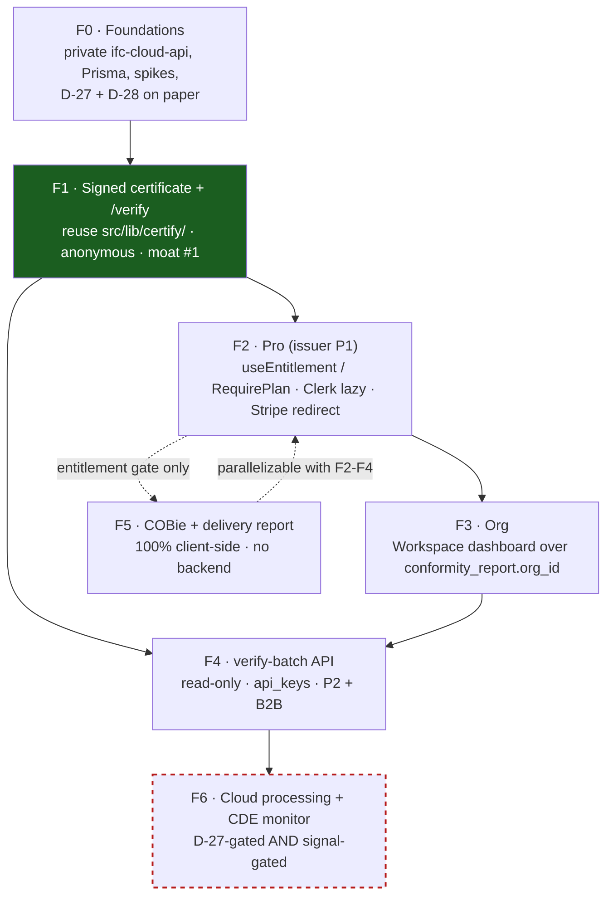

# CDE Roadmap — Delivery‑Conformance Platform (F0..F6)

> **Status: execution blueprint, not a proposal.** The pivot is decided: grow the app from a
> **conformance gate** (a signed checkpoint that sits *in front of* whatever CDE a team already
> pays for — Aconex / ACC / Dalux / Trimble / SharePoint) into a **lightweight CDE** for small/mid
> AEC teams — "DocuSign for BIM deliveries." This document is the forward build plan: phases
> **F0..F6** with goals, gates, ordered tasks, files‑to‑touch, and the moat each phase compounds.
>
> **Public doc.** Product / architecture / integration / tasks only. **No pricing, no go‑to‑market,
> no monetization specifics** — those live in the private `docs-planning/vision/*.md` suite.
>
> Read alongside: [`CDE_VISION.md`](./CDE_VISION.md) (why) · [`CONFORMANCE_DOMAIN.md`](./CONFORMANCE_DOMAIN.md)
> (the 7 entities) · [`CDE_ARCHITECTURE.md`](./CDE_ARCHITECTURE.md) (how the system is shaped) ·
> [`INTEGRATIONS.md`](./INTEGRATIONS.md) (the external contracts) · [`CONFORMANCE_PATTERNS.md`](./CONFORMANCE_PATTERNS.md)
> (the engineering conventions each phase must follow).

---

## 1. The one rule that orders everything

**Grow the *artifact* before the *platform*.** The signed **`ConformityReport`** (moat #1) is the
single asset every later phase monetizes; it is buildable *anonymously, with zero auth*, reusing the
already‑frozen `src/lib/certify/`. So it ships first (**F1**), before any billing, org, or
server‑side model work. Auth, orgs, and B2B surfaces are layers *on top of* an artifact that already
exists and is already being shared.

Two facts anchor the whole plan and appear as a **recurring acceptance criterion in every phase**:

1. **The anonymous, free user's network footprint stays byte‑for‑byte identical to today.** No new
   cookies, no auth libraries in the main bundle, no new network calls for anyone who does not
   explicitly click "Sign in" / "Go Pro." (`docs-planning/01` §12 — provably empty Network tab.)
2. **No IFC bytes cross an origin the user did not choose.** Through F0–F5 only *derived JSON
   summaries* + a *locally‑computed `sha256`* transit the edge (per D‑21). Server‑side model
   processing exists **only** in F6 and **only** behind the **D‑27** privacy‑invariant amendment.

Both are hard invariants, not aspirations. See [`CONTEXT.md`](../CONTEXT.md) invariant 1 and D‑27.

### Certificate‑first ordering — Alternatives considered

| Order | Reason rejected / chosen |
|---|---|
| Pro (billing) first, then certificate | **Rejected.** Billing carries the two hardest spikes (COOP/COEP‑vs‑Clerk, Prisma‑on‑Workers) and has *nothing to sell* until certificates exist. History and branding are meaningless without a corpus of `ConformityReport`s to keep and brand. |
| Certificate first (**F1**), Pro second (**F2**) | **Chosen.** Least auth dependency (anonymous issuance works), validates demand for the artifact *before* building payments, and creates the exact asset F2/F3/F4 monetize. See `docs-planning/00` §4. |
| Cloud processing (F6) early to differentiate | **Rejected.** Breaks invariant 1 as written (needs D‑27), needs different infra (container, not Worker — DA‑7), and has no documented demand signal. Deferred to F6, doubly gated. |

---

## 2. Phase dependency graph

- **F1 is the pivot** (dark green): everything monetizable descends from the artifact it ships.
- **F5 is parallelizable** with F2–F4 — pure client work, a different skill profile (parser/UI, not infra).
- **F6 is dashed/red**: do **not** build until *both* gates open (see §F6). It is specified so it is
  ready when the signal appears, not because it is imminent.

---

## 3. Which moat each phase compounds

| Phase | Builds moat | Note |
|---|---|---|
| **F0** | *(none — pure enablement)* | De‑risks R‑1/R‑2/R‑9 so no later phase is built on sand. |
| **F1** | **#1 — the citable signed number** | The `ConformityReport` artifact every later phase monetizes. |
| **F2** | **#1** (server‑side history the fork cannot replicate) + **#2** (ruleset sync feeds the corpus) | First value a MIT fork cannot copy: it lives on the server. |
| **F3** | **#1** (org‑level aggregation only our backend can produce) | A *team* of issuers deepens the citable number. |
| **F4** | **#1** (B2B measured‑usage surface — counters only we run) | First non‑issuer consumption path. |
| **F5** | **#2 — remediation corpus** (extends the deterministic fix corpus to delivery prose) | Convenience/retention; strengthens the issuer's daily habit. |
| **F6** | **#3 — crawlable/embeddable loop** (CDE‑monitor + `ui=receiver` embed) + **#1** (auto‑issue) | The moat CDEs cannot follow neutrally — but D‑27 + signal gated. |

Moats, verbatim, are the three from the distribution‑led plan (`ROADMAP.md` v2) re‑framed for
conformance: **#1** the signed `ConformityReport` as a cited standard; **#2** the i18n + tool‑specific
remediation corpus (`src/i18n/rule-remediation.ts`, ~440 entries, D‑22); **#3** the crawlable/embeddable
delivery loop (`/r` route in `cf-worker/worker.js`, D‑21; `ui=client`→`ui=receiver`, D‑25).

---

## 4. What already exists (reuse, never rebuild)

~60–70 % of the conformance core already ships and is verified in code. Every phase below *extends*
these; none rebuilds them.

| Asset | Where (verified) | Reused by |
|---|---|---|
| Frozen certify codec + payload builder | `src/lib/certify/canonical.ts` (`CertifyPayloadV1`, `payloadCanonicalBytes`, `computeCertHash`), `src/lib/certify/build-payload.ts` (`buildCertifyPayload`, `computeRulesetVersion`), 23 tests | **F1** |
| In‑memory certificate shape | `ValidationCertificate` + `buildCertificate()` in `src/components/ValidationExportModal.tsx` | **F1** (source of the payload) |
| Health Score | `calculateQualityScore` / `explainQualityScore` in `src/lib/validator.ts` | **F1** (`health_score`) |
| IDS 1.0 engine (golden‑tested vs 100 bSI testcases) | `src/lib/ids/ids-engine.ts` (`runIdsChecks`), `src/lib/ids/ids-runner.ts` (`runIds`), `ids.worker.ts` | **F1** (`ids_spec_hash`), Project ruleset |
| EIR profiles → IdsDocument | `src/lib/eir/eir-compiler.ts` (`compileEirToIds`) | Project `ruleset_version` |
| Stateless edge Worker (pattern to clone) | `cf-worker/worker.js` — routes `/subscribe`, `/r`, `/badge`, `/bench`; CORS allowlist, fail‑open rate‑limit bindings, `smoke-test.mjs` | **F0** (private `ifc-cloud-api` cloned from it) |
| Cross‑boundary codec discipline | `src/lib/share-report.ts` (`buildShareUrl`, `buildBadgeMarkdown`, `buildBadgeUrl`) + its mirror test | **F1** (mirror pattern), **F3** (badge reuse) |
| Remediation corpus (D‑22) | `src/i18n/rule-remediation.ts` (~440 entries) | **F5** (delivery‑report prose) |
| Embed / SDK / receiver‑view seed | `src/sdk/ifc-viewer-sdk.ts`, `src/lib/url-params.ts`, `ui=client` (D‑25) | **F4+** (`ui=receiver`), **F6** |
| BCF 2.1/3.0 round‑trip | `bcfStore` + `bcf-parser.worker`/`bcf-export.worker`, `src/lib/bcf.ts` | Submission review artifacts |

> `useEntitlement` / `RequirePlan` / `pro-entry.ts` / the `vendor-auth` chunk **do not exist yet** —
> they are net‑new in **F2** (verified: no matches in the repo today). The `vite.config.ts`
> `manualChunks` splitter (`vendor-three` / `vendor-ifc` / `vendor-ui`) is where `vendor-auth`
> will be added.

---

## F0 — Foundations

**Goal.** Stand up the private backend spine and de‑risk the two blocking spikes **before any
user‑facing conformance scope**. Nothing ships to users in F0.

**Gate (all must be green before F1 starts).**

- [ ] **Spike S‑1** (COOP/COEP‑vs‑Clerk, R‑1) resolved and recorded in `docs-planning/05`.
- [ ] Prisma driver‑adapter CRUD smoke‑tests green from `wrangler dev` against a **local** Postgres.
- [ ] **D‑27** and **D‑28** written into `DECISIONS.md` (current last decision = **D‑26** — verified).
- [ ] RAT / DPA rows drafted (Clerk US, Stripe US, Supabase EU) per R‑4.
- [ ] **Anonymous free user's network footprint provably unchanged** — empty Network tab (`docs-planning/01` §12).

**Ordered tasks.**

1. Create the **private `ifc-cloud-api`** repo by cloning `cf-worker/` patterns: CORS allowlist,
   fail‑open rate‑limit bindings, secrets via `wrangler secret`, `smoke-test.mjs`. The public
   `cf-worker/` is **not touched** — it stays stateless and part of the privacy story.
2. Author the **Prisma schema** for the 7 entities — `Workspace / Project / Milestone / Submission /
   ValidationRun / ConformityReport / AuditLog` (shapes in [`CONFORMANCE_DOMAIN.md`](./CONFORMANCE_DOMAIN.md)).
3. Wire Prisma on Workers (**R‑2**): `@prisma/adapter-pg` over Supavisor **:6543** (transaction mode)
   + `nodejs_compat`; **two‑URL pattern** (`DATABASE_URL` pooled for runtime / `DIRECT_URL` for
   `prisma migrate`). Accelerate rejected (cost + one more GDPR sub‑processor + latency).
4. Add `docker-compose.yml` **local Postgres** to dodge the **P3014** shadow‑DB failure (**R‑9**):
   `migrate dev` runs against local; Supabase receives **`migrate deploy` only**; CI drift‑check via
   `migrate diff --exit-code`. Never create tables by hand in the Supabase dashboard.
5. Run **Spike S‑1**: mount `@clerk/clerk-react` under the *real* COEP (`require-corp`) headers the
   app forces (`vite.config.ts` lines 202–203) and confirm ClerkJS loads. **Plan B** documented:
   Clerk Hosted Pages by redirect if embedded ClerkJS is blocked (`docs-planning/01` §8). Stripe is
   **always redirect‑only** in every scenario.
6. Fix version pins for `stripe` SDK + svix under the Workers runtime and leave a smoke test (**R‑6**).
7. **Author D‑27 and D‑28** in `DECISIONS.md` (the orchestrator commits these; do not edit
   `DECISIONS.md` from a feature branch).

**The two blocking spikes (do not skip).**

| Risk | What can go wrong | Mitigation | Who/when |
|---|---|---|---|
| **R‑1 · COOP/COEP vs Clerk** | The app forces `Cross-Origin-Embedder-Policy: require-corp` (for `@thatopen` SharedArrayBuffer). Third‑party scripts/iframes without CORP are blocked; ClerkJS loads remote assets + mounts iframes → could break embedded auth. | Stripe redirect‑only (decided); **mandatory S‑1 spike** in F0; documented Plan B (Clerk Hosted Pages). The `useEntitlement`/`RequirePlan` gating pattern is unchanged in either outcome. | Executor, F0. |
| **R‑2 · Prisma on Workers** | Prisma's query‑engine binary does not run in V8 isolates. | Resolved by decision (not ambiguous): driver adapter `@prisma/adapter-pg` + Supavisor :6543 + `nodejs_compat` + two URLs. Residual: if TCP‑per‑request latency > 100 ms p50, enable Hyperdrive (transparent). | Executor, F0 smoke test. |
| **R‑9 · `prisma migrate dev` P3014** | First `migrate dev` against Supabase dies (role can't create the shadow DB) → tempts the fatal "make tables in the dashboard" shortcut that breaks schema versioning. | Local Postgres for `migrate dev`; Supabase gets `migrate deploy` only; CI `migrate diff --exit-code`. Already designed — executor must just respect the flow. | Designed; executor respects it. |

**Files/dirs to touch.** `ifc-cloud-api/` (new private repo: `wrangler.toml`, `worker.js`/`src/`,
`schema.prisma`, `docker-compose.yml`, `smoke-test.mjs`) · `DECISIONS.md` (D‑27, D‑28 — via orchestrator).

**Moat built.** None yet — pure enablement.

---

## F1 — Signed certificate + public verify

**Goal.** Ship the signed **`ConformityReport`** artifact + SPA **`/verify`**, **issuable
anonymously**, reusing the already‑frozen `src/lib/certify/`.

**Gate.**

- [ ] An anonymous user issues a certificate; **anyone verifies it in another browser** via
      `/verify/<cert_hash>`.
- [ ] The `/certify` request carries **ONLY the JSON payload** — no IFC bytes, no filename
      (per `docs-planning/03-feature-certificado-firmado` acceptance criteria and `CertifyPayloadV1`,
      which excludes filename/GlobalIds/element names/coordinates by construction).
- [ ] Signature **fails on a single altered byte**.
- [ ] Dedup: re‑certifying the same file+ruleset+outcome returns the **same `cert_hash`** with
      `deduplicated: true` (`computeCertHash` excludes `validated_at`).
- [ ] Mirror canonicalization test (client `canonical.ts` vs Worker) **green** (guards **R‑8**).
- [ ] Anonymous network footprint unchanged for anyone who does not click "Issue certificate."

**Ordered tasks.**

1. Wire `buildCertifyPayload` (`src/lib/certify/build-payload.ts`) to **real** `validationStore` /
   `idsStore` data from the export surface (`src/components/ValidationExportModal.tsx`, which already
   builds `ValidationCertificate` via `buildCertificate()`). `health_score` = `calculateQualityScore`;
   `rules_result` in canonical `DEFAULT_RULES` order; `ids_spec_hash` from `runIds` when an IDS check ran.
2. Compute `file_hash_sha256` **in‑browser** via WebCrypto from `modelRegistry.getBuffer(modelId)` —
   the bytes never leave the browser (invariant 1).
3. Ship Worker **`POST /certify`** (sign ECDSA‑P256‑SHA256 over `payloadCanonicalBytes`, dedup on
   `computeCertHash`) + **`GET /certificates/:hash`**. The Worker mirrors `src/lib/certify/canonical.ts`
   **byte‑for‑byte**; its test suite reuses the frozen vectors (R‑8, already mitigated: 23 app tests +
   13 skeleton tests share vectors).
4. Generate the ECDSA P‑256 key pair; publish the public key at
   `public/.well-known/ifcvieweronline-keys.json` (+ `.pem`), static and committable.
5. Ship the SPA route **`/verify/:hash`** (`VerifyCertificateView.tsx`) doing **in‑browser** WebCrypto
   verification against the public keys — verification **never trusts the server**.
6. Printable certificate page + QR (`qrcode-generator`).
7. Reuse `buildBadgeMarkdown` from `src/lib/share-report.ts` so the badge links back to a verifiable
   report — never a blind self‑claim.

**Honest threat model (R‑5 — do not overstate).** Anyone can call `/certify` with a fabricated
result: the signature attests **integrity of issuance through the service**, not server‑side
re‑execution. Marketing must **never** claim "impossible to forge." The mitigation is deep‑verification
V2 (drop the IFC → re‑hash + optional local re‑run), recommended for **F1.5** (DA‑9), plus rate limiting.

**Files to touch.** `src/components/ValidationExportModal.tsx` · `src/lib/certify/build-payload.ts` ·
new `src/components/VerifyCertificateView.tsx` · `public/.well-known/ifcvieweronline-keys.json` ·
`ifc-cloud-api` routes `/certify`, `/certificates/:hash`.

**Moat built.** **#1** — the citable signed number; the artifact every later phase monetizes.

---

## F2 — Pro (issuer P1)

**Goal.** Let the issuer **P1** keep certificate history, sync rulesets, and brand reports — first
revenue path — via a **single** entitlement pattern.

**Gate.**

- [ ] Anonymous → sign‑up → **test‑mode** Stripe checkout → return → Pro visible **without manual
      reload** (≤ 30 s polling).
- [ ] `dist/assets/index-*.js` contains **no** Clerk/Stripe string (grep) — auth is lazy‑loaded only.
- [ ] `invoice.payment_failed` → `past_due` + 14‑day `graceUntil` written in DB **and** Clerk metadata.
- [ ] Tampered/expired JWT → **401**.
- [ ] Anonymous network footprint unchanged (nobody who does not click "Go Pro" loads auth).

**Ordered tasks.**

1. Build the entitlement primitives (net‑new): `src/hooks/useEntitlement.ts`,
   `src/components/pro/RequirePlan.tsx`, `ProUpsellModal.tsx`. Single source of truth = DB; Clerk
   metadata is a cache; double‑write happens **only** in the Stripe webhook (see [`CONFORMANCE_PATTERNS.md`](./CONFORMANCE_PATTERNS.md) §1).
2. Add **lazy auth**: `src/lib/pro/pro-entry.ts` (`import('@clerk/clerk-react')`) triggered **only**
   from explicit user actions — Toolbar / `ValidationExportModal` / `CustomProfileModal` / Landing.
   Add a **`vendor-auth`** chunk in `vite.config.ts` `manualChunks` (alongside `vendor-three` /
   `vendor-ifc` / `vendor-ui`) so auth code never enters the main bundle.
3. Worker endpoints: `/billing/checkout`, `/billing/portal`, `/entitlement`; `/webhooks/stripe`
   (idempotent via a `webhook_events` table); `/webhooks/clerk` (svix‑verified).
4. `saved_rulesets` sync — persist `RulesConfig` + `severityOverrides` + thresholds + compiled EIR
   profiles server‑side (feeds moat #2). Waiver sync deferred (DA‑6, recommend "no" for v1).
5. Bind certificate **history** to the `Workspace`.

**Alternatives considered.** *Server‑side render/gate Pro features* → rejected: breaks the byte‑identical
anon footprint and adds infra. *Embed ClerkJS inline* → contingent on S‑1; Plan B is Clerk Hosted Pages
by redirect (never blocks the gating pattern).

**Files to touch.** new `src/hooks/useEntitlement.ts`, `src/components/pro/RequirePlan.tsx`,
`ProUpsellModal.tsx`, `src/lib/pro/pro-entry.ts` · `vite.config.ts` (`vendor-auth`) ·
`src/components/Toolbar.tsx`, `ValidationExportModal.tsx`, `CustomProfileModal.tsx` (lazy triggers) ·
`ifc-cloud-api` billing/webhook routes.

**Moat built.** **#1** (server‑side history a MIT fork cannot replicate) + **#2** (ruleset sync).

---

## F3 — Org

**Goal.** Aggregate issuers' certificates into a **`Workspace`** / org dashboard, filtered over
`conformity_report.org_id`.

**Gate.**

- [ ] An org admin sees **only** their org's `ConformityReport`s.
- [ ] Clerk membership changes mirror to `org_members` within **one webhook cycle**.
- [ ] A non‑member gets **403**.
- [ ] Anonymous network footprint unchanged.

**Ordered tasks.**

1. Enable Clerk **Organizations** (DA‑2: Clerk Orgs + mirror, ratified) + mirror tables
   `organizations`, `org_members` via `/webhooks/clerk` (`docs-planning/01` §6.3). A `Workspace`
   maps 1:1 to a Clerk Organization when `org_id` is set.
2. Worker: `GET /org/:id/certificates`, `/org/invite`, `/org/accept-invite`.
3. Workspace‑scoped dashboard view over **existing** F1/F2 data — a query + membership layer, **not
   new writes**.

**Files to touch.** `ifc-cloud-api` org routes + webhook mirror · new org dashboard view in `src/` ·
schema: `organizations`, `org_members`.

**Moat built.** **#1** — org‑level aggregation only our backend can produce; a team of issuers deepens
the citable number.

---

## F4 — verify‑batch API

**Goal.** Expose **read‑only** batch verification for the verifier **P2** and B2B / CI integrators.

**Gate.**

- [ ] A **revoked** API key returns **401 immediately** — no cache window (sha256 vs `key_hash` on
      every request).
- [ ] Over‑quota returns **429 + `Retry-After`**.
- [ ] **No endpoint accepts model bytes.**

**Ordered tasks.**

1. Schema: `api_keys` (sha256 `key_hash`, `prefix`, `revoked_at`) + `api_usage` counters.
2. Worker `POST /api/v1/verify-batch` — **pure lookup** over `certificates` / `ConformityReport`
   (read‑only; barely any new compute).
3. Per‑key rate limiting (429 + `Retry-After`).
4. Document the contract in [`INTEGRATIONS.md`](./INTEGRATIONS.md).
5. *(Optional, F4+)* ship the **`ui=receiver`** embed preset (extends `ui=client`, D‑25) so a
   `Submission`'s report embeds in any CDE/portal page — advances moat #3.

**Files to touch.** `ifc-cloud-api` `/api/v1/verify-batch` · `docs/INTEGRATIONS.md` · schema
`api_keys`, `api_usage` · (`src/lib/url-params.ts` + `ui=client` for the `ui=receiver` seed).

**Moat built.** **#1** — a B2B measured‑usage surface (counters only we run); first non‑issuer path.

---

## F5 — COBie + client‑side delivery report

**Goal.** Add COBie export and a plain‑language **"why this delivery would be rejected"** report —
**100 % client‑side, no backend, no invariant risk.** Parallelizable with F2–F4.

**Gate.**

- [ ] COBie export + delivery report run **entirely in‑browser** with **zero new network requests**.
- [ ] The Pro variant is gated **only** by `useEntitlement` — client‑side fork‑risk **accepted**
      (DA‑3, ratified: it is convenience, not a moat; server‑izing it would mean uploading the model).

**Ordered tasks.**

1. COBie exporter (`exceljs`) reading `IfcElementQuantity` / psets via the existing takeoff pipeline.
2. Delivery report composes `ValidationRun` + IDS + coverage into **remediation‑first prose**, reusing
   the D‑22 corpus (`getRuleRemediation` in `src/i18n/rule-remediation.ts`). No Worker changes.

**Files to touch.** new `src/lib/cobie/*` + report composer in `src/` · `src/i18n/rule-remediation.ts`
(extend prose) · **no `ifc-cloud-api` changes.**

**Moat built.** **#2** — extends the deterministic remediation corpus (keep it deterministic; never
regress to LLM slop, D‑22). Strengthens the issuer's daily habit.

---

## F6 — Cloud processing + CDE monitor

> **Do not build this until BOTH gates open.** F6 is the only phase that processes models
> server‑side; it is specified so it is *ready when demand appears*, not because it is imminent.

**Goal.** Automatic per‑`Milestone` conformance on files uploaded to the team's **existing** CDE —
the gate becomes a **monitor**.

**Gate — both required, neither skippable.**

1. **D‑27 amendment ratified by the founder** (privacy‑invariant amendment: opt‑in, paid‑only, short
   retention, honest copy — see below). This is a product/brand decision, not an implementation detail.
2. **A real demand signal** — ≥ 1 client with a concrete CDE willing to wire the webhook.

Plus the technical acceptance criteria:

- [ ] Consent is **explicit + per‑action** and **paid‑only** — never anonymous, never a default.
- [ ] **72 h** retention with **guaranteed deletion even on failure**.
- [ ] Outbound webhook proven to **never carry model bytes** (contract test) — only the condensed
      `ConformityReport` (`{job_id, file_hash, health_score, counts, verify_url}`).
- [ ] **SSRF guard** on pull ingest (HTTPS‑only, domain allowlist, private/metadata‑IP block,
      size + timeout caps).

**D‑27 — the privacy boundary shift (must be disclosed accurately).** F0–F5 keep invariant 1 fully
intact — only derived JSON + a local `sha256` transit the edge. D‑27 amends invariant 1 to permit
server‑side IFC processing **only** under all of: (a) explicit per‑action opt‑in; (b) authenticated
**paid** plans only, never anonymous/free; (c) short 72 h retention with guaranteed deletion;
(d) **honest copy** — the proof point becomes *"your IFC model never leaves your browser **unless you
opt into cloud processing**"* and marketing never claims blanket client‑only once F6 ships; (e) SSRF
hardening; (f) new RAT rows + DPAs **before any code**. D‑27 is **founder‑gated** — propose it, do not
silently break invariant 1. (Full contract: [`INTEGRATIONS.md`](./INTEGRATIONS.md) → CDE connectors; R‑3/R‑5 in `docs-planning/05`.)

**Ordered tasks (when both gates open).**

1. Container‑runtime decision **DA‑7** (Cloudflare Containers vs Fly.io vs Railway — deferred, not now).
2. `POST /monitor/ingest?key=` — pull (`{file_url}`, signed CDE URL, preferred) or push (multipart) +
   a queue. SSRF guard on `file_url`.
3. HMAC‑SHA256‑signed **outbound** webhook (`X-Ifcv-Signature`) of the condensed `ConformityReport`
   only, to `webhook_out_url` — **never** the model. Reuses the `cf-worker` Resend notification pattern.
4. `monitor_configs` table; API key `sha256`‑checked against `key_hash` on **every** request (immediate
   revocation, no cache).
5. *(Optional)* auto‑issue a certificate per processed milestone (**DA‑13** — decide with F6).

**Files to touch (F6 only).** `ifc-cloud-api` `/monitor/ingest` + queue + outbound webhook · container
runtime (DA‑7) · R2 (first appears here, D‑27) · schema `monitor_configs`. Per
`docs-planning/03-feature-monitorizacion-cde.md` + `procesado-nube`.

**Moat built.** **#3** (CDE‑monitor + embeddable receiver view CDEs cannot follow neutrally) + **#1**
(auto‑issued certificates) — but strictly D‑27‑ and signal‑gated.

---

## 5. Cross‑phase acceptance criteria (checked every phase)

| Criterion | How it's verified |
|---|---|
| Anonymous network footprint byte‑identical to today | Empty Network tab for a user who never clicks sign‑in / Go‑Pro (`docs-planning/01` §12). |
| No auth code in the main bundle | `grep` `dist/assets/index-*.js` for `clerk`/`stripe` → **zero** matches (F2+). |
| No IFC bytes cross a foreign origin | F0–F5: only JSON + local `sha256`. F6: only under D‑27 opt‑in. Contract test on the outbound webhook. |
| Canonical contract does not drift | Mirror test (client `canonical.ts` vs Worker) on frozen vectors, every F1+ change (R‑8). |
| Prisma schema versioned, never hand‑edited | `migrate deploy` only to Supabase; CI `migrate diff --exit-code` (R‑9). |

---

## 6. Open decisions that gate specific phases (see `docs-planning/05`)

| DA | Decision | Blocks | Recommendation |
|---|---|---|---|
| DA‑1 | Free cap on simultaneous models? | Product posture | **No** — free tier builds moats #1/#3 on purpose; a client‑side cap is forkeable. |
| DA‑2 | Clerk Organizations vs own table | F3 | **Clerk Orgs + mirror** (ratified). |
| DA‑3 | Client‑side Pro gate on COBie/report | F5 | **Accept the fork‑risk** (ratified) — not a moat. |
| DA‑6 | Sync waivers in Pro profile? | F2 | v1: **do not sync** (waivers are per‑project). |
| DA‑7 | F6 container runtime | F6 | Do not decide now. |
| DA‑9 | Deep‑verification V2 in F1 or later? | F1.5 | **F1.5** — right after issuance MVP, before certificate marketing. |
| DA‑13 | Auto‑issue certificate on monitor? | F6 | Decide with F6. |
| DA‑14 | Multi‑model / federated certificate | F1+ | Wait for user signal (v1 = one cert per model). |

Pricing (DA‑8) and licence (DA‑11) are **out of scope for this public doc** — they live in the private
`docs-planning/vision/*.md` suite.

---

## 7. Where the details live

| Question | Doc |
|---|---|
| *Why* this niche, personas, years‑out image | [`CDE_VISION.md`](./CDE_VISION.md) |
| The 7 entities, state machines, invariants (D‑28) | [`CONFORMANCE_DOMAIN.md`](./CONFORMANCE_DOMAIN.md) |
| System shape, privacy boundary, reused‑vs‑new, D‑27 | [`CDE_ARCHITECTURE.md`](./CDE_ARCHITECTURE.md) |
| Integration contracts (SDK, certify, CDE, BCF, verify‑batch) | [`INTEGRATIONS.md`](./INTEGRATIONS.md) |
| Engineering conventions each phase must follow | [`CONFORMANCE_PATTERNS.md`](./CONFORMANCE_PATTERNS.md) |

---

*Last updated: 2026-07-04 · Status: execution blueprint · Phases F0..F6 · New decisions D‑27
(privacy‑invariant amendment, F6‑gating) + D‑28 (immutable Submission + append‑only AuditLog) — to be
added to `DECISIONS.md` after D‑26 · Certificate‑first (F1 before F2) · F6 double‑gated (D‑27 +
demand signal).*
