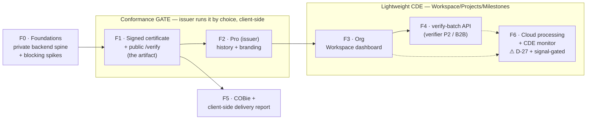

# CDE Vision — Delivery-Conformance Platform ("DocuSign for BIM deliveries")

> **Read order:** this is the north-star vision. For the *what* (entities) see [CONFORMANCE_DOMAIN.md](./CONFORMANCE_DOMAIN.md); for the *how* (system) see [CDE_ARCHITECTURE.md](./CDE_ARCHITECTURE.md); for the *when* (phases/tasks) see [CDE_ROADMAP.md](./CDE_ROADMAP.md); for the *surfaces* (SDK/certify/CDE connectors/BCF/API) see [INTEGRATIONS.md](./INTEGRATIONS.md).
>
> **Public MIT-repo document.** Product/architecture/integration only — no pricing, no go-to-market, no competitive tactics. Those live in the private `docs-planning/vision/` suite.

---

## 1. The one-line thesis

**We are building the neutral, signed checkpoint that proves a BIM handoff met its contractual/EIR requirements at the moment it was delivered — "DocuSign for BIM deliveries" — starting as a conformance *gate* in front of the CDE a team already pays for, and growing phase by phase into a lightweight CDE for the small/mid AEC teams the enterprise platforms underserve.**

The product today is a browser-only IFC viewer, validator, and non-destructive editor (see [CONTEXT.md](../CONTEXT.md)). The pivot does not throw that away — it reframes it. Everything the app already does (parse, render, validate against 44 rules and a full buildingSMART IDS 1.0 engine) becomes the **input** to a single new artifact: a portable, cryptographically verifiable **ConformityReport** that anyone can check in-browser without trusting us.

That artifact is the north star. The platform grows around it, never ahead of it.

---

## 2. Posture: a gate *in front of* existing CDEs — we never ask a team to switch

The enterprise CDEs (Aconex, Autodesk Construction Cloud / ACC, Dalux, Trimble Connect, Newforma, SharePoint) are document-management platforms optimized for storing and routing files at scale. Conformance is a shallow bolt-on for them: they own the *vault*, not the *IFC semantics*.

Our wedge is to sit as a **conformance gate** on the delivery path — a checkpoint the issuer runs *before* the file lands in whatever CDE the project already uses. We do not compete on storage. We turn each delivery into an immutable, signed `Submission` carrying a public `ConformityReport`, and let that report embed back into the host CDE's portal page (via the SDK, see [INTEGRATIONS.md](./INTEGRATIONS.md#js-sdk--embed)).

```
        BIM authoring tool                         Existing CDE
        (Revit/ArchiCAD/Tekla)                     (Aconex/ACC/Dalux/…)
                 │                                        ▲
                 │  IFC export                            │  file lands here, as today
                 ▼                                        │
        ┌─────────────────────────┐   signed report      │
        │  CONFORMANCE GATE (us)   │  ────────────────────┘
        │  validate → certify      │   embeds via ui=receiver
        │  → immutable Submission  │   (SDK / iframe)
        └─────────────────────────┘
```

**Design choice — gate, not replacement**

| | |
|---|---|
| **Decision** | Enter as a low-commitment gate in front of the incumbent CDE; never require a migration. |
| **Alternatives considered** | (a) Build a full CDE and compete head-on for document storage. (b) Ship a plugin *inside* one CDE (e.g. an ACC app). |
| **Reason** | (a) loses on storage scale and seat economics we cannot match, and asks a team to rip out infrastructure — no adoption. (b) forfeits neutrality (the whole value of the certificate is that it is issued by a party with no stake in any single CDE) and couples us to one vendor's roadmap. |
| **Consequence** | Adoption friction is near-zero (run one check before you send). The CDE connectors that automate this are **F6 only** and gated on **D-27** (§7) — until then the gate is a manual, client-side step the issuer runs by choice. |

---

## 3. Personas and their timeline

Three personas, staged by when each starts paying attention. Naming is pinned across the whole doc suite — see [CONFORMANCE_DOMAIN.md](./CONFORMANCE_DOMAIN.md).

| Persona | Who | Job-to-be-done | Comes online |
|---|---|---|---|
| **P1 — Issuer / Emisor** | BIM manager who must deliver a conformant model | Run the gate before delivery, issue a signed `ConformityReport`, keep history, brand reports. Creates **every** `Submission`. | **Revenue day 1** |
| **P2 — Verifier / Verificador** | Reviewer/approver of incoming submissions | Approve or reject a delivery against agreed requirements *without redoing the sender's work*; deep-verify certificates; drive the batch verify API. | **Year 2** (needs a corpus of submissions to verify) |
| **P3 — Receiver / Receptor** | Client or public authority receiving the delivery | Wants assurance that what they received conformed at delivery time; consumes an embedded receiver view. | **2028+ — domain-designed only, not built** |

The **issuer→verifier→receiver** handoff *is* the growth loop: a P1 shares a report link, a P2 opens and verifies it, and (eventually) a P3 receives the certified delivery — each handoff is a potential new account. The receiver view (`ui=receiver`) is a planned extension of the already-shipped `ui=client` skin (D-25, [`src/components/ClientPresentationLayout.tsx`](../src/components/ClientPresentationLayout.tsx)); the preset value is designed now (`EmbedUiPreset` in [`src/lib/url-params.ts`](../src/lib/url-params.ts) currently enumerates `'minimal' | 'full' | 'kiosk' | 'client'`) but P3's flow is not built until 2028+.

---

## 4. How ~60–70% already exists — and what conformance adds

The pivot is a *composition* of already-shipped, already-tested subsystems, not a rebuild. Reuse is the plan.

| Already built (verified in code) | Where | What conformance adds on top |
|---|---|---|
| **buildingSMART IDS 1.0 engine** (six facets, golden-tested vs 100 bSI testcases) | [`src/lib/ids/`](../src/lib/ids/) + `ids.worker.ts`; runner `runIds` in [`src/lib/ids/ids-runner.ts`](../src/lib/ids/ids-runner.ts) | Bind an IDS/EIR spec to a `Project`/`Milestone` as its `ruleset_version`, so each `Submission` is judged against contractual requirements. |
| **EIR profiles → IdsDocument** | [`src/lib/eir/`](../src/lib/eir/) (`compileEirToIds`) | One engine, many rule sources — EIR becomes just another ruleset a `Milestone` can require. |
| **44 validation rules + Health Score** | `DEFAULT_RULES` at [`src/types/index.ts:352`](../src/types/index.ts); `calculateQualityScore`, `explainQualityScore` in [`src/lib/validator.ts`](../src/lib/validator.ts) | The `ValidationRun` result feeds the signed report; the score becomes the citable number. |
| **Frozen certify module** (ECDSA P-256 contract, canonical codec, 23 tests) | [`src/lib/certify/canonical.ts`](../src/lib/certify/canonical.ts) (`CertifyPayloadV1`, `payloadCanonicalBytes`, `computeCertHash`) + `build-payload.ts` (`buildCertifyPayload`) | Wire it to real `validationStore`/`idsStore` data and to a signing Worker route → the `ConformityReport`. |
| **Stateless edge Worker** (email, `/r` crawlable report, `/badge`, `/bench` KV) | [`cf-worker/`](../cf-worker/) | Clone its patterns (CORS allowlist, rate-limit bindings, smoke test) into the private `ifc-cloud-api` backend. |
| **Share-report codec** (cross-boundary contract discipline) | [`src/lib/share-report.ts`](../src/lib/share-report.ts) (`buildShareUrl`, `buildBadgeMarkdown`) | Model for the certify client↔Worker mirror; the badge always links to a *verifiable* report. |
| **Client Presentation Mode** (`ui=client`, D-25) | [`src/components/ClientPresentationLayout.tsx`](../src/components/ClientPresentationLayout.tsx) | Seed for `ui=receiver` — the embeddable receiver view for P3. |
| **BCF 2.1/3.0 round-trip** | `bcfStore` + `bcf-parser.worker.ts`; export [`src/lib/bcf.ts`](../src/lib/bcf.ts) | A `ValidationRun`'s issues export to a BCF topic set; incoming BCF becomes review comments on a `Submission`. |
| **JS SDK + URL/embed params** | [`src/sdk/ifc-viewer-sdk.ts`](../src/sdk/ifc-viewer-sdk.ts), [`src/lib/url-params.ts`](../src/lib/url-params.ts) | Add the `ui=receiver` preset so a `Submission`'s report embeds in any CDE/portal page. |

**What is genuinely new** (built in the private `ifc-cloud-api` backend, not the MIT SPA): the entity persistence layer (Workspace/Project/Milestone/Submission/ValidationRun/ConformityReport/AuditLog), entitlement gating, the ECDSA signing route, and — F6 only — CDE connectors and any server-side model processing. See [CDE_ARCHITECTURE.md](./CDE_ARCHITECTURE.md) for the reused-vs-new inventory.

> The anonymous free user's network footprint stays **byte-for-byte identical to today** at every phase. That is a hard acceptance criterion, not an aspiration — see §7 and the phase gates in [CDE_ROADMAP.md](./CDE_ROADMAP.md).

---

## 5. The years-out product image

When the platform is fully realized, the gate has quietly become a lightweight CDE:

```
Workspace  (tenancy boundary; maps 1:1 to an org)
 └─ Project  (pins a ruleset_version — the contractual/EIR spec)
     └─ Milestone  ("LOD300 coordination", optional stage-specific ruleset)
         └─ Submission  (IMMUTABLE on submit — D-28)
             ├─ file_hash_sha256   (sha256 of IFC bytes, computed in-browser)
             ├─ ValidationRun      (44 rules ∪ IDS ∪ compiled EIR — one engine)
             ├─ ConformityReport   (signed CertifyPayloadV1 — the moat, verifiable by anyone)
             └─ AuditLog           (APPEND-ONLY ledger — submitted/verified/rejected/superseded)
```

The **integrity spine** (formalized as **D-28**, immutable Submission + append-only AuditLog) is what makes it "DocuSign for BIM": a delivery either conformed at submit time or it did not, *provably*. A correction is never an edit — it is a **new** `Submission` (new revision, the old one marked superseded), mirroring how a signed certificate is re-emitted rather than mutated. GDPR erasure anonymizes an actor link (`SetNull`) but never deletes an `AuditLog` entry — the artifact is public and immutable. Full entity fields, states, and invariants are in [CONFORMANCE_DOMAIN.md](./CONFORMANCE_DOMAIN.md).

**On forgeability — an honest boundary.** The `ConformityReport` attests the *integrity of issuance* (this per-rule outcome was signed by our key over this file hash at this time), not re-execution of the check. It does not prove the file the issuer hashed is the file they later delivered elsewhere. The mitigation is deep-verification V2 (drop the IFC into `/verify` → re-hash locally → optionally re-run the engine in-browser), a planned deepening — never a claim that the certificate is "impossible to forge."

---

## 6. The gate → lightweight-CDE evolution (phases at vision altitude)

Detail — ordered tasks, files-to-touch, acceptance gates — lives in [CDE_ROADMAP.md](./CDE_ROADMAP.md). At vision altitude:



| Phase | Goal (vision altitude) | Persona | Privacy posture |
|---|---|---|---|
| **F0 — Foundations** | Stand up the private `ifc-cloud-api` spine; de-risk the two blocking spikes (COOP/COEP-vs-Clerk, Prisma driver-adapter on Workers); write **D-27** and **D-28** to `DECISIONS.md`. No user-facing scope. | — | Anon footprint unchanged (nothing ships to users). |
| **F1 — Signed certificate** | Ship the `ConformityReport` + public `/verify` — issuable **anonymously**, reusing the frozen `src/lib/certify/`. This is the single artifact everything else monetizes. | P1 (anon OK) | Only derived JSON + a locally-computed sha256 cross the edge (D-21 discipline). |
| **F2 — Pro (issuer)** | Let P1 keep certificate history and brand reports via the entitlement pattern (`useEntitlement`/`RequirePlan`, Clerk lazy, Stripe redirect-only). | P1 | Auth libs never in the main bundle; anon still untouched. |
| **F3 — Org** | Aggregate issuers' certificates into a Workspace/org dashboard. A query + membership layer, not new writes. | P1 (team) | Same. |
| **F4 — verify-batch API** | Read-only batch verification for the first verifier (P2) and B2B/CI integrators. A lookup surface — no model bytes accepted. | P2 | No model bytes cross any boundary. |
| **F5 — COBie + delivery report** | COBie export + a plain-language "why this delivery would be rejected" report — **100% client-side, no backend, zero invariant risk**. Parallelizable with F2–F4. | P1 | No new network requests at all. |
| **F6 — Cloud processing + CDE monitor** | Automatic per-milestone conformance on files uploaded to the team's existing CDE — the gate becomes a monitor. **The only phase that processes models server-side.** | P1 → P2 | **Requires D-27** (§7). Opt-in, paid-only, short retention, honest copy. |

**Certificate-first ordering (F1 before F2).** F1 has the least auth dependency (anonymous issuance is sacred — it grows the corpus and the crawlable-report moat), and it creates the artifact that F2/F3/F4 monetize. Building payment before there is anything to attach it to would be building on sand.

---

## 7. D-27 is a hard prerequisite for F6 — not hand-waved

Invariant 1 in [CONTEXT.md](../CONTEXT.md) is explicit: **the IFC file never leaves the browser; edge Workers are permitted only as long as they never receive the model.** F0–F5 keep this fully intact — a `Submission`'s `file_hash_sha256` is computed in-browser via WebCrypto over `modelRegistry.getBuffer(modelId)`, and only derived JSON summaries + that hash ever transit the edge (the D-21 discipline the `/r` route already follows).

**F6 is the sole exception, and it may not be built until [DECISIONS.md] carries the ratified D-27 amendment.**

> **D-27 · Privacy-invariant amendment: opt-in server-side model processing.** Amends CONTEXT.md invariant 1 to permit server-side IFC processing **only** under all of these conditions, none skippable:
> 1. **Explicit per-action opt-in** — never a default.
> 2. **Never for anonymous or free users** — authenticated paid plans only.
> 3. **Short retention** — a 72 h working window with guaranteed deletion even on failure.
> 4. **Honest copy** — the privacy proof point becomes *"your IFC model never leaves your browser **unless you opt into cloud processing**"*; marketing never claims blanket client-only once F6 ships.
> 5. **SSRF/security hardening** on any pull ingest (HTTPS-only, domain allowlist, private/metadata-IP block, size + timeout caps — see [INTEGRATIONS.md](./INTEGRATIONS.md#cde-connectors-f6)).
> 6. **New RAT rows + DPAs** before any code.
>
> **Alternatives considered:** (a) keep invariant 1 absolute and never build F6 — rejected, it forecloses the CDE-monitor moat when demand appears; (b) process on-device only — rejected, a CDE watcher cannot run in the sender's browser.
> **Consequence:** the honest-privacy narrative shifts from *absolute* to *conditional*, and that must be disclosed accurately. **D-27 is founder-gated: propose it, do not silently break invariant 1.**

F6 is additionally **signal-gated**: it does not begin until there is a real demand signal (≥1 client with a concrete CDE willing to wire the webhook) *and* D-27 is ratified. Do not present cloud processing as imminent.

The companion **D-28** (immutable `Submission` + append-only `AuditLog`) is the integrity domain decision introduced with this suite; it is unrelated to privacy but is the other new decision future sessions must respect. Both must be added to `DECISIONS.md` (last existing decision is D-26).

---

## 8. What this document is *not*

- **Not a pricing or GTM doc.** Tiers, triggers, positioning, competitive wedge, and organic-growth flows live in the private, gitignored `docs-planning/vision/` suite (Spanish).
- **Not the entity reference.** Fields, states, and invariants → [CONFORMANCE_DOMAIN.md](./CONFORMANCE_DOMAIN.md).
- **Not the build plan.** Ordered tasks, gates, files-to-touch → [CDE_ROADMAP.md](./CDE_ROADMAP.md).
- **Not the system design.** Two-tier architecture, data-flow, privacy boundary → [CDE_ARCHITECTURE.md](./CDE_ARCHITECTURE.md).
- **Not the contract reference.** SDK/embed, certify issuance+verification, CDE connectors, BCF, verify-batch → [INTEGRATIONS.md](./INTEGRATIONS.md).

---

*Last updated: 2026-07-04 · Status: vision ratified, pivot decided. North star = the signed ConformityReport. Prerequisites for F6: D-27 (ratified + signal) and D-28 written to DECISIONS.md (last existing = D-26). ~60–70% of the core is already shipped and reused, not rebuilt.*
