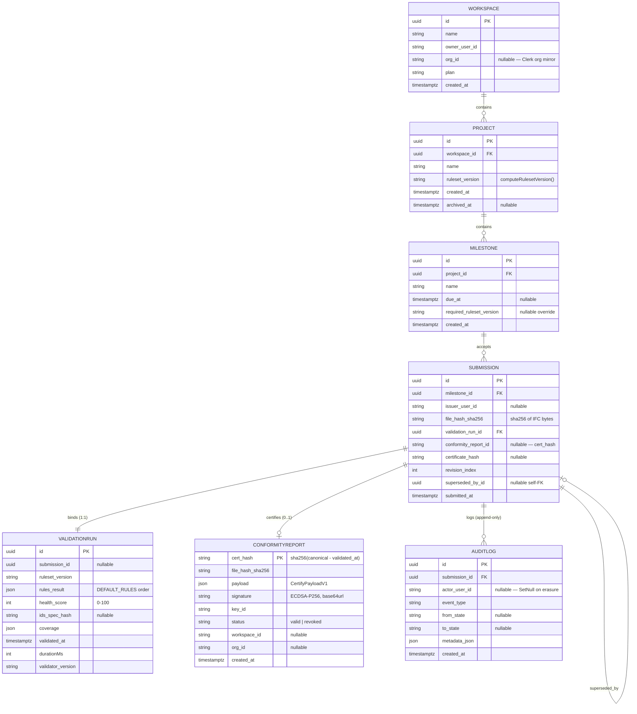
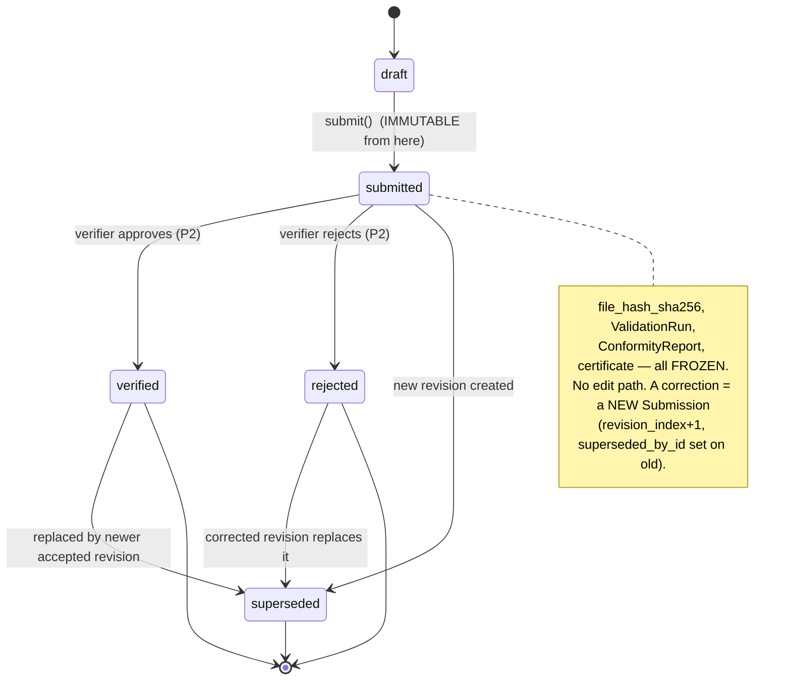

# Conformance Domain Model

> **Canonical entity reference** for the delivery-conformance platform ("DocuSign for BIM deliveries").
> This document defines the seven domain entities, their fields, state machines, and invariants, and maps them onto the IFC concepts and the **already-built** validation / IDS / EIR / certify code. If you are building any conformance feature, this is the contract you implement against.

**Read alongside:**
- [`docs/CDE_VISION.md`](./CDE_VISION.md) — why these entities exist (product north star).
- [`docs/CDE_ARCHITECTURE.md`](./CDE_ARCHITECTURE.md) — how these entities are persisted (private `ifc-cloud-api` Worker + Postgres).
- [`docs/CONFORMANCE_PATTERNS.md`](./CONFORMANCE_PATTERNS.md) — how to touch them safely (canonical-mirror, Result monad, worker/zod, entitlement).

---

## 1. Orientation

The product turns each BIM handoff into a **signed, immutable, publicly verifiable delivery record**. The domain is a strict containment tree with two integrity spines:

```
Workspace ──< Project ──< Milestone ──< Submission
                                            │
                                            ├── ValidationRun     (the client-side outcome)
                                            ├── ConformityReport   (the signed artifact — moat #1)
                                            └── AuditLog[]          (append-only event ledger)
```

Two new decisions govern this domain — reference them **by number**, never renumber:

| Decision | Title | What it fixes |
|---|---|---|
| **D-27** | Privacy-invariant amendment: opt-in server-side model processing | The **only** exception to CONTEXT.md invariant 1. Applies to **F6 only**. F0–F5 keep invariant 1 fully intact. |
| **D-28** | Immutable `Submission` + append-only `AuditLog` | `Submission` freezes on submit; a correction is a new revision. `AuditLog` is append-only; GDPR erasure `SetNull`s the actor, never deletes the entry. |

**~60–70% of this domain is already code.** The entities are a thin persistence + identity layer over engines that ship today:

| Domain concept | Already-built asset | Path |
|---|---|---|
| `ValidationRun` outcome | 44-rule engine + `calculateQualityScore` | `src/lib/validator.ts` |
| `ValidationRun` (IDS source) | golden-tested IDS 1.0 engine (`runIds`) | `src/lib/ids/ids-runner.ts` |
| `ValidationRun` (EIR source) | EIR profiles compiled to `IdsDocument` (`compileEirToIds`) | `src/lib/eir/eir-compiler.ts` |
| `ConformityReport` payload | frozen `CertifyPayloadV1` + canonical codec (23 tests) | `src/lib/certify/canonical.ts`, `build-payload.ts` |
| In-memory serialization | `ValidationCertificate` shape | `src/types/index.ts:840` |
| `file_hash_sha256` | in-browser `sha256Hex(modelRegistry.getBuffer(modelId))` | `src/lib/certify/canonical.ts:102` |

**Field naming convention (pinned):** DB/payload boundary uses `snake_case` (`file_hash_sha256`, `health_score`, `ruleset_version`) to match the frozen `CertifyPayloadV1`. TypeScript app-side stays `camelCase`. Do not cross the two.

---

## 2. ER diagram



> **Cardinality notes.** `Submission` → `ValidationRun` is 1:1 (the run is the frozen evidence bound at submit). `Submission` → `ConformityReport` is 0..1 (a submission may be logged without being certified; certification is the paid, portable step). `ConformityReport` is keyed by `cert_hash` and **deduplicated** — the same file + ruleset + outcome yields the same row, so it can be shared across submissions.

---

## 3. Entities

Fields, states, and invariants below are **verbatim** from the domain blueprint. Do not rename entities or fields.

### 3.1 `Workspace`

| | |
|---|---|
| **Fields** | `id, name, owner_user_id, org_id?, plan, created_at` |
| **States** | `active` \| `suspended` (billing) \| `closed` |

**Invariants.** Top-level tenancy boundary. Maps 1:1 to a Clerk Organization when `org_id` is set (mirrored via webhook — see `docs-planning/01` §6.3). All Projects/history filter by `Workspace`. A free/anonymous user has an **implicit ephemeral Workspace with no server row** until they authenticate (lazy upsert). This is what keeps the anonymous footprint byte-identical to today (see §6, invariant 1).

### 3.2 `Project`

| | |
|---|---|
| **Fields** | `id, workspace_id, name, ruleset_version, created_at, archived_at?` |
| **States** | `open` \| `archived` |

**Invariants.** Belongs to exactly one `Workspace`. `ruleset_version` pins which `RulesConfig` + `severityOverrides`/thresholds (or compiled EIR profile) every `Submission` is judged against. It is computed by `computeRulesetVersion(rules, profileId)` in [`src/lib/certify/build-payload.ts:47`](../src/lib/certify/build-payload.ts), which produces `profile:<id>@sha256:<16-hex>` — a fingerprint over the **entire canonicalised `RulesConfig`**, so enabled rules, naming patterns, required Psets, overrides and thresholds all fold into one discriminator. Changing the ruleset creates a new effective version; existing Submissions keep the version they were judged under (D-28).

### 3.3 `Milestone`

| | |
|---|---|
| **Fields** | `id, project_id, name, due_at?, required_ruleset_version?, created_at` |
| **States** | `upcoming` \| `open` \| `closed` |

**Invariants.** A named delivery checkpoint within a `Project` (e.g. "LOD300 coordination"). Accepts one or more Submissions. `required_ruleset_version` optionally overrides the Project ruleset for stage-specific requirements. Closing a Milestone **freezes which Submission is the accepted one** but never edits the Submissions themselves.

### 3.4 `Submission` — the immutable delivery record (D-28)

| | |
|---|---|
| **Fields** | `id, milestone_id, issuer_user_id?, file_hash_sha256, validation_run_id, conformity_report_id, certificate_hash?, revision_index, superseded_by_id?, submitted_at` |
| **States** | `draft → submitted (IMMUTABLE) → {verified \| rejected \| superseded}` |

**Invariants.**
- **IMMUTABLE on submit (D-28):** `file_hash_sha256`, the bound `ValidationRun` result, the `ConformityReport`, and any issued certificate **freeze**. There is no edit path.
- A correction is a **new `Submission`** with `revision_index + 1` and `superseded_by_id` set on the old one — never an edit. This mirrors the certificate re-emission model (a re-cert on a different day is a *new* payload but dedups to the same `cert_hash` when the outcome is identical; a corrected model has different bytes → a genuinely new record).
- `file_hash_sha256` = `sha256` of the IFC bytes computed **in-browser** via WebCrypto from `modelRegistry.getBuffer(modelId)` — the bytes themselves **never transit** (invariant 1 / D-27). See the caller contract documented in [`src/lib/certify/build-payload.ts:8`](../src/lib/certify/build-payload.ts).
- The model file is **NOT stored server-side in F0–F5**. Server-side model storage is F6-only and gated by **D-27**.

### 3.5 `ValidationRun` — the client-side outcome (one engine, many rule sources)

| | |
|---|---|
| **Fields** | `id, submission_id?, ruleset_version, rules_result[], health_score, ids_spec_hash?, coverage, validated_at, durationMs, validator_version` |
| **States** | `running` \| `complete` \| `failed` \| `cancelled` |

**Invariants.**
- The client-side output of **one engine fed by many rule sources** — never a second checker:
  1. the 44-rule engine (`calculateQualityScore` / `explainQualityScore` in [`src/lib/validator.ts:108`](../src/lib/validator.ts), running in `src/workers/validator.worker.ts`);
  2. the IDS 1.0 engine (`runIds` in [`src/lib/ids/ids-runner.ts:64`](../src/lib/ids/ids-runner.ts));
  3. a compiled EIR profile — `compileEirToIds` in [`src/lib/eir/eir-compiler.ts`](../src/lib/eir/eir-compiler.ts) **compiles to an `IdsDocument` and reuses the same IDS engine** (there is deliberately no parallel validation engine — see the module header).
- `health_score` = `calculateQualityScore` clamped to an integer **0–100** (`Math.max(0, Math.min(100, Math.round(...)))`, per `build-payload.ts:110`).
- `rules_result` is emitted in **canonical `DEFAULT_RULES` order** (`src/types/index.ts:352`). The certify layer derives the canonical rule id list by filtering `DEFAULT_RULES` for `RULE_*` boolean keys (`build-payload.ts:31`) — do not reorder `DEFAULT_RULES` without bumping the validator version.
- Reuses the existing `ValidationCertificate` shape (`src/types/index.ts:840`) as its **in-memory serialization**. A signed `ConformityReport` is **derived** from a completed run, never a re-computation.

**Per-rule aggregate (canonical).** The certify layer collapses issue lists into one status per rule using `worst()` semantics (`build-payload.ts:68`):

| Status | Rule when… |
|---|---|
| `fail` | ≥1 `error`-severity issue |
| `warning` | no errors, ≥1 `warning` |
| `pass` | no errors/warnings (`info` findings are advisory → still `pass`) |

### 3.6 `ConformityReport` — the signed, portable artifact (moat #1)

| | |
|---|---|
| **Fields** | `cert_hash (PK when certified), file_hash_sha256, payload (CertifyPayloadV1), signature, key_id, status, workspace_id?, org_id?, created_at` |
| **States** | `valid` \| `revoked` |

**Invariants.**
- `payload` is the **frozen `CertifyPayloadV1`** (`src/lib/certify/canonical.ts:38`). Fields: `schema_version, file_hash_sha256, validator_version, ruleset_version, rules_result[], health_score, ids_spec_hash, validated_at, org_id`.
- `cert_hash` = `sha256(canonical bytes **excluding** validated_at)` for dedup (`computeCertHash`, `canonical.ts:114`) — re-certifying the same file/ruleset/outcome on a different day yields the same `cert_hash`, so the Worker reuses the stored row (`deduplicated: true`) instead of minting a duplicate.
- `signature` = **ECDSA-P256-SHA256** over the **full** canonical bytes (`payloadCanonicalBytes`, `canonical.ts:95`), base64url.
- **Deliberate minimization — the payload carries NO:** filename, GlobalIds, element names, messages, coordinates, or geometry. It attests the **per-rule aggregate result**, never the model's contents (see `canonical.ts:33` header comment). This minimization is what lets the report be public and crawlable without leaking the model.
- Append-only + dedup (D-28); **never TTL'd** — permanence *is* the value.
- On GDPR `user.deleted`, the user link is `SetNull` but the report **persists** (it is a public, immutable artifact).

> ⚠️ **Never claim the certificate is "impossible to forge."** It attests the **integrity of issuance** — that *this exact per-rule outcome* was signed by our key over *this file hash*. It does not re-execute validation server-side, so a determined issuer could in principle sign a hash of a model that never actually passed (the "forge-at-origin" threat, `docs-planning/05` R-5). The mitigation is **deep-verification V2** (verifier drops the IFC → re-hash + optional local re-run), a moat-#1 deepening item, **not** a claim to make today.

### 3.7 `AuditLog` — the append-only evidential spine (D-28)

| | |
|---|---|
| **Fields** | `id, submission_id, actor_user_id? (SetNull on deletion), event_type, from_state?, to_state?, metadata_json, created_at` |
| **States** | n/a — append-only ledger of events |

**Invariants.**
- **APPEND-ONLY (D-28):** one immutable, timestamped, actor-attributed entry per state transition (`submitted` / `verified` / `rejected` / `superseded` / `certificate_issued`). Never mutated, never deleted.
- GDPR erasure anonymizes `actor_user_id` via **`SetNull` only** (`docs-planning/01` §6.3) — it never removes the entry. The artifact is public/immutable; only the actor link is severed.
- This is the evidential spine of "DocuSign for BIM": the provable history of what happened to a delivery and when.

**Alternatives considered (D-28).**
| Option | Reason rejected | Consequence of chosen design |
|---|---|---|
| Mutable submissions with version history | An editable submission cannot anchor a signed certificate or a dispute — the certificate would attest a state that can silently change. | Corrections are new revisions; storage grows monotonically. |
| Soft-delete of audit entries | Breaks the append-only guarantee that makes the log evidential. | GDPR handled by `SetNull` on the actor, not deletion. |

> **Storage growth is bounded and cheap.** Append-only + dedup: ~5 KB/cert → 100k certs ≈ 500 MB, well within the Supabase tier (`docs-planning/05` R-7). No TTL by design.

---

## 4. Submission state machine (D-28)



**Every transition writes exactly one `AuditLog` entry.** The write is part of the same transaction as the state change so the ledger can never diverge from the record. `draft` is a client-side-only phase (nothing persisted until `submit()`); the ephemeral Workspace stays row-less until then.

**Why a correction is a new revision, not an edit.** A signed `ConformityReport` binds a `file_hash_sha256`. Editing a submitted `Submission` would either (a) invalidate that binding or (b) make the certificate attest a state the record no longer reflects. Both break the "provably conformed at delivery time" guarantee. So the only way to change an outcome is to submit new bytes → new hash → new `ValidationRun` → new `Submission` with `superseded_by_id` chaining the lineage.

---

## 5. Mapping onto IFC concepts

| Conformance concept | IFC / engine reality | Where |
|---|---|---|
| "Did this element conform?" | Issues are keyed by **GlobalId**, not Express ID (Express IDs churn on every re-export). | CONTEXT.md invariant 9 |
| `file_hash_sha256` | `sha256` over the raw IFC byte buffer, the authoritative copy of which lives in `modelRegistry`. | CONTEXT.md invariant 14; `build-payload.ts:8` |
| Rule source: schema/spatial/quality | 44 `DEFAULT_RULES`, run in `validator.worker.ts`. | `src/types/index.ts:352` |
| Rule source: IDS 1.0 facets | six-facet engine golden-tested vs 100 bSI testcases. | `src/lib/ids/ids-runner.ts` |
| Rule source: contractual EIR | editable EIR profile → `IdsDocument` (`compileEirToIds`), judged by the **same** IDS engine. | `src/lib/eir/eir-compiler.ts` |
| `health_score` | `calculateQualityScore` — log-diminishing per-rule penalties subtracted from 100, clamped. | `src/lib/validator.ts:108` |
| `ids_spec_hash` | `sha256` of the `.ids` XML when the run included an IDS check, else `null`. | `canonical.ts:50` |

See [`IFC_DOMAIN.md`](../IFC_DOMAIN.md) for the underlying IFC entity/relationship model the rules traverse.

---

## 6. Invariant table (cross-referenced to CONTEXT.md)

| # | Invariant | CONTEXT.md ref | How this domain honours it |
|---|---|---|---|
| 1 | **No server-side processing of the model** in F0–F5. Only derived JSON summaries + a locally-computed `sha256` cross the edge. | invariant 1, D-21 | `/certify` receives only `CertifyPayloadV1` (JSON, no bytes, no filename). The IFC never leaves the browser. **F6 is the sole exception, gated by D-27** (opt-in, paid, 72 h retention, honest copy). |
| 9 | **Edits/issues keyed by GlobalId**, not Express ID. | invariant 9 | `ValidationRun` issue provenance uses GlobalId; the certified `rules_result` is aggregate-only, so no ids leak into the signed payload. |
| 14 | **`modelRegistry` is the authority** for IFC buffers per model. | invariant 14 | `file_hash_sha256` is computed from `modelRegistry.getBuffer(modelId)`, never `modelStore.ifcBuffer`. |
| 13 | Worker messages validated via **zod** in `worker-schemas.ts`. | invariant 13 | `ValidationRun` inputs (`parseValidatorMsg`, `parseIdsWorkerMsg`) are zod-validated before routing; extend the schemas when adding conformance message types. |

**D-27 boundary in one sentence:** F0–F5 keep invariant 1 absolute (only a locally-computed hash + derived JSON transit the edge); **F6** — and only F6 — may process opt-in model bytes server-side under D-27's mandatory conditions (explicit per-action consent, authenticated paid plans only, 72 h retention with guaranteed deletion even on failure, honest "unless you opt into cloud processing" copy, SSRF hardening, RAT/DPA rows first). Propose F6 work through D-27; never silently break invariant 1.

---

## 7. Building against this domain — checklist

When you touch any conformance entity:

- [ ] Field names at the DB/payload boundary are `snake_case`; app-side is `camelCase`. Do not mix.
- [ ] `ValidationRun` results derive from the existing engines (`calculateQualityScore`, `runIds`, `compileEirToIds`). **Never write a second validation path.**
- [ ] Any change to `CertifyPayloadV1` bumps `CERTIFY_SCHEMA_VERSION` and updates **both** the client (`canonical.ts`) and the mirrored Worker copy, guarded by the frozen vectors in `canonical.test.ts` (a one-byte divergence breaks every signature). See [`docs/CONFORMANCE_PATTERNS.md`](./CONFORMANCE_PATTERNS.md).
- [ ] `Submission` has no edit path — write a new revision.
- [ ] Every state transition writes exactly one `AuditLog` entry in the same transaction.
- [ ] GDPR erasure = `SetNull` on `actor_user_id` / user links, never `DELETE` of a report or audit entry.
- [ ] No IFC bytes cross an origin the user did not choose (F6/D-27 opt-in is the only exception).

---

*Last updated: 2026-07-04 · Status: domain reference for the conformance suite · Entities pinned (Workspace/Project/Milestone/Submission/ValidationRun/ConformityReport/AuditLog) · Governing decisions D-27 (privacy amendment, F6-only) + D-28 (immutable Submission / append-only AuditLog) · Grounded in `src/lib/certify/`, `src/lib/validator.ts`, `src/lib/ids/`, `src/lib/eir/`.*
