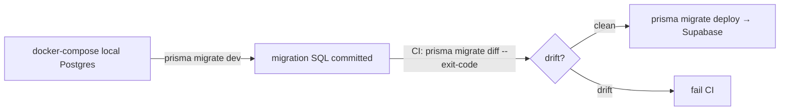

# Conformance Platform — Engineering Patterns

> **What this is.** The "what to touch and how" handbook for anyone building the delivery-conformance platform on top of today's client SPA. Every pattern here is either already shipped in the MIT repo or a documented extension of a shipped pattern. If you are about to add auth gating, a signed-payload endpoint, a worker message, a store field, or an edge route, the convention you must follow is here.
>
> **Scope guard.** Product/architecture/integration/patterns only — **no pricing, no go-to-market, no monetization specifics** (those live in the private `docs-planning/vision/*` suite). This file is public, MIT-appropriate.
>
> **Read alongside:** [`docs/CDE_ARCHITECTURE.md`](./CDE_ARCHITECTURE.md) (the system these patterns build), [`docs/INTEGRATIONS.md`](./INTEGRATIONS.md) (the external contracts these patterns protect), [`docs/CONFORMANCE_DOMAIN.md`](./CONFORMANCE_DOMAIN.md) (the entities they persist), [`docs/CDE_ROADMAP.md`](./CDE_ROADMAP.md) (which phase applies each).

---

## 0. The ten invariants of platform code

Before any pattern, the hard rules. A change that violates one of these is wrong even if it compiles and the tests pass.

| # | Invariant | Enforced by |
|---|---|---|
| I-1 | **The anonymous free user's network footprint stays byte-for-byte identical to today.** No auth/pay library in the main bundle; nothing new fires without an explicit paid-adjacent click. | `dist/assets/index-*.js` grep for `clerk`/`stripe` = empty; clean Network tab (docs-planning/01 §12) |
| I-2 | **No IFC bytes cross an origin the user did not choose** — except F6, opt-in, via **D-27**. Every server endpoint accepts derived JSON + a locally-computed sha256 only. | Payload shapes below; contract tests |
| I-3 | **The value of a paid feature lives on the server** (signature, DB, aggregation, counters). The gating UI is public and forkable by design. | `useEntitlement` returns free without the backend |
| I-4 | **No secret in the MIT repo.** Clerk/Stripe/Supabase keys are Worker Secrets in the private `ifc-cloud-api` repo. The frontend knows only public `VITE_*` URLs. | docs-planning/01 §2, §9 |
| I-5 | **`Result<T,E>` at every I/O boundary** — no throw across a boundary (D-12). | §4 |
| I-6 | **Every worker message is zod-validated before routing** (CONTEXT invariant 13, `worker-schemas.ts`). | §5 |
| I-7 | **Stores hold serialisable data only** (D-05); no Three.js objects, devtools + named actions always on. | §6 |
| I-8 | **The canonical payload codec is byte-identical on both sides of every cross-boundary contract**; a one-byte divergence breaks all signatures (R-8). | §3, frozen vectors |
| I-9 | **The edge is stateless and never touches IFC bytes** except behind D-27/F6. | §7 |
| I-10 | **Every tenant-owned query is workspace-scoped, twice.** `workspaceId` comes from the verified JWT (never the request body), is injected by the tenant-scoped repository, and RLS (`SET LOCAL app.workspace_id`) is the backstop. Quota checks on paid writes are **fail-closed**; abuse rate-limiting stays fail-open. | §7.2; `CONFORMANCE_DOMAIN.md` §3.9/§4.2 |

The certificate attests **the integrity of an issuance** (this payload, these per-rule results, this file hash, signed at this time) — **not** a re-execution of the validation. Never write copy or code comments that claim it is "impossible to forge." See §3.6.

---

## 1. Entitlement gating — `useEntitlement()` / `<RequirePlan>`

**Applies to:** F2 onward. Source of the pattern: docs-planning/01 §3.

### 1.1 The single source of truth + cache split

```
Truth  →  users.plan / users.planStatus / users.graceUntil   (Postgres, private repo)
Cache  →  Clerk user.publicMetadata.plan  { plan, planStatus, v: <epoch> }   (read from loaded session, no network)
```

**Double-write is done in exactly one place: the Stripe webhook** (`POST /webhooks/stripe`, docs-planning/01 §6.2). Order is non-negotiable:

1. `UPDATE users …` in Postgres (the truth).
2. `PATCH` Clerk Backend API `publicMetadata` (the cache).

If step 2 fails, retry — the truth is already persisted and `GET /entitlement` serves it. **Never** write the cache first. No other code path writes `plan`.

> **Alternatives considered.** Supabase Realtime push to refresh the client on plan change — **rejected**: it forces `supabase-js` + an open socket into the client, violating I-1 (the client never talks to Supabase directly; the Worker is the only door). Consequence: freshness after checkout is done by short polling (§1.3), not push.

### 1.2 The hook and the component (files to create, MIT repo)

```
src/hooks/useEntitlement.ts        // returns { plan, status, refresh() }
src/components/pro/RequirePlan.tsx  // <RequirePlan plan="pro" fallback={<ProUpsell/>}>…</RequirePlan>
src/components/pro/ProUpsellModal.tsx
```

`useEntitlement()` contract:

| Condition | Returns | Network |
|---|---|---|
| Clerk not loaded (anonymous) | `{ plan:'free', status:'anonymous' }` | **none** (guards I-1) |
| Clerk session present | reads `publicMetadata.plan` | none (instant) |
| `refresh()` called | `GET /entitlement` → Worker → Postgres | one request; used only on return-from-checkout polling and the billing view |

Mandatory UI states: `checking` (discreet spinner, never blocks the viewer), `past_due` (banner, Pro stays live through the 14-day grace), `canceled` (feature-specific read-only). Grace window is **14 days** from `invoice.payment_failed`.

### 1.3 Acceptance criteria (from docs-planning/01 §12)

- [ ] Anonymous → sign-up → test-mode Stripe checkout → return → Pro visible **without manual reload** (≤30 s polling `GET /entitlement` every 2 s).
- [ ] `grep -r clerk dist/assets/index-*.js` is empty.
- [ ] `invoice.payment_failed` → `past_due` + `graceUntil = now+14d` in DB **and** Clerk metadata; banner shows; at 14 days degrades to `free`.
- [ ] Repeated webhook (same event id) is idempotent (`webhook_events` PK).
- [ ] Tampered/expired JWT → 401 on every authenticated endpoint.

---

## 2. Lazy auth under COOP/COEP — the `pro-entry.ts` boundary

**Applies to:** F2. This is the single hardest constraint in the plan (R-1). Get it wrong and either I-1 breaks (auth in the main bundle) or auth silently fails under production headers.

### 2.1 Why it is hard

The app installs `coi-serviceworker.js`, which injects `COEP: require-corp` + `COOP: same-origin` on **every** page of the origin — required for `SharedArrayBuffer` used by `@thatopen` (see `docs/DEPLOYMENT.md`, D-07). Consequence: any cross-origin script/iframe without a correct `Cross-Origin-Resource-Policy` header is **blocked**. ClerkJS loads CDN assets and mounts iframes; embedded Stripe mounts iframes.

### 2.2 The pattern

```
src/lib/pro/pro-entry.ts   →   import('@clerk/clerk-react') + mount <ClerkProvider> in an isolated portal.
```

`pro-entry.ts` is imported **only** from these four trigger points (nowhere else):

| Trigger | File | Action |
|---|---|---|
| Persistent "Account / Pro" button | `Toolbar.tsx` (right zone, after the `ZoneDivider` ~L696) | entry point |
| Certificate row | `ValidationExportModal.tsx` | offer login for history/branding (anonymous issuance stays login-free — §3) |
| "Save to my account" | `CustomProfileModal.tsx` / `IdsModal.tsx` (EIR editor) | ruleset sync → upsell if `plan==='free'` |
| Pricing CTA | `Landing.tsx` | navigates into the app with the Pro modal open |

Bundle rule: the Clerk chunk must split out as **`vendor-auth`** in `vite.config.ts` `manualChunks` (same mechanism as `vendor-three`). Verifiable: `dist/assets/index-*.js` contains no `clerk` string after build.

**Stripe is redirect-only, always.** `location.href = <checkout url>` — a full-page navigation to `stripe.com` is not subject to our page's COEP. Never embed Stripe Elements.

### 2.3 Spike S-1 + Plan B (must run in F0, before more code)

> **Alternatives considered — auth mounting under real COEP.**
> - **A: `@clerk/clerk-react` mounted in-page** (§2.2). Works iff Clerk assets serve correct CORP — improved by using Clerk's own-domain proxy `clerk.ifcvieweronline.eu` (also better privacy narrative). **Preferred if S-1 passes.**
> - **B (Plan B, documented): redirect to Clerk Hosted Pages** (`accounts.ifcvieweronline.eu`); the app only handles the returned token; the bundle needs only headless `@clerk/clerk-js` for the session.
>
> **Reason to spike first:** the entire §1 gating pattern (hook / metadata / entitlement) is **identical in both scenarios** — only "how the login form is painted" changes. Deciding A vs B is cheap once measured, catastrophic if assumed.
> **Consequence:** F0's gate includes "S-1 resolved and recorded in docs-planning/05 R-1." Do not build F2 UI before that line is green.

---

## 3. The canonical-payload + signature mirror contract

**Applies to:** F1 (certificate). This is the contract that turns a ConformityReport into the moat (#1). It is the same discipline that already protects `share-report.ts` ↔ the report Worker's `decodeReport`.

### 3.1 The rule (R-8)

> `src/lib/certify/canonical.ts` is copied **verbatim** into the private `ifc-cloud-api` Worker. Both sides canonicalise the payload the exact same way before the Worker signs (ECDSA P-256) and before either side derives the dedup hash. **If the two disagree by a single byte, every signature stops verifying.** The frozen vectors in `src/lib/certify/canonical.test.ts` are the shared contract; the Worker's test suite must assert the identical canonical string and hashes.

`canonical.ts` must stay **dependency-free** — no React, no Zustand, no app imports; only `TextEncoder` and `crypto.subtle` — precisely so it can be pasted into the Worker and run in any runtime.

### 3.2 What is signed (the frozen shape)

`CertifyPayloadV1` (`src/lib/certify/canonical.ts`) — deliberately excludes filename, element names, GlobalIds, messages, coordinates, and geometry. It attests **per-rule aggregate results only**:

```ts
interface CertifyPayloadV1 {
  schema_version: 1
  file_hash_sha256: string        // sha256(IFC bytes), computed in-browser
  validator_version: string       // e.g. "2.0.0+r44"
  ruleset_version: string         // "profile:default@sha256:…" — computeRulesetVersion()
  rules_result: { rule_id: string; status: 'pass'|'fail'|'warning' }[]  // canonical DEFAULT_RULES order
  health_score: number            // integer 0–100 (calculateQualityScore, rounded+clamped)
  ids_spec_hash: string | null
  validated_at: string            // ISO-8601 UTC — EXCLUDED from the dedup hash
  org_id: string | null
}
```

### 3.3 Canonicalisation rules (from `canonicalJson`)

- Object keys sorted by **UTF-16 code unit** (`a < b`), **never** `localeCompare` (locale ordering breaks cross-runtime determinism — uppercase sorts before lowercase, `'Z' < 'a'`).
- No whitespace. Arrays keep given order (arrays are semantic).
- `undefined` object values dropped; `null` preserved.
- Throws on values JSON can't represent losslessly (`undefined` at top level / in arrays, functions, symbols, bigints, `NaN`/`Infinity`) — a signed payload must never silently coerce.

### 3.4 Two hashes, two purposes

```
cert_hash   = sha256( canonicalJson(payload WITHOUT validated_at) )   → dedup key + public certificate id
signature   = ECDSA-P256-SHA256 over payloadCanonicalBytes(payload)   → covers the FULL payload incl. validated_at
```

Re-certifying the same file + ruleset + outcome on a different day yields the **same `cert_hash`** (Worker returns the stored row with `deduplicated:true`) but a **different signature** (the timestamp is inside the signed bytes). This is proven by the frozen vector test `re-issuing on a different date keeps the same cert_hash`.

### 3.5 Building the payload (F1 wiring task)

`buildCertifyPayload(args)` in `src/lib/certify/build-payload.ts` is the only sanctioned constructor. It:
- validates `fileHashSha256` is 64 lowercase hex chars (throws otherwise),
- clamps/rounds `health_score` to `[0,100]`,
- emits `rules_result` in canonical `DEFAULT_RULES` order,
- computes `ruleset_version` via `computeRulesetVersion(rules, profileId)` (a stable fingerprint of the effective RulesConfig).

F1 task: wire `buildCertifyPayload` to real `validationStore`/`idsStore` data from `ValidationExportModal.tsx`. The file hash is computed in-browser from `modelRegistry.getBuffer(modelId)` via `sha256Hex` — **the bytes never leave** (I-2).

### 3.6 Honesty about the threat model

> **Do not claim the certificate is unforgeable.** It cryptographically proves that *this payload was signed by our key at this time*. It does **not** prove the browser actually ran the validator on the real file (forge-at-origin: a determined issuer could feed a doctored result to `buildCertifyPayload`). The mitigation is **deep-verification V2** (F1.5, docs-planning/05 R-5 / DA-9): a verifier drops the IFC into `/verify`, the browser re-hashes it against `file_hash_sha256` and optionally re-runs the engine locally. Verification **never trusts the server** — it checks the signature against the public key at `public/.well-known/ifcvieweronline-keys.json`.

### 3.7 Acceptance criteria (F1)

- [ ] `/certify` request body carries **only** the JSON payload — no IFC bytes, no filename (I-2).
- [ ] Signature fails to verify after a single altered byte.
- [ ] Dedup returns the same `cert_hash` + `deduplicated:true`.
- [ ] Client `canonical.test.ts` vectors == Worker vectors (mirror test green on both sides).
- [ ] `/verify/<cert_hash>` re-verifies in a second browser with no server trust.

---

## 4. `Result<T,E>` at all I/O boundaries (D-12)

**Applies to:** everywhere a call can fail asynchronously or silently. `src/lib/result.ts`.

```ts
type Result<T, E = Error> = { ok: true; value: T } | { ok: false; error: E }
```

Rules:
- OPFS ops, cache reads/writes, worker orchestration, and **every new Worker API call** (`api-client.ts`) return `Result<T, AppError>` — never throw across the boundary, never return `T | null`.
- Wrap throwing code at the boundary with `safeAsync(fn)` / `safe(fn)`; consume with `unwrapOr(r, fallback)` or an explicit `if (r.ok)`.
- `unwrap()` is allowed **only** at a boundary where throwing is acceptable (e.g. a top-level effect that toasts).
- `collectResults([...])` short-circuits on the first `Err` — use it for batch certify/verify.

> **Why (D-12).** OPFS fails silently in private browsing; worker errors arrive async. A single `Result` type forces callers to handle both paths at compile time. The new typed HTTP client (`src/lib/cloud/api-client.ts`) must follow the same shape so a 401/429/network error is a typed `Err`, never an unhandled rejection.

---

## 5. Worker protocol + zod validation (CONTEXT invariant 13)

**Applies to:** any new worker message (validator, IDS, BCF, export, GIF, and any future conformance worker). `src/lib/worker-schemas.ts`.

Every message posted from/to a worker is validated through a zod schema **before** it is stored or routed. The pattern:

1. Define the message schema as a `z.object` / `z.discriminatedUnion('type', …)`.
2. Derive the TS type with `z.infer` — **never** hand-write a parallel type (compile-time drift protection).
3. Add a `parseXxxMsg(raw): ParseResult<T>` helper that `safeParse`s and returns `{ ok:false, error: WorkerError('WORKER_INVALID_MSG', …) }` on failure.
4. Both directions are validated where both matter (the IDS runner validates worker→main; the IDS worker validates main→worker via `parseIdsInMsg`).

**Gotcha that has bitten this codebase (do not repeat):** any optional field you forget to declare in the schema is **silently stripped on parse**. The file has explicit warnings on `coverage`, IDS `cardinality`, and `skippedReason` — a missing declaration made the feature no-op while looking correct. When you add a field to a worker payload, add it to the schema in the same commit.

Transferable buffers ride as `z.instanceof(ArrayBuffer)` / `z.instanceof(Uint8Array)` (see GIF/export/IDS schemas) so structured-clone transfer keeps memory flat.

---

## 6. Store conventions (D-05)

**Applies to:** any new Zustand store the platform adds (there are 13 today; a conformance feature that needs client state adds a 14th, not a new state library).

| Rule | Detail |
|---|---|
| Serialisable only | No Three.js objects, no class instances with methods. Three.js geometry management stays in `viewer.ts` (`sceneStore` holds only serialisable data). |
| Devtools + named actions | Every store wraps with Zustand `devtools`; every mutation is a **named** action (shows up in the timeline). |
| Typed selectors | Export typed selectors; consumers subscribe to the narrowest slice. |
| Cross-module events via `appBus` | Do not read one store from another module directly; emit an `appBus` event (D-13, `src/lib/event-bus.ts`). `editorStore` emits on every mutation. |
| `modelRegistry` is buffer authority | Never read `modelStore.ifcBuffer` for multi-model ops; use `modelRegistry.getBuffer(modelId)` (CONTEXT invariant 14). |

Naming: lowerCamelCase + `Store` suffix (`validationStore`, `uiStore`, `presentationStore`). The receiver skin extends the **existing** `uiStore.clientMode`/`ui=client` flag (D-25) into a `ui=receiver` preset — it is a flag layered over the embed chrome, **not** a parallel viewer.

---

## 7. Edge-compute rules (the private `ifc-cloud-api` Worker)

**Applies to:** every route in the private repo. The Worker is a **clone of `cf-worker/` patterns**, not an extension of the public email Worker.

| Rule | Enforcement |
|---|---|
| **Stateless per request** | No in-memory session; truth is Postgres. |
| **Never touches IFC bytes** | Except F6/D-27. F0–F5 endpoints accept derived JSON + a client-computed sha256 only (I-2, I-9). |
| **CORS by allowlist** | Reuse `worker.js` allowlist function (`worker.js:27,66-68`) via `ALLOWED_ORIGINS`. |
| **Rate-limit fail-open** | Reuse the `[[unsafe.bindings]]` fail-open pattern from the current worker. |
| **No PII in logs** | Same criterion as "the Worker does not log the email" (GDPR_COMPLIANCE §7). No email, no Clerk id, no filename in any log line. |
| **Errors are `{ error: { code, message } }`** | Uniform shape; typed `Err` on the client (§4). |
| **Auth in the hot path uses `jose`/`@clerk/backend` `verifyToken`** | Verify signature + `exp` + `azp`; extract `sub`/`org_id`/`org_role` from the JWT. **No call to the Clerk API in the hot path.** Users are created **lazily** on first authenticated request (`upsert by id = sub`) — do not depend on the `user.created` webhook to operate. |
| **API keys checked by hash every request** | `sha256(key)` vs stored `key_hash`; revocation is **immediate**, no cache window (F4). |

> **Why a separate private Worker (docs-planning/01 §2).** The public `cf-worker/` is *pure stateless* and that purity is part of the D-21 privacy narrative — mixing a DB and Stripe keys into it contaminates the story and the risk profile. Reuse the *patterns* (CORS, rate-limit, the cross-boundary-mirror discipline of `share-report.ts` ↔ `decodeReport`, the deploy flow), not the deployment.

### 7.1 F6 / D-27 exception (the only server-side model processing)

The **only** place a model is processed server-side is F6's CDE monitor, and only behind **D-27** (opt-in per action, paid-only, never anonymous/free, 72h retention with guaranteed deletion even on failure, honest copy, SSRF-hardened pull ingest). The outbound webhook carries only the condensed ConformityReport (`{job_id,file_hash,health_score,counts,verify_url}`) — **never** the model. See [`docs/INTEGRATIONS.md`](./INTEGRATIONS.md) for the ingest/SSRF contract and [`docs/CDE_ROADMAP.md`](./CDE_ROADMAP.md) for the two gates (signal + D-27) that must both open first.

### 7.2 Tenant scoping + quota enforcement (I-10) — the multi-tenant pattern

**Applies to:** every tenant-owned route from F2 onward (history, rulesets, org dashboard, api_keys). Domain-level rationale and acceptance criteria: [`CONFORMANCE_DOMAIN.md`](./CONFORMANCE_DOMAIN.md) §3.9/§4.2; cost model: [`CDE_ARCHITECTURE.md`](./CDE_ARCHITECTURE.md) §4.3.

```
route handler ──► requireAuth() ──► workspaceId (from verified JWT, NEVER the body)
                        │
                        ▼
              tenantRepo(workspaceId)          // the ONLY way to touch tenant tables
                        │
                        ▼
     prisma.$transaction([
       SET LOCAL app.workspace_id = $1,        // RLS backstop — transaction-scoped,
       …reads/writes…,                          //   survives Supavisor tx pooling
       usage_counters upsert (same tx)          // metered write + count are atomic
     ])
```

Rules (each one is a review-blocking check):

1. **No handler imports `prisma` directly.** Tenant tables are reached only through `tenantRepo(workspaceId)`, which injects `workspace_id` into every `where`/`data`. Public lookup routes (`/certificates/:hash`) use a separate, explicitly-named `publicRepo` limited to hash lookups.
2. **`SET LOCAL`, never `SET`.** Session-level `SET` leaks across pooled connections under Supavisor transaction mode — the exact bug class RLS is meant to backstop. First statement of every tenant transaction: `SET LOCAL app.workspace_id = '<uuid>'`.
3. **Cross-tenant references return `404`, not `403`** — existence is not leaked. Integration test per entity.
4. **Quota check → write → counter increment, one transaction.** Quota checks on paid writes are **fail-closed** (`429 quota_exceeded`, typed `Err`); abuse rate-limiting stays fail-open. Never swap the two postures.
5. **Limits resolve as** `limit_overrides[key] ?? PLAN_LIMITS[plan][key]` — `PLAN_LIMITS` is a versioned constant in the Worker (zero DB reads on the hot path); the jsonb override exists only for negotiated exceptions.
6. **Role checks stay in the route guard** (JWT `org_role` + `org_members` mirror, §3.8 matrix); RLS encodes tenancy only. One axis per layer, both testable in isolation.

**Contract test (add to the §8.1 table when F2 lands):** with RLS enabled and a repository call deliberately stripped of its tenant filter, the query returns zero rows — the backstop must catch the bug loudly in CI, not in production.

---

## 8. Golden-vector testing + Prisma migration flow

### 8.1 Golden vectors — freeze, never regress

Two frozen-vector suites already guard the moats; new conformance work extends them, never replaces them.

| Suite | What it freezes | Where |
|---|---|---|
| Certify (23 tests) | Canonical string, full-payload sha, `cert_hash`, dedup behaviour, tamper detection | `src/lib/certify/canonical.test.ts` (12), `build-payload.test.ts` (11) |
| Share-report | Client encode == Worker decode | `src/lib/share-report.test.ts` (mirrors the Worker's `decodeReport`) |
| IDS engine | 100 official bSI testcases (all six facets) | `src/lib/ids/` golden fixtures |

**Contract tests each phase must add (assertions about what may cross a boundary, not about behaviour):**

| Phase | Contract test |
|---|---|
| F1 | `/certify` request body contains no key other than the nine `CertifyPayloadV1` fields — no filename, no bytes (I-2). |
| F1 | A certificate signed under a now-`retired` key **still verifies** against `.well-known` (key rotation must never orphan old certificates). |
| F1 | Worker mirror suite asserts the identical frozen vectors (`ce680ab9…04ee` full-payload sha, `941bd944…2832` cert_hash) as `canonical.test.ts`. |
| F2 | `dist/assets/index-*.js` contains no `clerk`/`stripe` string (I-1, build-time grep). |
| F4 | No verify-batch endpoint accepts a body field capable of carrying file content. |
| F6 | The outbound webhook payload serialises to `{job_id, file_hash, health_score, counts, verify_url, result_url}` **only** — a snapshot test, so model bytes *cannot* ride along unnoticed. |

Rule: when you change a frozen payload shape, **bump the schema version** (`CERTIFY_SCHEMA_VERSION`, `SHARE_REPORT_VERSION`) and update **both** sides in the same change. The Worker (private repo) has a mirror test asserting the identical vectors — R-8 is only mitigated while both stay green (docs-planning/05 R-8: ✅ 23 app tests + 13 Worker-skeleton tests over the same vectors).

### 8.2 Prisma migration flow (R-9 — do not shortcut)

> **Blocker (R-9 / P3014).** The first `prisma migrate dev` against Supabase dies with `P3014` — the DB role cannot create the shadow database — and tempts the fatal shortcut of "create tables in the dashboard," which destroys schema versioning.

**Mandated flow (already materialised in the Worker skeleton):**



- Develop against **local Postgres** (`docker-compose.yml` in the skeleton) for `migrate dev`.
- Supabase receives **`migrate deploy` only** — never `migrate dev`.
- CI runs `migrate diff --exit-code` as a drift check.
- Two-URL pattern: `DATABASE_URL` (pooled Supavisor `:6543`, `?pgbouncer=true&connection_limit=1`) for the Worker runtime via `@prisma/adapter-pg` + `nodejs_compat`; `DIRECT_URL` (`:5432`) for `migrate deploy` from CI/local **only, never in the Worker** (`prisma migrate` can't run through pgbouncer transaction mode — advisory locks + multi-statement DDL).

> **Alternatives considered — Prisma on Workers.** Prisma Accelerate — **rejected**: recurring cost, an extra sub-processor to document in the GDPR RAT, and a latency hop. Driver adapter gives the same result with no third party. Residual risk: TCP connect latency per request → if measured >100 ms p50, interpose **Cloudflare Hyperdrive** (transparent to Prisma; only the URL changes). Consequence: F0's gate includes a `wrangler dev` CRUD smoke test proving the adapter path works before any feature is built on it.

---

## 9. Quick reference — pattern → phase → file

| Pattern | First phase | Primary files |
|---|---|---|
| Entitlement gating (§1) | F2 | `src/hooks/useEntitlement.ts`, `src/components/pro/RequirePlan.tsx` |
| Lazy auth under COOP/COEP (§2) | F2 (spike F0) | `src/lib/pro/pro-entry.ts`, `vite.config.ts` (`vendor-auth`) |
| Canonical mirror contract (§3) | F1 | `src/lib/certify/canonical.ts` + `.test.ts`, `build-payload.ts`, `ValidationExportModal.tsx` |
| `Result<T,E>` (§4) | all | `src/lib/result.ts`, `src/lib/cloud/api-client.ts` (new) |
| Worker zod protocol (§5) | all | `src/lib/worker-schemas.ts` |
| Store conventions (§6) | all | any new `*Store.ts`, `src/lib/event-bus.ts` |
| Edge-compute rules (§7) | F1 | private `ifc-cloud-api` Worker (clones `cf-worker/`) |
| Tenant scoping + quotas (§7.2) | F2 | `tenantRepo` in the private Worker; `usage_counters`; `PLAN_LIMITS` constant |
| Golden vectors + Prisma flow (§8) | F0/F1 | `*.test.ts` suites, `schema.prisma`, `docker-compose.yml` |

---

**Cross-references:** [`docs/CDE_ARCHITECTURE.md`](./CDE_ARCHITECTURE.md) · [`docs/INTEGRATIONS.md`](./INTEGRATIONS.md) · [`docs/CONFORMANCE_DOMAIN.md`](./CONFORMANCE_DOMAIN.md) · [`docs/CDE_ROADMAP.md`](./CDE_ROADMAP.md). Decisions referenced: D-05, D-07, D-12, D-13, D-21, D-25, plus **D-27** (privacy-invariant amendment, ⏸️ written but founder-gated) / **D-28** (immutable Submission + append-only AuditLog, active) — both in `DECISIONS.md` since 2026-07-04. (`docs-planning/*` references point at the private, gitignored planning suite — they will not resolve in a public checkout.)

*Last updated: 2026-07-06 (rev 2: I-10 tenant-scoping invariant + §7.2 tenant repo / SET LOCAL / quota fail-closed pattern) · Status: patterns handbook for the conformance platform — grounded in shipped code (certify/result/worker-schemas/share-report/validator) + docs-planning/01 & 05. Public/MIT-appropriate.*
