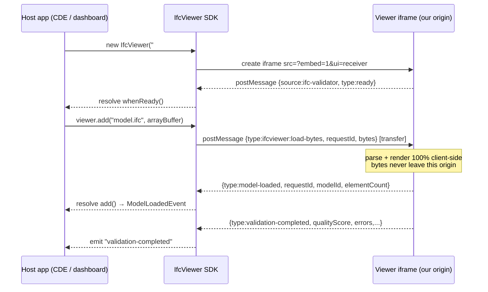
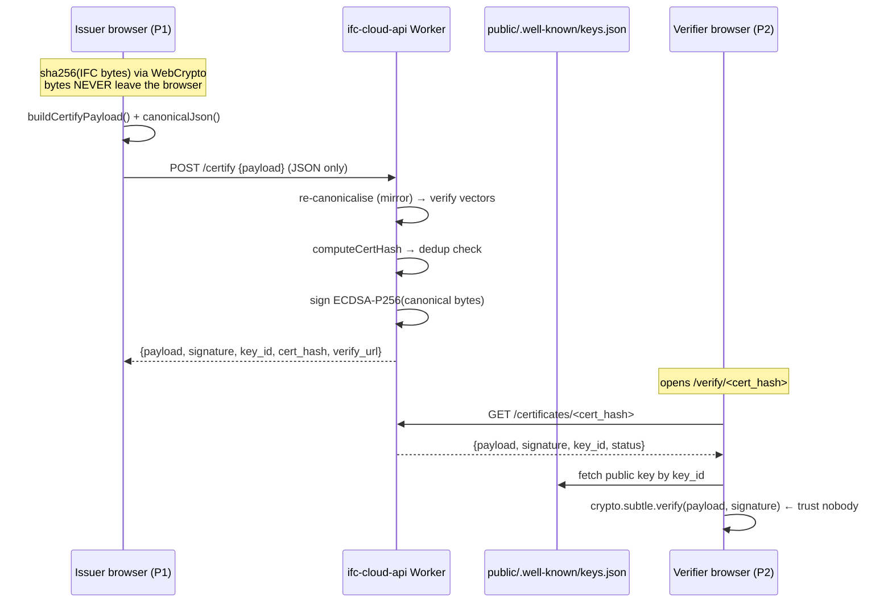

# Integrations

> **Audience:** integrators and engineers building the outward-facing surfaces of the
> IFC delivery-conformance platform.
> **Scope:** every way an external system talks to us — the embeddable JS SDK/iframe,
> signed-certificate issuance + public verification, CDE connectors, BCF round-trip,
> and the read-only verify-batch API. Contracts, sequence diagrams, and the security
> notes (SSRF, key revocation) that each surface must honour.

This document is one of the public engineering docs for the conformance platform. See
also [`CDE_ARCHITECTURE.md`](./CDE_ARCHITECTURE.md) (system picture),
[`CONFORMANCE_DOMAIN.md`](./CONFORMANCE_DOMAIN.md) (the `ConformityReport` /
`Submission` shapes referenced here), and
[`CONFORMANCE_PATTERNS.md`](./CONFORMANCE_PATTERNS.md) (the contract-mirror and
`Result` conventions the code below follows).

---

## The invariant every integration honours

> **No IFC bytes cross an origin the user did not choose.**

This is CONTEXT.md invariant 1, and it is repeated in the contract for every surface
below. Concretely:

- The SDK/iframe streams bytes the **host app already holds**, over `postMessage`, to an
  origin the integrator picked. We never fetch a file to a server.
- Certificate issuance sends **only a JSON payload + a locally-computed `sha256`** — the
  model never leaves the browser.
- The verify-batch API **accepts no model bytes at all** — it is a lookup surface.
- The **only** exception is the F6 CDE monitor, where a paid, authenticated user
  **opts in** to server-side processing under **D-27** (privacy-invariant amendment:
  explicit per-action opt-in, paid plans only, 72 h retention with guaranteed deletion,
  honest copy, SSRF hardening). F6 is both signal-gated and D-27-gated — it is not built
  yet, and it never applies to anonymous or free users.

| Surface | Phase | Crosses the privacy boundary? | Auth |
|---|---|---|---|
| JS SDK / iframe embed | shipped | No — bytes stay in the host origin | none |
| Certificate issuance `/certify` | F1 | No — JSON payload + local `sha256` only | optional JWT |
| Public verification `/verify` + `/certificates/:hash` | F1 | No — verification runs in the browser | none |
| BCF 2.1/3.0 round-trip | shipped | No — client-side zip/unzip | none |
| verify-batch API | F4 | No — no bytes accepted | API key |
| CDE monitor `/monitor/ingest` | **F6, D-27** | **Yes — opt-in model bytes** | API key |

---

## 1. JS SDK & iframe embed

**Status:** shipped (SDK `v1.7.0`). Source: [`src/sdk/ifc-viewer-sdk.ts`](../src/sdk/ifc-viewer-sdk.ts),
built to `public/sdk/`. URL parsing: [`src/lib/url-params.ts`](../src/lib/url-params.ts).
Reference: [`docs/EMBED_URL_PARAMS.md`](./EMBED_URL_PARAMS.md).

The SDK is a ~6 KB dependency-free class (`IfcViewer`) plus an `<ifc-viewer>` custom
element. It mounts the app in an `<iframe>` and drives it two-way over `postMessage`.
Because the host app passes **bytes** (`viewer.add(name, ArrayBuffer)`), there is no
SSRF surface: the SDK never asks a server to fetch a URL. `addFromUrl()` exists only for
**public, CORS-enabled** URLs the integrator already trusts, and the fetch happens in the
visitor's browser.

### Message protocol (already implemented)

All messages from the viewer carry `{ source: 'ifc-validator', type, ... }`; commands to
the viewer use the `ifcviewer:` namespace. Loads and queries are correlated with a
`requestId` so a host `add()` promise never resolves against an app-initiated load
(`onMessage` in `ifc-viewer-sdk.ts`).

| Direction | `type` | Payload / effect |
|---|---|---|
| viewer → host | `ready` | `{ languages }` — mounted, ready for commands |
| viewer → host | `model-loaded` | `{ modelId, fileName, elementCount, fromCache }` |
| viewer → host | `model-error` | `{ message, url?, name? }` |
| viewer → host | `validation-completed` | `{ qualityScore, errors, warnings, info }` |
| viewer → host | `element-selected` | `{ expressId, modelId, ifcType, name }` |
| host → viewer | `ifcviewer:load-bytes` | `{ requestId, name, bytes }` (transferable) |
| host → viewer | `ifcviewer:load` | `{ requestId, url, name? }` (public URL) |
| host → viewer | `ifcviewer:select` / `:isolate` / `:fit` / `:reset` / `:view` | camera / selection |
| host → viewer | `ifcviewer:get-*` | request/response queries (`get-stats`, `get-issues`, `get-validation`, `check-ids`, `check-eir`) |

### Sequence — host streams bytes, drives the viewer



### New: `ui=receiver` preset (extends D-25 `ui=client` seed)

The receiver persona (P3, see `CONFORMANCE_DOMAIN.md`) needs a Submission's
`ConformityReport` to embed inside **their** CDE/portal — a show-only, non-technical
skin. This extends the shipped `ui=client` skin (D-25), which already renders a large
semantic Health Score badge, a verify CTA, and hides all editing chrome
(`EMBED_URL_PARAMS.md` §presets). `ui=receiver` is that skin narrowed further to a
signed report + verify affordance.

**Alternatives considered**

| Option | Reason rejected |
|---|---|
| A brand-new receiver viewer | Rejected — `ui=client` (D-25) already owns the show-only chrome; a parallel viewer duplicates the preset plumbing in `url-params.ts` and the presenter-gear logic. |
| Reuse `ui=client` verbatim | Rejected — `client` still exposes tour/capture affordances aimed at a **presenter**; the receiver wants a report + "verify this" and nothing else. |

**Consequence:** `receiver` is added as a preset string in
[`src/lib/url-params.ts`](../src/lib/url-params.ts) (alongside `minimal|full|kiosk|client`)
and to `IfcViewerPreset` in `ifc-viewer-sdk.ts`; `buildSrc()` already forwards any non-`minimal`
`ui` value, so no SDK transport change is needed.

**Acceptance criteria**

- [ ] `?ui=receiver` renders the signed-report skin with no editing/tour chrome.
- [ ] The report embed can be pointed at a certified Submission via `#report=` / a `verify_url`.
- [ ] The anonymous network footprint is byte-for-byte unchanged (empty Network tab beyond app assets).
- [ ] `postMessage` stays two-way; `ready`/`element-selected` still fire.

---

## 2. Signed certificate issuance & public verification

**Status:** F1. The canonical codec is **already frozen and tested**:
[`src/lib/certify/canonical.ts`](../src/lib/certify/canonical.ts) (`CertifyPayloadV1`,
`canonicalJson`, `payloadCanonicalBytes`, `computeCertHash`) with 23 tests in
`canonical.test.ts`, and the pure builder `buildCertifyPayload()` /
`computeRulesetVersion()` in `src/lib/certify/build-payload.ts`. What F1 wires is the
Worker endpoints and the SPA `/verify` route. Full spec:
[`docs-planning/03-feature-certificado-firmado.md`](../docs-planning/03-feature-certificado-firmado.md).

The `ConformityReport` **is** the signed `CertifyPayloadV1` (see `CONFORMANCE_DOMAIN.md`).
It deliberately excludes file name, GlobalIds, element names, messages and coordinates —
it attests the **per-rule aggregate result**, never model contents.

### The contract & why the mirror matters

This is a **cross-boundary contract**: the browser canonicalises the payload with
`canonicalJson()`; the private `ifc-cloud-api` Worker re-canonicalises the **exact same
bytes** before signing and before deriving the dedup hash. A one-byte divergence between
the two implementations breaks every signature. The guard is the frozen vector set in
`canonical.test.ts`, which the Worker's test suite must mirror byte-for-byte. From the
existing tests the frozen vectors are:

```
canonicalJson(example payload)  → sha256 = ce680ab9…04ee
computeCertHash(example payload) → cert_hash = 941bd944…2832
```

See `CONFORMANCE_PATTERNS.md` for the general contract-mirror discipline (same pattern as
`share-report.ts` ↔ `cf-worker/worker.js`).

- **Signature:** `ECDSA-P256-SHA256` over the full canonical bytes, base64url.
- **`cert_hash` (dedup key + public id):** `sha256(canonical bytes **excluding**
  `validated_at`)` — so re-issuing the same file + ruleset + outcome on another day yields
  the same id and the Worker reuses the row.
- **Algorithm choice — ECDSA P-256, not Ed25519:** verification MUST run in any receiver's
  browser; P-256 has universal WebCrypto support, Ed25519 does not yet. (Recorded in the
  feature doc / `05`.)

### `POST /certify` — public, optional auth, rate-limited

**Request** (the payload from `CertifyPayloadV1`, unsigned; only JSON + the local hash):

```jsonc
{
  "schema_version": 1,
  "file_hash_sha256": "9f86d08…",              // sha256 of IFC bytes, computed in-browser
  "validator_version": "2.0.0+r44",            // CERTIFY_VALIDATOR_VERSION (auto-derived from DEFAULT_RULES)
  "ruleset_version": "profile:iso19650@sha256:ab12…",
  "rules_result": [ { "rule_id": "RULE_EMPTY_NAME", "status": "pass" }, … ],
  "health_score": 82,                          // integer 0-100 (calculateQualityScore)
  "ids_spec_hash": null,
  "validated_at": "2026-07-03T10:12:00Z",
  "org_id": null
}
```

- Optional `Authorization: Bearer <JWT>`. With a valid JWT and `"save_to_history": true`,
  the row persists `user_id` (and `org_id` if the JWT carries an active org). **Anonymous
  issuance is the default and is sacred** — no login prompt.
- Server validation: strict schema, known `schema_version`, `health_score` integer 0-100,
  every `rule_id` in the Worker's embedded 44-rule allowlist (a new rule = a Worker deploy).
- Dedup: existing `cert_hash` → return it with `"deduplicated": true`, no new row.
- Rate limit: `CERTIFY_LIMITER` `{ limit: 10, period: 60 }` per IP, fail-open (same
  `[[unsafe.bindings]]` mechanism as `/subscribe` in `cf-worker/worker.js`).

**Response `200/201`:**

```jsonc
{
  "payload": { …full payload… },
  "signature": "MEQCIB…",
  "key_id": "2026-07-k1",
  "cert_hash": "3c9a…",
  "verify_url": "https://www.ifcvieweronline.eu/verify/3c9a…",
  "deduplicated": false
}
```

### `GET /certificates/:hash` — public, no auth

`:hash` is a `cert_hash` (one row) or a `file_hash_sha256` (may return several — different
rulesets over the same file). Returns `{ match: 'cert'|'file', certificates: [{ payload,
signature, key_id, status, created_at }] }`; `404` if none. Cacheable at the edge
(`Cache-Control: public, max-age=300`) — immutable except on revocation.

### Sequence — issue anonymously, verify in another browser



### Honest security posture (do not overclaim)

The signature attests **integrity of issuance through our service** — that the payload was
not altered after signing — **not** re-execution on a trusted server. Because the repo is
MIT, anyone can `POST /certify` a hand-crafted JSON. This is an accepted v1 threat,
mitigated by: (a) honest copy on `/verify` ("result computed in the issuer's browser with
IFC Viewer Online vX"); (b) **deep verification V2** (F1.5) where a receiver who already
holds the file drops it on `/verify` to re-hash (`sha256` must match `file_hash_sha256`)
and optionally re-run the engine locally — making forgery detectable without breaking any
invariant; (c) rate limiting against mass issuance.
**Never** market "impossible to forge"; market "verifiable and tamper-evident".

### Key rotation

`key_id` (e.g. `2026-07-k1`) rides in every response and is persisted per certificate.
`public/.well-known/ifcvieweronline-keys.json` publishes
`{ keys: [{ kid, alg:"ES256", spki_pem, status:"active"|"retired" }] }`; retired keys stay
so old certificates keep verifying. A compromised key is marked `revoked`; per-certificate
`status='revoked'` handles point revocations (spam/abuse).

**Acceptance criteria** (from the feature doc)

- [ ] Anonymous issue → verify from another browser at `/verify/<cert_hash>`.
- [ ] Network tab shows `/certify` carrying **only** the JSON — no IFC bytes, no file name.
- [ ] Signature verifies with the published key and **fails on a single altered byte**.
- [ ] Same file + ruleset twice → same `cert_hash`, `deduplicated:true`, one DB row.
- [ ] Flow degrades to the unsigned local JSON certificate when the Worker is unreachable.
- [ ] The client↔Worker canonicalisation mirror test passes on the same vectors.

---

## 3. CDE connectors (F6 — D-27-gated)

**Status:** deferred to F6, and gated on **both** the D-27 amendment being ratified **and**
a real demand signal (≥1 client with a concrete CDE willing to wire the webhook). This is
the **only** integration that processes model bytes server-side. Full spec:
[`docs-planning/03-feature-monitorizacion-cde.md`](../docs-planning/03-feature-monitorizacion-cde.md).

The posture is a **gate/monitor in front of the CDE the team already pays for** — we never
ask them to switch. A model uploaded to Aconex/ACC/Dalux/SharePoint triggers a webhook to
us; we validate and return a **condensed `ConformityReport` only** — never the file.

### Ingest — `POST /monitor/ingest?key=<api_key>`

Auth by API key in the query (many CDEs cannot set custom headers; the `X-Api-Key` header
is the documented preference). The key is verified by `sha256` against `key_hash` on
**every** request — revocation is immediate, **no cache** (§8).

| Mode | Body | Notes |
|---|---|---|
| **Pull** (preferred) | `{ file_url }` | A signed URL from the CDE. We download → validate → **delete** (72 h max, D-27). The file is never uploaded "by hand". |
| **Push** | `multipart/form-data` (file) | For CDEs without signed URLs; per-plan size cap. |

Returns `202 { job_id }`. Processing reuses the F5 cloud queue/container (`cloud_jobs`,
same retention/deletion regime).

### Outbound — `POST <webhook_out_url>` (condensed report only)

```jsonc
{ "job_id": "…", "file_hash": "9f86…", "health_score": 82,
  "counts": { "errors": 3, "warnings": 7, "info": 12 },
  "verify_url": "https://…/verify/<cert_hash>",   // when auto-certificate is enabled (DA-13)
  "result_url": "https://…/dashboard/job/…" }
```

Signed `HMAC-SHA256` with a per-config secret in `X-Ifcv-Signature` (the same pattern
Stripe applies to us) so the receiver can verify authenticity. **The outbound payload
never contains the model bytes** — this is a contract test, not a code-review hope.
Retries with backoff (3 attempts / 24 h); config marked `failing` after N failures.

### Sequence — CDE upload → conformance → webhook

```mermaid
sequenceDiagram
    participant CDE as Team CDE (Aconex/ACC/Dalux/SharePoint)
    participant Worker as ifc-cloud-api /monitor
    participant Q as Cloud queue + container (F5)
    participant Hook as webhook_out_url

    CDE->>Worker: POST /monitor/ingest?key=…  {file_url}  (pull)
    Worker->>Worker: sha256(key) vs key_hash — no cache; SSRF guard on file_url
    Worker-->>CDE: 202 {job_id}
    Worker->>Q: enqueue job
    Q->>CDE: GET file_url (HTTPS, allowlisted host)
    Note over Q: validate (44 rules + IDS) → delete file ≤72h (D-27)
    Q->>Hook: POST condensed ConformityReport  (X-Ifcv-Signature: HMAC)
    Note over Hook: never the model bytes
```

### SSRF hardening on pull ingest (mandatory)

A `file_url` is attacker-influenced, so the pull fetch must:

- **HTTPS only** — reject `http:`, `file:`, `gopher:`, etc.
- **Domain allowlist** — optional per-config allowlist of CDE hosts.
- **Block private / metadata IPs** — resolve the host and reject RFC-1918 ranges,
  loopback, link-local, and cloud metadata endpoints (`169.254.169.254`, `metadata.*`);
  re-check after any redirect (guard against DNS-rebind / redirect-to-internal).
- **Size cap + timeout** — per-plan max bytes and a hard request timeout.

### Per-connector notes

| CDE | Trigger | File delivery | Notes |
|---|---|---|---|
| **Aconex** | Workflow / event webhook | Pull via signed URL | Prefer pull; map delivery to a `Milestone`. |
| **Autodesk ACC / BIM 360** | Webhooks API (`dm.*` events) | Pull via signed URL | Two-legged app auth on the CDE side; we only receive the webhook + fetch the signed URL. |
| **Dalux** | Export/publish webhook | Pull | Confirm signed-URL TTL exceeds our queue latency. |
| **SharePoint / Graph** | Graph change notification | Pull via Graph download URL, or Push | Graph subscriptions expire — client re-subscribes on their side, not ours. |

**Acceptance criteria** (from the feature doc)

- [ ] A revoked key gets `401` on `/monitor/ingest` immediately (no cache window).
- [ ] The outbound webhook payload never contains file bytes (contract test).
- [ ] A signed outbound webhook verifies with the config secret; a tampered one does not.
- [ ] The downloaded/uploaded file is deleted per the F5 regime **even on failure**.
- [ ] A simulated CDE (`curl` script) drives the full ingest → process → webhook cycle.
- [ ] Consent is explicit, paid-only, per D-27; anonymous/free users can never reach this path.

---

## 4. BCF 2.1 / 3.0 round-trip

**Status:** shipped. Source: [`src/lib/bcf.ts`](../src/lib/bcf.ts) (`importBcf`,
`exportBcfZip`, `issuesToBcfTopics`, `downloadBcfBlob`) + `bcfStore` +
`src/workers/bcf-parser.worker.ts`. This is a **client-side** integration surface — the
`.bcfzip` is zipped/unzipped in the browser (`fflate`), so no bytes cross the boundary and
there is **no new transport**.

- **Export:** a `ValidationRun`'s issues → a BCF topic set. `issuesToBcfTopics(issues,
  snapshotBase64?)` maps each `ValidationIssue` to a `BcfTopic` (title `[ruleId]
  elementName`, description = message), optionally attaching a viewpoint snapshot.
- **Import:** an incoming `.bcfzip` is parsed off-thread (worker → `bcfStore.setTopics`)
  and its topics/comments become `AuditLog`-visible review comments on a `Submission`
  (see `CONFORMANCE_DOMAIN.md`).
- **Camera viewpoints** reuse the shared `getCameraViewpoint()` primitive (D-24) so a BCF
  viewpoint, a tour step, and a certificate snapshot all frame the model identically.

**Conformance mapping**

| BCF concept | Conformance domain |
|---|---|
| Topic | A review item on a `Submission` |
| Comment | An `AuditLog`-visible review comment |
| Viewpoint | Reuses `getCameraViewpoint()` (D-24) |

**Consequence:** BCF is treated as an **integration surface, not differentiation** — every
coordination tool has BCF. We reuse it as the interop path into/out of the review flow; we
do not invest in it as a moat.

---

## 5. verify-batch API (F4, B2B)

**Status:** F4. A **read-only lookup** over the `certificates` / `ConformityReport` table —
the first non-issuer revenue path (a verifier P2, or a large issuer's CI, wires it up).
It adds essentially no new compute. Spec: `docs-planning/01` §6.4 + the api-verificación doc.

- **`POST /api/v1/verify-batch`** — accepts a list of `cert_hash` and/or `file_hash_sha256`;
  returns each report's status + summary. **No model bytes are accepted** on any endpoint.
- **Auth:** API key, `sha256`-checked against `key_hash` on every request (`api_keys`:
  `id`, `user_id`/`org_id`, `key_hash`, `prefix`, `created_at`, `last_used_at`,
  `revoked_at`). Usage metered in `api_usage` counters.
- **Rate limiting:** per key; over-quota returns `429` with `Retry-After`.

```jsonc
// POST /api/v1/verify-batch   Header: X-Api-Key: ifck_live_…
{ "hashes": ["3c9a…", "9f86d08…"] }
// → 200
{ "results": [
    { "hash": "3c9a…", "match": "cert", "status": "valid",
      "health_score": 82, "verified": true },
    { "hash": "9f86d08…", "match": "file", "certificates": [ … ] }
] }
```

**Acceptance criteria**

- [ ] A revoked API key returns `401` immediately — **no cache window** (§8).
- [ ] Over-quota returns `429` + `Retry-After`.
- [ ] No endpoint accepts model bytes.

---

## 6. Cross-cutting security rules

### API key revocation is immediate (no cache)

Both the CDE monitor (§3) and verify-batch (§4) verify `sha256(key)` against `key_hash`
by reading `revoked_at` **on every request**. There is deliberately **no in-memory or
edge cache of key validity** — the moment a key is revoked in the dashboard, the next
request fails `401`. This is an explicit acceptance criterion, not an optimisation to be
"improved" away later.

### Result monad at every boundary

All I/O boundaries (Worker handlers, SDK request/response, BCF import) return
`Result<T,E>` rather than throwing across the edge (D-12). See `CONFORMANCE_PATTERNS.md`.

### Worker message validation

Every worker message is validated with zod via `worker-schemas.ts` (invariant 13). The
BCF parser already does this (`parseBcfParserMsg` in `bcf.ts`); new workers follow suit.

### Rate limiting is fail-open

Rate limiters return "allow" when unbound or on error (`underLimit` in
`cf-worker/worker.js`) so an infra hiccup never blocks a legitimate free user. Abuse
throttling is best-effort; correctness (signature, key check) is never fail-open.

---

## Reused vs. new — integration inventory

| Surface | Reuses (shipped) | New for the platform |
|---|---|---|
| SDK / embed | `ifc-viewer-sdk.ts`, `url-params.ts`, `ui=client` (D-25) | `ui=receiver` preset string |
| Certificate | `certify/canonical.ts` + `build-payload.ts` (frozen, 23 tests), `buildBadgeMarkdown` (`share-report.ts`) | Worker `/certify`, `/certificates/:hash`, SPA `/verify`, `.well-known` keys |
| CDE monitor | F5 queue/container, Resend email pattern (`cf-worker/`), `api_keys` | `/monitor/ingest`, HMAC outbound, `monitor_configs`, SSRF guard |
| BCF | `bcf.ts`, `bcf-parser.worker.ts`, `getCameraViewpoint` (D-24) | — (mapping to `Submission`/`AuditLog` only) |
| verify-batch | `certificates` table (from F1) | `/api/v1/verify-batch`, `api_keys`/`api_usage` |

---

*Last updated: 2026-07-04 · Status: SDK/embed + BCF shipped; certificate (F1) codec frozen, endpoints pending; verify-batch (F4) and CDE monitor (F6, D-27-gated) designed, not built.*
