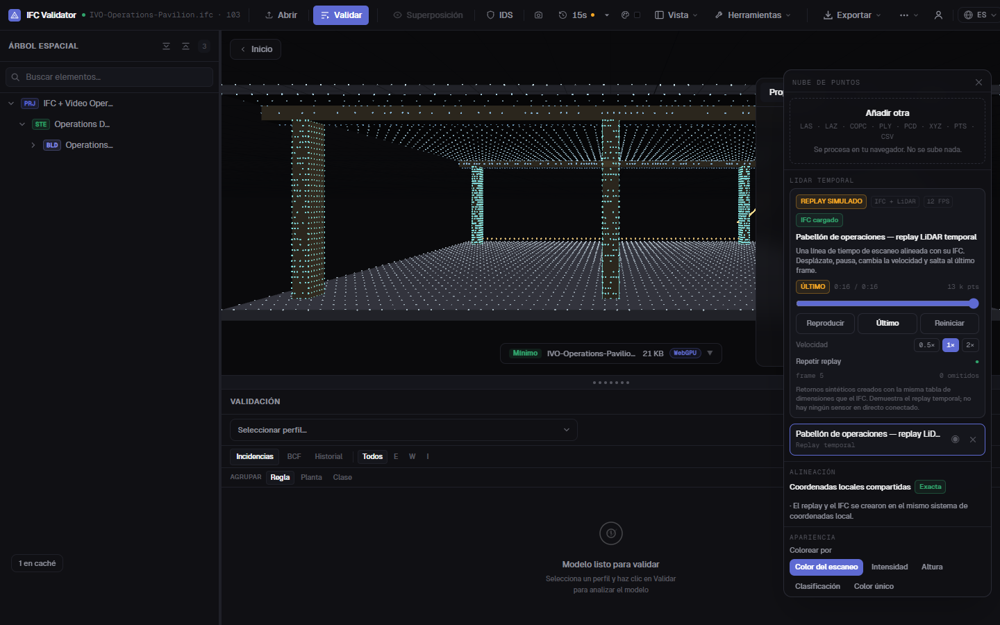

# LiDAR, vídeo y nubes de puntos en tiempo real

**Fecha de investigación:** 2026-08-20

**Estado:** vídeo MP4/WebM/Ogg, cámara/pantalla local, demo IFC + vídeo, mejoras de cámara, replay LiDAR temporal IFC-alineado, contrato binario validado, buffer de tres frames, fallos de red simulados y adaptador MCAP indexado ya implementados. La adquisición LiDAR viva y el gateway todavía no están implementados porque requieren escoger sensor y hardware.

**Objetivo:** añadir reproducción temporal y fuentes vivas al visor IFC sin degradar el flujo estático existente ni presentar una superposición como fiable cuando faltan calibración o timestamps.

## 1. Conclusión ejecutiva

No existe una única función llamada “vídeo de nube de puntos”. Son cuatro productos distintos:

| Producto | Entrada | Dificultad | Utilidad |
|---|---|---:|---|
| Vídeo 2D dentro de la escena | MP4/WebM/WebRTC | Baja | Inspección visual y cámaras de obra |
| Secuencia grabada de puntos | MCAP/frames indexados | Media | Replay, diagnóstico y demostraciones reproducibles |
| LiDAR vivo | Paquetes de sensor o ROS 2 `PointCloud2` | Alta | Operación, seguridad, seguimiento y digital twin |
| Vídeo volumétrico | G-PCC/V-PCC u otro codec temporal 3D | Muy alta | Telepresencia y captura dinámica densa |

La arquitectura recomendada para este repositorio es:

1. **Mantener COPC para nubes estáticas grandes.** Ya permite seleccionar nodos del octree mediante HTTP Range; no debe convertirse en un falso formato de vídeo.
2. **Usar MCAP como contenedor de grabaciones** de puntos, imágenes, poses y transformaciones. Un gateway reproduce el intervalo solicitado y el navegador conserva solo una pequeña ventana temporal.
3. **Usar WebSocket binario como transporte vivo inicial.** Es compatible con navegadores y proxies actuales y encaja con un gateway ROS 2/Foxglove.
4. **Usar WebRTC para vídeo RGB.** El navegador obtiene decodificación de vídeo, control de congestión y latencia baja; el frame se presenta como `<video>` y, si procede, como `THREE.VideoTexture`.
5. **Añadir WebTransport progresivamente**, con streams fiables para esquema/calibración/keyframes y datagramas para frames reemplazables. Debe existir fallback: WebTransport sigue siendo un Working Draft del W3C.
6. **No conectar el navegador directamente al UDP o USB propietario del LiDAR.** Un proceso edge debe hablar con el SDK del fabricante, filtrar, transformar, registrar y publicar un contrato estable.

```text
LiDAR / depth camera / RGB camera
                │
                ▼
   Edge gateway junto al sensor
   SDK fabricante → timestamps → pose/TF → ROI/voxel → registro
                │
       ┌────────┴─────────┐
       │                  │
WebSocket/WebTransport   WebRTC
 puntos + pose + estado  vídeo RGB
       │                  │
       └────────┬─────────┘
                ▼
 Web Worker → buffer circular → GPU
                │
                ▼
 IFC + scan vivo + timeline + métricas de calidad
```

## 2. Lo que ya tiene el repositorio

La base actual evita tener que empezar de cero:

- Lectores PLY, PCD, XYZ, LAS, LAZ y COPC.
- Worker de parsing y transferencia de `ArrayBuffer`.
- Origen local para evitar pérdida de precisión con coordenadas geográficas grandes.
- Un `THREE.Points` por chunk, nunca un objeto por punto.
- Posiciones `Float32`; RGB, intensidad, clasificación y confianza como bytes normalizados.
- Frustum culling, presupuesto global de puntos y LOD dependiente de cámara.
- Streaming COPC por nodos, caché de nodos, periodo de gracia y expulsión.
- Alineación escalonada y ajustes manuales sin mover el IFC.
- Picking y medición sobre el rango realmente dibujado.

Lo que falta para datos temporales es deliberadamente diferente:

- pose real del sensor por frame;
- adaptadores de esquema para ROS/Foxglove (el payload propio y MCAP ya existen);
- conexión viva a un gateway real (la política y reconexión simulada ya existen);
- sincronización del vídeo y los puntos;
- estado visible de latencia, calidad y calibración.

Intentar representar todo eso cargando un PLY nuevo por frame provocaría asignaciones, garbage collection, re-creación de geometrías y una latencia inaceptable.

### Replay temporal implementado

El panel de nubes incluye ahora **Pabellón de operaciones — replay LiDAR
temporal**. Un solo botón carga el IFC4 asociado y reproduce un barrido de 16 s
creado desde la misma tabla dimensional (18 × 12 m, seis pilares, vigas y
cubierta). La interfaz ofrece Play/Pause, seek, 0,5×/1×/2×, Latest, loop,
secuencia, puntos vigentes y frames omitidos.

La demo se identifica en pantalla como `REPLAY SIMULADO`: los retornos no vienen
de un sensor físico. Sí ejercita el camino de producto que interesa validar antes
de comprar hardware:

- `timestampMs` y secuencia monotónica por frame;
- reloj finito con pausa, seek, velocidad, Latest y loop;
- una única geometría `DynamicDrawUsage` de capacidad fija;
- actualización del prefijo activo mediante `updateRanges` y `drawRange`;
- arrays del generador y buffers GPU reutilizados entre frames;
- memoria GPU calculada desde la capacidad residente, no desde el frame actual;
- IFC translúcido y nube en el mismo sistema local, sin mover el modelo.

El replay actual genera como máximo 12 actualizaciones GPU/s. Si el navegador
no mantiene el ritmo, el reloj avanza y registra frames omitidos en vez de crear
una cola que reproduzca el supuesto presente con retraso.

Además, cada frame pasa ya por el camino de entrada que usará una fuente externa:

- paquete binario little-endian `IVPF` v1 con tamaño, stride y atributos declarados;
- CRC32 del payload y rechazo de posiciones/metadata no finitas;
- tres slots de arrays preasignados, sin cola proporcional a la sesión;
- descarte de duplicados, frames tardíos y frames superados;
- política `newest valid frame wins` antes de copiar a la geometría GPU;
- modo **Inyectar fallos**, que hace visibles pérdida, reordenación, corrupción y
  reconexión simuladas sin etiquetarlas como telemetría de un sensor.

El botón **Descargar ejemplo MCAP indexado** genera localmente 33 frames a 2 fps.
El adaptador usa `McapIndexedReader`, valida CRCs del contenedor y recorre los
mensajes por chunks; el preflight conserva índices y como máximo un payload, no
toda la grabación. El canal usa el payload propio
`ifcviewer.point-frame.v1`: todavía no afirma compatibilidad automática con
`sensor_msgs/PointCloud2` o `foxglove.PointCloud`.



## 3. Fuentes de datos viables

### 3.1 Ouster: opción LiDAR profesional

El SDK oficial abre tanto sensores vivos como PCAP, OSF, rosbag y MCAP, produce frames y expone paquetes LiDAR/IMU. El driver ROS oficial publica `PointCloud2`. Es una buena opción para una demostración industrial exterior o de gran campo de visión.

Integración propuesta:

```text
Ouster → Ouster SDK / ouster-ros → /ouster/points + /tf
       → gateway → contrato binario del visor
```

No se debe enviar el PCAP crudo al navegador: la decodificación, la compensación de movimiento y el conocimiento de intrínsecos pertenecen al edge.

### 3.2 Livox Mid-360: opción industrial compacta

Livox SDK2 recibe directamente los puntos de Mid-360/HAP y es compatible con Windows y Linux. Su ROS Driver 2 publica nubes, pero el propio proyecto advierte que el driver está orientado a pruebas y necesita endurecimiento para producción. Es apto para una demo, no una garantía de despliegue industrial sin trabajo adicional.

### 3.3 RealSense: prototipo interior económico

RealSense SDK 2.0 entrega profundidad, color y calibración intrínseca/extrínseca. Es útil para prototipar una cámara RGB-D, vídeo coloreado y espacios interiores. No se debe describir automáticamente como LiDAR ni atribuirle precisión de levantamiento.

### 3.4 iPhone/iPad con LiDAR

ARKit ofrece por frame `sceneDepth`, `smoothedSceneDepth`, mapa de confianza y la imagen capturada en dispositivos compatibles. Apple publica incluso una muestra que genera una nube coloreada desde esos datos.

La captura profesional debe hacerse en una aplicación nativa pequeña:

```text
ARKit depth + confidence + capturedImage + camera.transform
→ cuantización/filtrado local
→ WebRTC vídeo + WebSocket/WebTransport puntos
```

WebXR Depth Sensing existe como especificación, pero no debe ser el único camino de producto: depende del dispositivo, navegador y sesión XR. La aplicación nativa ofrece control y trazabilidad superiores.

### 3.5 Datos grabados antes de comprar hardware

La primera demo temporal debería usar una grabación con:

- `PointCloud2` o `foxglove.PointCloud`;
- vídeo comprimido o imágenes;
- `/tf` o poses equivalentes;
- calibración;
- timestamps comunes.

MCAP está diseñado para mensajes pub/sub con timestamp y lectura indexada por tiempo/topic. Permite probar seek, pausa, pérdida de frames y sincronización utilizando exactamente el mismo gateway de la fuente viva.

## 4. Contrato mínimo de un frame de puntos

### Binary frame contract implementado

La versión 1 implementada es deliberadamente simple antes de cuantizar. Cabecera
fija de 96 bytes:

| Offset | Tipo | Campo |
|---:|---|---|
| 0 | `u32` | magic `IVPF` |
| 4 | `u16 + u16` | versión y bytes de cabecera |
| 8 | `u32` | máscara RGB/intensidad/clase/confianza/bounds |
| 12 | `u32` | secuencia monotónica |
| 16 | `u64` | timestamp en nanosegundos |
| 24 | `u32` | número de puntos |
| 28 | `u16` | stride, 18 bytes en v1 |
| 32 | `Float64 × 3` | origen local |
| 56 | `Float32` | radio de culling |
| 60 | `Float32 × 6` | bounds min/max |
| 84 | `u32` | bytes de payload |
| 88 | `u32` | CRC32 del payload |

Cada punto ocupa 18 bytes: XYZ `Float32` (12), RGB `Uint8` (3), intensidad,
clase y confianza `Uint8` (3). Los flags distinguen atributos disponibles; los
bytes ausentes conservan un layout fijo y nunca se exponen como datos reales.
El decoder aplica presupuesto antes de reservar/copiar y rechaza magic, versión,
layout, longitud, CRC, bounds o posiciones inválidos.

Esta v1 prioriza que la demo y el futuro gateway compartan un contrato auditable.
La cuantización a `Uint16` descrita debajo sigue siendo una optimización posterior
que necesita escala/origen por tile y un benchmark de error.

El visor no debe acoplarse a los paquetes de Ouster, Livox o cualquier fabricante. El gateway normaliza cada frame a un encabezado estable y un payload binario.

Campos obligatorios:

| Campo | Razón |
|---|---|
| `streamId` | Distinguir sensores y reconexiones |
| `sequence` | Detectar pérdidas, duplicados y reordenación |
| `timestampNs` | Sincronizar vídeo, puntos, pose e IFC |
| `frameId` | Declarar el sistema de coordenadas |
| `pointCount` y `stride` | Validar el payload antes de tocar GPU |
| `origin[3]` en Float64 | Mantener precisión global y vértices locales pequeños |
| `pose` | Transformar sensor → mundo/IFC en el instante de captura |
| `attributeMask` | XYZ, RGB, intensidad, clase, confianza, retorno, etc. |
| escala/offset de cuantización | Reconstruir posiciones locales |
| codec y tamaño | Validar y decodificar de forma acotada |

Payload inicial recomendado por punto:

```text
position: Uint16 x 3   6 B   (coordenadas dentro del frame/tile)
rgb:      Uint8  x 3   3 B   opcional
intensity Uint8        1 B   opcional
class     Uint8        1 B   opcional
padding/flags          1 B
---------------------------
total típico          12 B/punto
```

La cuantización siempre se declara. No se puede asumir que 16 bits sirven para toda la obra: el gateway selecciona un tile/origen y una escala cuya resolución cumpla el caso de uso.

Ejemplos de ancho de banda **sin compresión**, solo para dimensionar:

| Supuesto | Cálculo | Payload |
|---|---:|---:|
| 100.000 puntos, 10 Hz, 12 B/punto | `100k × 10 × 12` | 12 MB/s |
| 250.000 puntos, 10 Hz, 12 B/punto | `250k × 10 × 12` | 30 MB/s |
| 1.000.000 puntos, 10 Hz, 12 B/punto | `1M × 10 × 12` | 120 MB/s |

Por eso el filtrado, ROI, voxelización y presupuesto deben aplicarse antes de atravesar Internet. “Transmitir todos los puntos” no es un requisito de calidad.

## 5. Transporte: decisión razonada

| Tecnología | Uso recomendado | Ventaja | Límite |
|---|---|---|---|
| HTTP Range + COPC | Nube estática/contexto histórico | Ya implementado, cacheable, espacial | No es temporal ni vivo |
| MCAP | Grabación y replay | Topics, timestamps e índice | Requiere lector/gateway de reproducción |
| WebSocket binario | MVP de puntos vivos | Compatibilidad y despliegue sencillos | Un flujo fiable puede acumular retraso |
| WebRTC | Vídeo RGB vivo | Codec hardware, jitter buffer, congestión | Señalización y operación más complejas |
| WebRTC DataChannel | Telemetría/puntos pequeños | P2P y modos unordered | No sustituye automáticamente un pipeline de puntos |
| WebTransport | Puntos vivos avanzado | Streams múltiples y datos no fiables/reemplazables | API/especificación aún en evolución; necesita fallback |
| G-PCC/V-PCC | Volumétrico a gran escala | Codec temporal específico de puntos | Decoder web y pipeline mucho más complejos |

### Política de latencia

Para una vista viva, un frame viejo vale menos que uno nuevo. El cliente debe:

1. conservar 2–3 frames como máximo;
2. eliminar el frame pendiente más antiguo si llega uno más nuevo;
3. no bloquear el render esperando un frame perdido;
4. mostrar latencia y frames descartados;
5. cambiar a “degradado/desconectado” si la edad supera el umbral configurado.

Los streams fiables se reservan para calibración, esquemas, comandos, anotaciones y keyframes. Los frames efímeros pueden viajar por un canal reemplazable/no fiable cuando el transporte lo permita.

## 6. Pipeline del navegador

### 6.1 Ingesta

- La UI crea una sesión y valida URL, protocolo, autenticación y límites.
- Un Web Worker recibe bytes, valida cabecera/tamaño y decodifica.
- Con aislamiento cross-origin (`COOP`/`COEP`) se puede usar `SharedArrayBuffer`; sin él se usan `ArrayBuffer` transferibles.
- El worker escribe en un buffer circular preasignado. No crea arrays nuevos por punto.

### 6.2 GPU

- Una geometría dinámica por stream, no por frame.
- Capacidad fija negociada; `drawRange` expresa el número vigente de puntos.
- `BufferAttribute.updateRanges`/`bufferSubData` actualiza solo la región escrita.
- El shader reconstruye la posición local cuantizada con `origin + scale`.
- RGB, intensidad, clase, confianza y edad siguen siendo atributos compactos.
- Si un frame supera la capacidad, se reduce en el edge o se elige una muestra; no se realoca la GPU en mitad de la interacción.

### 6.3 Acumulación temporal

Un LiDAR rotatorio puede verse incompleto en un único sweep. El usuario puede elegir:

- **Latest:** solo el frame más reciente; menor latencia.
- **Accumulate 0.5–2 s:** varios sweeps transformados a un frame común, con alpha por edad.
- **Freeze:** congela un instante para medir o comparar.
- **Difference:** conserva el contexto estático y transmite únicamente cambios.

Acumular sin compensar la pose produce “dobles paredes”. Solo se habilita cuando hay transformación válida por timestamp.

## 7. Integración de vídeo

### Nivel 1 — vídeo acompañado

Panel 2D sincronizado con la timeline. Es el primer entregable porque aporta contexto sin afirmar una calibración espacial.

### Nivel 2 — pantalla/cámara dentro de la escena

Un `<video>` de MP4/WebM o WebRTC alimenta `THREE.VideoTexture`. Se representa en un plano, marcador de cámara o viewport flotante. Three.js actualiza la textura cuando hay un frame de vídeo disponible y no genera mipmaps por defecto.

**Implementado en esta iteración para MP4/WebM/Ogg:** modos Screen, Terrain y
Billboard; colocación automática relativa al IFC; X/Y/Z, heading/tilt/roll,
anchura, opacidad y offset de superficie; Play/Pause/Seek/Loop/Mute; encuadre y
teardown completo. Incluye un IFC4 y un clip sintético local generados desde la
misma geometría. Guía práctica: [`VIDEO_3D.md`](./VIDEO_3D.md).

### Nivel 3 — proyección calibrada

El vídeo colorea puntos o se proyecta sobre IFC mediante:

```text
pixel = K · T_camera_world(t) · T_world_point · point
```

Se necesitan:

- intrínsecos `K`, distorsión y resolución;
- extrínsecos LiDAR↔cámara;
- pose de cámara por timestamp;
- clocks sincronizados;
- prueba de reproyección con error documentado.

Sin esos datos, la aplicación debe etiquetar el modo como **unregistered** y no ofrecer medición Scan-to-BIM sobre la imagen.

WebCodecs solo es necesario si se requiere acceso de bajo nivel a frames, composición especial o codecs fuera del flujo normal de `<video>`. Para un stream WebRTC ordinario, `<video>` + `VideoTexture` es más sencillo y aprovecha mejor el navegador.

## 8. Alineación con IFC

Para cada punto vivo:

```text
p_ifc(t) = T_ifc_world · T_world_sensor(t) · p_sensor
```

La cadena debe conservar:

- unidades;
- convención de ejes;
- `frameId` de origen y destino;
- timestamp de pose;
- origen flotante/local;
- fuente de cada transformación;
- incertidumbre o estado de calibración.

La alineación ICP puede inicializar una captura estática, pero no sustituye el tracking de pose de un sensor que se mueve. Para un móvil hacen falta ARKit/VIO/SLAM o tracking externo; para un sensor fijo basta una extrínseca medida y versionada.

## 9. Rendimiento avanzado

### Ya aplicado en esta iteración

- Dolly a cursor más rápido y acelerado por ráfaga.
- Refuerzo adicional al alejar la cámara, que era la dirección más desagradable.
- `smoothTime` reducido de 0,25 s a 0,12 s y respuesta de arrastre a 0,065 s.
- Pan de construcción más rápido.
- Actualizaciones de fragmentos agrupadas a una por animation frame.
- Mientras la cámara se mueve, la nube dibuja el 45 % de su presupuesto; al descansar recupera automáticamente el 100 %.

La reducción temporal afecta solo a cuántos puntos se dibujan. No elimina datos residentes, no cambia alineación y no modifica el IFC.

### Siguiente orden de optimización

1. **Telemetría real:** frame time p50/p95, puntos dibujados, bytes/s, latencia, cola, descartes y VRAM estimada.
2. **Calidad adaptativa:** si p95 supera el presupuesto durante una ventana, bajar puntos y/o resolución; restaurar lentamente para evitar oscilación.
3. **ROI server-side:** enviar el frustum ampliado, una caja elegida o las clases solicitadas al gateway.
4. **Triple buffer GPU:** ya hay cero geometrías nuevas por frame y capacidad fija; medir si tres buffers reducen stalls antes de añadirlos.
5. **Separar estático/dinámico:** COPC para la obra y stream solo para personas, máquinas o cambios.
6. **Cuantización por tile:** pasar de posiciones Float32 de 12 B a Uint16 de 6 B cuando la resolución declarada lo permita.
7. **Codec:** evaluar Draco/Foxglove CompressedPointCloud o G-PCC con mediciones de encode, decode, ratio y latencia; no elegir solo por ratio.
8. **WebGPU opcional:** culling/compactación compute cuando exista una ganancia medida y una ruta WebGL estable.

### Criterios de rendimiento propuestos

Son objetivos de producto, no resultados medidos todavía:

- interacción p95 ≥ 30 FPS en el dispositivo mínimo acordado;
- cámara responde visualmente en el siguiente frame;
- la cola viva nunca crece sin límite;
- memoria GPU acotada por configuración;
- latencia visible para el usuario;
- recuperación automática tras una desconexión corta;
- fallback estático si el dispositivo no sostiene la calidad mínima.

No se debe fijar una cifra de puntos/segundo contractual antes de escoger hardware, navegador objetivo, codec, red y resolución espacial.

## 10. Experiencia de usuario

El modo vivo debe mostrar, sin abrir herramientas de desarrollo:

- `LIVE`, `PAUSED`, `REPLAY`, `DEGRADED` o `OFFLINE`;
- hora del frame y edad/latencia;
- frecuencia de entrada y de render;
- puntos recibidos, dibujados y descartados;
- sensor, `frameId`, unidades y estado de calibración;
- calidad Auto/High/Balanced/Low;
- Latest/Accumulate/Freeze/Difference;
- timeline y velocidad para replay;
- caja ROI y filtros de clase/intensidad/confianza;
- botón para volver a encuadrar el stream;
- medición solo sobre frame congelado o con advertencia explícita.

La primera funcionalidad de valor no debería ser “ver puntos moviéndose”, sino una de estas:

- ocupación/personas sin almacenar vídeo identificable;
- maquinaria y zonas de exclusión;
- progreso de obra contra IFC;
- alerta de cambio/deformación;
- inspección remota con vídeo y nube sincronizados.

## 11. Seguridad, privacidad y operación

- TLS obligatorio (`wss`, HTTPS, WebRTC seguro).
- URLs de stream y tokens nunca embebidos en un IFC o enlace público.
- Autorización por proyecto y stream; expiración y revocación.
- Límites de puntos, bytes, frecuencia, dimensiones y tiempo de decodificación antes de reservar memoria.
- Gateway sin acceso arbitrario a red interna desde URLs suministradas por clientes.
- Grabación separada de visualización viva y con política de retención explícita.
- Para vídeo de obra: consentimiento/base legal, minimización, control de acceso y, cuando proceda, desenfoque en edge.
- Auditoría de conexión, reproducción y exportación; nunca guardar el stream por defecto de forma silenciosa.

## 12. Plan de implementación

### P0 — completado aquí

- Mejorar zoom, pan y damping.
- Agrupar actualizaciones de fragmentos por frame.
- Bajar temporalmente el presupuesto de puntos durante interacción.
- Cubrir los cambios con tests.
- Añadir vídeo local como superficie 3D lazy con presets y controles de reproducción.
- Añadir una demo offline IFC4 + vídeo creada y validada en el repositorio.
- Añadir webcam y captura de pantalla reales como `MediaStream` local, sin audio
  ni subida, con estado LIVE y cierre de tracks.
- Añadir ajuste asistido de un vídeo rígido al terreno visible mediante cinco
  muestras y aviso explícito de desnivel.

### P1 — replay temporal, sin hardware (en curso)

- [x] Definir `DynamicPointFrame` con timestamp y secuencia.
- [x] Implementar geometría dinámica reutilizable, capacidad fija y truncado explícito.
- [x] Timeline con Play/Pause/Seek/Speed/Latest/Loop.
- [x] Demo sintética determinista alineada con un IFC4 generado y validado localmente.
- [x] Contabilizar frames de visualización omitidos sin dejar crecer una cola.
- [x] Añadir parser binario validado y buffer circular de tres frames de entrada.
- [ ] Gateway que lee MCAP y publica puntos, pose y estado.
- [x] Simular desconexión/reconexión, pérdida, corrupción y frames reordenados con telemetría visible.
- [ ] Sincronizar el `VideoTexture` ya implementado con el reloj MCAP y la pose de cámara.
- [x] Generador local de ejemplo MCAP indexado, lector incremental y tests de round-trip/seek.

**Gate:** no avanzar a sensor vivo hasta que replay soporte pérdida, seek, pausa, reconexión simulada y memoria acotada.

**Estado del gate:** superado para el replay sintético. Sigue faltando el gateway
real y un fixture de sensor publicado con licencia antes de llamar a la fuente
`LIVE`.

### P2 — sensor vivo

- Elegir una sola fuente inicial: RealSense/ARKit para interior económico o Livox/Ouster para LiDAR industrial.
- Implementar adaptador edge y timestamps.
- Calibrar contra un IFC o target conocido.
- WebSocket binario con reconexión y backpressure.
- Dashboard de latencia/FPS/descartes.

**Gate:** si la cola crece o la latencia no vuelve a su objetivo después de congestión, descartar frames y reducir calidad; nunca reproducir lentamente un supuesto “live”.

### P3 — producción/avanzado

- WebRTC RGB remoto y proyección calibrada (la captura local ya está resuelta).
- WebTransport progresivo con fallback WebSocket.
- ROI server-side y diferencias contra contexto COPC.
- Grabación MCAP controlada.
- Codec de puntos elegido mediante benchmark.
- WebGPU solo tras perfilado y con fallback.

## 13. Fuentes primarias

Consultadas el 2026-08-20:

- Three.js, [`VideoTexture`](https://threejs.org/docs/pages/VideoTexture.html).
- W3C, [`Media Capture and Streams`](https://www.w3.org/TR/mediacapture-streams/).
- MDN, [`getUserMedia`](https://developer.mozilla.org/en-US/docs/Web/API/MediaDevices/getUserMedia)
  y [`getDisplayMedia`](https://developer.mozilla.org/en-US/docs/Web/API/MediaDevices/getDisplayMedia).
- W3C, [`WebTransport`](https://www.w3.org/TR/webtransport/) — Working Draft.
- W3C, [`WebCodecs`](https://www.w3.org/TR/webcodecs/) — Working Draft.
- W3C, [`WebXR Depth Sensing Module`](https://www.w3.org/TR/webxr-depth-sensing-1/).
- ROS 2, [`sensor_msgs/PointCloud2`](https://github.com/ros2/common_interfaces/blob/rolling/sensor_msgs/msg/PointCloud2.msg).
- Foxglove, [`PointCloud` schema](https://docs.foxglove.dev/docs/sdk/schemas/point-cloud) y [3D panel](https://docs.foxglove.dev/docs/visualization/panels/3d).
- Foxglove, [servidor WebSocket y control de playback](https://docs.foxglove.dev/docs/sdk/websocket-server).
- Foxglove, [`foxglove_bridge`](https://github.com/foxglove/foxglove-sdk/blob/main/ros/src/foxglove_bridge/README.md).
- MCAP, [format specification](https://mcap.dev/spec) y [guides](https://mcap.dev/guides).
- MCAP TypeScript, [`@mcap/core`, `@mcap/browser` y ejemplo oficial de lectura indexada](https://github.com/foxglove/mcap/tree/main/typescript).
- COPC 1.0, [especificación](https://copc.io/).
- OGC, [3D Tiles 1.1](https://docs.ogc.org/cs/22-025r4/22-025r4.html); `.pnts` aparece deprecado en 1.1.
- Ouster, [Sensor SDK](https://docs.ouster.com/) y [`open_source`](https://docs.ouster.com/sdk-docs/features/consumption/using-the-api.html).
- Ouster, [drivers ROS oficiales](https://github.com/ouster-lidar/ouster-ros).
- Livox, [SDK2](https://github.com/Livox-SDK/Livox-SDK2) y [ROS Driver 2](https://github.com/Livox-SDK/livox_ros_driver2).
- RealSense, [`librealsense`](https://github.com/realsenseai/librealsense).
- Apple, [`sceneDepth`](https://developer.apple.com/documentation/arkit/arconfiguration/framesemantics-swift.struct/scenedepth) y [muestra de point cloud](https://developer.apple.com/documentation/arkit/displaying-a-point-cloud-using-scene-depth).
- MPEG, [Geometry-based Point Cloud Compression](https://www.mpeg.org/standards/MPEG-I/9/) y [resumen PCC](https://mpeg-pcc.org/).
- `camera-controls`, [propiedades y eventos](https://github.com/yomotsu/camera-controls#properties).
