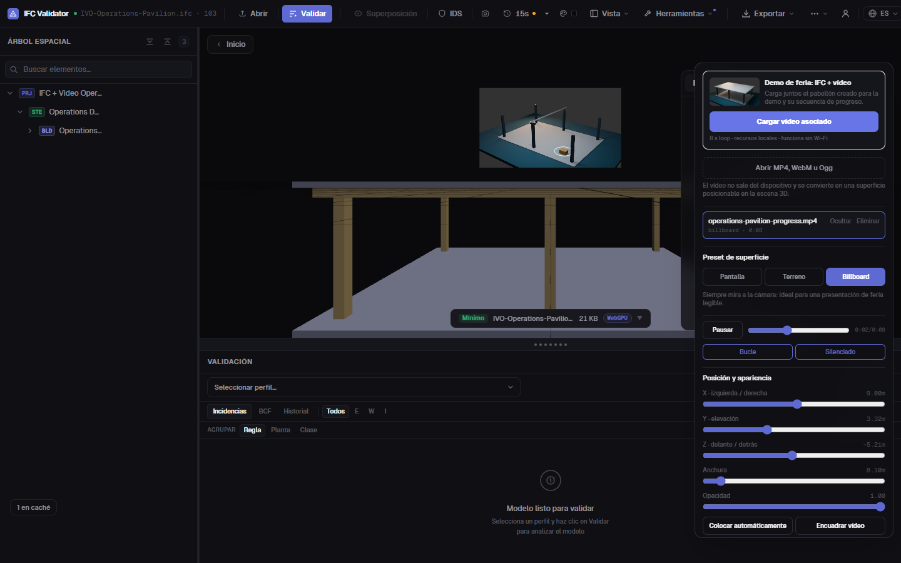

# Vídeo 3D con IFC, terreno y nubes de puntos

**Estado (2026-08-20): implementado y disponible con `VITE_FEATURE_VIDEO=true`.**

El vídeo no se dibuja como una ventana HTML sobre el visor. Se decodifica en un
`HTMLVideoElement`, se entrega a `THREE.VideoTexture` y se representa como una
superficie métrica dentro de la misma escena que el IFC, el terreno GIS, las
nubes de puntos y los recursos GLB/OBJ.

## Demo de feria incluida

1. Abre cualquier IFC y entra en **Tools → 3D video**.
2. Pulsa **Load IFC + video demo**.
3. El visor carga `Operations Pavilion — IFC + Video` y el loop local de ocho
   segundos. No depende de Internet.
4. Prueba **Screen**, **Terrain** y **Billboard**; después ajusta posición,
   anchura, opacidad y encuadre.
5. Para una fuente real, pulsa **Cámara en directo** o **Compartir pantalla**.
6. Usa el Capture Toolkit existente si quieres grabar el resultado compuesto.



Los tres activos salen del mismo script y de la misma tabla de dimensiones:

- `public/models/video-demo/IVO-Operations-Pavilion.ifc` — IFC4, válido y
  recargado con geometría en Bonsai; 6 columnas, 2 vigas y 2 losas.
- `public/models/video-demo/operations-pavilion-progress.mp4` — vídeo sintético
  H.264, 960 × 540, 24 fps, 8 s, 407 kB.
- `public/models/video-demo/operations-pavilion-poster.jpg` — portada local.

Se regeneran con:

```powershell
npm run video-demo
```

El activo se etiqueta como sintético. No simula una cámara de obra real ni
atribuye una precisión que no tiene.

## Modos de colocación

| Modo | Qué hace | Cuándo usarlo |
|---|---|---|
| **Screen** | Plano vertical fijo en el lado del IFC que mira hacia la cámara actual | CCTV, timelapse, instrucciones, panel de operaciones |
| **Terrain** | Plano horizontal XZ, situado en la cota inferior del IFC, con offset configurable | Orto-vídeo, evolución de parcela, calor/actividad sobre una zona local plana |
| **Billboard** | Copia la orientación de la cámara en cada render y permanece legible | Ferias, storytelling, KPI visual o vídeo que no necesita calibración espacial |

Los presets calculan un primer tamaño y posición con el `Box3` del IFC activo.
No bloquean nada: X/Y/Z, heading, tilt, roll, anchura, opacidad y separación
siguen siendo editables. **Colocar automáticamente** recalcula el preset. Los
botones **Vídeo** e **IFC + vídeo** permiten elegir entre inspeccionar el recurso
o volver a la composición comercial completa.

### Terreno: límite deliberado

`Terrain` es una superficie rígida colocada sobre una zona local. Tiene
`depthWrite=false`, `polygonOffset` y un lift inicial de 4 cm para que no
parpadee contra terreno o losas coplanares.

**Ajustar a superficie visible** muestrea el centro y las cuatro esquinas. Si
existe el `terrain-patch` GIS usa exclusivamente esa malla; si no, recurre a las
superficies visibles del IFC. Como el vídeo sigue siendo rígido, se coloca sobre
la muestra más alta y se muestra un aviso cuando el desnivel indica que conviene
reducir su tamaño. El muestreo ocurre solo al pulsar el botón, nunca por frame.

No deforma silenciosamente el vídeo sobre cada triángulo del relieve. Eso
necesita una malla subdividida con alturas muestreadas, coordenadas UV bien
definidas y una extensión/CRS del vídeo. Sin esos datos, “clamp to terrain”
distorsiona la imagen y aparenta una georreferenciación inexistente. La propia
comunidad de Cesium ha documentado fragmentación y limitaciones de transparencia
al fijar vídeo a terreno; por eso aquí la separación es visible y controlable.

## Reproducción y privacidad

- Play/Pause, seek, loop y mute están en el mismo panel.
- **Cámara en directo** usa `getUserMedia`; **Compartir pantalla** usa
  `getDisplayMedia`. Ambas fuentes se convierten en la misma `VideoTexture` y
  pueden usar los tres modos y todos los controles de colocación.
- La captura solicita 1280×720 hasta 30 fps para cámara y 15 fps ideal/30 máximo
  para pantalla. No solicita micrófono ni envía el stream.
- Las fuentes en directo requieren HTTPS o `localhost`, permiso explícito y una
  acción del usuario. Al detener o eliminar se paran todos sus tracks.
- Los clips arrancan silenciados para cumplir las políticas de autoplay. Si el
  navegador lo bloquea, el panel lo explica y mantiene un botón Play.
- Los archivos locales usan `blob:` y no se suben.
- Al eliminar un clip se pausa el elemento, se vacía el `src`, se libera el
  object URL y se destruyen `VideoTexture`, material, geometría y nodos Three.
- El panel sondea el tiempo cada 250 ms solo mientras está abierto; no crea un
  segundo bucle de render. Three actualiza `VideoTexture` al llegar un frame.

## Ejemplos de la comunidad revisados

| Proyecto / discusión | Aprendizaje aplicado | Decisión aquí |
|---|---|---|
| [Three.js VideoTexture](https://threejs.org/docs/pages/VideoTexture.html) y [demo de material de vídeo](https://threejs.org/examples/webgl_materials_video.html) | Textura nativa, filtros lineales, sin mipmaps; recrear la textura si cambia la fuente | Base directa del sistema, sin dependencia adicional |
| [Three.js: webcam como VideoTexture](https://threejs.org/examples/webgl_materials_video_webcam.html) y [discusión de color](https://discourse.threejs.org/t/webcam-texture-is-washed-out/53412) | Un `MediaStream` puede alimentar el mismo elemento de vídeo; declarar sRGB evita una imagen lavada | Webcam local integrada con `srcObject` y `texture.colorSpace = SRGBColorSpace` |
| [Three.js forum: actualización de VideoTexture](https://discourse.threejs.org/t/how-does-a-videotexture-get-updated/23861/2) | `requestVideoFrameCallback` marca el frame; el renderer sigue mandando cuándo se pinta | No se usa un timer para marcar `needsUpdate` |
| [Cesium Sandcastle Video](https://sandcastle.cesium.com/?src=Video.html) | Material de vídeo y sincronización opcional con el reloj de la escena | Timeline local ahora; reloj IFC/LiDAR común en la fase MCAP |
| [Cesium Community: vídeo sobre terreno](https://community.cesium.com/t/about-video-material/8204) | Clamp y transparencia pueden necesitar una apariencia propia y mostrar fragmentación | Plano local + offset honesto antes de draping real |
| [three-projected-material](https://github.com/marcofugaro/three-projected-material) | Proyección desde una cámara, `cover`, escala y offset sobre receptores 3D | Referencia para el modo calibrado futuro, no para un simple plano |
| [three-projective-media](https://github.com/bartoszubak/three-projective-media) | API reciente para vídeo proyectado, receptores explícitos y teardown; su discusión pública mostró que un MP4 problemático puede degradar toda la demo | Activo local pequeño, lifecycle explícito y benchmark antes de adoptar proyección |
| [Potree](https://github.com/potree/potree) | Orientación de imágenes, cámara animada y nubes grandes son flujos distintos pero coordinables | El vídeo permanece recurso independiente del LOD de puntos |
| [MDN getUserMedia](https://developer.mozilla.org/en-US/docs/Web/API/MediaDevices/getUserMedia) y [getDisplayMedia](https://developer.mozilla.org/en-US/docs/Web/API/MediaDevices/getDisplayMedia) | Permisos, contexto seguro, constraints y activación transitoria | Botones explícitos, sin audio, resolución acotada y teardown de tracks |

## Rendimiento

El coste dominante de este modo es el decode/upload del frame de vídeo, no los
dos triángulos del plano. La implementación reduce riesgo así:

- `VideoTexture` lazy: cero decoder y cero textura si no se abre el panel;
- sin mipmaps y filtros lineales;
- una geometría y un material por clip;
- frustum culling normal — la esfera del plano es invariante a la rotación del
  billboard, así que un vídeo fuera de cámara no necesita dibujarse;
- al ocultar un clip también se pausa su decoder;
- `toneMapped=false` y `MeshBasicMaterial`: el vídeo no paga iluminación PBR;
- assets de feria H.264 pequeños y locales;
- lifecycle completo y feature flag para despliegues que no lo necesiten.

Para producción hay que medir por dispositivo: FPS p50/p95, tiempo de decode,
resolución del clip, frames perdidos y memoria GPU. No se debe usar 4K por
defecto porque “se ve mejor” si el plano ocupa 600 px en pantalla.

## Siguiente nivel: vídeo remoto calibrado y LiDAR vivo

La webcam y la captura local ya son fuentes vivas reales, pero todavía no son
un stream remoto WebRTC ni están calibradas espacialmente. Para colorear
IFC/puntos como un proyector o sincronizar LiDAR vivo hacen falta además:

1. intrínsecos de cámara, distorsión y resolución;
2. extrínseca cámara ↔ LiDAR/IFC;
3. pose y timestamp por frame;
4. un reloj común y error de reproyección medido;
5. WebRTC para RGB vivo y un gateway WebSocket/WebTransport para puntos;
6. estado visible `LIVE/REPLAY/DEGRADED/OFFLINE`.

Ese diseño, incluyendo MCAP, ROS 2, Ouster/Livox/RealSense/ARKit y el contrato
binario propuesto, está en [`REALTIME_LIDAR_VIDEO.md`](./REALTIME_LIDAR_VIDEO.md).
