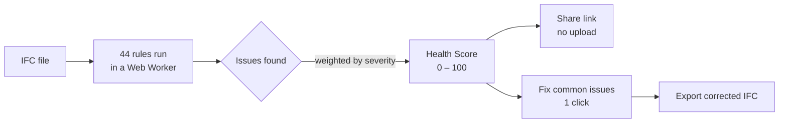
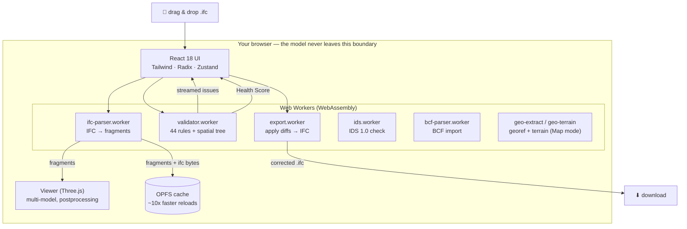

<div align="center">

# IFC Viewer Online

**Open an IFC file and get a Health Score — 0 to 100 — in 30 seconds.**

Free IFC viewer + validator that runs entirely in your browser.
No account. No ruleset to configure. No file size limit. Your models never leave your machine.

[**→ Try it live**](https://www.ifcvieweronline.eu/)

<br/>

[](https://www.ifcvieweronline.eu/)
[](#license--open-core)
[](#contributing)
[](https://github.com/j03rul4nd/ifc-viewer-online/stargazers)


<br/>

**Read this in your language**

English · [简体中文](README.zh-CN.md) · [Español](README.es.md) · [Français](README.fr.md) · [Deutsch](README.de.md) · [日本語](README.ja.md) · [Português](README.pt.md) · [Català](README.ca.md) · [Italiano](README.it.md) · [ไทย](README.th.md)

</div>

---

<div align="center">

[](https://www.ifcvieweronline.eu/)

<sub><i>Load a demo model → run a validation profile → Health Score + ranked issues, 100% in your browser. <a href="https://www.ifcvieweronline.eu/">Try it live →</a></i></sub>

</div>

> **In one sentence:** drag in an IFC, see your model in 3D, get a Health Score with a ranked list of issues, fix the common ones in a click, and export a corrected file — without uploading anything to a server.

## Contents

- [Why this exists](#why-this-exists)
- [What it does](#what-it-does)
- [See it in action](#see-it-in-action)
- [Embed it / SDK](#embed-it--sdk)
- [The Health Score](#the-health-score)
- [How it works (architecture)](#how-it-works-architecture)
- [What a validation issue looks like](#what-a-validation-issue-looks-like)
- [Tech stack](#tech-stack)
- [Getting started](#getting-started)
- [Project structure](#project-structure)
- [The 44 validation rules](#the-44-validation-rules)
- [Contributing](#contributing)
- [Roadmap](#roadmap)
- [License — open core](#license--open-core)

---

## Why this exists

Most IFC validation tools have at least one of these friction points:

| Tool | Friction |
|---|---|
| buildingSMART validator | 250 MB file size limit, no 3D viewer, raw text output |
| Autodesk Viewer / BIM 360 | Uploads your model to their servers — an NDA risk |
| Sortdesk | Requires an account before you can validate |
| Data Octopus | Charges per check — expensive for regular use |
| IFC Verify | No 3D viewer — issues show as text only |
| BIMvision / Solibri Anywhere | Desktop-only, Windows-only (Solibri Anywhere discontinued April 2026) |

**IFC Viewer Online has none of those limitations.** It runs entirely in the browser via WebAssembly, with no upload, no account, and no size cap. Your models never leave your machine.

---

## What it does

| Capability | What you get |
|---|---|
| **IFC Health Check** | 44 validation rules, streamed live from a Web Worker, summarized as a single **Health Score (0–100)**. |
| **buildingSMART IDS** | Load an `.ids` file (or one of the built-in samples) and check the model against an Information Delivery Specification — full IDS 1.0 facet coverage (entity, attribute, property, classification, material, partOf), validated against the official buildingSMART test cases. Pass/fail per specification, with export to JSON/CSV/HTML/BCF. |
| **3D Viewer** | WebGL rendering via Three.js + `@thatopen/components`. Multi-model loading with independent transforms, SSAO, edge rendering, bloom, 2D floor plans, live section cuts, and length/area/edge/volume measurements. |
| **3D Map mode (GIS)** | Place a georeferenced model on a real-world basemap (OpenStreetMap / topo / satellite) and optional 3D terrain, inside the same 3D scene. Georeferencing is auto-extracted from the IFC (`IfcMapConversion` / `IfcSite` lat-lon) with a manual-placement fallback. Tile requests reveal only the approximate site location — the model never leaves the browser. Build-flag gated (`VITE_FEATURE_GIS`). |
| **Non-destructive editor** | Edit property values, fix GUIDs, rename elements. Every change is a diff with full undo/redo. Export a corrected IFC binary — diffs applied in a worker, no server. |
| **BCF 2.1 / 3.0 import/export** | Navigate to imported BCF viewpoints and manage issue topics in a dedicated BCF panel (create, comment, capture viewpoints). Export validation or IDS findings as a BCF zip for Navisworks, BIMcollab, Solibri, and any BCF-compatible CDE. |
| **Quantity takeoff** | Aggregates `IfcElementQuantity` across the model — area, volume, length per IFC class. |
| **OPFS geometry cache** | Parsed geometry is cached in the browser's Origin Private File System. Reloads are ~10× faster and work offline. |
| **Embed / SDK** | Drop the viewer into any page via iframe + URL params, or mount it from a ~6 KB dependency-free JS SDK that streams IFC bytes client-side (no upload, no CORS). See [Embed it / SDK](#embed-it--sdk). |
| **Mobile UI** | Dedicated bottom-sheet panels for validation and IDS, a floating bottom-nav, and touch-friendly controls down to 320 px. |
| **10 languages** | EN · ES · FR · DE · PT · JA · CA · ZH · IT · TH |

**Supported IFC versions:** IFC2x3 · IFC4 · IFC4x1 · IFC4x3

---

## See it in action

> Every clip below is the **real app** running in a browser — no mockups, no edited footage. The model used is the open [Duplex Apartment](public/Ifc2x3_Duplex_Architecture.ifc) reference IFC (7,131 elements), parsed and validated 100% client-side.

### Navigate the model & inspect IFC properties

Browse the full spatial hierarchy (project → site → storey → space → element), click any element to highlight it in 3D, and read its raw IFC property sets, classifications and quantities.


### Highlight every issue in 3D

Run a validation profile, then toggle the **Overlay** to paint flagged elements directly onto the model — so a list of issues becomes something you can actually see and walk through.


### Export a corrected model

Re-export the model as **IFC** or **GLB**, or push the validation issues out as a **BCF 2.1** package and a shareable report — all generated in a Web Worker, nothing uploaded.


---

## Embed it / SDK

Drop the viewer into a blog, a CDE panel, a digital twin, or any internal tool — the model is parsed in the visitor's browser, **nothing is uploaded**.

**1. Iframe / URL params** — deep-link a public model and tune the chrome:

```html
<iframe src="https://<host>/?model=https://your-cde.com/model.ifc&embed=1"
        width="100%" height="600" style="border:0" allow="fullscreen"></iframe>
```

Params: `model` (comma-separated for federated), `embed`, `ui` (`minimal`·`full`·`kiosk`), `validate`, `select`, `isolate`, `lang`, plus granular `tree`/`sidebar`/`panel`/`home` toggles. Full reference: [`docs/EMBED_URL_PARAMS.md`](docs/EMBED_URL_PARAMS.md).

**2. JS SDK** — mount the viewer and stream IFC bytes from your own app (no public URL, no CORS):

```html
<div id="viewer" style="height:520px"></div>
<script type="module">
  import { IfcViewer } from "https://<host>/sdk/ifc-viewer.es.js";
  const viewer = new IfcViewer("#viewer");
  const bytes = await fetch("/models/project.ifc").then(r => r.arrayBuffer());
  await viewer.add("project.ifc", bytes);   // parsed client-side
  viewer.on("element-selected", (e) => console.log(e.ifcType, e.expressId));
</script>
```

The SDK is a ~6 KB dependency-free ES module (iframe + `postMessage` bridge). Build it with `npm run build:sdk`; live demo + docs at `/<base>/sdk/`. Full reference: [`docs/IFC_VIEWER_SDK.md`](docs/IFC_VIEWER_SDK.md).

The SDK can also pull data for dashboards (`getStats`, `getIssues`, `getValidation`,
`screenshot`) and run a buildingSMART **IDS** check client-side (`checkIds(idsXml)` →
pass/fail per specification) — covering all six IDS 1.0 facets (entity, attribute,
property, classification, material, partOf), validated against the official
buildingSMART test cases. A CDE can drive the viewer two-way over `postMessage`
(`ifcviewer:load` / `select` / `isolate` / `fit`) and listen for `ready`, `model-loaded`,
`validation-completed`, `element-selected`.

---

## The Health Score

Every model receives a single number from **0 to 100** — a logarithmic, diminishing-returns score derived from the weighted severity of all detected issues. It is the one number you can act on, cite, or share with a colleague.



| Severity | Examples |
|---|---|
| **Error** | Duplicate GUIDs, broken aggregates, missing spatial containers |
| **Warning** | Missing property sets, missing materials, naming-convention violations |
| **Info** | Proxy overuse, coordinate offset, file-size anomalies, outdated schema |

---

## How it works (architecture)

The whole pipeline lives in the browser. The IFC file is parsed in a Web Worker via WebAssembly, rendered with Three.js, and validated in a second worker — **nothing about your model is sent to any server.**



Independent workers keep the UI responsive: parsing, validation, export, IDS checking, BCF import and (in Map mode) georeferencing/terrain each run off the main thread. State is held in eleven small [Zustand](https://github.com/pmndrs/zustand) stores; geometry never enters the store (only stable IDs do). See [`ARCHITECTURE.md`](ARCHITECTURE.md) for the full data-flow diagrams.

---

## What a validation issue looks like

The validator reads raw IFC STEP entities and emits structured issues. For example, this duplicated GUID in the source file:

```step
#42=  IFCWALL('3vB2Y...DUPLICATE',   #5, 'Basic Wall', $, ...);
#118= IFCWALLSTANDARDCASE('3vB2Y...DUPLICATE', #5, 'Wall', $, ...);
```

...produces a typed issue, streamed to the UI and included in the shareable report:

```jsonc
{
  "ruleId": "RULE_DUPLICATE_GUID",
  "severity": "error",
  "globalId": "3vB2Y...DUPLICATE",
  "expressIds": [42, 118],
  "message": "GlobalId is shared by 2 elements",
  "ifcClass": "IfcWall"
}
```

BCF 2.1 export wraps the same issues in the open coordination markup that Navisworks and BIMcollab understand:

```xml
<Markup>
  <Topic Guid="..." TopicType="Issue" TopicStatus="Open">
    <Title>Duplicate GlobalId on IfcWall</Title>
    <Priority>High</Priority>
  </Topic>
</Markup>
```

Every worker message is validated at runtime with [Zod](https://zod.dev) schemas (`src/lib/worker-schemas.ts`), so malformed data never reaches the UI.

---

## Tech stack

| Layer | Technology |
|---|---|
| IFC parsing | [web-ifc](https://github.com/ThatOpenCompany/web-ifc) (WebAssembly) |
| 3D rendering | [Three.js](https://threejs.org/) + [@thatopen/components](https://github.com/ThatOpenCompany/engine_components) |
| GIS / basemap | [3d-tiles-renderer](https://github.com/NASA-AMMOS/3DTilesRendererJS) (tiles inside the three.js scene) — Map mode only |
| UI | React 18 + Tailwind CSS + Radix UI |
| Animations | Framer Motion + GSAP |
| State | Zustand 5 (11 stores: model, scene, validation, editor, ui, takeoff, toast, bcf, ids, geo, waiver) |
| Validation | Web Worker — 44 rules, streamed via `postMessage` |
| IDS | Pure-TS IDS 1.0 engine + dedicated web-ifc worker (`src/lib/ids/`, `ids.worker.ts`) |
| Runtime safety | Zod schemas on every worker boundary |
| Virtualized lists | @tanstack/react-virtual |
| i18n | i18next (10 languages) |
| Analytics | PostHog (client-side, no PII) |
| Build | Vite 6 + TypeScript (strict) |
| Tests | Vitest (jsdom) |
| Deploy | Vercel (static, zero backend) |

---

## Getting started

```bash
git clone https://github.com/j03rul4nd/ifc-viewer-online.git
cd ifc-viewer-online
npm install
npm run dev    # → http://localhost:3000
```

The dev server sets `Cross-Origin-Opener-Policy: same-origin` and `Cross-Origin-Embedder-Policy: require-corp` — required for `SharedArrayBuffer` (multithreaded WASM).

**Build**

```bash
npm run build   # → dist/
```

> The build bundles Three.js and `@thatopen/*` inline into worker chunks (~5 MB each). The `build` script already passes `--max-old-space-size=4096`. If you still hit a heap OOM, try `NODE_OPTIONS=--max-old-space-size=8192 npx vite build`.

**Test**

```bash
npm test        # vitest (jsdom)
```

---

## Project structure

```
src/
  components/      # Landing, Viewer, ValidationPanel, IdsPanel, BcfPanel, GeoPanel, Sidebar, ModelTree, ScenePanel, …
                   #   + mobile/ (bottom-sheet panels) · ids/ · blog/ · legal/ · reactbits/
  workers/         # ifc-parser · validator · export · ids · bcf-parser · geo-extract · geo-terrain (.worker.ts)
  stores/          # 11 Zustand stores (model, scene, validation, editor, ui, takeoff, toast, bcf, ids, geo, waiver)
  hooks/           # useModelSession, useValidationRunner, useIdsRun, useElementFocus, useIsMobile, …
  lib/             # viewer.ts · loader.ts · validator.ts · diffStore.ts · worker-schemas.ts · share-report.ts
    ids/           # IDS 1.0 engine (parser, facets, runner, report, golden testcases)
    geo/           # GIS / Map mode (basemap engine, CRS, georef ladder, terrain, providers)
  sdk/             # IfcViewer embeddable JS SDK (built to public/sdk/)
  i18n/ · locales/ # i18next config + per-locale JSON — en/ es/ fr/ de/ pt/ ja/ ca/ zh/ it/ th/
  types/           # Zod schemas + TypeScript types (ValidationRules, EditDiff, …)
public/
  ifc-validator/           # Niche landing — /ifc-validator/
  ifc-viewer-mac/          # Niche landing — /ifc-viewer-mac/
  solibri-alternative/     # Niche landing — /solibri-alternative/
  tools/fix-duplicate-guids/
  es/                      # Spanish static shell + /es/ifc-validador/
cf-worker/         # Cloudflare Worker — stateless email-capture proxy (never sees the model)
```

Reference docs that go deeper: [`ARCHITECTURE.md`](ARCHITECTURE.md) · [`IFC_DOMAIN.md`](IFC_DOMAIN.md) · [`DECISIONS.md`](DECISIONS.md) · [`ROADMAP.md`](ROADMAP.md).

---

## The 44 validation rules

Rules run in `src/workers/validator.worker.ts`, gated by a `RulesConfig`, grouped by generation. (Distinct from the buildingSMART **IDS** check — that runs your own `.ids` specification, not this built-in rule set.)

<details>
<summary><b>Core — 18 rules</b> (names, GUIDs, types, hierarchy)</summary>

`RULE_EMPTY_NAME` · `RULE_EMPTY_LONGNAME` · `RULE_DUPLICATE_NAME` · `RULE_NAMING_CONVENTION` · `RULE_MISSING_TYPE` · `RULE_DUPLICATE_GUID` · `RULE_MISSING_PROPERTY_SET` · `RULE_ORPHAN_ELEMENT` · `RULE_WRONG_CONTAINER` · `RULE_BROKEN_AGGREGATE` · `RULE_INVALID_GUID_FORMAT` · `RULE_SPATIAL_HIERARCHY` · `RULE_CIRCULAR_REFERENCE` · `RULE_EMPTY_PROPERTY_VALUE` · `RULE_MISSING_MATERIAL` · `RULE_ELEMENT_IN_BUILDING` · `RULE_INVALID_IFC_VERSION` · `RULE_ELEMENT_CLASH` (off by default)

</details>

<details>
<summary><b>Spatial &amp; file header — 11 rules</b> (project/site/storey, ISO 19650)</summary>

`RULE_MISSING_PROJECT` · `RULE_MISSING_BUILDING` · `RULE_MISSING_STOREY` · `RULE_EMPTY_STOREY` · `RULE_FILE_DESCRIPTION_MISSING` · `RULE_FILE_AUTHOR_MISSING` · `RULE_PROJECT_LONGNAME_MISSING` · `RULE_STOREY_ELEVATION_MISSING` · `RULE_ISO19650_PROJECT_INFO` · `RULE_ISO19650_AUTHOR_INFO` · `RULE_ISO19650_FILENAME`

</details>

<details>
<summary><b>LOD, classification &amp; MEP — 9 rules</b></summary>

`RULE_MISSING_CLASSIFICATION` · `RULE_LOD_PSET_MISSING` · `RULE_LOD_QUANTITY_MISSING` · `RULE_LOD_MATERIAL_LAYER_MISSING` · `RULE_MEP_SYSTEM_MISSING` · `RULE_CLASH_MEP_STRUCTURAL` · `RULE_PROXY_OVERUSE` · `RULE_COORDINATE_OFFSET` · `RULE_FILE_SIZE_ANOMALY`

</details>

<details>
<summary><b>Geometry &amp; storey integrity — 6 rules</b></summary>

`RULE_OPENING_WITHOUT_HOST` · `RULE_STOREY_ELEVATION_DUPLICATE` · `RULE_STOREY_ELEVATION_ORDER` · `RULE_UNIT_CONSISTENCY` · `RULE_SPACE_AREA_MISSING` · `RULE_CONNECTED_MEP`

</details>

---

## Contributing

Contributions are welcome — new validation rules, translations, and bug fixes especially.

**Add a validation rule** (`src/workers/validator.worker.ts`):

1. Add the rule ID to `ValidationRules` in `src/types/index.ts`
2. Implement the `async` function — it receives the `IfcAPI` instance, `modelId`, and a `SpatialIndex` helper, and returns `ValidationIssue[]`
3. Wire it into the `runAllRules` dispatch block
4. Add i18n strings to `RULE_TRANSLATIONS` in `src/types/index.ts`
5. Set `DEFAULT_RULES[RULE_ID] = true` (or `false` if opt-in)
6. Update the rule count in the marketing copy that references "44 rules" (`index.html`, `README*.md`, `src/seo/config.ts`, the `public/*` landing pages)

**Add a translation:** copy `src/locales/en/` to a new locale folder, translate the JSON values, and register the locale in `src/i18n/config.ts`. Translations of this README are equally welcome — match the file naming (`README.<lang>.md`) and add a link to the language row at the top.

**Before opening a PR:** run `npm test` and `npm run lint`.

---

## Roadmap

The product is technically mature (multi-model viewer, 44-rule validator, full buildingSMART IDS 1.0 checking, non-destructive editor, BCF 2.1/3.0, 3D Map/GIS mode, embed + SDK, 10 languages). The forward plan is **distribution-led**, not feature-led.

**Shipped:**

- **buildingSMART IDS** — full IDS 1.0 facet coverage, validated against the official bSI test cases. Load any `.ids`, get pass/fail per specification, export to JSON/CSV/HTML/BCF.
- **3D Map / GIS mode** — georeferenced model on a real-world basemap + 3D terrain, all inside the existing scene (flag-gated).
- **Remediation guides** — deterministic "how to fix this in Revit / ArchiCAD / Tekla / Allplan" content per rule, authored in i18n (no AI, no server). Also published as static, crawlable [`/fix/`](https://www.ifcvieweronline.eu/fix/) pages in 10 languages.
- **Crawlable reports** — the share link is server-rendered by a stateless edge worker so reports unfurl on social and get indexed (the model still never leaves the browser).
- **Embed + JS SDK** — iframe/URL-param embedding and a dependency-free SDK with two-way `postMessage`.

**Planned:**

- **Model-vs-model revision diff** — compare two versions of a model by GlobalId. (Validation run-to-run and IDS run-to-run diffs already ship.)
- **Solibri-parity backlog** — rule templates, information takeoff, presentations/clash grouping. See [`ROADMAP.md`](ROADMAP.md).

See [`ROADMAP.md`](ROADMAP.md) for the full plan and the explicitly deferred items.

---

## License — open core

| Component | License |
|---|---|
| IFC viewer (Three.js rendering, WASM integration) | **MIT** |
| Validator (44 rules, Web Worker) | **MIT** |
| IDS 1.0 engine + worker | **MIT** |
| GIS / 3D Map mode | **MIT** |
| Non-destructive editor (diffs, undo/redo, IFC export) | **MIT** |
| Stores, hooks, utilities, i18n | **MIT** |
| Cloudflare Worker (email-capture backend) | Proprietary |
| Future: cloud storage, sharing API, auth, PDF reports | Proprietary |

**The core viewer and validator are MIT-licensed forever.** Fork it, self-host it, use it commercially. The cloud infrastructure for future paid features is proprietary and cannot be replicated from this repo alone.

---

## Author

[Joel Benitez](https://github.com/j03rul4nd)

If this project saved you time, a ⭐ helps other BIM people find it.

---

<div align="center">

*Built with [@thatopen/components](https://github.com/ThatOpenCompany/engine_components), [web-ifc](https://github.com/ThatOpenCompany/web-ifc), and [Three.js](https://threejs.org/).*

</div>
